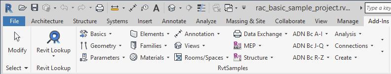
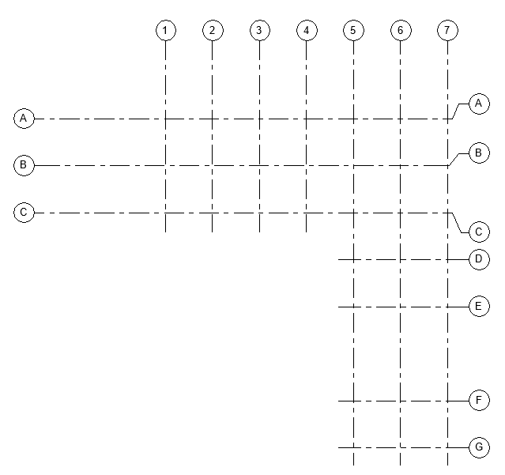
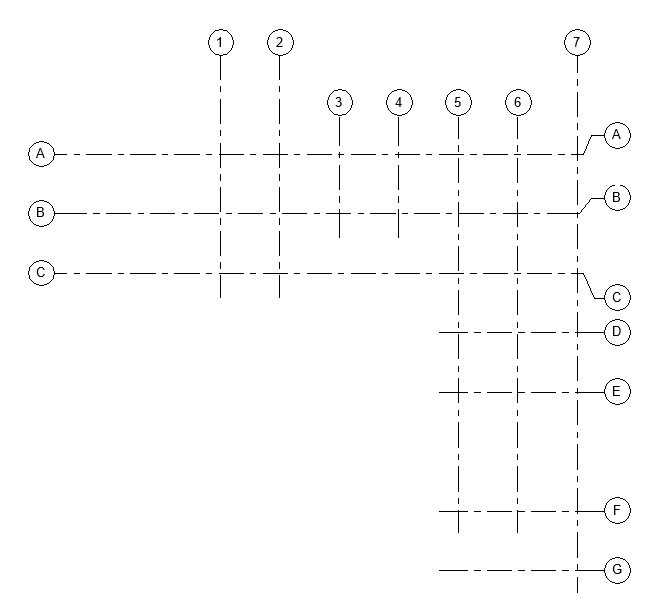

<head>
<meta http-equiv="Content-Type" content="text/html; charset=utf-8">
<link rel="stylesheet" type="text/css" href="bc.css">

<!--

-->
</head>

<!---

- 13012962 [通り芯の始終点（３D)を編集する方法]

SDK Update and RvtSamples 2018 @AutodeskForge #ForgeDevCon #RevitAPI @AutodeskRevit #bim #dynamobim http://bit.ly/mod_grid_point
SetCurveInView to modify grid endpoint @AutodeskForge #ForgeDevCon #RevitAPI @AutodeskRevit #bim #dynamobim http://bit.ly/mod_grid_point

An updated version of the Revit SDK was published, I set up <code>RvtSamples</code> for Revit 2018, which I use to load The Building Coder samples, and we present a useful employment of the <code>DatumPlane</code> class methods <code>GetCurvesInView</code> and <code>SetCurveInView</code>
&ndash; Revit 2018 SDK Update
&ndash; RvtSamples for Revit 2018
&ndash; How to Modify Grid Curve End Points...

-->

### SDK Update, RvtSamples and Setting Grid Endpoint

An updated version of the Revit SDK was published, I set up `RvtSamples` for Revit 2018, which I use to
load [The Building Coder samples](https://github.com/jeremytammik/the_building_coder_samples),
and we present a useful employment of the  `DatumPlane` class methods `GetCurvesInView` and `SetCurveInView`:

- [Revit 2018 SDK Update](#2)
- [RvtSamples for Revit 2018](#3)
- [How to Modify Grid Curve End Points](#4)

#### Revit 2018 SDK Update

An update of the Revit SDK has been posted to
the [Revit Developer Centre](http://www.autodesk.com/developrevit):

- [Revit 2018 SDK (Update May 19, 2017)](http://download.autodesk.com/us/revit-sdk/REVIT_2018_SDK_1.msi) (msi - 355088Kb)

It includes the
new [DuplicateGraphics](http://thebuildingcoder.typepad.com/blog/2017/05/revit-2017-and-2018-sdk-samples.html#4.2) sample
that was omitted in the first customer shipment of the Revit 2018 SDK.

#### RvtSamples for Revit 2018

I use the Revit SDK external application `RvtSamples` to load all the SDK samples for testing and debugging purposes.

I first described it in The Building Coder's fifth blog post
on [Managing SDK Samples](http://thebuildingcoder.typepad.com/blog/2008/08/managing-sdk-sa.html).

I soon implemented
the [include file functionality](http://thebuildingcoder.typepad.com/blog/2008/11/loading-the-building-coder-samples.html) to
also use it to load all other sample commands that I regularly use,
including [The Building Coder samples](https://github.com/jeremytammik/the_building_coder_samples).

Last year, Dan Tartaglia raised and I addressed several issues setting
up [RvtSamples for Revit 2017](http://thebuildingcoder.typepad.com/blog/2016/04/rvtsamples-for-revit-2017.html).

This year, I went through a similar process.

For the sake of efficiency, I am here simply posting
the [entire contents of my RvtSamples folder](zip/RvtSamples_2018.zip) as
it stands now, up and running on my system.

The only files that I modified are:

- Application.cs
- RvtSamples.addin
- RvtSamples.txt

Now to return to the topic for today:

#### How to Modify Grid Curve End Points

**Question:** I would like to modify end points of a grid curve for 3D extent, but the `Grid.Curve` property is read-only, so I cannot set a new curve.

Is there any way to edit a grid curve?

**Answer:** Ever since Revit 2016, the `Grid` class provides the methods `GetCurvesInView` and `SetCurveInView.

More precisely, these methods were added to the `DatumPlane` class, which is a base class of `Grid`.

[GetCurvesInView](http://www.revitapidocs.com/2017/2f93dd88-baac-8e61-377e-b937f3faaff6.htm) retrieves a collection of curves representing a `DatumPlane` element in a given view:

<pre class="code">
  public&nbsp;IList&lt;Curve&gt;&nbsp;GetCurvesInView(
  &nbsp;&nbsp;DatumExtentType&nbsp;extentMode,
  &nbsp;&nbsp;View&nbsp;view
  )
</pre>

They can be set using [SetCurveInView](http://www.revitapidocs.com/2017/eaff0038-34f2-03cf-185b-2872cffb84af.htm):

<pre class="code">
  public&nbsp;void&nbsp;SetCurveInView(
  &nbsp;&nbsp;DatumExtentType&nbsp;extentMode,
  &nbsp;&nbsp;View&nbsp;view,
  &nbsp;&nbsp;Curve&nbsp;curve
  )
</pre>

The `DatumExtentType` specifies what type of datum extent that is displayed in a particular view.

If you want the actual 3D extents, you need to pass in `DatumExtentType.Model`.

After retrieving the current grid curves, you can determine their end points, create a new line using those points, and set it back to the grid via `Grid.SetCurveInView`.

Here is code snippet demonstrating this:

<pre class="code">
UIApplication&nbsp;uiapp&nbsp;=&nbsp;commandData.Application;
UIDocument&nbsp;uidoc&nbsp;=&nbsp;uiapp.ActiveUIDocument;
Document&nbsp;doc&nbsp;=&nbsp;uidoc.Document;
Selection&nbsp;sel&nbsp;=&nbsp;uidoc.Selection;
View&nbsp;view&nbsp;=&nbsp;doc.ActiveView;

ISelectionFilter&nbsp;f
&nbsp;&nbsp;=&nbsp;new&nbsp;JtElementsOfClassSelectionFilter&lt;Grid&gt;();

Reference&nbsp;elemRef&nbsp;=&nbsp;sel.PickObject(
&nbsp;&nbsp;ObjectType.Element,&nbsp;f,&nbsp;&quot;Pick&nbsp;a&nbsp;grid&quot;&nbsp;);

Grid&nbsp;grid&nbsp;=&nbsp;doc.GetElement(&nbsp;elemRef&nbsp;)&nbsp;as&nbsp;Grid;

IList&lt;Curve&gt;&nbsp;gridCurves&nbsp;=&nbsp;grid.GetCurvesInView(&nbsp;
&nbsp;&nbsp;DatumExtentType.Model,&nbsp;view&nbsp;);

using(&nbsp;Transaction&nbsp;tx&nbsp;=&nbsp;new&nbsp;Transaction(&nbsp;doc&nbsp;)&nbsp;)
{
&nbsp;&nbsp;tx.Start(&nbsp;&quot;Modify&nbsp;Grid&nbsp;Endpoints&quot;&nbsp;);

&nbsp;&nbsp;foreach(&nbsp;Curve&nbsp;c&nbsp;in&nbsp;gridCurves&nbsp;)
&nbsp;&nbsp;{
&nbsp;&nbsp;&nbsp;&nbsp;XYZ&nbsp;start&nbsp;=&nbsp;c.GetEndPoint(&nbsp;0&nbsp;);
&nbsp;&nbsp;&nbsp;&nbsp;XYZ&nbsp;end&nbsp;=&nbsp;c.GetEndPoint(&nbsp;1&nbsp;);

&nbsp;&nbsp;&nbsp;&nbsp;XYZ&nbsp;newStart&nbsp;=&nbsp;start&nbsp;+&nbsp;10&nbsp;*&nbsp;XYZ.BasisY;
&nbsp;&nbsp;&nbsp;&nbsp;XYZ&nbsp;newEnd&nbsp;=&nbsp;end&nbsp;-&nbsp;10&nbsp;*&nbsp;XYZ.BasisY;

&nbsp;&nbsp;&nbsp;&nbsp;Line&nbsp;newLine&nbsp;=&nbsp;Line.CreateBound(&nbsp;newStart,&nbsp;newEnd&nbsp;);

&nbsp;&nbsp;&nbsp;&nbsp;grid.SetCurveInView(&nbsp;
&nbsp;&nbsp;&nbsp;&nbsp;&nbsp;&nbsp;DatumExtentType.Model,&nbsp;view,&nbsp;newLine&nbsp;);
&nbsp;&nbsp;}
&nbsp;&nbsp;tx.Commit();
}
</pre>

Many thanks to Ryuji Ogasawara for sharing this!

There is hardly any error checking here, so you need to know exactly what to pick.

It moves the grid endpoints vertically, so you need to select a vertically oriented grid for it to work.

I added Ryuji's sample as a new external command
to [The Building Coder samples](https://github.com/jeremytammik/the_building_coder_samples)
[release 2018.0.133.0](https://github.com/jeremytammik/the_building_coder_samples/releases/tag/2018.0.133.0) in the
module [CmdSetGridEndpoint.cs](https://github.com/jeremytammik/the_building_coder_samples/blob/master/BuildingCoder/BuildingCoder/CmdSetGridEndpoint.cs).

Here are the isolated grids in *rac_basic_sample.rvt*:

Launching `CmdSetGridEndpoint` and picking 3, 4, 5 and 6 generates this:

