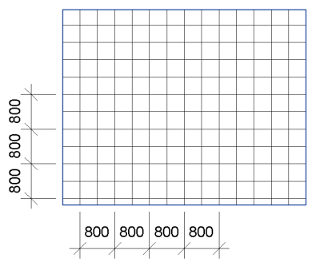

<head>
<meta http-equiv="Content-Type" content="text/html; charset=utf-8">
<link rel="stylesheet" type="text/css" href="bc.css">

<!--

-->
</head>

<!---

- add-in guid
  https://autodesk.slack.com/archives/C0SJ4U3PE/p1497273372195629
  [q] if we create a revit addin, should the AddinId be unique across different versions of Revit (2017/2018/2019)? Or should they keep the same AddinId?
  [a] They can have the same GUID. Not only can, but should keep the same add-in id. Some frameworks - updaters, external services and extensible storage, uses the add-in id and serializes it with relevant data.  So you will want the same add-in id in future versions so that Revit doesn't treat the capability as unrecognized.

- https://forums.autodesk.com/t5/revit-api-forum/dimension-on-hatch-pattern-slab/td-p/7063302
  /a/doc/revit/tbc/draft/dim_hatch.txt
  undocumented relationships
  
- lb http://thebuildingcoder.typepad.com/blog/2011/11/undocumented-elementid-relationships.html
  0702_avoid_idling.htm:1
  0849_stair_geometry.htm:2
  0996_attrib_relations.htm:1
  1076_framing_xsec_analyse.htm:1
  1205_image_relationships.htm:2
  1565_dim_hatch.md:1

Why to retain your #RevitAPI Add-In GUID @AutodeskRevit #bim #dynamobim @AutodeskForge #ForgeDevCon http://bit.ly/dim_hatch_vodoo
Dimension hatch pattern with voodoo magic #RevitAPI @AutodeskRevit #bim #dynamobim @AutodeskForge #ForgeDevCon http://bit.ly/dim_hatch_vodoo

Reporting on a very exciting topic from the Revit API discussion forum from the Forge accelerator in Barcelona
&ndash; Barcelona Forge accelerator
&ndash; Retain the Add-In GUID
&ndash; Dimension on hatch pattern...

-->

### Hatch Line Dimensioning Voodoo

Reporting on a very exciting topic from the Revit API discussion forum from the Forge accelerator in Barcelona:

- [Barcelona Forge accelerator](#2)
- [Retain the Add-In GUID](#3)
- [Dimension on hatch pattern](#4)

#### Barcelona Forge Accelerator

I am back in the Barcelona Autodesk office supporting the [Forge Accelerator](http://autodeskcloudaccelerator.com/forge-accelerator).

I was here [last year](http://thebuildingcoder.typepad.com/blog/2016/03/adn-becomes-forge-and-barcelona-accelerator.html#3)
[as well](http://thebuildingcoder.typepad.com/blog/2016/05/forge-accelerator-devcon-and-answer-day.html), where
I started working on
the [roomedit3d project](https://github.com/jeremytammik/roomedit3d), implementing all 
its [Revit-independent functionality](http://thebuildingcoder.typepad.com/blog/2016/05/roomedit3d-console-test-and-rendering-assets.html#2).

Let's look at two Revit API issues before I dig in deeper into Forge:

#### Retain the Add-In GUID

**Question:** If I create a Revit add-in, should the `AddinId` be unique across different versions of Revit (2017/2018/2019)?

Or should I retain the same `AddinId`?

**Answer:** The different versions can have the same GUID.

Not only can, but they definitely should keep the same add-in id.

Some frameworks, e.g., updaters, external services and extensible storage, use the add-in id and serialise it with relevant data.

Therefore, you will want to retain the same add-in id in future versions, so that Revit doesn't treat the capability as unrecognized.

#### Dimension on Hatch Pattern

On to a much more complex question, adding a new entry to our collection
of [undocumented `ElementId` relationships](http://thebuildingcoder.typepad.com/blog/2011/11/undocumented-elementid-relationships.html).

It came up in
the [Revit API discussion forum](http://forums.autodesk.com/t5/revit-api-forum/bd-p/160) thread
on creating a [dimension on hatch pattern slab](https://forums.autodesk.com/t5/revit-api-forum/dimension-on-hatch-pattern-slab/td-p/7063302) and
was answered very creatively indeed by Fair59, who has already contributed numerous answers to other very tricky issues.

Fair59's solution reminds me of
Scott Wilson's [`Reference` stable representation magic voodoo](http://thebuildingcoder.typepad.com/blog/2016/04/stable-reference-string-magic-voodoo.html):

**Question:** I want to get dimension on hatch pattern slab like this: 

But I don't know how to retrieve hatch line.

**Answer 1:** First: Use [RevitLookup](https://github.com/jeremytammik/RevitLookup) to
find out what elements you are after:
 
Second: Retrieve their geometry, asking for `ComputeReferences = true`.
 
Third: Create the dimensioning using the references:

- [Dimension walls by iterating faces](http://thebuildingcoder.typepad.com/blog/2011/02/dimension-walls-by-iterating-faces.html)
- [Dimension walls using `FindReferencesByDirection`](http://thebuildingcoder.typepad.com/blog/2011/02/dimension-walls-using-findreferencesbydirection.html)

**Response:** That does not help.

1. I already know it's a floor and can get it.
2. I already retrieve the solid of floor.

The problem is, from the solid I cannot retrieve the geometry of the line pattern in the floor to create dimensions between them.
 
Can you explain more details, please?
 
Here my code in this project so far:
 
<pre class="code">
//&nbsp;Pick&nbsp;floor&nbsp;element
IList&lt;Element&gt;&nbsp;elems&nbsp;=&nbsp;sel.PickElementsByRectangle();
Floor&nbsp;fl&nbsp;=&nbsp;null;
 
//&nbsp;Loop&nbsp;elems&nbsp;to&nbsp;get&nbsp;Floor
foreach(&nbsp;Element&nbsp;e&nbsp;in&nbsp;elems&nbsp;)
{
&nbsp;&nbsp;if(&nbsp;e&nbsp;is&nbsp;Floor&nbsp;)
&nbsp;&nbsp;{
&nbsp;&nbsp;&nbsp;&nbsp;fl&nbsp;=&nbsp;(Floor)&nbsp;e;
&nbsp;&nbsp;&nbsp;&nbsp;break;
&nbsp;&nbsp;}
}
 
Solid&nbsp;s&nbsp;=&nbsp;null;
Options&nbsp;o&nbsp;=&nbsp;new&nbsp;Options();
o.ComputeReferences&nbsp;=&nbsp;true;
GeometryElement&nbsp;geoElem&nbsp;=&nbsp;fl.get_Geometry(&nbsp;o&nbsp;);
 
//&nbsp;Loop&nbsp;the&nbsp;geometry&nbsp;of&nbsp;Floor&nbsp;to&nbsp;get&nbsp;solid
foreach(&nbsp;GeometryObject&nbsp;geoObj&nbsp;in&nbsp;geoElem&nbsp;)
{
&nbsp;&nbsp;if(&nbsp;s&nbsp;!=&nbsp;null&nbsp;)
&nbsp;&nbsp;&nbsp;&nbsp;break;
&nbsp;&nbsp;s&nbsp;=&nbsp;(Solid)&nbsp;geoObj;
}
 
//&nbsp;Stop&nbsp;here,have&nbsp;solid&nbsp;of&nbsp;floor&nbsp;but&nbsp;don&#39;t&nbsp;know&nbsp;
//&nbsp;how&nbsp;to&nbsp;retrieve&nbsp;line&nbsp;in&nbsp;fill&nbsp;pattern&nbsp;of&nbsp;floor&nbsp;:(
</pre>

**Answer 2:** The answer is: you cannot get the geometry objects of the hatch pattern, at all.
 
You even cannot calculate the hatch line positions manually, since there is no information about origin and direction in relation to the face.

Also, the  user may have edited the hatch pattern origin by hand.

Additionally, there are two kinds of fill patterns: 'model' and 'drawing'. One of them depends on view's scale, the other not.

You can analySe the related FillPattern's FillGrids, but you don't have the logical connection to the Face's coordinates.
 
So, no, it cannot be done.

**Answer 3:** There is indeed no direct way to get to hatch lines.

However, we have just about enough information to construct them.
 
I had a hunch, that the reference to the surface and to the hatch lines are related.

A call to `Reference.ConvertToStableRepresentation` returns:

- Surface: 926c1621-1982-4ef6-bcbc-21fe350f0087-001f2d0b:1:SURFACE
- Hatch Line: 926c1621-1982-4ef6-bcbc-21fe350f0087-001f2d0b:1:SURFACE/6

So, given a `StableRepresentation` of a surface , you can construct a `Reference` to a hatch line like this, where `index` is an integer `>1`:

<pre class="code">
Reference&nbsp;HatchRef
&nbsp;&nbsp;=&nbsp;Reference.ParseFromStableRepresentation(&nbsp;doc,
&nbsp;&nbsp;&nbsp;&nbsp;StableRepresentation&nbsp;of&nbsp;Surface&nbsp;+&nbsp;&quot;/index&quot;&nbsp;);
</pre> 

The indices are distributed over the different hatch lines as follows:

Take 2 references to a HatchLine and you can create a dimension.

Once you have the dimension, you can determine the direction and position of the 'unbound' lines.
 
Here is my code the creates that dimension:

<pre class="code">
Floor&nbsp;_floor;
Reference&nbsp;top&nbsp;=&nbsp;HostObjectUtils.GetTopFaces(&nbsp;_floor&nbsp;)
&nbsp;&nbsp;.First();
 
PlanarFace&nbsp;topFace&nbsp;=&nbsp;_floor.GetGeometryObjectFromReference(&nbsp;
&nbsp;&nbsp;top&nbsp;)&nbsp;as&nbsp;PlanarFace;
 
//&nbsp;Check&nbsp;for&nbsp;model&nbsp;surfacepattern
 
Material&nbsp;mat&nbsp;=&nbsp;doc.GetElement(&nbsp;
&nbsp;&nbsp;topFace.MaterialElementId&nbsp;)&nbsp;as&nbsp;Material;
 
FillPatternElement&nbsp;patterntype&nbsp;=&nbsp;doc.GetElement(&nbsp;
&nbsp;&nbsp;mat.SurfacePatternId&nbsp;)&nbsp;as&nbsp;FillPatternElement;
 
if(&nbsp;patterntype&nbsp;==&nbsp;null&nbsp;)&nbsp;return&nbsp;Result.Failed;
 
FillPattern&nbsp;pattern&nbsp;=&nbsp;patterntype.GetFillPattern();
 
if(&nbsp;pattern.IsSolidFill&nbsp;
&nbsp;&nbsp;||&nbsp;pattern.Target&nbsp;==&nbsp;FillPatternTarget.Drafting&nbsp;)
&nbsp;&nbsp;&nbsp;&nbsp;return&nbsp;Result.Failed;
 
//&nbsp;Get&nbsp;number&nbsp;of&nbsp;gridLines&nbsp;in&nbsp;pattern&nbsp;&nbsp;&nbsp;&nbsp;&nbsp;&nbsp;&nbsp;&nbsp;&nbsp;&nbsp;&nbsp;&nbsp;&nbsp;&nbsp;&nbsp;&nbsp;
 
int&nbsp;_gridCount&nbsp;=&nbsp;pattern.GridCount;
 
//&nbsp;Construct&nbsp;StableRepresentations&nbsp;and&nbsp;find&nbsp;the&nbsp;
//&nbsp;Reference&nbsp;to&nbsp;HatchLines
 
string&nbsp;StableRef&nbsp;=&nbsp;top.ConvertToStableRepresentation(&nbsp;
&nbsp;&nbsp;doc&nbsp;);
 
ReferenceArray&nbsp;_resArr&nbsp;=&nbsp;new&nbsp;ReferenceArray();
for(&nbsp;int&nbsp;ip&nbsp;=&nbsp;0;&nbsp;ip&nbsp;&lt;&nbsp;2;&nbsp;ip++&nbsp;)
{
&nbsp;&nbsp;int&nbsp;index&nbsp;=&nbsp;1&nbsp;+&nbsp;(&nbsp;ip&nbsp;*&nbsp;_gridCount&nbsp;*&nbsp;2&nbsp;);
 
&nbsp;&nbsp;string&nbsp;StableHatchString&nbsp;=&nbsp;StableRef&nbsp;
&nbsp;&nbsp;&nbsp;&nbsp;+&nbsp;string.Format(&nbsp;&quot;/{0}&quot;,&nbsp;index&nbsp;);
 
&nbsp;&nbsp;Reference&nbsp;HatchRef&nbsp;=&nbsp;null;
&nbsp;&nbsp;try
&nbsp;&nbsp;{
&nbsp;&nbsp;&nbsp;&nbsp;HatchRef&nbsp;
&nbsp;&nbsp;&nbsp;&nbsp;&nbsp;&nbsp;=&nbsp;Reference.ParseFromStableRepresentation(&nbsp;
&nbsp;&nbsp;&nbsp;&nbsp;&nbsp;&nbsp;&nbsp;&nbsp;doc,&nbsp;StableHatchString&nbsp;);
&nbsp;&nbsp;}
&nbsp;&nbsp;catch
&nbsp;&nbsp;{&nbsp;}
&nbsp;&nbsp;if(&nbsp;HatchRef&nbsp;==&nbsp;null&nbsp;)&nbsp;continue;
&nbsp;&nbsp;_resArr.Append(&nbsp;HatchRef&nbsp;);
}
 
//&nbsp;2&nbsp;or&nbsp;more&nbsp;References&nbsp;=&gt;&nbsp;create&nbsp;dimension
 
if(&nbsp;_resArr.Size&nbsp;&gt;&nbsp;1&nbsp;)
{
&nbsp;&nbsp;using(&nbsp;Transaction&nbsp;t&nbsp;=&nbsp;new&nbsp;Transaction(&nbsp;doc&nbsp;)&nbsp;)
&nbsp;&nbsp;{
&nbsp;&nbsp;&nbsp;&nbsp;t.Start(&nbsp;&quot;dimension&nbsp;Hatch&quot;&nbsp;);
&nbsp;&nbsp;&nbsp;&nbsp;Dimension&nbsp;_dimension&nbsp;=&nbsp;doc.Create.NewDimension(
&nbsp;&nbsp;&nbsp;&nbsp;&nbsp;&nbsp;doc.ActiveView,&nbsp;Line.CreateBound(&nbsp;
&nbsp;&nbsp;&nbsp;&nbsp;&nbsp;&nbsp;&nbsp;&nbsp;XYZ.Zero,&nbsp;new&nbsp;XYZ(&nbsp;10,&nbsp;0,&nbsp;0&nbsp;)&nbsp;),
&nbsp;&nbsp;&nbsp;&nbsp;&nbsp;&nbsp;_resArr&nbsp;);
 
&nbsp;&nbsp;&nbsp;&nbsp;//&nbsp;Move&nbsp;dimension&nbsp;a&nbsp;tiny&nbsp;amount&nbsp;to&nbsp;orient&nbsp;the&nbsp;
&nbsp;&nbsp;&nbsp;&nbsp;//&nbsp;dimension&nbsp;perpendicular&nbsp;to&nbsp;the&nbsp;hatchlines
 
&nbsp;&nbsp;&nbsp;&nbsp;//&nbsp;I&nbsp;can&#39;t&nbsp;say&nbsp;why&nbsp;it&nbsp;works,&nbsp;but&nbsp;it&nbsp;does.
 
&nbsp;&nbsp;&nbsp;&nbsp;ElementTransformUtils.MoveElement(&nbsp;doc,&nbsp;
&nbsp;&nbsp;&nbsp;&nbsp;&nbsp;&nbsp;_dimension.Id,&nbsp;new&nbsp;XYZ(&nbsp;.1,&nbsp;0,&nbsp;0&nbsp;)&nbsp;);
 
&nbsp;&nbsp;&nbsp;&nbsp;t.Commit();
&nbsp;&nbsp;}
}
</pre>   
 
**Response:** I ended up avoiding the problem by using a `FilledRegion` previous set on the floor pattern. The `FilledRegion` dimension should be equal to one tile dimension.

So, I can locate one tile on Floor, then create a dimension from that to others.  

Many thanks to Fair59 for this extremely creative approach and another gem in the collection of tips and tricks making use of undocumented Revit `ElementId` relationships!

