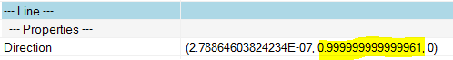

<head>
<meta http-equiv="Content-Type" content="text/html; charset=utf-8">
<link rel="stylesheet" type="text/css" href="bc.css">

<!--

-->
</head>

<!---

- rotate grid to horizontal or vertical
  13048285 [Grids Off-Axis]
  https://forums.autodesk.com/t5/revit-api-forum/grids-off-axis/m-p/7129065
  https://github.com/jeremytammik/the_building_coder_samples/blob/master/BuildingCoder/BuildingCoder/CmdSetGridEndpoint.cs

Aligning a Slightly Off-Axis Grid using #RevitAPI @AutodeskRevit #bim #dynamobim @AutodeskForge #ForgeDevCon http://bit.ly/aligngrid

Here is a follow-up on the recent discussion on how to modify a grid curve end point using <code>Grid.SetCurveInView</code>.
In the Revit API discussion forum thread on off-axis grids causing warnings in Revit, an attempt to use the same approach fails. Instead, Fair59 presents a solution using <code>RotateElement</code> to align an almost horizontal or almost vertical grid that is slightly off-axis...

-->

### Aligning a Slightly Off-Axis Grid

Here is a follow-up on the recent discussion on how
to [modify a grid curve end point](http://thebuildingcoder.typepad.com/blog/2017/05/sdk-update-rvtsamples-and-modifying-grid-end-point.html#4) using
`Grid.SetCurveInView`.

In the [Revit API discussion forum](http://forums.autodesk.com/t5/revit-api-forum/bd-p/160) thread
on [off-axis grids](https://forums.autodesk.com/t5/revit-api-forum/grids-off-axis/m-p/7129065) causing
warnings in Revit, an attempt to use the same approach fails.

Instead, Fair59 presents a solution using `RotateElement` to align an almost horizontal or almost vertical grid that is slightly off-axis:

**Question:** I have models with `Grid` elements that produce off-axis warnings.
Snooping the `Grid.Lines` shows direction vectors that are microscopically off horizontal/vertical.
I have been unsuccessful in changing the `XYZ` `Direction`, which is read-only.

Is it possible to adjust the direction vector, or the start and end points, to resolve the off-axis error? 

**Answer:** The solution
to  [modify a grid curve end point](http://thebuildingcoder.typepad.com/blog/2017/05/sdk-update-rvtsamples-and-modifying-grid-end-point.html#4) might
be exactly what you need.

**Response:** That looks like precisely what is required.
However, on grids that are microscopically off-axis, it fails, saying "The curve is unbound or not coincident with the original one of the datum plane".

**Answer:** The exception message basically says that your new curve doesn't lie on the old curve, meaning that you can't change the direction this way.

The solution is to rotate the `Grid` with `ElementTransformUtils.RotateElement`.

**Response:** That would be a reasonable solution. I suspect that the error is not from user input, but a result of Revit's accuracy limitations and rounding issues. In my case the variation is microscopic, so determining the relative rotation increment, rather than being able to set the absolute angle will just push the rounding error further out. This is the off-axis grid:

The highlighted value should be 1.0 but this `Direction` property is read-only.

**Answer:** It is maybe a rounding issue, but Revit gives you a warning in the Warning-Review list, so it would be prudent to correct the issue.

Here is the method `AlignOffAxisGrid` that does so:

<pre class="code">
///&nbsp;&lt;summary&gt;
///&nbsp;Align&nbsp;the&nbsp;given&nbsp;grid&nbsp;horizontally&nbsp;or&nbsp;vertically&nbsp;
///&nbsp;if&nbsp;it&nbsp;is&nbsp;very&nbsp;slightly&nbsp;off&nbsp;axis,&nbsp;by&nbsp;Fair59&nbsp;in
///&nbsp;https://forums.autodesk.com/t5/revit-api-forum/grids-off-axis/m-p/7129065
///&nbsp;&lt;/summary&gt;
void&nbsp;AlignOffAxisGrid(
&nbsp;&nbsp;Grid&nbsp;grid&nbsp;)
{
&nbsp;&nbsp;//Grid&nbsp;grid&nbsp;=&nbsp;doc.GetElement(&nbsp;
&nbsp;&nbsp;//&nbsp;&nbsp;sel.GetElementIds().FirstOrDefault()&nbsp;)&nbsp;as&nbsp;Grid;
 
&nbsp;&nbsp;Document&nbsp;doc&nbsp;=&nbsp;grid.Document;
 
&nbsp;&nbsp;XYZ&nbsp;direction&nbsp;=&nbsp;grid.Curve
&nbsp;&nbsp;&nbsp;&nbsp;.GetEndPoint(&nbsp;1&nbsp;)
&nbsp;&nbsp;&nbsp;&nbsp;.Subtract(&nbsp;grid.Curve.GetEndPoint(&nbsp;0&nbsp;)&nbsp;)
&nbsp;&nbsp;&nbsp;&nbsp;.Normalize();
 
&nbsp;&nbsp;double&nbsp;distance2hor&nbsp;=&nbsp;direction.DotProduct(&nbsp;XYZ.BasisY&nbsp;);
&nbsp;&nbsp;double&nbsp;distance2vert&nbsp;=&nbsp;direction.DotProduct(&nbsp;XYZ.BasisX&nbsp;);
&nbsp;&nbsp;double&nbsp;angle&nbsp;=&nbsp;0;
 
&nbsp;&nbsp;//&nbsp;Maybe&nbsp;use&nbsp;another&nbsp;criterium&nbsp;then&nbsp;&lt;0.0001
 
&nbsp;&nbsp;double&nbsp;max_distance&nbsp;=&nbsp;0.0001;
 
&nbsp;&nbsp;if(&nbsp;Math.Abs(&nbsp;distance2hor&nbsp;)&nbsp;&lt;&nbsp;max_distance&nbsp;)
&nbsp;&nbsp;{
&nbsp;&nbsp;&nbsp;&nbsp;XYZ&nbsp;vector&nbsp;=&nbsp;direction.X&nbsp;&lt;&nbsp;0&nbsp;
&nbsp;&nbsp;&nbsp;&nbsp;&nbsp;&nbsp;?&nbsp;direction.Negate()&nbsp;
&nbsp;&nbsp;&nbsp;&nbsp;&nbsp;&nbsp;:&nbsp;direction;
 
&nbsp;&nbsp;&nbsp;&nbsp;angle&nbsp;=&nbsp;Math.Asin(&nbsp;-vector.Y&nbsp;);
&nbsp;&nbsp;}
 
&nbsp;&nbsp;if(&nbsp;Math.Abs(&nbsp;distance2vert&nbsp;)&nbsp;&lt;&nbsp;max_distance&nbsp;)
&nbsp;&nbsp;{
&nbsp;&nbsp;&nbsp;&nbsp;XYZ&nbsp;vector&nbsp;=&nbsp;direction.Y&nbsp;&lt;&nbsp;0&nbsp;
&nbsp;&nbsp;&nbsp;&nbsp;&nbsp;&nbsp;?&nbsp;direction.Negate()&nbsp;
&nbsp;&nbsp;&nbsp;&nbsp;&nbsp;&nbsp;:&nbsp;direction;
 
&nbsp;&nbsp;&nbsp;&nbsp;angle&nbsp;=&nbsp;Math.Asin(&nbsp;vector.X&nbsp;);
&nbsp;&nbsp;}
 
&nbsp;&nbsp;if(&nbsp;angle.CompareTo(&nbsp;0&nbsp;)&nbsp;!=&nbsp;0&nbsp;)
&nbsp;&nbsp;{
&nbsp;&nbsp;&nbsp;&nbsp;using(&nbsp;Transaction&nbsp;t&nbsp;=&nbsp;new&nbsp;Transaction(&nbsp;doc&nbsp;)&nbsp;)
&nbsp;&nbsp;&nbsp;&nbsp;{
&nbsp;&nbsp;&nbsp;&nbsp;&nbsp;&nbsp;t.Start(&nbsp;&quot;correctGrid&quot;&nbsp;);
 
&nbsp;&nbsp;&nbsp;&nbsp;&nbsp;&nbsp;ElementTransformUtils.RotateElement(&nbsp;doc,&nbsp;
&nbsp;&nbsp;&nbsp;&nbsp;&nbsp;&nbsp;&nbsp;&nbsp;grid.Id,&nbsp;
&nbsp;&nbsp;&nbsp;&nbsp;&nbsp;&nbsp;&nbsp;&nbsp;Line.CreateBound(&nbsp;grid.Curve.GetEndPoint(&nbsp;0&nbsp;),&nbsp;
&nbsp;&nbsp;&nbsp;&nbsp;&nbsp;&nbsp;&nbsp;&nbsp;&nbsp;&nbsp;grid.Curve.GetEndPoint(&nbsp;0&nbsp;).Add(&nbsp;XYZ.BasisZ&nbsp;)&nbsp;),&nbsp;
&nbsp;&nbsp;&nbsp;&nbsp;&nbsp;&nbsp;&nbsp;&nbsp;angle&nbsp;);
 
&nbsp;&nbsp;&nbsp;&nbsp;&nbsp;&nbsp;t.Commit();
&nbsp;&nbsp;&nbsp;&nbsp;}
&nbsp;&nbsp;}
}
</pre>

**Response:** Many thanks, that has indeed resolved the error. 

Many thanks to Fair59 for this efficient solution!

I added it 
to [The Building Coder samples](https://github.com/jeremytammik/the_building_coder_samples)
module [CmdSetGridEndpoint.cs](https://github.com/jeremytammik/the_building_coder_samples/blob/master/BuildingCoder/BuildingCoder/CmdSetGridEndpoint.cs)
in [release 2018.0.133.1](https://github.com/jeremytammik/the_building_coder_samples/releases/tag/2018.0.133.1),
cf. the [diff to the previous version](https://github.com/jeremytammik/the_building_coder_samples/compare/2018.0.133.0...2018.0.133.1).

