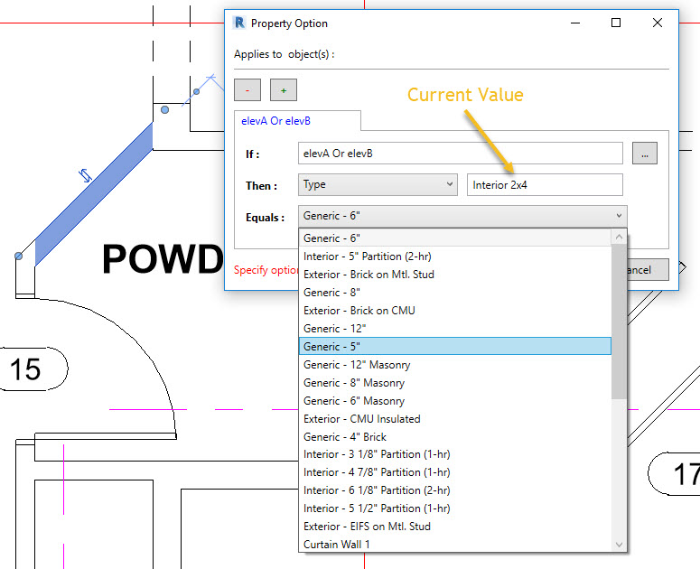

<head>
<meta http-equiv="Content-Type" content="text/html; charset=utf-8">
<link rel="stylesheet" type="text/css" href="bc.css">

<!--

-->
</head>

<!---

- https://forums.autodesk.com/t5/revit-api-forum/elegant-way-to-get-possible-elementid-values-for-specific/m-p/7166198

- https://forums.autodesk.com/t5/revit-api-forum/how-to-extract-points-of-areas-for-pathfinding-algorithm/td-p/7163541
  https://revitbeyondbim.wordpress.com/2017/01/03/fire-exit-risk-assessment-with-revit-and-dynamo/

Finding an exit path through the BIM using #RevitAPI @AutodeskRevit #bim #dynamobim @AutodeskForge #ForgeDevCon http://bit.ly/path_elemid_param
Determining ElementId Parameter values #RevitAPI @AutodeskRevit #bim #dynamobim @AutodeskForge #ForgeDevCon http://bit.ly/path_elemid_param

As usual, lots of exciting discussions are being conducted in the Revit API discussion forum.
I'll just highlight two of them going on right now
&ndash; Finding a path through the BIM
&ndash; Finding all possible <code>ElementId</code> values for specific <code>Parameter</code>...

-->

### Finding an Exit Path and ElementId Parameter Values

As usual, lots of exciting discussions are being conducted in
the [Revit API discussion forum](http://forums.autodesk.com/t5/revit-api-forum/bd-p/160).

I'll just highlight two of them going on right now:

- [Finding a path through the BIM](#2)
- [Finding all possible `ElementId` values for specific `Parameter`](#3)

#### Finding a Path Through the BIM

First, an issue raised by Terry
on [how to extract points of areas for pathfinding algorithm](https://forums.autodesk.com/t5/revit-api-forum/how-to-extract-points-of-areas-for-pathfinding-algorithm/td-p/7163541):

**Question:** I  want to find shortest safety path from any room to the exit in Revit.
 
Thus, I plan to divide areas (like rooms, exit, floor, doors) into two-dimensional grids to form vertex or nodes, so that I can apply them in a pathfinding algorithm like [A*](https://en.wikipedia.org/wiki/A*_search_algorithm).

By Subh83 &ndash; Own work, <a href="http://creativecommons.org/licenses/by-sa/3.0" title="Creative Commons Attribution-Share Alike 3.0">CC BY-SA 3.0</a>, <a href="https://commons.wikimedia.org/w/index.php?curid=14916867">Link</a>

 
I noticed that Revit has provided coordinates in floats number which cannot be used directly, though. Is there some similar functionality which can achieve my plan in Revit API?
 
**Answer:** Regarding tips about handling the Revit floating point coordinates: That is pretty trivial. I suggest that you convert them to millimetres, store those in integer numbers, and base your calculations on that. Then you can convert the results back to the Revit imperial coordinates when needed.

The path finding aspect is much more interesting and challenging, of course.

I implemented
a [Revit add-in that prompts the user to select a model curve representing the optimal exit path](http://thebuildingcoder.typepad.com/blog/2016/09/hololens-escape-path-waypoint-json-exporter.html) for
a specific project of Kean Walmsley's.

That is not what you are asking for, but might help with inspiration or other aspects of your task.

Do you know what a [Voronoi diagram](https://en.wikipedia.org/wiki/Voronoi_diagram) is?
 
It might be used to generate the optimal path automatically.
 
Check out Max Thumfart's sample using the C++ Boost library [Voronoi implementation in a Revit add-in](http://thebuildingcoder.typepad.com/blog/2015/07/grevit-firerating-in-the-cloud-demo-deployment-vacation.html#3).
 
Furthermore, I heard that Adam Sheather presented an example of wrapping the A* algorithm in a Dynamo node at AU 2016; I don't see it mentioned in his class
material [SD21181-L &ndash; Coding New Nodes with Dynamo](http://au.autodesk.com/au-online/classes-on-demand/class-catalog/classes/year-2016/dynamo-studio/sd21181-l), though.
 
The A* C# library code you can use
is [another faster version of A* (2D+3D) in C#](http://www.roy-t.nl/2011/09/24/another-faster-version-of-a-2d3d-in-c.html)
by [Roy T](http://www.roy-t.nl).
 
You can use the geometry library in Dynamo or C# to check whether Revit elements intersect with the A* voxel space and use that to blank out that area.
 
With that in hand, you can specify a box and how many items you want to check against for the pathfinding.

You could implement code to generate Revit elements to do the intersection test in a temporary transaction and roll that back instead of committing.

However, it is probably more efficient to retrieve read-only element geometry from Revit elements with no transaction at all, and you could use
the [BooleanOperationsUtils.ExecuteBooleanOperation method](http://www.revitapidocs.com/2017/89cb7975-cc76-65ba-b996-bcb78d12161a.htm) to check for intersections.

**Response:** Thank you very much for your reply! The A* for 3D in C# is of great help in my future work.
 
I also found another simple path algorithm using dynamo which extracts points in grid, and a Dynamo package called lunch box would find the shortest:
[Fire Exit Risk Assessment with Revit and Dynamo](https://revitbeyondbim.wordpress.com/2017/01/03/fire-exit-risk-assessment-with-revit-and-dynamo).

It will give much inspiration for the pathfinding algorithm.

#### Finding all Possible ElementId Values for a Specific Parameter

Let's add to that yet another one of Fair59's growing list of impressive solutions, in the thread
on an [elegant way to get possible `ElementId` values for specific `Parameter`](https://forums.autodesk.com/t5/revit-api-forum/elegant-way-to-get-possible-elementid-values-for-specific/m-p/7166198):

**Question:** I'm creating a sort of "Property Editor" dialog for user selected elements. In my dialog, the user may pick from a list of non-read-only parameters, and specify an alternate value that my application will use later on under particular circumstances (see dialog image below).
 
The challenge is to provide a list of relevant alternate "Element Id Values" based on the selected parameter. So far, my approach is to explicitly exam the "Current Value (ElementId)" of selected parameter and create alternate value list accordingly. For some "Current Values" I use the `GetSimilarTypes` function, while others I simply filter the document for elements of same category, cf. the image and code below.

So far, I have two questions:
 
- Can someone suggest a less explicit, more elegant way of populating the alternate ElementId values?
- Based on my current approach, if the "Current Value" is NULL, I have no way of getting alternate values. I can't find a way to get available values for a Parameter that does not have an existing value for reference.
 

 

<pre class="code">
&nbsp;&nbsp;if(&nbsp;request&nbsp;==&nbsp;EditPropertyOptRequest.GetAvailableValues&nbsp;)
&nbsp;&nbsp;{
&nbsp;&nbsp;&nbsp;&nbsp;cond.SelElemValue&nbsp;=&nbsp;null;
&nbsp;&nbsp;&nbsp;&nbsp;cond.PropertyOpt.ElementValues&nbsp;=&nbsp;new&nbsp;ObservableCollection&lt;Element&gt;();
 
&nbsp;&nbsp;&nbsp;&nbsp;try
&nbsp;&nbsp;&nbsp;&nbsp;{
&nbsp;&nbsp;&nbsp;&nbsp;&nbsp;&nbsp;dynamic&nbsp;CurrentElem&nbsp;=&nbsp;doc.GetElement(&nbsp;cond.SelProperty.AsElementId&nbsp;);
 
&nbsp;&nbsp;&nbsp;&nbsp;&nbsp;&nbsp;if(&nbsp;(&nbsp;CurrentElem&nbsp;)&nbsp;is&nbsp;WallType&nbsp;)
&nbsp;&nbsp;&nbsp;&nbsp;&nbsp;&nbsp;{
&nbsp;&nbsp;&nbsp;&nbsp;&nbsp;&nbsp;&nbsp;&nbsp;WallType&nbsp;obj&nbsp;=&nbsp;CurrentElem;
 
&nbsp;&nbsp;&nbsp;&nbsp;&nbsp;&nbsp;&nbsp;&nbsp;foreach(&nbsp;void&nbsp;ElemId_loopVariable&nbsp;in&nbsp;obj.GetSimilarTypes&nbsp;)
&nbsp;&nbsp;&nbsp;&nbsp;&nbsp;&nbsp;&nbsp;&nbsp;{
&nbsp;&nbsp;&nbsp;&nbsp;&nbsp;&nbsp;&nbsp;&nbsp;&nbsp;&nbsp;ElemId&nbsp;=&nbsp;ElemId_loopVariable;
&nbsp;&nbsp;&nbsp;&nbsp;&nbsp;&nbsp;&nbsp;&nbsp;&nbsp;&nbsp;cond.PropertyOpt.ElementValues.Add(&nbsp;doc.GetElement(&nbsp;ElemId&nbsp;)&nbsp;);
&nbsp;&nbsp;&nbsp;&nbsp;&nbsp;&nbsp;&nbsp;&nbsp;}
&nbsp;&nbsp;&nbsp;&nbsp;&nbsp;&nbsp;}
&nbsp;&nbsp;&nbsp;&nbsp;&nbsp;&nbsp;else&nbsp;if(&nbsp;(&nbsp;CurrentElem&nbsp;)&nbsp;is&nbsp;FloorType&nbsp;)
&nbsp;&nbsp;&nbsp;&nbsp;&nbsp;&nbsp;{
&nbsp;&nbsp;&nbsp;&nbsp;&nbsp;&nbsp;&nbsp;&nbsp;FloorType&nbsp;obj&nbsp;=&nbsp;CurrentElem;
 
&nbsp;&nbsp;&nbsp;&nbsp;&nbsp;&nbsp;&nbsp;&nbsp;foreach(&nbsp;void&nbsp;ElemId_loopVariable&nbsp;in&nbsp;obj.GetSimilarTypes&nbsp;)
&nbsp;&nbsp;&nbsp;&nbsp;&nbsp;&nbsp;&nbsp;&nbsp;{
&nbsp;&nbsp;&nbsp;&nbsp;&nbsp;&nbsp;&nbsp;&nbsp;&nbsp;&nbsp;ElemId&nbsp;=&nbsp;ElemId_loopVariable;
&nbsp;&nbsp;&nbsp;&nbsp;&nbsp;&nbsp;&nbsp;&nbsp;&nbsp;&nbsp;cond.PropertyOpt.ElementValues.Add(&nbsp;doc.GetElement(&nbsp;ElemId&nbsp;)&nbsp;);
&nbsp;&nbsp;&nbsp;&nbsp;&nbsp;&nbsp;&nbsp;&nbsp;}
&nbsp;&nbsp;&nbsp;&nbsp;&nbsp;&nbsp;}
&nbsp;&nbsp;&nbsp;&nbsp;&nbsp;&nbsp;else&nbsp;if(&nbsp;(&nbsp;CurrentElem&nbsp;)&nbsp;is&nbsp;FamilySymbol&nbsp;)
&nbsp;&nbsp;&nbsp;&nbsp;&nbsp;&nbsp;{
&nbsp;&nbsp;&nbsp;&nbsp;&nbsp;&nbsp;&nbsp;&nbsp;FamilySymbol&nbsp;obj&nbsp;=&nbsp;CurrentElem;
 
&nbsp;&nbsp;&nbsp;&nbsp;&nbsp;&nbsp;&nbsp;&nbsp;foreach(&nbsp;void&nbsp;ElemId_loopVariable&nbsp;in&nbsp;obj.GetSimilarTypes&nbsp;)
&nbsp;&nbsp;&nbsp;&nbsp;&nbsp;&nbsp;&nbsp;&nbsp;{
&nbsp;&nbsp;&nbsp;&nbsp;&nbsp;&nbsp;&nbsp;&nbsp;&nbsp;&nbsp;ElemId&nbsp;=&nbsp;ElemId_loopVariable;
&nbsp;&nbsp;&nbsp;&nbsp;&nbsp;&nbsp;&nbsp;&nbsp;&nbsp;&nbsp;cond.PropertyOpt.ElementValues.Add(&nbsp;doc.GetElement(&nbsp;ElemId&nbsp;)&nbsp;);
&nbsp;&nbsp;&nbsp;&nbsp;&nbsp;&nbsp;&nbsp;&nbsp;}
&nbsp;&nbsp;&nbsp;&nbsp;&nbsp;&nbsp;}
&nbsp;&nbsp;&nbsp;&nbsp;&nbsp;&nbsp;else&nbsp;if(&nbsp;(&nbsp;CurrentElem&nbsp;)&nbsp;is&nbsp;Level&nbsp;)
&nbsp;&nbsp;&nbsp;&nbsp;&nbsp;&nbsp;{
&nbsp;&nbsp;&nbsp;&nbsp;&nbsp;&nbsp;&nbsp;&nbsp;FilteredElementCollector&nbsp;collector&nbsp;=&nbsp;new&nbsp;FilteredElementCollector(&nbsp;doc&nbsp;);
&nbsp;&nbsp;&nbsp;&nbsp;&nbsp;&nbsp;&nbsp;&nbsp;collector.OfCategory(&nbsp;BuiltInCategory.OST_Levels&nbsp;).WhereElementIsNotElementType();
 
&nbsp;&nbsp;&nbsp;&nbsp;&nbsp;&nbsp;&nbsp;&nbsp;foreach(&nbsp;void&nbsp;elem_loopVariable&nbsp;in&nbsp;collector&nbsp;)
&nbsp;&nbsp;&nbsp;&nbsp;&nbsp;&nbsp;&nbsp;&nbsp;{
&nbsp;&nbsp;&nbsp;&nbsp;&nbsp;&nbsp;&nbsp;&nbsp;&nbsp;&nbsp;elem&nbsp;=&nbsp;elem_loopVariable;
&nbsp;&nbsp;&nbsp;&nbsp;&nbsp;&nbsp;&nbsp;&nbsp;&nbsp;&nbsp;cond.PropertyOpt.ElementValues.Add(&nbsp;elem&nbsp;);
&nbsp;&nbsp;&nbsp;&nbsp;&nbsp;&nbsp;&nbsp;&nbsp;}
&nbsp;&nbsp;&nbsp;&nbsp;&nbsp;&nbsp;}
&nbsp;&nbsp;&nbsp;&nbsp;&nbsp;&nbsp;else&nbsp;if(&nbsp;(&nbsp;CurrentElem&nbsp;)&nbsp;is&nbsp;Phase&nbsp;)
&nbsp;&nbsp;&nbsp;&nbsp;&nbsp;&nbsp;{
&nbsp;&nbsp;&nbsp;&nbsp;&nbsp;&nbsp;&nbsp;&nbsp;FilteredElementCollector&nbsp;collector&nbsp;=&nbsp;new&nbsp;FilteredElementCollector(&nbsp;doc&nbsp;);
&nbsp;&nbsp;&nbsp;&nbsp;&nbsp;&nbsp;&nbsp;&nbsp;collector.OfCategory(&nbsp;BuiltInCategory.OST_Phases&nbsp;).WhereElementIsNotElementType();
 
&nbsp;&nbsp;&nbsp;&nbsp;&nbsp;&nbsp;&nbsp;&nbsp;foreach(&nbsp;void&nbsp;elem_loopVariable&nbsp;in&nbsp;collector&nbsp;)
&nbsp;&nbsp;&nbsp;&nbsp;&nbsp;&nbsp;&nbsp;&nbsp;{
&nbsp;&nbsp;&nbsp;&nbsp;&nbsp;&nbsp;&nbsp;&nbsp;&nbsp;&nbsp;elem&nbsp;=&nbsp;elem_loopVariable;
&nbsp;&nbsp;&nbsp;&nbsp;&nbsp;&nbsp;&nbsp;&nbsp;&nbsp;&nbsp;cond.PropertyOpt.ElementValues.Add(&nbsp;elem&nbsp;);
&nbsp;&nbsp;&nbsp;&nbsp;&nbsp;&nbsp;&nbsp;&nbsp;}
&nbsp;&nbsp;&nbsp;&nbsp;&nbsp;&nbsp;}
&nbsp;&nbsp;&nbsp;&nbsp;&nbsp;&nbsp;cond.SelElemValue&nbsp;=&nbsp;cond.PropertyOpt.ElementValues(&nbsp;0&nbsp;);
&nbsp;&nbsp;&nbsp;&nbsp;}
&nbsp;&nbsp;&nbsp;&nbsp;catch(&nbsp;Exception&nbsp;ex&nbsp;)
&nbsp;&nbsp;&nbsp;&nbsp;{
&nbsp;&nbsp;&nbsp;&nbsp;}
&nbsp;&nbsp;}
</pre>
 
Quick update...
 
After realizing `GetSimilarTypes` method is inherited from the `ElementType` base class, I now attempt to cast `Element` to `ElementType`, then use `GetSimilarTypes` method if `ElemType` is Not NULL. Otherwise I filter document for NonElementTypes of same Category. I still need to handle elements with No Category. So far, I've identified Line Styles as being this way.
 
I am quite happy with this approach!
 
<pre class="code">
  if(&nbsp;request&nbsp;==&nbsp;EditPropertyOptRequest.GetAvailableValues&nbsp;)
  {
  &nbsp;&nbsp;cond.SelElemValue&nbsp;=&nbsp;null;
  &nbsp;&nbsp;cond.PropertyOpt.ElementValues&nbsp;=&nbsp;new&nbsp;ObservableCollection&lt;Element&gt;();
   
  &nbsp;&nbsp;if(&nbsp;cond.SelProperty.StorageType&nbsp;==&nbsp;StorageType.ElementId&nbsp;)
  &nbsp;&nbsp;{
  &nbsp;&nbsp;&nbsp;&nbsp;ElementId&nbsp;ElemId&nbsp;=&nbsp;cond.SelProperty.AsElementId;
  &nbsp;&nbsp;&nbsp;&nbsp;if(&nbsp;ElemId&nbsp;==&nbsp;null&nbsp;)
  &nbsp;&nbsp;&nbsp;&nbsp;&nbsp;&nbsp;return;
   
  &nbsp;&nbsp;&nbsp;&nbsp;Element&nbsp;Elem&nbsp;=&nbsp;doc.GetElement(&nbsp;ElemId&nbsp;);
  &nbsp;&nbsp;&nbsp;&nbsp;ElementType&nbsp;ElemType&nbsp;=&nbsp;Elem&nbsp;as&nbsp;ElementType;
   
  &nbsp;&nbsp;&nbsp;&nbsp;if(&nbsp;ElemType&nbsp;!=&nbsp;null&nbsp;)
  &nbsp;&nbsp;&nbsp;&nbsp;{
  &nbsp;&nbsp;&nbsp;&nbsp;&nbsp;&nbsp;foreach(&nbsp;ElemId&nbsp;in&nbsp;ElemType.GetSimilarTypes&nbsp;)
  &nbsp;&nbsp;&nbsp;&nbsp;&nbsp;&nbsp;{
  &nbsp;&nbsp;&nbsp;&nbsp;&nbsp;&nbsp;&nbsp;&nbsp;cond.PropertyOpt.ElementValues.Add(&nbsp;doc.GetElement(&nbsp;ElemId&nbsp;)&nbsp;);
  &nbsp;&nbsp;&nbsp;&nbsp;&nbsp;&nbsp;}
  &nbsp;&nbsp;&nbsp;&nbsp;}
  &nbsp;&nbsp;&nbsp;&nbsp;else&nbsp;if(&nbsp;Elem.Category&nbsp;!=&nbsp;null&nbsp;)
  &nbsp;&nbsp;&nbsp;&nbsp;{
  &nbsp;&nbsp;&nbsp;&nbsp;&nbsp;&nbsp;FilteredElementCollector&nbsp;collector&nbsp;=&nbsp;new&nbsp;FilteredElementCollector(&nbsp;doc&nbsp;);
  &nbsp;&nbsp;&nbsp;&nbsp;&nbsp;&nbsp;collector.OfCategory(&nbsp;Elem.Category.Id.IntegerValue&nbsp;).WhereElementIsNotElementType();
   
  &nbsp;&nbsp;&nbsp;&nbsp;&nbsp;&nbsp;foreach(&nbsp;Elem&nbsp;in&nbsp;collector&nbsp;)
  &nbsp;&nbsp;&nbsp;&nbsp;&nbsp;&nbsp;{
  &nbsp;&nbsp;&nbsp;&nbsp;&nbsp;&nbsp;&nbsp;&nbsp;cond.PropertyOpt.ElementValues.Add(&nbsp;Elem&nbsp;);
  &nbsp;&nbsp;&nbsp;&nbsp;&nbsp;&nbsp;}
  &nbsp;&nbsp;&nbsp;&nbsp;}
  &nbsp;&nbsp;&nbsp;&nbsp;else
  &nbsp;&nbsp;&nbsp;&nbsp;{
  &nbsp;&nbsp;&nbsp;&nbsp;&nbsp;&nbsp;//
  &nbsp;&nbsp;&nbsp;&nbsp;&nbsp;&nbsp;//&nbsp;Handle&nbsp;non-category&nbsp;elements.&nbsp;Namely&nbsp;Line&nbsp;Styles(aka&nbsp;GraphicStlyes)
  &nbsp;&nbsp;&nbsp;&nbsp;&nbsp;&nbsp;//
  &nbsp;&nbsp;&nbsp;&nbsp;}
   
  &nbsp;&nbsp;&nbsp;&nbsp;cond.SelElemValue&nbsp;=&nbsp;cond.PropertyOpt.ElementValues(&nbsp;0&nbsp;);
  &nbsp;&nbsp;}
  }
</pre>

This differs significantly from
the [combo box dropdown workarounds](http://thebuildingcoder.typepad.com/blog/2015/11/drop-down-enumerated-parameter-values.html),
because it touches on how to mimic contextual content of the Element Properties Panel using Revit API; more specifically, how to get a list of available `ElementId` values for a given `Parameter` whose Storage Type = ElementId and has an existing value to use as reference. Mostly revolving around use of 'ElementType.GetSimilarTypes' method.

To get available values for a parameter that does not have an existing value for reference, you might be able to create a suitable template element in a temporary transaction, grab the data you require from it, and roll back the transaction without committing, also known as
the ['temporary transaction trick' TTT](http://thebuildingcoder.typepad.com/blog/about-the-author.html#5.53).
 
Even then, I don't see a way to determine what a "suitable template element" might be. Given a parameter with <null> ElementID value, the only helpful information looks like BuiltInParameter Id, but that doesn't get me very far. Worst case, I make exceptions for my favourite BuiltInParameter Id's to assist in determining "suitable template element".
 
Almost as if the Parameter class would benefit from something like a `GetSampleValueType` method.

**Answer:** You can use an `ElementParameterFilter` to get all the elements that have a value other than `ElementId.InvalidElementId` for a specific parameter.
 
This code filters for elements in the active view that are demolished in some phase:
 
<pre class="code">
  ParameterValueProvider&nbsp;pvp_Demolished&nbsp;
  &nbsp;&nbsp;=&nbsp;new&nbsp;ParameterValueProvider(&nbsp;
  &nbsp;&nbsp;&nbsp;&nbsp;new&nbsp;ElementId(&nbsp;(int)&nbsp;BuiltInParameter
  &nbsp;&nbsp;&nbsp;&nbsp;&nbsp;&nbsp;.PHASE_DEMOLISHED&nbsp;)&nbsp;);
   
  FilterNumericGreater&nbsp;fgreater&nbsp;
  &nbsp;&nbsp;=&nbsp;new&nbsp;FilterNumericGreater();
   
  FilterElementIdRule&nbsp;IdFilter&nbsp;
  &nbsp;&nbsp;=&nbsp;new&nbsp;FilterElementIdRule(&nbsp;pvp_Demolished,&nbsp;
  &nbsp;&nbsp;&nbsp;&nbsp;fgreater,&nbsp;ElementId.InvalidElementId&nbsp;);
   
  ElementParameterFilter&nbsp;efilter&nbsp;
  &nbsp;&nbsp;=&nbsp;new&nbsp;ElementParameterFilter(&nbsp;IdFilter&nbsp;);
   
  FilteredElementCollector&nbsp;elems&nbsp;
  &nbsp;&nbsp;=&nbsp;new&nbsp;FilteredElementCollector(&nbsp;
  &nbsp;&nbsp;&nbsp;&nbsp;doc,&nbsp;doc.ActiveView.Id&nbsp;)
  &nbsp;&nbsp;&nbsp;&nbsp;&nbsp;&nbsp;.WherePasses(&nbsp;efilter&nbsp;);
</pre>
 
**Response:** Unfortunately that's not what I'm looking to accomplish. Please see the [video below](https://www.youtube.com/watch?v=b_1k3uXaQrY) for a better explanation of what I'm trying to do:

<iframe width="480" height="270" src="https://www.youtube.com/embed/b_1k3uXaQrY?rel=0" frameborder="0" allowfullscreen></iframe>

Maybe you might have another idea.

**Answer:** Actually, it <u>is</u> part of what you are trying to accomplish. With an `ElementParameterFilter`, you get a list of elements (if there are any) that have a value for the parameter in question, and then you may find all the relevant values, or display all the found values.

**Response:** Oh, I see now, VERY CLEVER!!!
 
Just implemented and works like a charm. Only caveat like you say is "if there are any", but I can live with that.
 
Thanks for the great tip!!!

Many thanks again to Fair59 for all his exciting solutions!

<!-- A-star pathfinding algorithm -->
