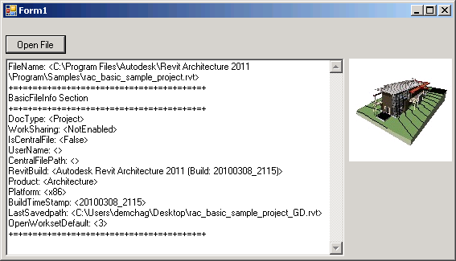

<head>
<meta http-equiv="Content-Type" content="text/html; charset=utf-8">
<link rel="stylesheet" type="text/css" href="bc.css">
<!--

-->

</head>

<!---

- read basic file info using python
  http://thebuildingcoder.typepad.com/blog/2008/10/rvt-file-version.html#comment-3378524407

- The View from Inside the Factory: What’s Next for Revit 2018
  http://blogs.autodesk.com/revit/2017/05/18/whats-next-revit-2018

Determine RVT version using #Python #RevitAPI @AutodeskRevit #bim #dynamobim @AutodeskForge #ForgeDevCon http://bit.ly/rvt_version_py

We discussed several approaches to read the <code>BasicFileInfo</code> and RVT OLE storage, aka COM Structured Storage, to retrieve stuff like the file version and preview image, and, more lately, alternative access to BIM data via Forge...

&ndash; 
...

-->

### Determining RVT File Version Using Python

Before diving into a programming topic, albeit a non-Revit-API one, let me highlight this interesting read 
on [The View from Inside the Factory: What’s Next for Revit 2018](http://blogs.autodesk.com/revit/2017/05/18/whats-next-revit-2018),
well worthwhile for programmers and non-programmers alike, discussing stuff like:

> The way we develop and deliver Revit software...  what that means to you, and to us, the folks 'inside the factory'...
agile development and delivery... more frequent releases...
[Revit Roadmap](https://forums.autodesk.com/t5/revit-roadmaps/bg-p/307)
and [Revit Ideas Page](https://forums.autodesk.com/t5/revit-ideas/idb-p/302)...

Returning to programming issues, we discussed several approaches to read the `BasicFileInfo` and RVT OLE storage,
aka [COM Structured Storage](https://en.wikipedia.org/wiki/COM_Structured_Storage),
to retrieve stuff like the file version and preview image, and, more lately, alternative access to BIM data via Forge:

- [RVT file version using Python `rvtver.py`](http://thebuildingcoder.typepad.com/blog/2008/10/rvt-file-version.html)
- [RFA file version using Python `rvtver.py`](http://thebuildingcoder.typepad.com/blog/2009/06/rfa-version-grey-commands-family-context-and-rdb-link.html#1)
- [C# Revit OLE Storage viewer](http://thebuildingcoder.typepad.com/blog/2010/06/open-revit-ole-storage.html)
- [Basic File Info and RVT file version via C# console application](http://thebuildingcoder.typepad.com/blog/2013/01/basic-file-info-and-rvt-file-version.html#5)
- [Reading an RVT File without Revit](http://thebuildingcoder.typepad.com/blog/2016/02/reading-an-rvt-file-without-revit.html)
- [External Access to the Revit API](http://thebuildingcoder.typepad.com/blog/2017/05/external-access-to-the-revit-api.html)

<!---
0887_rvt_file_version.htm
1407_read_rvt_without_revit.md
--->

Frederic now presented another more efficient Python solution for accessing the RVT file version in
his [comment](http://thebuildingcoder.typepad.com/blog/2008/10/rvt-file-version.html#comment-3378524407) on the first post above:

> I recently needed the same functionality, but in a large project file the `BasicFileInfo` was in line 900000 of 3000000 if I remember correctly.

> So, I needed something that accesses the `BasicFileInfo` directly.

> With the external [`olefile` Python package](https://pypi.org/project/olefile) from [pypi.org](https://pypi.org), that was very easy and readable &ndash;
[check out my gist](https://gist.github.com/hdm-dt-fb/46aa41f5394ed5e8e7055bc7258d2ff1):

<pre class="prettyprint">
import os.path as op
import olefile
import re

def get_rvt_file_version(rvt_file):
  if op.exists(rvt_file):
    if olefile.isOleFile(rvt_file):
      rvt_ole = olefile.OleFileIO(rvt_file)
      bfi = rvt_ole.openstream("BasicFileInfo")
      file_info = bfi.read().decode("utf-16le", "ignore")
      pattern = re.compile(r"\d{4}")
      rvt_file_version = re.search(pattern, file_info)[0]
      return rvt_file_version
    else:
      print("file does not apper to be an ole file: {}".format(rvt_file))
  else:
    print("file not found: {}".format(rvt_file))
</pre>

Thank you very much for sharing this, Frederic!
