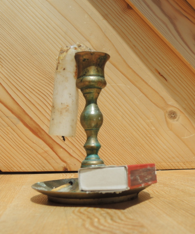
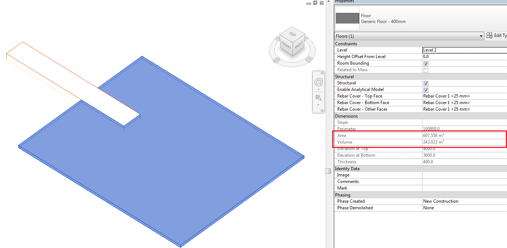
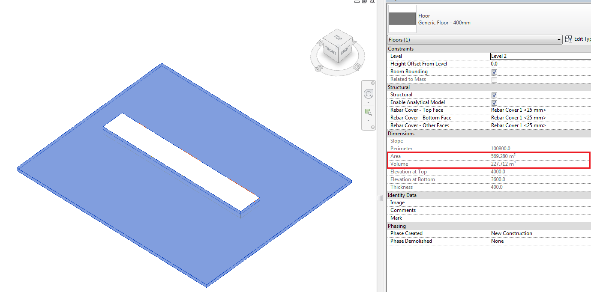
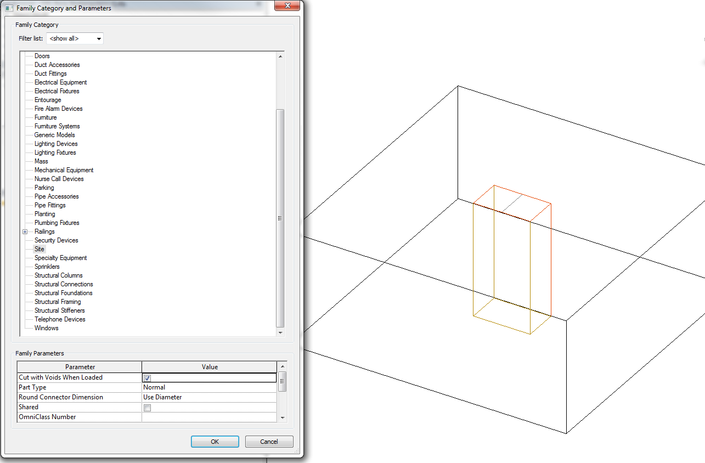
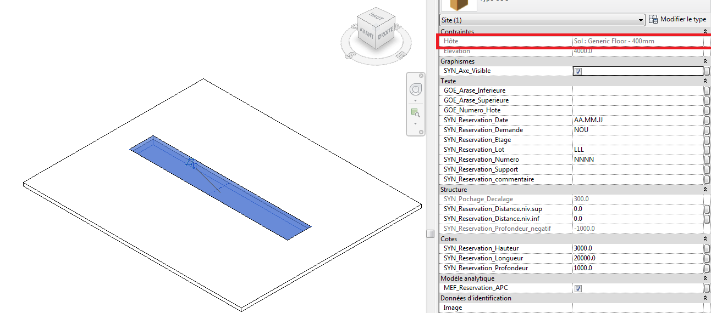
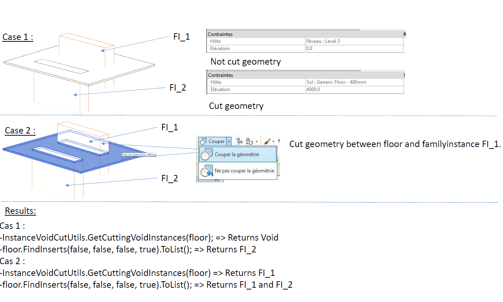

<head>
<meta http-equiv="Content-Type" content="text/html; charset=utf-8">
<link rel="stylesheet" type="text/css" href="bc.css">
<!--

-->

</head>

<!---

FindInserts finds void instances cutting floor #RevitAPI @AutodeskRevit #bim #dynamobim @AutodeskForge #ForgeDevCon http://bit.ly/FindInserts

Here is another brilliant and super succinct solution provided by Fair59, answering the Revit API discussion forum thread on how to get cutting void instances in the floor using the <code>HostObject</code> <code>FindInserts</code> method &ndash; Question: I have a floor on which a family instance is inserted on the face of the floor (the instance host is also the floor). I checked in the family the "Cut with Void When Loaded" parameter, so that the void is created in the floor. Now, I want to retrieve all the instances that create voids in the floor...

-->

### FindInserts Determines Void Instances Cutting Floor

Is it hot enough for you?

It sure is for this guy:

Time for some rest and recuperation, meseems...

Before that, let me share another brilliant and super succinct solution provided by Fair59, answering
the [Revit API discussion forum](http://forums.autodesk.com/t5/revit-api-forum/bd-p/160) thread on how
to [get cutting void instances in the floor](https://forums.autodesk.com/t5/revit-api-forum/get-cutting-void-instances-in-the-floor/m-p/7170237) using 
the [`HostObject`](http://www.revitapidocs.com/2017/56a32e0b-df65-a6ba-40bd-8f50a1f31dcd.htm)
[`FindInserts`](http://www.revitapidocs.com/2017/58990230-38cb-3af7-fd25-96ed3215a43d.htm) method:

**Question:** I have a floor on which a family instance is inserted on the face of the floor (the instance host is also the floor).

I checked in the family the "Cut with Void When Loaded" parameter, so that the void is created in the floor.

Now, I want to retrieve all the instances that create voids in the floor.

I did some research, and found the discussion
of [Boolean operations and `InstanceVoidCutUtils`](http://thebuildingcoder.typepad.com/blog/2011/06/boolean-operations-and-instancevoidcututils.html).

But when I use the `InstanceVoidCutUtils` `GetCuttingVoidInstances` method, it returns an empty list.
 
I also looked
at the [`ElementIntersectsSolidFilter` problem and solution](http://thebuildingcoder.typepad.com/blog/2015/07/intersect-solid-filter-avf-and-directshape-for-debugging.html#2) and
tried `ElementIntersectsElementFilter` and `ElementIntersectsSolidFilter`.

Those filters do not return the expected result for me to deduce the voids in the floor either; in fact, they say that no elements intersect.
 
First case &ndash; area = 607.558m2 and Volume = 243.023m3:
 

Second case &ndash; area = 607.558m2 and Volume = 243.023m3:

`Family` parameter "Cut with Voids When Loaded":
 

`FamilyInstance` cutting host:

Here is the code I use:

<pre class="code">
  Solid&nbsp;solid&nbsp;=&nbsp;floor.get_Geometry(&nbsp;new&nbsp;Options()&nbsp;)
  &nbsp;&nbsp;.OfType&lt;Solid&gt;()
  &nbsp;&nbsp;.Where&lt;Solid&gt;(&nbsp;s&nbsp;=&gt;&nbsp;(null&nbsp;!=&nbsp;s)&nbsp;&amp;&amp;&nbsp;(!s.Edges.IsEmpty)&nbsp;)
  &nbsp;&nbsp;.FirstOrDefault();
   
  FilteredElementCollector&nbsp;intersectingInstances&nbsp;
  &nbsp;&nbsp;=&nbsp;new&nbsp;FilteredElementCollector(&nbsp;doc&nbsp;)
  &nbsp;&nbsp;&nbsp;&nbsp;.OfClass(&nbsp;typeof(&nbsp;FamilyInstance&nbsp;)&nbsp;)
  &nbsp;&nbsp;&nbsp;&nbsp;.WherePasses(&nbsp;new&nbsp;ElementIntersectsSolidFilter(&nbsp;
  &nbsp;&nbsp;&nbsp;&nbsp;&nbsp;&nbsp;solid&nbsp;)&nbsp;);
   
  int&nbsp;n1&nbsp;=&nbsp;intersectingInstances.Count&lt;Element&gt;();
   
  intersectingInstances&nbsp;
  &nbsp;&nbsp;=&nbsp;new&nbsp;FilteredElementCollector(&nbsp;doc&nbsp;)
  &nbsp;&nbsp;&nbsp;&nbsp;.OfClass(&nbsp;typeof(&nbsp;FamilyInstance&nbsp;)&nbsp;)
  &nbsp;&nbsp;&nbsp;&nbsp;.WherePasses(&nbsp;new&nbsp;ElementIntersectsElementFilter(&nbsp;
  &nbsp;&nbsp;&nbsp;&nbsp;&nbsp;&nbsp;floor&nbsp;)&nbsp;);
   
  int&nbsp;n&nbsp;=&nbsp;intersectingInstances.Count&lt;Element&gt;();
</pre>

Here, both `n` and `n1` are equal to 0.
 
**Answer:** Try using 
the [`HostObject`](http://www.revitapidocs.com/2017/56a32e0b-df65-a6ba-40bd-8f50a1f31dcd.htm)
[`FindInserts`](http://www.revitapidocs.com/2017/58990230-38cb-3af7-fd25-96ed3215a43d.htm) method instead:

<pre class="code">
  HostObject&nbsp;floor;
  List&lt;ElementId&gt;&nbsp;intersectingInstanceIds&nbsp;
  &nbsp;&nbsp;=&nbsp;floor.FindInserts(&nbsp;false,&nbsp;false,&nbsp;false,&nbsp;true&nbsp;)
  &nbsp;&nbsp;&nbsp;&nbsp;.ToList();
</pre>

**Response:** I have done some tests and here are my results:

Situation:

- `Fl_1` is hosted by Level 3 and intersects the floor.
- `Fl_2` is hosted by the floor and intersects it.

Results:

1. Do not cut geometry:
    - `InstanceVoidCutUtils.GetCuttingVoidInstances(floor)` returns `void`
    - `floor.FindInserts(false,false,false,true)` returns `Fl_2`
2. Cut geometry:
    - `InstanceVoidCutUtils.GetCuttingVoidInstances(floor)` returns `Fl_1`
    - `floor.FindInserts(false,false,false,true)` returns both `Fl_1` and `Fl_2`

In summary, `FindInserts` returns `FI_1` even if its host (Level 3) is not the floor.

It's good.

I think we can say that the problem is solved.
 
Thank you FAIR59 ;)

