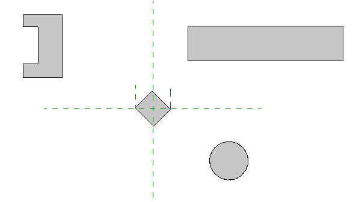
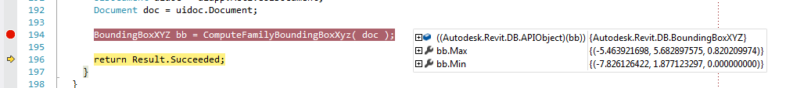
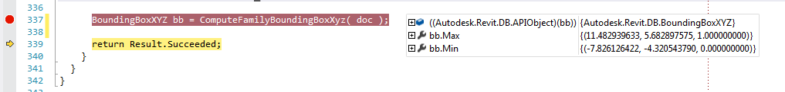

<head>
<meta http-equiv="Content-Type" content="text/html; charset=utf-8">
<link rel="stylesheet" type="text/css" href="bc.css">
<!--

-->

</head>

<!---

- post the news about BIM 360 Hackathon on your blog
  https://bim360hackathon.devpost.com/
  People can attend webinars without participating in Hackathon, for this they need to register at
  https://bim360hackathon.devpost.com/details/webinars

- FW: Autodesk® Developer News - BIM 360 online hackathon now open and reminder for Bangalore Accelerator

- https://forums.autodesk.com/t5/revit-api-forum/get-height-of-building/td-p/7223642

- FamilyBoundingBox
  tighter bounding box calculation using FamilyInstance information
  [Add FamilyInstance into bounding box calculation #1](2017-07-20 10:10 10:20 adn_aec https://github.com/jeremytammik/FamilyBoundingBox/pull/1)
  [release 2017.0.0.1](https://github.com/jeremytammik/FamilyBoundingBox/releases/tag/2017.0.0.1)

- 13022634 [BasicFileInfo IsCreatedLocal property outputting unexpected value]
  REVIT-116425 [unexpected value of BasicFileInfo IsCreatedLocal property -- 13022634]
  https://forums.autodesk.com/t5/revit-api-forum/basicfileinfo-iscreatedlocal-property-outputting-unexpected/m-p/7111503

BIM 360 Hackathon #RevitAPI @AutodeskRevit #bim #dynamobim @AutodeskForge #ForgeDevCon http://bit.ly/bim360hackboundingbox
Building height and Bounding Box Determination #RevitAPI @AutodeskRevit #bim #dynamobim @AutodeskForge #ForgeDevCon http://bit.ly/bim360hackboundingbox

Topics for today
&ndash; BIM 360 and Forge Hackathon and Webinar Series
&ndash; <code>IsCreatedLocal</code> versus <code>IsLocal</code>
&ndash; Getting the building height
&ndash; FamilyBoundingBox enhanced taking instances into account...

--->

### BIM 360 Hackathon and Bounding Box Determination

Summer is still hot and sunny.

I spent the last two weeks attempting to and succeeding pretty well at doing next to nothing.

Here are some things that cropped up anyway:

- [BIM 360 and Forge Hackathon and Webinar Series](#2)
- [`IsCreatedLocal` versus `IsLocal`](#3)
- [Getting the building height](#4)
- [FamilyBoundingBox enhanced taking instances into account](#5)

#### BIM 360 and Forge Hackathon and Webinar Series

Last time I wrote, I mentioned
the [BIM 360 online hackathon](http://thebuildingcoder.typepad.com/blog/2017/07/dockable-pane-point-cloud-ai-bim360-forge-and-au.html#3) and 
an introductory [integration and partnering webinar recording](http://thebuildingcoder.typepad.com/blog/2017/07/dockable-pane-point-cloud-ai-bim360-forge-and-au.html#3b).

Here is some more news and motivation for this event:

This is the fifth annual online hackathon conducted by the Autodesk App Store team, from August 1 to October 31, 2017.  This year, the hackathon is dedicated to apps that use the [BIM 360 API](https://developer.autodesk.com/en/docs/bim360/v1/overview).
 
This hackathon is a great way to quickly climb the BIM 360 + Forge API integration learning curve with Autodesk engineers close at hand (virtually) to grow your business by integrating with BIM 360.  The seven web training sessions give you a head start addressing opportunities across the entire building and infrastructure lifecycle and help you discover what you can achieve by leveraging Forge APIs with BIM 360. You don't have to take part in the hackathon to attend the webinars, but registration for the webinars is required.  Sign up once for the webinar series and attend any webinar you want. All webinars will be recorded:

- August 15 &ndash; BIM 360 business opportunities with AppStore
- August 16 &ndash; Introduction to BIM360 and Forge API
- August 17 &ndash; Authentication and Data Management
- August 18 &ndash; Model Derivative API
- August 22 &ndash; Viewer
- August 23 &ndash; BIM 360 Account Level API
- August 24 &ndash; Submitting BIM360 App to Autodesk AppStore
 
[Registration for the BIM 360 Online Hackathon](https://bim360hackathon.devpost.com) is open right now.
 
During the hackathon introduction webinar on August 15th, we’ll be talking about what you can do right now to integrate with BIM 360 and provide an early look at the API roadmap (i.e., programmatic access to Issues, BIM 360 UI integration, and more).
 
Another reason to work on BIM 360 integration sooner rather than later is we’ll be launching a BIM 360 app 'Showcase' on [www.autodesk.com](http://www.autodesk.com) plus a BIM 360 app storefront in the Autodesk App Store in the next few weeks.  Being present in the Showcase and the App Store BIM 360 storefront when they first 'open' is a great way to get maximum exposure for your business with Autodesk BIM 360 customers (while there are still just a few dozen apps, so you don’t risk getting lost in the crowd later, when hundreds are added).
 
For all new apps on the BIM 360 platform submitted to the Autodesk App Store and accepted for publication in the store, a reward of 500 USD will be given, for one eligible app per entrant.
 
Check out the [full hackathon details including how to enter and the rules](https://bim360hackathon.devpost.com).
 
You don’t have to have an app in mind or even be a developer to participate in or benefit from the Hackathon.  Join us to learn more about the opportunities to tap into the construction industry’s digital transformation by creating apps and seamless experiences that leverage the Forge APIs to extend BIM 360.
 
If you have any questions, please send an email to [bim360hackathon@autodesk.com](mailto:bim360hackathon@autodesk.com).

#### IsCreatedLocal versus IsLocal

We recently discussed an issue related to 
the [`BasicFileInfo` `IsCreatedLocal` property outputting an unexpected value](https://forums.autodesk.com/t5/revit-api-forum/basicfileinfo-iscreatedlocal-property-outputting-unexpected/m-p/7111503).

That was resolved by the following explanation from the Revit development team:

`IsCreatedLocal` is currently used in the Revit Server workflow.

If a local model is created by the `RevitServerTool` command line tool, the `IsCreatedLocal` property in `BasicFileInfo` is true.

The properties `IsCreatedLocal` and `IsLocal` are mutually exclusive &ndash; when `IsCreatedLocal` is true, `IsLocal` is actually false.

To safely determine whether a model is local, API users can use the following:

<pre class="code">
  IsCreatedLocal || IsLocal
</pre>

#### Getting the Building Height

Another sweet and short solution was achieved in 
the [Revit API discussion forum](http://forums.autodesk.com/t5/revit-api-forum/bd-p/160) thread
on [getting the height of a building](https://forums.autodesk.com/t5/revit-api-forum/get-height-of-building/td-p/7223642):

**Question:** This seems simple enough, but is there an easy way to get the total height of a building?
 
**Answer:** Sure there is.
 
[The Building Coder samples](https://github.com/jeremytammik/the_building_coder_samples) provide
a method to [get the entire model extents](http://thebuildingcoder.typepad.com/blog/2016/08/vacation-end-forge-news-and-bounding-boxes.html#8).
 
It calls the `get_BoundingBox` method generated by
the [BoundingBox property](http://www.revitapidocs.com/2017/def2f9f2-b23a-bcea-43a3-e6de41b014c8.htm) on
all elements in the model and aggregates their results.

You can easily adapt that to your needs.
 

#### FamilyBoundingBox Enhanced Taking Instances into Account

An enhancement to
the [FamilyBoundingBox add-in](https://github.com/jeremytammik/FamilyBoundingBox) to determine a family's extents leads to another bounding box related topic.

It is based on Kevin [@kelau1993](https://forums.autodesk.com/t5/user/viewprofilepage/user-id/4517553) Lau's solution to
determine the bounding box of a family in the family document environment presented in
the [Revit API discussion forum](http://forums.autodesk.com/t5/revit-api-forum/bd-p/160) thread
on [family bounding box in family document](https://forums.autodesk.com/t5/revit-api-forum/family-boundingbox-in-family-document/m-p/6946049).

Here is the [full description of the update in Kevin's own words](https://github.com/jeremytammik/FamilyBoundingBox/pull/1):

I updated the code to compute the family definition bounding box to take into account all nested family instances in addition to the `GeomCombinatiom` and `GenericForm` elements.

Previously, nested family instances were ignored.

A family instance requires going through the geometry to get a tighter bounding box.

The result of calling `get_BoundingBox` directly is really loose for some reason.

I looked through these sites for reference:

- [LINQ DIY Transformed Geometry Bounding Box](http://thebuildingcoder.typepad.com/blog/2013/10/linq-diy-transformed-geometry-bounding-box.html)
- [SetoutPoints](https://github.com/jeremytammik/SetoutPoints)
[GeomVertices.cs](https://github.com/jeremytammik/SetoutPoints/blob/master/SetoutPoints/GeomVertices.cs)
- [Knowledgebase article on GeometryInstances](https://knowledge.autodesk.com/support/revit-products/getting-started/caas/CloudHelp/cloudhelp/2017/ENU/Revit-API/files/GUID-B4F83374-0DF6-4737-91EB-900E676E862B-htm.html)
- [Example: Retrieve Geometry Data from a Beam](https://knowledge.autodesk.com/support/revit-products/getting-started/caas/CloudHelp/cloudhelp/2017/ENU/Revit-API/files/GUID-F092BCCC-77E9-4DA9-9264-10F0DB354BF5-htm.html)

I also tried using this:

<pre class="code">
  familyInstance
    .get_Geometry(options)
    .GetTransformed(
      familyInstance.GetTransform() )
</pre>

However, the result was inaccurate.

Here is a sample family <a href="zip/importnest.rfa">importnest.rfa</a>:

It contains a `GeomCombination` at the top left consisting of a void and a solid extrusion.

The rest of the geometries are nested family instances.

Notice that with the new code, the bounding box grows to include the FamilyInstances.

Here are the results in the debugger:

Old:

New:

My images don't really show that the bounding box is right for the FamilyInstances, though.
I don't know if there is a better way to get the coordinates of a vertex other than this method.
You can verify the bounding box by calculating it in the UI. My way is to just place ReferencePlanes and snoop the coordinates with RevitLookup.
One option to display them would be to create ReferencePlanes surrounding the bounding box in the different views or just create an Extrusion or something occupying the space of the bounding box.

Kevin's new code is integrated into
the [FamilyBoundingBox add-in](https://github.com/jeremytammik/FamilyBoundingBox)
[release 2017.0.0.1](https://github.com/jeremytammik/FamilyBoundingBox/releases/tag/2017.0.0.1).

Many thanks to Kevin for sharing this!
