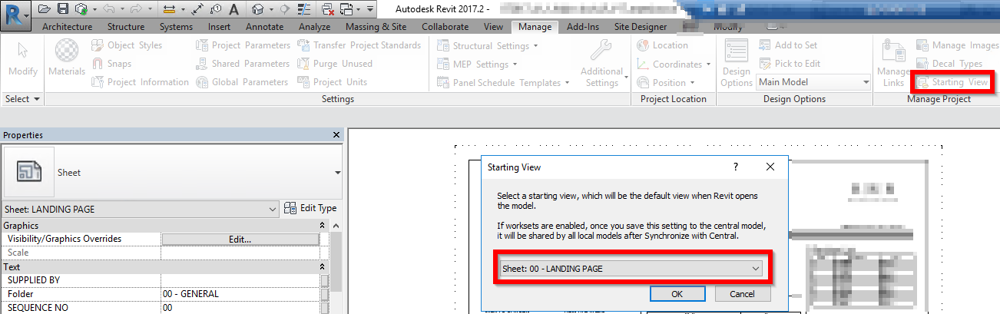
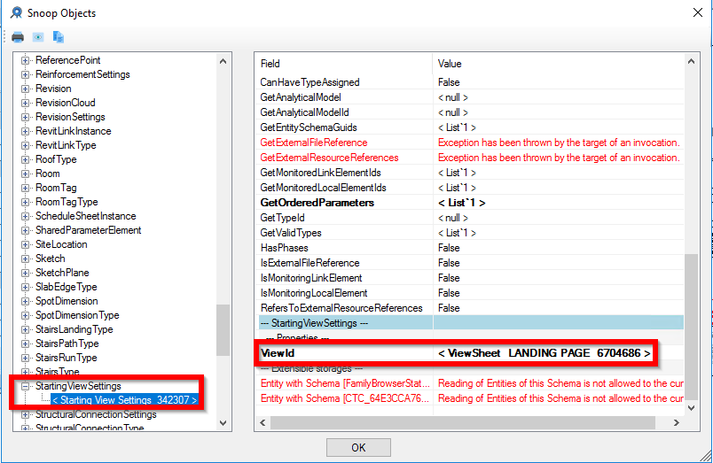

<head>
<meta http-equiv="Content-Type" content="text/html; charset=utf-8">
<link rel="stylesheet" type="text/css" href="bc.css">
<!--

-->

</head>

<!---

- publish /a/doc/forge/ recording for aec jim q

- devcon promo
  DevCon promo toolbox has slides for presentations or flyers for meet-ups - Please use:
  https://forge.autodesk.com/devcon-promo-tools
  https://autodesk.app.box.com/folder/34726869489
  You're our awesome dev community influencers - please retweet, share and like AutodeskForge Tweets about DevCon (and more;-) (edited)
  Other resources you might find helpful for Dev evangelism:
  For info about Forge and what the APIs offer -
  https://autodesk.box.com/s/khqe1tohno1fzhveegoziynkmpmh4lhu
  Community Success stories & use cases to see what people are doing with Forge -
  https://autodesk.box.com/s/wt2nica2rwfst47hkt80szdvyrjk3ptd
  Forge OTS page for all other Forge info and resources -
  https://autodesksales.gosavo.com/CustomPage/View.aspx?id=39136343&srlid=51521699&srisprm=False&sritidx=1&srpgidx=0&srpgsz=2

- How to pull the starting view for document using the Revit API
  https://stackoverflow.com/questions/45696372/how-to-pull-the-starting-view-for-document-using-the-revit-api

- Moving Detail Group only moves its LocationPoint, not detail items inside
  Moving items inside Detail Group
  https://forums.autodesk.com/t5/revit-api-forum/moving-detail-group-only-moves-its-locationpoint-not-detail/m-p/7302496
  
- 13269724 [Family Instance Filter]
  https://github.com/jeremytammik/the_building_coder_samples/releases/tag/2018.0.134.2
  https://forums.autodesk.com/t5/revit-api-forum/family-instance-filter/m-p/7287113

Forge for AEC demos & sample code #RevitAPI @AutodeskRevit #bim @AutodeskForge #ForgeDevCon http://bit.ly/fam_filt_forge_aec https://youtu.be/5xVwvBzemkg
Determining the @AutodeskRevit starting view #RevitAPI #bim #dynamobim @AutodeskForge #ForgeDevCon http://bit.ly/fam_filt_forge_aec
Filtering for family instances and types by family name #RevitAPI @AutodeskRevit #bim #dynamobim @AutodeskForge #ForgeDevCon http://bit.ly/fam_filt_forge_aec

A biggish post rather late in the week... still answering too many cases
&ndash; Forge for AEC demos and sample code
&ndash; Determining the starting view
&ndash; Detecting installed Revit version
&ndash; Detecting installed C3D version
&ndash; Moving items inside a detail group
&ndash; Filtering for family instances and types by family name...

--->

### Forge, Installed Version, Move Group, Name Filter

A biggish post rather late in the week... still answering too many cases:

- [Forge for AEC &ndash; demos and sample code](#2)
- [Determining the starting view](#3)
- [Detecting installed Revit version](#4)
- [Detecting installed C3D version](#5)
- [Moving items inside a detail group](#6)
- [Filtering for family instances and types by family name](#7)

####Forge for AEC &ndash; Demos and Sample Code

Last week, I briefly discussed some pros and cons
of [Revit versus Forge for BIM programming](http://thebuildingcoder.typepad.com/blog/2017/08/revit-versus-forge-ids-and-add-in-installation.html#2).

Since then, Jim Quanci, Senior Director Software Partner Development at Autodesk,
published [Autodesk Forge &ndash; What is it?](https://youtu.be/5xVwvBzemkg) &ndash;
a 45 minute video recording showing what's possible to do
with [Forge](https://forge.autodesk.com) through a set of demos and live code samples:

<iframe width="480" height="270" src="https://www.youtube.com/embed/5xVwvBzemkg?rel=0" frameborder="0" allowfullscreen></iframe>

If this spikes your interest, you will certainly benefit from
the [Forge developer conference DevCon](https://forge.autodesk.com/devcon-2017) taking place just
before [Autodesk University](http://au.autodesk.com) in Las Vegas November 13-14.

We are also working at creating some kind of mini DevCon
for [AU Germany in Darmstadt](https://www.rayseven.com/r7/runtime/autodesk/au2017/website.php), October 17-18.

I am planning on attending both venues and hope to see you at one of them.

####Determining the Starting View

[Skeletank](https://stackoverflow.com/users/180529/skeletank) shared
an interesting and illuminating solution on StackOverflow 
showing [how to pull the starting view for document using the Revit API](https://stackoverflow.com/questions/45696372/how-to-pull-the-starting-view-for-document-using-the-revit-api):

**Question:** How can I use the Revit API to get the Starting View for a Document? The equivalent way to access it using the user interface is seen below:

**Answer:** I used
the [RevitLookup tool](https://github.com/jeremytammik/RevitLookup) and
browsed through the database to find a class called `StartingViewSettings` with the property `ViewId` that returns the `ElementId` of the starting view:

Here is my actual code for getting the view:

<pre class="code">
&nbsp;&nbsp;FilteredElementCollector&nbsp;a
&nbsp;&nbsp;&nbsp;&nbsp;=&nbsp;new&nbsp;FilteredElementCollector(&nbsp;doc&nbsp;)
&nbsp;&nbsp;&nbsp;&nbsp;&nbsp;&nbsp;.OfClass(&nbsp;typeof(&nbsp;StartingViewSettings&nbsp;)&nbsp;);

&nbsp;&nbsp;View&nbsp;startingView&nbsp;=&nbsp;null;

&nbsp;&nbsp;foreach(&nbsp;StartingViewSettings&nbsp;settings&nbsp;in&nbsp;a&nbsp;)
&nbsp;&nbsp;{
&nbsp;&nbsp;&nbsp;&nbsp;startingView&nbsp;=&nbsp;doc.GetElement(
&nbsp;&nbsp;&nbsp;&nbsp;&nbsp;&nbsp;settings.ViewId&nbsp;)&nbsp;as&nbsp;View;
&nbsp;&nbsp;}
</pre>

Many thanks to skeletank for researching and sharing this, and describing the effective approach to do so!

####Detecting Installed Revit Version

Another issue was raised by my consulting colleague Miro Schonauer:

**Question:** What is the best way to check if any version and, if so, what version of Revit is installed?

I checked Windows registry keys mentioned in the discussion on 
the [perpetual GUID algorithm and Revit 2014 product GUIDs](http://thebuildingcoder.typepad.com/blog/2013/04/perpetual-guid-algorithm-and-revit-2014-product-guids.html), 
but that is only up to Revit 2014 and still not sure we can detect 'any version'.

**Answer:** One choice it to use `RevitProductUtility` API provided by the `RevitAddInUtility.dll` assembly:

<pre class="code">
&nbsp;&nbsp;IList&lt;RevitProduct&gt;&nbsp;allInstalledRevitProducts
&nbsp;&nbsp;&nbsp;&nbsp;=&nbsp;RevitProductUtility.GetAllInstalledRevitProducts();
 
&nbsp;&nbsp;foreach(&nbsp;RevitProduct&nbsp;p&nbsp;in&nbsp;allInstalledRevitProducts&nbsp;)
&nbsp;&nbsp;{
&nbsp;&nbsp;&nbsp;&nbsp;if(&nbsp;p.Version&nbsp;==&nbsp;RevitVersion.Revit2015&nbsp;)
&nbsp;&nbsp;&nbsp;&nbsp;{
&nbsp;&nbsp;&nbsp;&nbsp;&nbsp;&nbsp;//&nbsp;Revit&nbsp;2015&nbsp;installed.
&nbsp;&nbsp;&nbsp;&nbsp;}
&nbsp;&nbsp;&nbsp;&nbsp;else&nbsp;if(&nbsp;p.Version&nbsp;==&nbsp;RevitVersion.Revit2017&nbsp;)
&nbsp;&nbsp;&nbsp;&nbsp;{
&nbsp;&nbsp;&nbsp;&nbsp;&nbsp;&nbsp;//&nbsp;Revit&nbsp;2017&nbsp;installed.
&nbsp;&nbsp;&nbsp;&nbsp;}
&nbsp;&nbsp;}
</pre>

####Detecting Installed C3D Version

Another query from Miro, not on Revit, but such a closely related topic, so let's mention it as well:

**Question:** I would like to issue a warning if there is no C3D installed on the machine.

What is the best way to verify this?

Can I simply check if a certain registry entry exists?

I thought of using:

- C3D 2015
    - HKEY_LOCAL_MACHINE\SOFTWARE\Autodesk\AutoCAD\R20.0\ACAD-E000:409 &ndash; English
    - HKEY_LOCAL_MACHINE\SOFTWARE\Autodesk\AutoCAD\R20.0\InstalledProducts\C3D &ndash; any locale
- C3D 2015
    - HKEY_LOCAL_MACHINE\SOFTWARE\Autodesk\AutoCAD\R21.0\ACAD-0000:409
    - HKEY_LOCAL_MACHINE\SOFTWARE\Autodesk\AutoCAD\R21.0\InstalledProducts\C3D

**Answer:** It’s better to use these:

- HKEY_LOCAL_MACHINE\SOFTWARE\Autodesk\AutoCAD\R20.0\InstalledProducts\C3D
- HKEY_LOCAL_MACHINE\SOFTWARE\Autodesk\AutoCAD\R21.0\InstalledProducts\C3D

Many thanks to Miro for raising and clarifying this!

####Moving Items Inside a Detail Group

Fair59 solved another issue in
the [Revit API discussion forum](http://forums.autodesk.com/t5/revit-api-forum/bd-p/160) thread 
on [moving detail group only moves its location point, not detail items inside](https://forums.autodesk.com/t5/revit-api-forum/moving-detail-group-only-moves-its-locationpoint-not-detail/m-p/7302496):

**Question:** I'm trying to move Detail Group element to a point that was picked, but only the Location of the group moves, not the detail items inside.

**Answer:** To move the entire group, you can use:
 
<pre class="code">
&nbsp;&nbsp;XYZ&nbsp;moveVector&nbsp;=&nbsp;new&nbsp;XYZ(&nbsp;5,&nbsp;0,&nbsp;0&nbsp;);
 
&nbsp;&nbsp;using(&nbsp;Transaction&nbsp;t&nbsp;=&nbsp;new&nbsp;Transaction(&nbsp;doc&nbsp;)&nbsp;)
&nbsp;&nbsp;{
&nbsp;&nbsp;&nbsp;&nbsp;List&lt;ElementId&gt;&nbsp;toMove&nbsp;=&nbsp;new&nbsp;List&lt;ElementId&gt;()&nbsp;{
&nbsp;&nbsp;&nbsp;&nbsp;&nbsp;&nbsp;group.Id&nbsp;};
 
&nbsp;&nbsp;&nbsp;&nbsp;toMove.AddRange(&nbsp;group.GetMemberIds()&nbsp;);
&nbsp;&nbsp;&nbsp;&nbsp;t.Start(&nbsp;&quot;MoveGroup&quot;&nbsp;);
&nbsp;&nbsp;&nbsp;&nbsp;ElementTransformUtils.MoveElements(&nbsp;doc,&nbsp;
&nbsp;&nbsp;&nbsp;&nbsp;&nbsp;&nbsp;toMove,&nbsp;moveVector&nbsp;);
&nbsp;&nbsp;&nbsp;&nbsp;t.Commit();
&nbsp;&nbsp;}
</pre>

In the creation of the (extra) list, I added the `group.Id`.
So I move the `group.Id` and the `member.Ids`.

You can set the translation vector from the old point to the picked point like this:
 
<pre class="code">
&nbsp;&nbsp;XYZ&nbsp;locPoint&nbsp;=&nbsp;(&nbsp;group.Location&nbsp;as&nbsp;LocationPoint&nbsp;).Point;
&nbsp;&nbsp;XYZ&nbsp;pickedPoint;
&nbsp;&nbsp;moveVector&nbsp;=&nbsp;pickedPoint.Subtract(&nbsp;locPoint&nbsp;);
</pre>

Thank you, Fair59, for yet another succinct and accurate solution!

####Filtering for Family Instances and Types by Family Name

Yet another issue in 
the [Revit API discussion forum](http://forums.autodesk.com/t5/revit-api-forum/bd-p/160) thread
on implementing
a [family instance filter](https://forums.autodesk.com/t5/revit-api-forum/family-instance-filter/m-p/7287113) led
to a little update and
new [release 2018.0.134.2](https://github.com/jeremytammik/the_building_coder_samples/releases/tag/2018.0.134.2)
of [The Building Coder samples](https://github.com/jeremytammik/the_building_coder_samples):

**Question:** I want to retrieve a list of all Family Instances by Type name. As the Type name is not unique (i.e. "Type 1") and can be used repeatedly by different Families, I need to also specify the family name.

For instance, there are two title block families: `TB1` and `TB2`; both of them have a type named `60" x 30" Student`.

I would like to write a single filter statement that collects only `TB2:60" x 30" Student` instances.

It seems counter intuitive to run a `foreach` over your results to check the family type.

**Answer:** You can achieve the filter you ask for in several ways.

The easiest and slowest is to use .NET post-processing or LINQ.

That is equivalent to running a `foreach` loop over the results of the filter.

Revit returns a large collection of instances, which costs time and marshalling effort, and .NET post-processes them.

A much faster alternative, but a little bit more complex, is to implement
a [parameter filter](http://thebuildingcoder.typepad.com/blog/2010/06/element-name-parameter-filter-correction.html).

You can apply any filters you like in any order you like.
 
Revit may perform some optimisation by reordering them.
 
It is probably useful
to [apply all quick filters first](http://thebuildingcoder.typepad.com/blog/2015/12/quick-slow-and-linq-element-filtering.html).
 
Using `ToList` to convert the enumerable filtered element collector to a .NET `List` is  normally not necessary
and [may cause a significant inefficiency](http://thebuildingcoder.typepad.com/blog/2012/09/findelement-and-collector-optimisation.html).
 
Check out the examples provided
by [The Building Coder samples](https://github.com/jeremytammik/the_building_coder_samples) in
the [module CmdCollectorPerformance.cs](https://github.com/jeremytammik/the_building_coder_samples/blob/master/BuildingCoder/BuildingCoder/CmdCollectorPerformance.cs)
 
You could filter for families first, then determine their types, and then the instances referring to those.
 
In fact, the CmdCollectorPerformance.cs module includes code demonstrating that approach.
 
However, since the elements you are after in the end are the instances, it makes sense to filter for those right away, and then eliminate the ones that don't match the expected family.
 
Here are the two functions using LINQ post-processing that I now added to The Building Coder samples to answer this question once and for all:

<pre class="code">
  #region&nbsp;Retrieve&nbsp;all&nbsp;family&nbsp;instances&nbsp;of&nbsp;specific&nbsp;named&nbsp;family&nbsp;and&nbsp;type
  ///&nbsp;&lt;summary&gt;
  ///&nbsp;Get&nbsp;instances&nbsp;by&nbsp;family&nbsp;name&nbsp;then&nbsp;type&nbsp;name
  ///&nbsp;&lt;/summary&gt;
  static&nbsp;IEnumerable&lt;FamilyInstance&gt;
  &nbsp;&nbsp;GetFamilyInstancesByFamilyAndType(
  &nbsp;&nbsp;&nbsp;&nbsp;Document&nbsp;doc,
  &nbsp;&nbsp;&nbsp;&nbsp;string&nbsp;familyName,
  &nbsp;&nbsp;&nbsp;&nbsp;string&nbsp;typeName&nbsp;)
  {
  &nbsp;&nbsp;return&nbsp;new&nbsp;FilteredElementCollector(&nbsp;doc&nbsp;)
  &nbsp;&nbsp;&nbsp;&nbsp;.OfClass(&nbsp;typeof(&nbsp;FamilyInstance&nbsp;)&nbsp;)
  &nbsp;&nbsp;&nbsp;&nbsp;.Cast&lt;FamilyInstance&gt;()
  &nbsp;&nbsp;&nbsp;&nbsp;.Where(&nbsp;x&nbsp;=&gt;&nbsp;x.Symbol.Family.Name.Equals(&nbsp;familyName&nbsp;)&nbsp;)&nbsp;//&nbsp;family
  &nbsp;&nbsp;&nbsp;&nbsp;.Where(&nbsp;x&nbsp;=&gt;&nbsp;x.Name.Equals(&nbsp;typeName&nbsp;)&nbsp;);&nbsp;//&nbsp;family&nbsp;type&nbsp;&nbsp;&nbsp;&nbsp;&nbsp;&nbsp;&nbsp;&nbsp;&nbsp;&nbsp;&nbsp;&nbsp;&nbsp;&nbsp;&nbsp;
  }
  #endregion&nbsp;//&nbsp;Retrieve&nbsp;all&nbsp;family&nbsp;instances&nbsp;of&nbsp;specific&nbsp;named&nbsp;family&nbsp;and&nbsp;type
   
  #region&nbsp;Return&nbsp;first&nbsp;title&nbsp;block&nbsp;family&nbsp;symbol&nbsp;of&nbsp;specific&nbsp;named&nbsp;family&nbsp;and&nbsp;type
  ///&nbsp;&lt;summary&gt;
  ///&nbsp;Get&nbsp;title&nbsp;block&nbsp;family&nbsp;symbol&nbsp;(=&nbsp;definition)&nbsp;
  ///&nbsp;by&nbsp;family&nbsp;name&nbsp;then&nbsp;type&nbsp;name
  ///&nbsp;&lt;/summary&gt;
  static&nbsp;FamilySymbol
  &nbsp;&nbsp;GetTitleBlockSymbolByFamilyAndType(
  &nbsp;&nbsp;&nbsp;&nbsp;Document&nbsp;doc,
  &nbsp;&nbsp;&nbsp;&nbsp;string&nbsp;familyName,
  &nbsp;&nbsp;&nbsp;&nbsp;string&nbsp;typeName&nbsp;)
  {
  &nbsp;&nbsp;return&nbsp;new&nbsp;FilteredElementCollector(&nbsp;doc&nbsp;)
  &nbsp;&nbsp;&nbsp;&nbsp;.OfClass(&nbsp;typeof(&nbsp;FamilySymbol&nbsp;)&nbsp;)
  &nbsp;&nbsp;&nbsp;&nbsp;.OfCategory(&nbsp;BuiltInCategory.OST_TitleBlocks&nbsp;)
  &nbsp;&nbsp;&nbsp;&nbsp;.Cast&lt;FamilySymbol&gt;()
  &nbsp;&nbsp;&nbsp;&nbsp;.Where(&nbsp;x&nbsp;=&gt;&nbsp;x.FamilyName.Equals(&nbsp;familyName&nbsp;)&nbsp;)&nbsp;//&nbsp;family
  &nbsp;&nbsp;&nbsp;&nbsp;.FirstOrDefault(&nbsp;x&nbsp;=&gt;&nbsp;x.Name&nbsp;==&nbsp;typeName&nbsp;);&nbsp;//&nbsp;family&nbsp;type
  }
  #endregion&nbsp;//&nbsp;Return&nbsp;first&nbsp;title&nbsp;block&nbsp;family&nbsp;symbol&nbsp;of&nbsp;specific&nbsp;named&nbsp;family&nbsp;and&nbsp;type
</pre>

Implementing dedicated parameter filters for the family and type name would be much more efficient, and would avoid Revit having to marshal and send across to .NET all the data for the instances or types that do not match the desired criteria.

The code region to [retrieve named family symbols](https://github.com/jeremytammik/the_building_coder_samples/blob/master/BuildingCoder/BuildingCoder/CmdCollectorPerformance.cs#L1039-L1101) demonstrates several different approaches using both LINQ and the more efficient parameter filter.
 
You can implement similar code to retrieve family instances instead of symbols.
 
