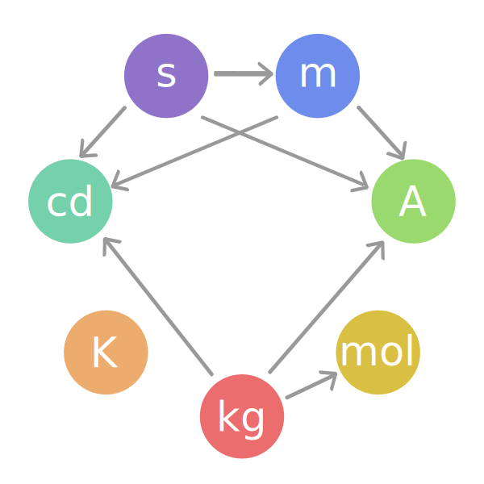

<head>
<meta http-equiv="Content-Type" content="text/html; charset=utf-8">
<link rel="stylesheet" type="text/css" href="bc.css">
<!--

-->

</head>

<!---

#RevitAPI Unit Abbreviations @AutodeskRevit #bim #dynamobim @AutodeskForge #ForgeDevCon http://bit.ly/unitabbrev

Håvard Dagsvik of Symetri implemented code to automatically generate a dictionary mapping the Revit <code>DisplayUnitType</code> to corresponding <code>UnitSymbolType</code> display strings. The developer guide describes these classes like this
&ndash; UnitType &ndash; type of physical quantity to be measured, for example length or force (UT_Length or UT_Force)
&ndash; DisplayUnitType &ndash;  units and display format used to format numbers as strings or convert units (i.e. DUT_METERS)
&ndash; UnitSymbolType &ndash; unit symbol displayed in the formatted string representation of a number to indicate the units of the value (i.e. UST_M)...

--->

### Unit Abbreviations

Håvard Dagsvik of [Symetri](http://www.symetri.com) implemented code to automatically generate a dictionary mapping the Revit `DisplayUnitType` to corresponding `UnitSymbolType` display strings.

If you are not clear about what these two Revit API enumeration mean, 
the [developer guide description of units](http://help.autodesk.com/view/RVT/2018/ENU/?guid=GUID-099B3FD9-1C5B-459C-AC1E-EF958551DFB6) describes these classes like this:

- UnitType &ndash; type of physical quantity to be measured, for example length or force (UT_Length or UT_Force)
- DisplayUnitType &ndash; units and display format used to format numbers as strings or convert units (i.e. DUT_METERS)
- UnitSymbolType &ndash; unit symbol displayed in the formatted string representation of a number to indicate the units of the value (i.e. UST_M)

The Revit API help file `RevitAPI.chm` documentation says:

- [DisplayUnitType Enumeration](http://www.revitapidocs.com/2017/7d3d3306-a4c2-c577-0aeb-cca42d6cfd2f.htm) &ndash; The units and display format used to format numbers as strings. Also used for unit conversions.
- [UnitSymbolType Enumeration](http://www.revitapidocs.com/2017/1a6d5d01-d835-c419-c14a-4cd25f563ea0.htm) &ndash; The unit symbol displayed in the formatted string representation of a number to indicate the units of the value.

The Building Coder already took a stab at this in two past articles:

- [Unit abbreviations](http://thebuildingcoder.typepad.com/blog/2013/11/unit-abbreviations.html)
- [Localised unit abbreviations](http://thebuildingcoder.typepad.com/blog/2013/11/localised-unit-abbreviations.html)

The former implements a manually generated hard coded display of unit type abbreviation list for a selected subset of `DisplayUnitType` values.

The latter shows how you can use the `LabelUtils` to generate a list of localised abbreviations.

Håvard takes a new approach to automatically cover many more values without manual intervention.

In Håvard's own words:

I've been looking at extracting a complete list of unit abbreviations for each `ParameterType` and their `DisplayUnitTypes`. In total, roughly 210, I think.
 
I looked at what was around on your blog and elsewhere.
Your manually generated list of unit abbreviations could be expanded to include all UnitSymbolTypes, not just the first 22.
Anyhow, I decided to try something different.
 
What I do is this:

- Create a shared parameter file containing every parameter type.
- Attach these parameters to the `ProjectInformation` element.
- For every `double` parameter, set a value of `1`.
- Then, for each parameter value, read the value string and isolate the unit abbreviation it contains.
 
In the end, the code produces a C# source file including the required `using` namespace statements and the actual `Dictionary`.
That file can be imported directly back into Visual Studio to be used as an API.
Here are both the [complete Visual Studio Revit add-in project `RVT_UnitTypes.zip`](zip/hd_RVT_UnitTypes.zip) and
the [C# module `UnitAbbrevHandler.cs`](zip/hd_UnitAbbrevHandler.cs) it generates.
 
It may be somewhat overkill;
I'm not sure yet :-)
If the list of abbrevs is not complete &ndash; though I think it is &ndash; it should be easy to tweak it more to get there.

This is related to an Excel export/import function.
I export Revit parameters values to Excel, edit them there, and import the changed values back to the Revit elements.
 
In Excel, it's nice to have the unit abbreviations visible so you know what you are editing, e.g., meters or millimetres, Joules, gram Celsius or BTU for energy and specific heat, etc.
That provides the use case for this dictionary.
On export, we get the abbreviation from this predefined but auto-generated dictionary.
 
Originally, I thought it included all possible abbreviations, but it doesn't.
The code could easily do that, but I only need one `UnitSymbolType` per `DisplayUnitType`.
After all, `lb/m3` and `lbm/m3` represents the same thing.
 
The only situation I see in which this would matter is on parameter type `Currency`.
The `UnitSymbolType` `$` is obviously not the same as the `UnitSymbolType` `£`.
But Revit is not a currency converter.
In our case we only care about valid DUT's that can be fed into the  `UnitUtils.ConvertToInternalUnits` function.
 
Tweaking this code, I guess you could create any other relations you might need, e.g., a complete `Dictionary` mapping "unit abbreviation to `DisplayUnitType`.

I hope this is useful to others as well.

Many thanks to Håvard for researching and sharing this!

