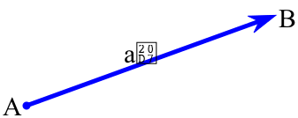

<head>
<meta http-equiv="Content-Type" content="text/html; charset=utf-8">
<link rel="stylesheet" type="text/css" href="bc.css">
<!--

-->

</head>

<!---

- XYZ point versus vector
  12021972 [XYZ question]
  https://forums.autodesk.com/t5/revit-api-forum/xyz-question/m-p/6460982
  13096971 [Distinct XYZ]
  https://forums.autodesk.com/t5/revit-api-forum/distinct-xyz/m-p/7161065

The Building Coder Birthday Post: the #RevitAPI XYZ Class @AutodeskRevit #bim #dynamobim @AutodeskForge #ForgeDevCon http://bit.ly/xyzpntvec

Today is The Building Coder's ninth birthday.
We'll celebrate by discussing the pretty fundamental issue of XYZ points versus vectors, and how to distinguish different points
&ndash; <code>XYZ</code> point versus vector
&ndash; How to distinguish <code>XYZ</code> points...

--->

### Birthday Post on the XYZ Class

Today is The Building Coder's ninth birthday.

The first [welcome](http://thebuildingcoder.typepad.com/blog/2008/08/welcome.html) post was published August 22, 2008.

We'll celebrate by discussing the pretty fundamental issue of `XYZ` points versus vectors, and how to distinguish different points:

- [`XYZ` point versus vector](#2)
- [How to distinguish `XYZ` points](#3)

####XYZ Point versus Vector

This question was raised in
the [Revit API discussion forum](http://forums.autodesk.com/t5/revit-api-forum/bd-p/160) thread
on [`XYZ` question](https://forums.autodesk.com/t5/revit-api-forum/xyz-question/m-p/6460982):

**Question:** I find the `XYZ` class very confusing because it can be a point or a vector.

Does anybody know any good guide on how to use them? Or some documentation.

Also, I have a specific question: how does one extract start and end points of a XYZ vector?

**Answer:** The documentation is right there where it belongs, in the Revit API help file `RevitAPI.chm`
[section on the `XYZ` class](http://www.revitapidocs.com/2017/c2fd995c-95c0-58fb-f5de-f3246cbc5600.htm).

You are perfectly right, the XYZ class can represent either a point or a vector, depending on how you use it.

If you have a `XYZ` object and run an angle method, you're in fact handling a vector information... but if you just get a coordinate, then a point.

In some cases, a vector doesn't have a start or end point, for instance, if it is used to represent a pure direction, not a line. If you need a line, use the Curve/Line object.

[Bobby Jones](https://forums.autodesk.com/t5/user/viewprofilepage/user-id/53074) suggested  rolling your own `Point` and `Vector` wrappers around it, making your code much easier to maintain.

The `XYZ` class defines methods that are specific to the concept of both points and vectors. Sometimes, it is difficult to know which concept it is dealing with at any given time.

Another benefit of providing your own point and vector wrappers is that you can limit their interface to only methods that make sense.

The following code compiles, but none of it makes any sense:

<pre class="code">
void&nbsp;PointAndVectorExample(&nbsp;Line&nbsp;revitLine&nbsp;)
{
&nbsp;&nbsp;var&nbsp;o&nbsp;=&nbsp;revitLine.Origin;
&nbsp;&nbsp;var&nbsp;whatIstheLengthOfaPoint&nbsp;=&nbsp;o.GetLength();
&nbsp;&nbsp;var&nbsp;howIsaPointaUnitLength&nbsp;=&nbsp;o.IsUnitLength();

&nbsp;&nbsp;var&nbsp;lineDirection&nbsp;=&nbsp;revitLine.Direction;
&nbsp;&nbsp;var&nbsp;whatDoesThisRepresent&nbsp;=&nbsp;lineDirection.CrossProduct(&nbsp;o&nbsp;);
&nbsp;&nbsp;var&nbsp;thisDoesntMakeSense&nbsp;=&nbsp;lineDirection.DistanceTo(&nbsp;o&nbsp;);
}
</pre>

Here are some PARTIAL `Point3D` and `Vector3D` classes to give you the idea, and some helper extensions to make them easier to use.  You can take these and wrap the appropriate `XYZ` methods for each as well as define additional methods of your own.  And even implement additional interfaces, such as `IEquatable`.

<pre class="code">
public&nbsp;class&nbsp;Point3D
{
&nbsp;&nbsp;public&nbsp;Point3D(&nbsp;XYZ&nbsp;revitXyz&nbsp;)
&nbsp;&nbsp;{
&nbsp;&nbsp;&nbsp;&nbsp;XYZ&nbsp;=&nbsp;revitXyz;
&nbsp;&nbsp;}

&nbsp;&nbsp;public&nbsp;Point3D()&nbsp;:&nbsp;this(&nbsp;XYZ.Zero&nbsp;)
&nbsp;&nbsp;{&nbsp;}

&nbsp;&nbsp;public&nbsp;Point3D(&nbsp;double&nbsp;x,&nbsp;double&nbsp;y,&nbsp;double&nbsp;z&nbsp;)&nbsp;
&nbsp;&nbsp;&nbsp;&nbsp;:&nbsp;this(&nbsp;new&nbsp;XYZ(&nbsp;x,&nbsp;y,&nbsp;z&nbsp;)&nbsp;)
&nbsp;&nbsp;{&nbsp;}

&nbsp;&nbsp;public&nbsp;XYZ&nbsp;XYZ&nbsp;{&nbsp;get;&nbsp;private&nbsp;set;&nbsp;}

&nbsp;&nbsp;public&nbsp;double&nbsp;X&nbsp;=&gt;&nbsp;XYZ.X;
&nbsp;&nbsp;public&nbsp;double&nbsp;Y&nbsp;=&gt;&nbsp;XYZ.Y;
&nbsp;&nbsp;public&nbsp;double&nbsp;Z&nbsp;=&gt;&nbsp;XYZ.Z;

&nbsp;&nbsp;public&nbsp;double&nbsp;DistanceTo(&nbsp;Point3D&nbsp;source&nbsp;)
&nbsp;&nbsp;{
&nbsp;&nbsp;&nbsp;&nbsp;return&nbsp;XYZ.DistanceTo(&nbsp;source.XYZ&nbsp;);
&nbsp;&nbsp;}

&nbsp;&nbsp;public&nbsp;Point3D&nbsp;Add(&nbsp;Vector3D&nbsp;source&nbsp;)
&nbsp;&nbsp;{
&nbsp;&nbsp;&nbsp;&nbsp;return&nbsp;new&nbsp;Point3D(&nbsp;XYZ.Add(&nbsp;source.XYZ&nbsp;)&nbsp;);
&nbsp;&nbsp;}

&nbsp;&nbsp;public&nbsp;static&nbsp;Point3D&nbsp;operator&nbsp;+(&nbsp;
&nbsp;&nbsp;&nbsp;&nbsp;Point3D&nbsp;point,&nbsp;
&nbsp;&nbsp;&nbsp;&nbsp;Vector3D&nbsp;vector&nbsp;)
&nbsp;&nbsp;{
&nbsp;&nbsp;&nbsp;&nbsp;return&nbsp;point.Add(&nbsp;vector&nbsp;);
&nbsp;&nbsp;}

&nbsp;&nbsp;public&nbsp;override&nbsp;string&nbsp;ToString()
&nbsp;&nbsp;{
&nbsp;&nbsp;&nbsp;&nbsp;return&nbsp;XYZ.ToString();
&nbsp;&nbsp;}

&nbsp;&nbsp;public&nbsp;static&nbsp;Point3D&nbsp;Zero&nbsp;
&nbsp;&nbsp;&nbsp;&nbsp;=&gt;&nbsp;new&nbsp;Point3D(&nbsp;XYZ.Zero&nbsp;);
}

public&nbsp;class&nbsp;Vector3D
{
&nbsp;&nbsp;public&nbsp;Vector3D(&nbsp;XYZ&nbsp;revitXyz&nbsp;)
&nbsp;&nbsp;{
&nbsp;&nbsp;&nbsp;&nbsp;XYZ&nbsp;=&nbsp;revitXyz;
&nbsp;&nbsp;}

&nbsp;&nbsp;public&nbsp;Vector3D()&nbsp;:&nbsp;this(&nbsp;XYZ.Zero&nbsp;)
&nbsp;&nbsp;{&nbsp;}

&nbsp;&nbsp;public&nbsp;Vector3D(&nbsp;double&nbsp;x,&nbsp;double&nbsp;y,&nbsp;double&nbsp;z&nbsp;)&nbsp;
&nbsp;&nbsp;&nbsp;&nbsp;:&nbsp;this(&nbsp;new&nbsp;XYZ(&nbsp;x,&nbsp;y,&nbsp;z&nbsp;)&nbsp;)
&nbsp;&nbsp;{&nbsp;}

&nbsp;&nbsp;public&nbsp;XYZ&nbsp;XYZ&nbsp;{&nbsp;get;&nbsp;private&nbsp;set;&nbsp;}

&nbsp;&nbsp;public&nbsp;double&nbsp;X&nbsp;=&gt;&nbsp;XYZ.X;
&nbsp;&nbsp;public&nbsp;double&nbsp;Y&nbsp;=&gt;&nbsp;XYZ.Y;
&nbsp;&nbsp;public&nbsp;double&nbsp;Z&nbsp;=&gt;&nbsp;XYZ.Z;

&nbsp;&nbsp;public&nbsp;Vector3D&nbsp;CrossProduct(&nbsp;Vector3D&nbsp;source&nbsp;)
&nbsp;&nbsp;{
&nbsp;&nbsp;&nbsp;&nbsp;return&nbsp;new&nbsp;Vector3D(&nbsp;XYZ.CrossProduct(&nbsp;source.XYZ&nbsp;)&nbsp;);
&nbsp;&nbsp;}

&nbsp;&nbsp;public&nbsp;double&nbsp;GetLength()
&nbsp;&nbsp;{
&nbsp;&nbsp;&nbsp;&nbsp;return&nbsp;XYZ.GetLength();
&nbsp;&nbsp;}

&nbsp;&nbsp;public&nbsp;override&nbsp;string&nbsp;ToString()
&nbsp;&nbsp;{
&nbsp;&nbsp;&nbsp;&nbsp;return&nbsp;XYZ.ToString();
&nbsp;&nbsp;}

&nbsp;&nbsp;public&nbsp;static&nbsp;Vector3D&nbsp;BasisX&nbsp;=&gt;&nbsp;new&nbsp;Vector3D(&nbsp;
&nbsp;&nbsp;&nbsp;&nbsp;XYZ.BasisX&nbsp;);
&nbsp;&nbsp;public&nbsp;static&nbsp;Vector3D&nbsp;BasisY&nbsp;=&gt;&nbsp;new&nbsp;Vector3D(&nbsp;
&nbsp;&nbsp;&nbsp;&nbsp;XYZ.BasisY&nbsp;);
&nbsp;&nbsp;public&nbsp;static&nbsp;Vector3D&nbsp;BasisZ&nbsp;=&gt;&nbsp;new&nbsp;Vector3D(&nbsp;
&nbsp;&nbsp;&nbsp;&nbsp;XYZ.BasisZ&nbsp;);
}

public&nbsp;static&nbsp;class&nbsp;XYZExtensions
{
&nbsp;&nbsp;public&nbsp;static&nbsp;Point3D&nbsp;ToPoint3D(&nbsp;this&nbsp;XYZ&nbsp;revitXyz&nbsp;)
&nbsp;&nbsp;{
&nbsp;&nbsp;&nbsp;&nbsp;return&nbsp;new&nbsp;Point3D(&nbsp;revitXyz&nbsp;);
&nbsp;&nbsp;}

&nbsp;&nbsp;public&nbsp;static&nbsp;Vector3D&nbsp;ToVector3D(&nbsp;this&nbsp;XYZ&nbsp;revitXyz&nbsp;)
&nbsp;&nbsp;{
&nbsp;&nbsp;&nbsp;&nbsp;return&nbsp;new&nbsp;Vector3D(&nbsp;revitXyz&nbsp;);
&nbsp;&nbsp;}
}

public&nbsp;static&nbsp;class&nbsp;LineExtensions
{
&nbsp;&nbsp;public&nbsp;static&nbsp;Vector3D&nbsp;Direction(
&nbsp;&nbsp;&nbsp;&nbsp;this&nbsp;Line&nbsp;revitLine&nbsp;)
&nbsp;&nbsp;{
&nbsp;&nbsp;&nbsp;&nbsp;return&nbsp;new&nbsp;Vector3D(&nbsp;revitLine.Direction&nbsp;);
&nbsp;&nbsp;}

&nbsp;&nbsp;public&nbsp;static&nbsp;Point3D&nbsp;Origin(&nbsp;
&nbsp;&nbsp;&nbsp;&nbsp;this&nbsp;Line&nbsp;revitLine&nbsp;)
&nbsp;&nbsp;{
&nbsp;&nbsp;&nbsp;&nbsp;return&nbsp;new&nbsp;Point3D(&nbsp;revitLine.Origin&nbsp;);
&nbsp;&nbsp;}
}
</pre>

Many thanks to Bobby for sharing this!

####How to Distinguish XYZ Points

Another [Revit API discussion forum](http://forums.autodesk.com/t5/revit-api-forum/bd-p/160) thread
that Bobby also helped out with deals
with [Distinct `XYZ`](https://forums.autodesk.com/t5/revit-api-forum/xyz-question/m-p/6460982):

**Question:** I have a list of `XYZ` points obtained from MEP connectors.

How can I clean it of duplicates, i.e., eliminate points with identical coordinates?

I am trying to do it like this:

<pre class="code">
&nbsp;&nbsp;var&nbsp;distinctElementConnectors&nbsp;
&nbsp;&nbsp;&nbsp;&nbsp;=&nbsp;MyMepUtils.GetALLConnectors(&nbsp;elements&nbsp;)
&nbsp;&nbsp;&nbsp;&nbsp;&nbsp;&nbsp;.Where(&nbsp;c&nbsp;=&gt;&nbsp;c.IsConnected&nbsp;)
&nbsp;&nbsp;&nbsp;&nbsp;&nbsp;&nbsp;.Distinct(&nbsp;c&nbsp;=&gt;&nbsp;c.Origin&nbsp;)
&nbsp;&nbsp;&nbsp;&nbsp;&nbsp;&nbsp;.ToHashSet();
</pre>

The call to `Distinct(c => c.Origin)` doesn't work, because `Distinct` doesn't know how to compare XYZs (or does it?).

**Answer:** You are absolutely correct:

The .NET API does not have any built-in mechanism to compare the Revit API `XYZ` objects.

However, it is easy to implement, and I have done so several times in different discussion published by The Building Coder.

Here are the first and last mentions so far:

- [Nested instance geometry](http://thebuildingcoder.typepad.com/blog/2009/05/nested-instance-geometry.html)
- [Fuzzy comparison](http://thebuildingcoder.typepad.com/blog/2017/06/sensors-bim-ai-revitlookup-and-fuzzy-comparison.html#4)

Furthermore, you can take a look
at [The Building Coder samples](https://github.com/jeremytammik/the_building_coder_samples) class
`XyzEqualityComparer`, defined there in three different modules.

Another direction to go, again suggested by Bobby, assuming you implemented your own `Point3D` and `Vector3D` wrapper classes, is to have those classes implement the `IEquatable` interface.

Here's a shell of the `Point3D` class showing an implementation:

<pre class="code">
public&nbsp;static&nbsp;class&nbsp;DoubleExtensions
{
&nbsp;&nbsp;private&nbsp;const&nbsp;double&nbsp;Tolerance&nbsp;=&nbsp;1.0e-10;
 
&nbsp;&nbsp;public&nbsp;static&nbsp;bool&nbsp;IsAlmostEqualTo(
&nbsp;&nbsp;&nbsp;&nbsp;this&nbsp;double&nbsp;double1,
&nbsp;&nbsp;&nbsp;&nbsp;double&nbsp;double2&nbsp;)
&nbsp;&nbsp;{
&nbsp;&nbsp;&nbsp;&nbsp;var&nbsp;isAlmostEqual&nbsp;=
&nbsp;&nbsp;&nbsp;&nbsp;&nbsp;&nbsp;Math.Abs(&nbsp;double1&nbsp;-&nbsp;double2&nbsp;)
&nbsp;&nbsp;&nbsp;&nbsp;&nbsp;&nbsp;&nbsp;&nbsp;&lt;=&nbsp;Tolerance;
 
&nbsp;&nbsp;&nbsp;&nbsp;return&nbsp;isAlmostEqual;
&nbsp;&nbsp;}
}

public&nbsp;class&nbsp;Point3D&nbsp;:&nbsp;IEquatable&lt;Point3D&gt;
{
&nbsp;&nbsp;public&nbsp;Point3D(&nbsp;XYZ&nbsp;revitXyz&nbsp;)
&nbsp;&nbsp;{
&nbsp;&nbsp;&nbsp;&nbsp;XYZ&nbsp;=&nbsp;revitXyz;
&nbsp;&nbsp;}

&nbsp;&nbsp;public&nbsp;XYZ&nbsp;XYZ&nbsp;{&nbsp;get;&nbsp;}

&nbsp;&nbsp;public&nbsp;double&nbsp;X&nbsp;=&gt;&nbsp;XYZ.X;
&nbsp;&nbsp;public&nbsp;double&nbsp;Y&nbsp;=&gt;&nbsp;XYZ.Y;
&nbsp;&nbsp;public&nbsp;double&nbsp;Z&nbsp;=&gt;&nbsp;XYZ.Z;

&nbsp;&nbsp;public&nbsp;bool&nbsp;Equals(&nbsp;Point3D&nbsp;other&nbsp;)
&nbsp;&nbsp;{
&nbsp;&nbsp;&nbsp;&nbsp;if(&nbsp;ReferenceEquals(&nbsp;other,&nbsp;null&nbsp;)&nbsp;)&nbsp;return&nbsp;false;
&nbsp;&nbsp;&nbsp;&nbsp;if(&nbsp;ReferenceEquals(&nbsp;this,&nbsp;other&nbsp;)&nbsp;)&nbsp;return&nbsp;true;

&nbsp;&nbsp;&nbsp;&nbsp;return&nbsp;X.IsAlmostEqualTo(&nbsp;other.X&nbsp;)&nbsp;&amp;&amp;
&nbsp;&nbsp;&nbsp;&nbsp;&nbsp;&nbsp;&nbsp;&nbsp;&nbsp;Y.IsAlmostEqualTo(&nbsp;other.Y&nbsp;)&nbsp;&amp;&amp;
&nbsp;&nbsp;&nbsp;&nbsp;&nbsp;&nbsp;&nbsp;&nbsp;&nbsp;Z.IsAlmostEqualTo(&nbsp;other.Z&nbsp;);
&nbsp;&nbsp;}

&nbsp;&nbsp;public&nbsp;override&nbsp;bool&nbsp;Equals(&nbsp;object&nbsp;obj&nbsp;)
&nbsp;&nbsp;{
&nbsp;&nbsp;&nbsp;&nbsp;if(&nbsp;ReferenceEquals(&nbsp;null,&nbsp;obj&nbsp;)&nbsp;)&nbsp;return&nbsp;false;
&nbsp;&nbsp;&nbsp;&nbsp;if(&nbsp;ReferenceEquals(&nbsp;this,&nbsp;obj&nbsp;)&nbsp;)&nbsp;return&nbsp;true;
&nbsp;&nbsp;&nbsp;&nbsp;if(&nbsp;obj.GetType()&nbsp;!=&nbsp;GetType()&nbsp;)&nbsp;return&nbsp;false;

&nbsp;&nbsp;&nbsp;&nbsp;return&nbsp;Equals(&nbsp;(Point3D)&nbsp;obj&nbsp;);
&nbsp;&nbsp;}

&nbsp;&nbsp;public&nbsp;override&nbsp;int&nbsp;GetHashCode()
&nbsp;&nbsp;{
&nbsp;&nbsp;&nbsp;&nbsp;return&nbsp;Tuple.Create(&nbsp;Math.Round(&nbsp;X,&nbsp;10&nbsp;),
&nbsp;&nbsp;&nbsp;&nbsp;&nbsp;&nbsp;&nbsp;&nbsp;Math.Round(&nbsp;Y,&nbsp;10&nbsp;),
&nbsp;&nbsp;&nbsp;&nbsp;&nbsp;&nbsp;&nbsp;&nbsp;Math.Round(&nbsp;Z,&nbsp;10&nbsp;)&nbsp;).
&nbsp;&nbsp;&nbsp;&nbsp;&nbsp;&nbsp;GetHashCode();
&nbsp;&nbsp;}
}
</pre>

Storing `Point3D` instances in a hashset will give you your distinct set of points.

<pre class="code">
&nbsp;&nbsp;var&nbsp;distinctElementConnectors
&nbsp;&nbsp;&nbsp;&nbsp;=&nbsp;MyMepUtils.GetALLConnectors(&nbsp;elements&nbsp;)
&nbsp;&nbsp;&nbsp;&nbsp;&nbsp;&nbsp;.Where(&nbsp;c&nbsp;=&gt;&nbsp;c.IsConnected&nbsp;)
&nbsp;&nbsp;&nbsp;&nbsp;&nbsp;&nbsp;.Select(&nbsp;c&nbsp;=&gt;&nbsp;c.Origin.ToPoint3D()&nbsp;)
&nbsp;&nbsp;&nbsp;&nbsp;&nbsp;&nbsp;.ToHashSet();
</pre>

Yet another solution to address this directly is to define a comparer class for native Revit API `Connector` objects, such as the `ConnectorXyzComparer` one provided in
at [The Building Coder samples](https://github.com/jeremytammik/the_building_coder_samples) [Util.cs  module](https://github.com/jeremytammik/the_building_coder_samples/blob/master/BuildingCoder/BuildingCoder/Util.cs#L1439-L1465):

<pre class="code">
///&nbsp;&lt;summary&gt;
///&nbsp;Compare&nbsp;Connector&nbsp;objects&nbsp;based&nbsp;on&nbsp;their&nbsp;location&nbsp;point.
///&nbsp;&lt;/summary&gt;
public&nbsp;class&nbsp;ConnectorXyzComparer&nbsp;:&nbsp;IEqualityComparer&lt;Connector&gt;
{
&nbsp;&nbsp;public&nbsp;bool&nbsp;Equals(&nbsp;Connector&nbsp;x,&nbsp;Connector&nbsp;y&nbsp;)
&nbsp;&nbsp;{
&nbsp;&nbsp;&nbsp;&nbsp;return&nbsp;null&nbsp;!=&nbsp;x
&nbsp;&nbsp;&nbsp;&nbsp;&nbsp;&nbsp;&amp;&amp;&nbsp;null&nbsp;!=&nbsp;y
&nbsp;&nbsp;&nbsp;&nbsp;&nbsp;&nbsp;&amp;&amp;&nbsp;IsEqual(&nbsp;x.Origin,&nbsp;y.Origin&nbsp;);
&nbsp;&nbsp;}

&nbsp;&nbsp;public&nbsp;int&nbsp;GetHashCode(&nbsp;Connector&nbsp;x&nbsp;)
&nbsp;&nbsp;{
&nbsp;&nbsp;&nbsp;&nbsp;return&nbsp;HashString(&nbsp;x.Origin&nbsp;).GetHashCode();
&nbsp;&nbsp;}
}

///&nbsp;&lt;summary&gt;
///&nbsp;Get&nbsp;distinct&nbsp;connectors&nbsp;from&nbsp;a&nbsp;set&nbsp;of&nbsp;MEP&nbsp;elements.
///&nbsp;&lt;/summary&gt;
public&nbsp;static&nbsp;HashSet&lt;Connector&gt;&nbsp;GetDistinctConnectors(
&nbsp;&nbsp;List&lt;Connector&gt;&nbsp;cons&nbsp;)
{
&nbsp;&nbsp;return&nbsp;cons.Distinct(&nbsp;new&nbsp;ConnectorXyzComparer()&nbsp;)
&nbsp;&nbsp;&nbsp;&nbsp;.ToHashSet();
}
</pre>

I implemented that in The Building Coder samples [release 2018.0.134.1](https://github.com/jeremytammik/the_building_coder_samples/releases/tag/2018.0.134.1).

Here is the [diff to the preceding release](https://github.com/jeremytammik/the_building_coder_samples/compare/2018.0.134.0...2018.0.134.1).

Thanks again to Bobby, and Happy Birthday coding, everybody!

