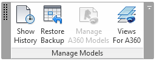

<head>
<meta http-equiv="Content-Type" content="text/html; charset=utf-8">
<link rel="stylesheet" type="text/css" href="bc.css">
<!--

-->

</head>

<!---

- [Select Views to Publish to the Cloud](https://knowledge.autodesk.com/support/revit-products/learn-explore/caas/CloudHelp/cloudhelp/2016/ENU/Revit-CAR/files/GUID-09FBF9E2-6ECF-447D-8FA8-12AB16495BC3-htm.html)
  Collaboration for Revit
  Flora Gu commented on  Customer Incident DERI-4007 [[get properties] Revit Rooms not extract, unless visible on a view]
  According to the Revit extractor team, customers need to select views to publish to cloud explictly. But looks like most of the users are not aware of that. Please see this instruction document: https://knowledge.autodesk.com/support/revit-products/learn-explore/caas/CloudHelp/cloudhelp/2016/ENU/Revit-CAR/files/GUID-09FBF9E2-6ECF-447D-8FA8-12AB16495BC3-htm.html
  If the views are not selected in the Revit model, it won't be extracted, and we have no ways to do show the data they need.
  Please make sure the customers select the views with the rooms or other elements they need according to the document above.

- 13323030 [Revit2018AddInTemplateSet]
  https://forums.autodesk.com/t5/revit-api-forum/revit2018addintemplateset/m-p/7331376

Select Rooms and Views to Publish to the Cloud #RevitAPI @AutodeskRevit #bim #dynamobim @AutodeskForge #ForgeDevCon http://bit.ly/forge_view_nuget
Updated #RevitAPI 2018.1 NuGet packages @AutodeskRevit #bim #dynamobim @AutodeskForge #ForgeDevCon http://bit.ly/forge_view_nuget

Two little items to point out before we end the week
&ndash; Select Rooms and Views to Publish to the Cloud
&ndash; Revit 2018.1 API NuGet Packages...

--->

### Revit 2018.1 NuGet Packages, Rooms and Views in Forge

Two little items to point out before we end the week:

- [Select Rooms and Views to Publish to the Cloud](#2)
- [Revit 2018.1 API NuGet Packages](#3)

####Select Rooms and Views to Publish to the Cloud

People have complained about Revit rooms not being translated to Forge.

This can be easily fixed
by [selecting the views to publish to the cloud](https://knowledge.autodesk.com/support/revit-products/learn-explore/caas/CloudHelp/cloudhelp/2016/ENU/Revit-CAR/files/GUID-09FBF9E2-6ECF-447D-8FA8-12AB16495BC3-htm.html) and
ensuring that the views with the rooms and all other required elements are included.

You can do so manually in
the [Collaboration for Revit add-in](http://help.autodesk.com/view/RVT/2017/ENU/?guid=GUID-95DA7950-294A-442F-B82A-218E45D79C66) and
(possibly, not yet confirmed) programmatically as well, as pointed out in the discussion last year
on [selecting RVT 3D views for Forge translation](http://thebuildingcoder.typepad.com/blog/2016/07/selecting-views-for-forge-translation.html).

If you succeed in doing it programmatically, please let us know!

I would love to share a sample demonstrating that.

Thank you!

####Revit 2018.1 API NuGet Packages

Andrey Bushman points out his updated NuGet packages and Revit add-in template set for the Revit 2018.1 API in 
the [Revit API discussion forum](http://forums.autodesk.com/t5/revit-api-forum/bd-p/160) thread on 
the [Revit2018AddInTemplateSet](https://forums.autodesk.com/t5/revit-api-forum/revit2018addintemplateset/m-p/7331376).

Andrey [originally introduced the Revit API NuGet packages](http://thebuildingcoder.typepad.com/blog/2016/12/nuget-revit-api-package.html) in December last year and
also [updated RevitLookup to make use of them](http://thebuildingcoder.typepad.com/blog/2016/12/nuget-revit-api-package.html#3).

He went on to [introduce his add-in template set](http://thebuildingcoder.typepad.com/blog/2017/02/new-visual-studio-2015-templates-for-revit-add-ins.html) in
February.

It implements significant enhancements over the skeleton projects produced by
the [Visual Studio Revit add-in wizards](http://thebuildingcoder.typepad.com/blog/about-the-author.html#5.20), cf.
the [comparison between the two](http://thebuildingcoder.typepad.com/blog/2017/02/new-visual-studio-2015-templates-for-revit-add-ins.html#3)
and [Q &amp; A](http://thebuildingcoder.typepad.com/blog/2017/02/new-visual-studio-2015-templates-for-revit-add-ins.html#4).

Andrey later also added [support for Edit and Continue in the template set](http://thebuildingcoder.typepad.com/blog/2017/02/add-in-templates-supporting-edit-and-continue.html).

His new thread announces the add-in templates set updated for Revit 2018.1 plus the links to the necessary NuGet packages:

- [Revit 2018 Add-In Template Set](https://github.com/Andrey-Bushman/Revit2018AddInTemplateSet)
- [Revit2018DevTools](https://www.nuget.org/packages/Revit2018DevTools) &ndash; RevitDevTools is the common tools for using by Revit add-ins.
- [Revit-2018.1-x64.Base](https://www.nuget.org/packages/Revit-2018.1-x64.Base) &ndash; Revit 2018.1 x64 assemblies.
- [Revit-2018.1x64-Utilities](https://www.nuget.org/packages/Revit-2018.1x64-Utilities) &ndash; Revit 2018.1 x64 Utilities .Net API
- [Revit-2018.1x64-Additional](https://www.nuget.org/packages/Revit-2018.1x64-Additional) &ndash; Additional assemblies of Revit API.

RevitLookup has already
been [updated to use the NuGet Revit 2018.1 API package](http://thebuildingcoder.typepad.com/blog/2017/08/edge-loop-point-reference-plane-and-column-line.html#2) as well.

Many thanks to Andrey for maintaining these useful resources!

By the way, we also have
a [NuGet package for the Revit Server REST API Library](http://thebuildingcoder.typepad.com/blog/2017/02/revitserverapilib-truss-members-and-layers.html#2).

I wish you a nice weekend!
