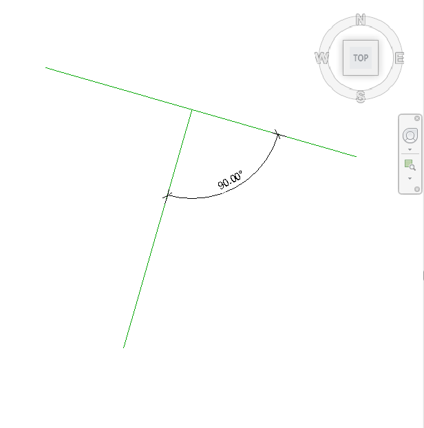

<head>
<meta http-equiv="Content-Type" content="text/html; charset=utf-8">
<link rel="stylesheet" type="text/css" href="bc.css">
<!--

-->

</head>

<!---

- https://forums.autodesk.com/t5/revit-api-forum/how-to-create-line-based-on-angle/m-p/7372910

- "ExtentElem" and duplicate legend components remastered for TBC blog post

- references for dimensioning
Please  look at discussion
https://forums.autodesk.com/t5/revit-api-forum/obtaining-references-from-edges-in-python/m-p/7356104
and solution from
https://github.com/CADBIMDeveloper/PutRevitDimensionsToSquareFaces/tree/master/PutRevitDimensionsToSquareFaces
Sincerely, Alexander
- [a readme is a must](http://thebuildingcoder.typepad.com/blog/2016/10/how-to-create-a-new-line-style.html#4)!
- [people cannot use the code unless you specify a license](http://thebuildingcoder.typepad.com/blog/2013/10/the-building-coder-samples-on-github.html#2)!
- [more on licenses](http://thebuildingcoder.typepad.com/blog/2013/10/wall-compound-layer-and-other-geometry.html#2)
I still use the This sample is licensed under the terms of the [MIT License](http://opensource.org/licenses/MIT), a lax, permissive non-copyleft free software license. For substantial programs it is better to use the Apache 2.0 license since it blocks patent treachery. Mine samples are not substantial.
- I've fixed the code (there was much more tricks working with revit references) and pushed to the github.

Obtaining square face references for dimensioning #RevitAPI @AutodeskRevit #dynamobim @AutodeskForge #ForgeDevCon http://bit.ly/dimfaceref
The ExtentElem + duplicating legend components #RevitAPI @AutodeskRevit #bim #dynamobim @AutodeskForge #ForgeDevCon http://bit.ly/dimfaceref
Creating a line perpendicular to another using #RevitAPI @AutodeskRevit #bim #dynamobim @AutodeskForge #ForgeDevCon http://bit.ly/dimfaceref

Alexander Ignatovich answered several interesting questions in the Revit API discussion forum
&ndash; <code>ExtentElem</code> and duplicate legend components remastered
&ndash; Obtaining generic model square face references for dimensioning
&ndash; Preparing family with reference planes for dimensioning
&ndash; Creating a line perpendicular to another...

--->

### ExtentElem and Square Face Dimensioning References

Alexander Ignatovich, [@CADBIMDeveloper](https://github.com/CADBIMDeveloper), aka Александр Игнатович,
answered several interesting questions in 
the [Revit API discussion forum](http://forums.autodesk.com/t5/revit-api-forum/bd-p/160) and elsewhere:

- [`ExtentElem` and duplicating legend components](#2)
- [Obtaining generic model square face references for dimensioning](#3)
- [Preparing family with reference planes for dimensioning](#3.1)
- [Creating a line perpendicular to another](#4)

####ExtentElem and Duplicating Legend Components

In Alexander's own words:

I recently developed a bunch of automation tools for legend views.

I faced and solved a tricky thing I want to share. 

I had to copy legend components from view A to view B. I looked at `ElementTransformUtils.CopyElements` with partial success. However, instead of copying all legend components between the views, Revit created a new view for them.

My code at that moment looked like this:

<pre class="code">
&nbsp;&nbsp;var&nbsp;collector&nbsp;=&nbsp;new&nbsp;FilteredElementCollector(&nbsp;
&nbsp;&nbsp;&nbsp;&nbsp;doc,&nbsp;legendView.Id&nbsp;);
 
&nbsp;&nbsp;var&nbsp;elementsIds&nbsp;=&nbsp;collector
&nbsp;&nbsp;&nbsp;&nbsp;.WhereElementIsNotElementType()
&nbsp;&nbsp;&nbsp;&nbsp;.ToElementIds();
 
&nbsp;&nbsp;ElementTransformUtils.CopyElements(&nbsp;legendView,&nbsp;
&nbsp;&nbsp;&nbsp;&nbsp;elementsIds,&nbsp;destLegendView,&nbsp;Transform.Identity,&nbsp;
&nbsp;&nbsp;&nbsp;&nbsp;new&nbsp;CopyPasteOptions()&nbsp;);
</pre>

I searched for a solution and found the old blog post
on [duplicating a legend component](http://thebuildingcoder.typepad.com/blog/2010/05/duplicate-legend-component.html).

That solution puts elements into a group, places a group instance and then ungroups it. This method still remains working with little modification, such as:

- Rename method `Ungroup` to `UngroupMembers`.
- Pass a generic list of element ids instead of a list of elements to the `NewGroup` method.
- Open and activate the destination view  before placing new group.

Once I had that working, I was pretty sure that it included unnecessary overhead, so I continued my research.

Later I realized that the list of element ids included an `ExtentElem` element.

This needs to be removed from `elementsIds` to make this code work as expected.

As always, when using a filtered element collector, the question arises on how to identify it.

In this case, all other elements have a valid category, and this one does not, so we can use:

<pre class="code">
&nbsp;&nbsp;var&nbsp;elementsIds&nbsp;=&nbsp;collector
&nbsp;&nbsp;&nbsp;&nbsp;.WhereElementIsNotElementType()
&nbsp;&nbsp;&nbsp;&nbsp;.Where(&nbsp;x&nbsp;=&gt;&nbsp;x.Category&nbsp;!=&nbsp;null&nbsp;)&nbsp;//&nbsp;I&nbsp;don't&nbsp;want&nbsp;to&nbsp;use&nbsp;name,&nbsp;but&nbsp;I've&nbsp;found&nbsp;that&nbsp;all&nbsp;other&nbsp;use&nbsp;elements&nbsp;in&nbsp;legend&nbsp;view&nbsp;has&nbsp;category
&nbsp;&nbsp;&nbsp;&nbsp;.Select(&nbsp;x&nbsp;=&gt;&nbsp;x.Id&nbsp;)
&nbsp;&nbsp;&nbsp;&nbsp;.ToList();
</pre>
 
So, this code remains simple and clear. The `ExtentElem` is a common problem and its id should not be passed to the `CopyElements` method.

Since I don't see this type of element mentioned by The Building Coder, I thought it worthwhile to point out.

Very many thanks to Alexander for this deep research and valuable insight!

####Obtaining Generic Model Square Face References for Dimensioning

Next, Alexander implemented an add-in to help answer 
the [Revit API discussion forum](http://forums.autodesk.com/t5/revit-api-forum/bd-p/160) forum thread
on [obtaining references from edges in Python](https://forums.autodesk.com/t5/revit-api-forum/how-to-create-line-based-on-angle/m-p/7372910) to 
put together a routine that will automatically create dimensions on a square face of a generic model. i.e. the user selects the face and dimensions appear:

**Question:** I've got some of the code working, obtaining the edges from a user selected 3D face, this returns the 4 edges (which are Edge class objects), it should simply be a case of obtaining the edge's reference that can be used to create the dimensions.
 
The Edge class has a Property which should return a reference to the edge - but when I run the code, it returns Null - and I can't see why.
 
This is the code:

<pre class="prettyprint">
# Dynamo
import clr
clr.AddReference('RevitAPI')
clr.AddReference('RevitAPIUI')
from Autodesk.Revit.DB import *
from Autodesk.Revit.UI import *

clr.AddReference("RevitServices")
import RevitServices
from RevitServices.Persistence import DocumentManager
from RevitServices.Transactions import TransactionManager

doc = DocumentManager.Instance.CurrentDBDocument
uiapp = DocumentManager.Instance.CurrentUIApplication
app = uiapp.Application
uidoc = DocumentManager.Instance.CurrentUIApplication.ActiveUIDocument

#The inputs to this node will be stored as a list in the IN variables.
dataEnteringNode = IN
selobject  = UnwrapElement(IN[0]) # Object to select

#Get user to pick a face
selob = uidoc.Selection.PickObject(Selection.ObjectType.PointOnElement, "Pick something now")

#Get Id of element thats picked
selobid = selob.ElementId

#Get element thats picked
getob = doc.GetElement(selobid)

#Get face thats picked
getface = getob.GetGeometryObjectFromReference(selob)

#Get edges of face (returns a list the first object is the list of edges)
edgeloops = getface.EdgeLoops

#Select the first edge
dimedge1 = edgeloops[0][0]

#Select the third edge (the one opposite the first)
dimedge2 = edgeloops[0][2]

#Obtain a reference of the first edge
edgeref1 = dimedge1.Reference

#Obtain a reference of the thord edge
edgeref2 = dimedge2.Reference

#Assign your output to the OUT variable.
OUT = [selob, selobid, getob, getface, edgeloops, dimedge1, dimedge2, edgeref1, edgeref2]
</pre>

If you execute it, you'll see that `edgeref1` and `edgeref2` variables both contain `Null`.
 
Any idea why?

**Answer:** I found the solution for your problem.

The main idea is to retrieve the element geometry with the option set to `ComputeReference = True` and then find the appropriate face by reference.

Sorry, I don't know Python too much, so I created an add-in in C# for you. You may get it from
the [PutRevitDimensionsToSquareFaces add-in GitHub repository](https://github.com/CADBIMDeveloper/PutRevitDimensionsToSquareFaces).

It includes a lot of tricks with Revit references to make this work as expected with families.

Initially, I only tested it only with floors; now it works with family instances too.

Many thanks to Alexander for this work!

Jeremy adds: I added a readme and license to the code for him, because:

- [A readme is a must](http://thebuildingcoder.typepad.com/blog/2016/10/how-to-create-a-new-line-style.html#4)!
- [People cannot use the code unless you specify a license](http://thebuildingcoder.typepad.com/blog/2013/10/the-building-coder-samples-on-github.html#2)!
- [More on licenses](http://thebuildingcoder.typepad.com/blog/2013/10/wall-compound-layer-and-other-geometry.html#2)...

I myself use the [MIT License](http://opensource.org/licenses/MIT) for my samples, "a lax, permissive non-copyleft free software license. For substantial programs, it is better to use the Apache 2.0 license since it blocks patent treachery".

My samples are not substantial.

####Preparing Family with Reference Planes for Dimensioning

Alexander later added another, simpler solution to the conversation:

If you use Revit 2018 or later, you can prepare your family for easier dimensioning by adding specific reference planes in the family definition, e.g., xLeft, xRight, yTop, yBottom, and then access them on the family instance in the project environment like this:

<pre class="prettyprint">
def CreateDimension(instance, refNames, direction):
  references = ReferenceArray()
  
  for x in refNames:
    references.Append(instance.GetReferenceByName(x))
  
  origin = instance.Location.Point
  
  transform = instance.GetTotalTransform()
  transform.Origin = XYZ.Zero
  
  dimensionDirection = transform.OfPoint(direction)
  
  dimensionLine = Line.CreateUnbound(origin, dimensionDirection)
  
  doc.Create.NewDimension(doc.ActiveView, dimensionLine, references)

famInst = selection[0]

tx = Transaction(doc, "create dimensions")
tx.Start()

CreateDimension(famInst, ["xLeft", "xRight"], XYZ.BasisX)
CreateDimension(famInst, ["yBottom", "yTop"], XYZ.BasisY)

tx.Commit()
</pre>

####Creating a Line Perpendicular to Another

Finally, a trivial question to round this off, though very useful for the geometrically challenged, from
the [Revit API discussion forum](http://forums.autodesk.com/t5/revit-api-forum/bd-p/160) forum thread
on [how to create a line based on an angle](https://forums.autodesk.com/t5/revit-api-forum/how-to-create-line-based-on-angle/m-p/7372910):

**Question:** I have a line element in Revit.

I want to add a second line perpendicular to it.

The second line start point can be any point on the line which is 90 degrees from the first line axis.

How can I create the second line based on this angle?

Here is an example of the line I need:

I have been playing around with the methods `CreateTransformed`, `CreateRotationAtPoint` and `CrossProduct`, but I still don't get the result I want.

**Answer:** It is simple. Just determine a) the line direction and b) the line sketch plane normal.

Then, `normal.CrossProduct(direction)` defines your second line direction, or maybe you need `-1*normal.CrossProduct(direction)`.

Take any point on first line, for example, `pt1 = fistLine.Evaluate(0.5, true)`, set `pt2 = pt1 + length * direction`, create the second line using `Line.CreateBound(pt1, pt2)`, then create a model curve on the first line's sketch plane, based on this second line.

Thanks again to Alexander for this succinct explanation!

