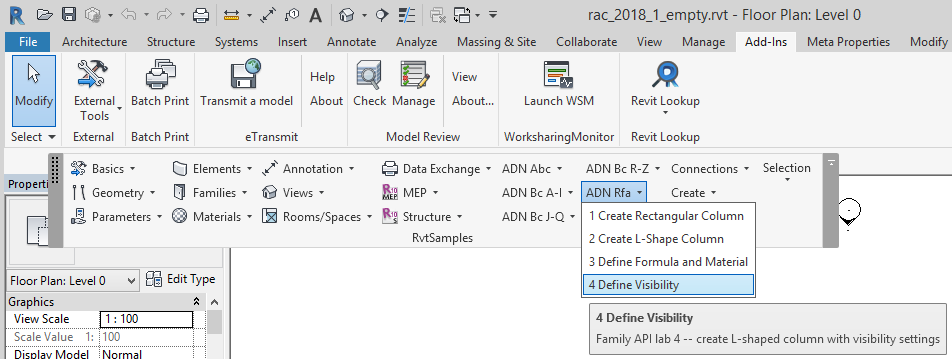

<head>
<meta http-equiv="Content-Type" content="text/html; charset=utf-8">
<link rel="stylesheet" type="text/css" href="bc.css">
<!--

-->

</head>

<!---

- [Changes and Additions to the Revit API 2013 to 2017](https://forums.autodesk.com/t5/revit-api-forum/changes-and-additions-to-the-revit-api-2013-to-2017/m-p/6395846)
  /a/doc/revit/tbc/git/a/zip/Revit_API_Changes_and_Additions_2013-2017.pdf

- 13399063 [Ribbon combobox string]
  https://forums.autodesk.com/t5/revit-api-forum/ribbon-combobox-string/m-p/7392732

ADN Xtra #RevitAPI Labs updated for Revit 2018 @AutodeskRevit #bim #dynamobim @AutodeskForge #ForgeDevCon http://bit.ly/changes_xtra

As usual, I am answering Revit API cases and maintaining the documentation and training material.
What I really should be doing is preparing my upcoming class for Autodesk University in Darmstadt.
Here are some of the things I dealt with today
&ndash; API changes from Revit 2013 to Revit 2017
&ndash; ADN Xtra Revit API Labs for Revit 2018
&ndash; Access to modified combo box setting...

--->

### ADN Xtra Labs and API Changes since Revit 2013

As usual, I am answering Revit API cases and maintaining the documentation and training material.

What I really should be doing is preparing my upcoming class for Autodesk University in Darmstadt.

On the good side, I went for a
nice [climb up the south ridge of Bergseeschijen](https://flic.kr/s/aHsm4AuoeE):

<!-- http://thebuildingcoder.typepad.com/img/bergseeschijen_813_500x375.jpg -->

Here are some of the things I dealt with today:

- [API changes from Revit 2013 to Revit 2017](#2)
- [ADN Xtra Revit API Labs for Revit 2018](#3)
- [Access to modified combo box setting](#4)

####API Changes from Revit 2013 to Revit 2017

[Stever66](https://forums.autodesk.com/t5/user/viewprofilepage/user-id/1979353) very
kindly shared an useful document in 
the [Revit API discussion forum](http://forums.autodesk.com/t5/revit-api-forum/bd-p/160) thread 
on [changes and additions to the Revit API 2013 to 2017](https://forums.autodesk.com/t5/revit-api-forum/changes-and-additions-to-the-revit-api-2013-to-2017/m-p/6395846) that
deserves mentioning and safeguarding here as well:

- [Revit_API_Changes_and_Additions_2013-2017.pdf](zip/Revit_API_Changes_and_Additions_2013-2017.pdf)

He says:

> I got tired of searching 4 or 5 different documents for keywords that have been changed.  So I put together a single PDF with all the Changes and Additions to the Revit API from 2013 to 2017.

> I assume there is no problem posting this information in one single document, and I hope it is helpful to others.

[Dale.Bartlett](https://forums.autodesk.com/t5/user/viewprofilepage/user-id/11510) adds:

> ... your document will indeed be very helpful. When this Web thing runs out of steam, the hordes will be willing to trade a lot for a real pdf.

Many thanks to Steve for this useful work, and Dale for his humorous (or frightening) contribution.

In any case, I created a copy of it here as well now.

Furthermore, I take this opportunity to point out that that all the *What's New* documents are also provided online by The Building Coder:

- [What's New in the Revit 2010 API](#http://thebuildingcoder.typepad.com/blog/2013/02/whats-new-in-the-revit-2010-api.html)
- [What's New in the Revit 2011 API](#http://thebuildingcoder.typepad.com/blog/2013/02/whats-new-in-the-revit-2011-api.html)
- [What's New in the Revit 2012 API](#http://thebuildingcoder.typepad.com/blog/2013/02/whats-new-in-the-revit-2012-api.html)
- [What's New in the Revit 2013 API](#http://thebuildingcoder.typepad.com/blog/2013/03/whats-new-in-the-revit-2013-api.html)
- [What's New in the Revit 2014 API](#http://thebuildingcoder.typepad.com/blog/2013/04/whats-new-in-the-revit-2014-api.html)
- [What's New in the Revit 2015 API](#http://thebuildingcoder.typepad.com/blog/2014/04/whats-new-in-the-revit-2015-api.html)
- [What's New in the Revit 2016 API](#http://thebuildingcoder.typepad.com/blog/2015/04/whats-new-in-the-revit-2016-api.html)
- [What's New in the Revit 2017 API](#http://thebuildingcoder.typepad.com/blog/2016/04/whats-new-in-the-revit-2017-api.html)
- [What's New in the Revit 2017.1 API](#http://thebuildingcoder.typepad.com/blog/2016/11/whats-new-in-the-revit-20171-api.html)
- [What's New in the Revit 2018 API](#http://thebuildingcoder.typepad.com/blog/2017/04/whats-new-in-the-revit-2018-api.html)

If you prefer it offline, I provide an option for that as well:

As you hopefully know, you can
download [The Building Coder blog source](https://github.com/jeremytammik/tbc) in
its entirety from its GitHub repository to keep it locally &ndash; and search using your own tools &ndash; in a safe place.

You can also use [The Building Coder complete index](https://jeremytammik.github.io/tbc/a) viewable
in any browser either locally or online on GitHub pages to help find specific items.

I hope you find this useful.

####ADN Xtra Revit API Labs for Revit 2018

Rather overdue, I migrated
the [AdnRevitApiLabsXtra](https://github.com/jeremytammik/AdnRevitApiLabsXtra) to Revit 2018, producing the 
new [release 2018.0.0.0](https://github.com/jeremytammik/AdnRevitApiLabsXtra/releases/tag/2018.0.0.0).

As with all add-in migrations that I performed so far from Revit 2017 to Revit 2018, nothing much was required.

The compilation after the flat migration simply updating the Revit API assembly references
produced [7 warnings](zip/adn_xtra_2018_warnings_01.txt).

I removed one of them by deleting references to Revit API namespaces containing no members from the `FamilyVb` project,
leaving  [6 warnings](zip/adn_xtra_2018_warnings_02.txt) about due to use of a deprecated API call in `Labs2`, where tags are added to the little house model:

- C# warning CS0618: *Document.NewTag(View, Element, bool, TagMode, TagOrientation, XYZ)* is obsolete: This method is deprecated in Revit 2018 and will be removed in a future version. Use *IndependentTag.Create()* instead.
- VB warning BC40000: *Public Overloads Function NewTag(dbview As View, elemToTag As Element, addLeader As Boolean, tagMode As TagMode, tagOrientation As TagOrientation, pnt As XYZ) As IndependentTag* is obsolete: This method is deprecated in Revit 2018 and will be removed in a future version. Use *IndependentTag.Create()* instead.

I still need to find out how to determine the proper reference to the family instance to pass in to the new method.

If anyone knows off-hand, please tell me.

Thank you!

####Access to Modified Combo Box Setting

The ADN Xtra Labs migration was prompted by a question on accessing
the [ribbon combobox string](https://forums.autodesk.com/t5/revit-api-forum/ribbon-combobox-string/m-p/7392732):

**Question:** I have a combobox located on my Ribbon. I would like to retrieve the selected value as a string to use in an external command. I set the value as a public string for the application but I can’t access it outside of it. Is there something special that needs to happen for this to work?

**Answer:** This should be pretty simple.
 
The [ADN Revit API labs](https://github.com/ADN-DevTech/RevitTrainingMaterial) and
my [Xtra labs](https://github.com/jeremytammik/AdnRevitApiLabsXtra) include
the C# and VB projects `UiCs` and `UiVb` demonstrating how to create the combo boxes.

Prompted by my look at them to answer your question, I migrated the latter to Revit 2018, while I was at it.
 
Take a look at the [lines 395 to 452 in 1_Ribbon.cs](https://github.com/jeremytammik/AdnRevitApiLabsXtra/blob/master/2_Revit_UI_API/SourceCS/1_Ribbon.cs#L395-L452),
defining the methods `AddComboBox` and `comboBx_CurrentChanged`, or the corresponding ones in the VB version.
 
The `comboBx_CurrentChanged` event handler is notified and called when the combo box value changes:

<pre class="code">
///&nbsp;&lt;summary&gt;
///&nbsp;Event&nbsp;handler&nbsp;for&nbsp;the&nbsp;above&nbsp;combo&nbsp;box&nbsp;
///&nbsp;&lt;/summary&gt;&nbsp;&nbsp;&nbsp;&nbsp;
void&nbsp;comboBx_CurrentChanged(
&nbsp;&nbsp;object&nbsp;sender,
&nbsp;&nbsp;ComboBoxCurrentChangedEventArgs&nbsp;e&nbsp;)
{
&nbsp;&nbsp;//&nbsp;Cast&nbsp;sender&nbsp;as&nbsp;TextBox&nbsp;to&nbsp;retrieve&nbsp;text&nbsp;value
&nbsp;&nbsp;ComboBox&nbsp;combodata&nbsp;=&nbsp;sender&nbsp;as&nbsp;ComboBox;
&nbsp;&nbsp;ComboBoxMember&nbsp;member&nbsp;=&nbsp;combodata.Current;
&nbsp;&nbsp;TaskDialog.Show(&nbsp;&quot;Combobox&nbsp;Selection&quot;,
    &quot;Your&nbsp;new&nbsp;selection:&nbsp;&quot;&nbsp;+&nbsp;member.ItemText&nbsp;);
}
</pre>
 
Store the updated value somewhere and make it available via an externally accessible method or property on your class and you will be all set and ready to go.
