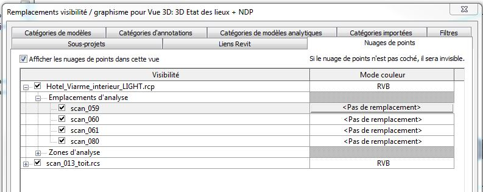

<head>
<meta http-equiv="Content-Type" content="text/html; charset=utf-8">
<link rel="stylesheet" type="text/css" href="bc.css">
<!--

-->

</head>

<!---

- email [Solved: Application.CopyModel error for Revit Server]

- [Manage the point cloud visibility in Revit 3D view](https://www.linkedin.com/pulse/manage-point-cloud-visibility-revit-3d-view-sonas-api-pierre-navarra)
  https://forums.autodesk.com/t5/revit-api-forum/hidding-scans-in-pointcloudinstance/m-p/7369983
  solution

Revit Server Download and Hiding Point Cloud Scan #RevitAPI @AutodeskRevit #bim #dynamobim @AutodeskForge #ForgeDevCon http://bit.ly/downloadrs

Today, I have two important results to share based on hard work by Tim Burnham and Pierre Navarra
&ndash; Download from Revit Server requires RSN.INI entry
&ndash; Hiding a point cloud scan RCS in an RCP instance...

--->

### Revit Server Download and Hiding Point Cloud Scan

Today, I have two important results to share based on hard work by Tim Burnham and Pierre Navarra:

- [Download from Revit Server requires RSN.INI entry](#2)
- [Hiding a point cloud scan RCS in an RCP instance](#3)

####Download from Revit Server Requires RSN.INI Entry

I discussed [copying a model from a Revit Server](http://thebuildingcoder.typepad.com/blog/2011/12/copy-a-model-from-a-revit-server.html) six
years ago.

After all this time, an important caveat is required, prompted by Tim Burnham and all the blood, sweat and tears he spent on resolving an issue with an `Application.CopyModel` error for Revit Server:

**Question:** I wrote an application that interacts with Revit Server and downloads files for some RVT analytic processing.
This always works well for me on my machine, but not for others.
We are using a specific server `A`.  When users of `A` run my application, they can ping and iterate through all the server contents using my REST code, no problem.  However, when the app goes to download the file via `Application.CopyModel`, we are getting *The central model is missing* errors.  My Win7 laptop is not receiving these errors and is able to download fine every time.  Nobody else works.
 
I had several different people try this and reproduce the error at `CopyModel` time.  Two are Win7, two are Win8.  All get the error.  As you can see here, there is nothing out of the ordinary with my sample:

<pre class="code">
&nbsp;&nbsp;string&nbsp;serverFilePath&nbsp;=&nbsp;@&quot;RSN://XX.XX.X.XXX/Project1.rvt&quot;;
 
&nbsp;&nbsp;if(&nbsp;ModelPathUtils.IsValidUserVisibleFullServerPath(&nbsp;
&nbsp;&nbsp;&nbsp;&nbsp;serverFilePath&nbsp;)&nbsp;)
&nbsp;&nbsp;{
&nbsp;&nbsp;&nbsp;&nbsp;ModelPath&nbsp;tempMp&nbsp;=&nbsp;ModelPathUtils
&nbsp;&nbsp;&nbsp;&nbsp;&nbsp;&nbsp;.ConvertUserVisiblePathToModelPath(&nbsp;serverFilePath&nbsp;);
&nbsp;&nbsp;&nbsp;&nbsp;app.CopyModel(&nbsp;tempMp,&nbsp;@&quot;C:\Temp\Project1.rvt&quot;,&nbsp;true&nbsp;);
&nbsp;&nbsp;}
</pre>

Why am I so lucky?  If I log on to another machine using my credentials, it doesn’t work at download time for me either.

I’m using Revit 2017.
 
**Answer:** After much head banging and debugging, I discovered that if you use the `Application.CopyModel` .NET API for Revit Server downloads, the associated central server you wish to download from must be listed in the local workstation `RSN.INI` file:

- C:\ProgramData\Autodesk\Revit Server 2017\Config\RSN.INI

This file may not even exist if the client hasn’t done any RS integration work.

Removing the central server IP from the .INI file will yield either *network communication* or *can’t detach from central* type errors.   
 
I don’t believe this is documented for API use.

If your local Revit install is set up with the server already, I assume the API will always work and this hidden behaviour will go undetected.

I would expect the API should interact with RS assuming port 808 is open and you’re within the LAN/WAN confines.
 
It might be useful to amend the initial article
on [copying a model from a Revit Server](http://thebuildingcoder.typepad.com/blog/2011/12/copy-a-model-from-a-revit-server.html) to
include this info.

Someone will thank you!

Above all, a big thank you to Tim for sharing this important information and all his hard work in detecting and resolving the issue!

####Hiding a Point Cloud Scan RCS in an RCP Instance

Another thank you is due
to [Pierre Navarra](https://fr.linkedin.com/in/pierre-navarra-62032a107)
of [SONA Architecture](http://www.sona-architecture.com) for
his solution
for [managing the point cloud visibility in a Revit 3D view](https://www.linkedin.com/pulse/manage-point-cloud-visibility-revit-3d-view-sonas-api-pierre-navarra) discussed in 
the [Revit API discussion forum](http://forums.autodesk.com/t5/revit-api-forum/bd-p/160) thread
on [hiding scans in `PointCloudInstance`](https://forums.autodesk.com/t5/revit-api-forum/hidding-scans-in-pointcloudinstance/m-p/7369983):

**Question:** `PointCloudInstance` can return the list of scans by using `GetScans`.

I'd like to make invisible a specific scan of a point cloud instance in my 3D view.

The Revit API documentation says, "PointCloudOverrideSettings - Used to get or set the visibility, color mode, and PointCloudColorSettings for a PointCloudInstance or one of its scans."

I can't find how to do it, though... Could you help me, please?

Manually, in the user interface, I can make invisible an `rcs` from an `rcp` instance:

I can use `GetScans` to obtain the list of all rcs from my rcp instance.

With RevitLookup, however, I see no way to get the element ids of an individual rcs...
 
And the help says about scans, "An .rcp file can contain multiple scans. The method PointCloudInstance.GetScans() returns a list of scan names which can be used to set visibility and fixed color overrides independently for each scan in the PointCloudInstance. PointCloudInstance.ContainsScan() indicates whether the given scan name is contained in the point cloud instance while PointCloudInstance.GetScanOrigin() will return the origin of the given scan in model coordinates."
 
"PointCloudColorSettings - Used to assign specific colors for certain color modes to a PointCloudInstance element, or one of its scans. Does not apply if the PointCloudColorMode is NoOverride or Normals."

But how to access the rcs id ?

**Answer:** I'm done, and it works!

I wrote about it
in [managing the point cloud visibility in a Revit 3D view](https://www.linkedin.com/pulse/manage-point-cloud-visibility-revit-3d-view-sonas-api-pierre-navarra).

I use these API calls:

<pre class="code">
&nbsp;&nbsp;PointCloudOverrideSettings
&nbsp;&nbsp;&nbsp;&nbsp;ptc_overridesettings_invisible
&nbsp;&nbsp;&nbsp;&nbsp;&nbsp;&nbsp;=&nbsp;new&nbsp;PointCloudOverrideSettings();
 
&nbsp;&nbsp;ptc_overrides.SetPointCloudScanOverrideSettings(
&nbsp;&nbsp;&nbsp;&nbsp;pti.Id,&nbsp;ptc_overridesettings_invisible,
&nbsp;&nbsp;&nbsp;&nbsp;scanname,&nbsp;doc&nbsp;);
</pre>
 
Thank you for sharing this, Pierre!
