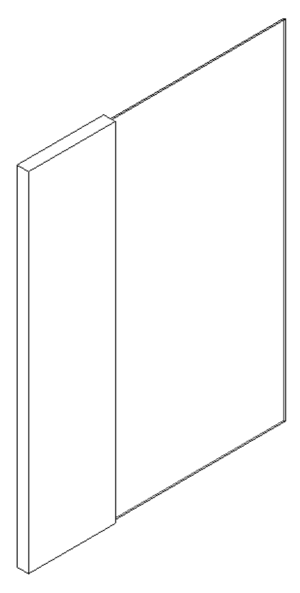

<head>
<meta http-equiv="Content-Type" content="text/html; charset=utf-8">
<link rel="stylesheet" type="text/css" href="bc.css">
<!--

-->

</head>

<!---

- 13504038 [How to retrieve geometry for a basic wall being a panel in a curtain wall]

Curtain wall geometry with basic wall panel via #RevitAPI @AutodeskRevit #bim #dynamobim @AutodeskForge #ForgeDevCon http://bit.ly/curtainwallgeo

A quick geometrical question on retrieving geometry from a basic wall being used as a panel in a curtain wall.
I am struggling to retrieve the geometry data from a curtain wall that contains a Basic wall in one of the curtain wall panels. My example curtain wall has two panels. With one of the panels, a basic wall type is associated. I need to get the geometry data (i.e., the faces) for the entire curtain wall. When I reach the second panel in my code, the <code>SymbolGeometry</code> contains zero objects, so my code cannot retrieve any geometry for it...

--->

### Curtain Wall Panel Geometry with Basic Wall Panel

A quick geometrical question on retrieving geometry from a basic wall being used as a panel in a curtain wall:

**Question:** I am struggling to retrieve the geometry data from a curtain wall that contains a Basic wall in one of the curtain wall panels. 

My example curtain wall has two panels. With one of the panels, a basic wall type is associated. I need to get the geometry data (i.e., the faces) for the entire curtain wall. When I reach the second panel in my code, the `SymbolGeometry` contains zero objects, so my code cannot retrieve any geometry for it. As a result, it is not able to handle the basic wall to retrieve its geometry face data. 
 

**Answer:** Here is a code snippet that handles this situation correctly.

The main point is this: we need to find the panel-wall which corresponds to the curtain wall and then retrieve its geometry in a second step:

<pre class="code">
&nbsp;&nbsp;//&nbsp;First,&nbsp;find&nbsp;solid&nbsp;geometry&nbsp;from&nbsp;panel&nbsp;ids.
&nbsp;&nbsp;//&nbsp;Note&nbsp;that&nbsp;the&nbsp;panel&nbsp;which&nbsp;contains&nbsp;a&nbsp;basic
&nbsp;&nbsp;//&nbsp;wall&nbsp;has&nbsp;NO&nbsp;geometry!
 
&nbsp;&nbsp;Wall&nbsp;wall&nbsp;=&nbsp;doc.GetElement(&nbsp;curtainWallId&nbsp;)&nbsp;as&nbsp;Wall;
&nbsp;&nbsp;var&nbsp;grid&nbsp;=&nbsp;wall.CurtainGrid;
 
&nbsp;&nbsp;foreach(&nbsp;ElementId&nbsp;id&nbsp;in&nbsp;grid.GetPanelIds()&nbsp;)
&nbsp;&nbsp;{
&nbsp;&nbsp;&nbsp;&nbsp;Element&nbsp;e&nbsp;=&nbsp;doc.GetElement(&nbsp;id&nbsp;);
&nbsp;&nbsp;&nbsp;&nbsp;solids.AddRange(&nbsp;GetElementSolids(&nbsp;e&nbsp;)&nbsp;);
&nbsp;&nbsp;}
 
&nbsp;&nbsp;//&nbsp;Secondly,&nbsp;find&nbsp;corresponding&nbsp;panel&nbsp;wall
&nbsp;&nbsp;//&nbsp;for&nbsp;the&nbsp;curtain&nbsp;wall&nbsp;and&nbsp;retrieve&nbsp;the&nbsp;actual
&nbsp;&nbsp;//&nbsp;geometry&nbsp;from&nbsp;that.
 
&nbsp;&nbsp;FilteredElementCollector&nbsp;cwPanels
&nbsp;&nbsp;&nbsp;&nbsp;=&nbsp;new&nbsp;FilteredElementCollector(&nbsp;doc&nbsp;)
&nbsp;&nbsp;&nbsp;&nbsp;&nbsp;&nbsp;.OfCategory(&nbsp;BuiltInCategory.OST_CurtainWallPanels&nbsp;)
&nbsp;&nbsp;&nbsp;&nbsp;&nbsp;&nbsp;.OfClass(&nbsp;typeof(&nbsp;Wall&nbsp;)&nbsp;);
 
&nbsp;&nbsp;foreach(&nbsp;Wall&nbsp;cwp&nbsp;in&nbsp;cwPanels&nbsp;)
&nbsp;&nbsp;{
&nbsp;&nbsp;&nbsp;&nbsp;//&nbsp;Find&nbsp;panel&nbsp;wall&nbsp;belonging&nbsp;to&nbsp;this&nbsp;curtain&nbsp;wall
&nbsp;&nbsp;&nbsp;&nbsp;//&nbsp;and&nbsp;retrieve&nbsp;its&nbsp;geometry
 
&nbsp;&nbsp;&nbsp;&nbsp;if(&nbsp;cwp.StackedWallOwnerId&nbsp;==&nbsp;curtainWallId&nbsp;)
&nbsp;&nbsp;&nbsp;&nbsp;{
&nbsp;&nbsp;&nbsp;&nbsp;&nbsp;&nbsp;solids.AddRange(&nbsp;GetElementSolids(&nbsp;cwp&nbsp;)&nbsp;);
&nbsp;&nbsp;&nbsp;&nbsp;}
&nbsp;&nbsp;}
</pre>

I added this code in the method `GetCurtainWallPanelGeometry` 
to [The Building Coder samples release 2018.0.134.6](https://github.com/jeremytammik/the_building_coder_samples/releases/tag/2018.0.134.6)
module [CmdCurtainWallGeom.cs L35-L66](https://github.com/jeremytammik/the_building_coder_samples/blob/master/BuildingCoder/BuildingCoder/CmdCurtainWallGeom.cs#L35-L66).
 
