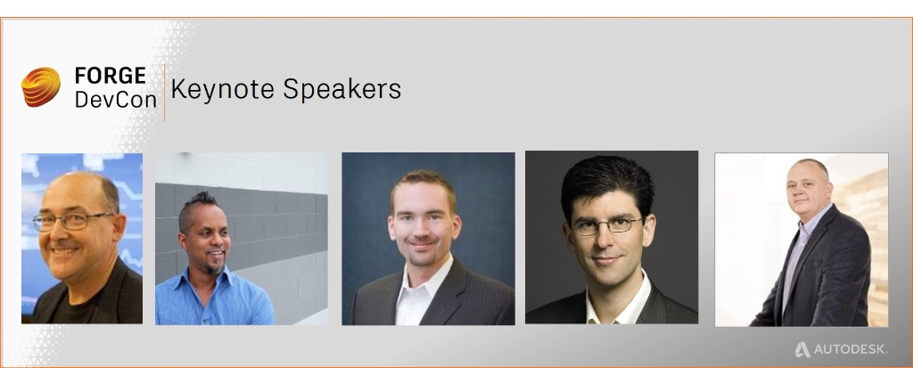

<head>
<meta http-equiv="Content-Type" content="text/html; charset=utf-8">
<link rel="stylesheet" type="text/css" href="bc.css">
<!--

-->

</head>

<!---

- 
  https://flic.kr/s/aHskqqGu2C

 
[Register today for DevCon 2017](http://autode.sk/2gZo7Bn)!
http://au.autodesk.com/las-vegas/registration-pricing/forge-devcon

[AU class catalogue search for 'cloud'](http://autode.sk/2yZfqyd) 
https://autodeskuniversity.smarteventscloud.com/connect/search.ww?mc_cid=dfd134ea95&mc_eid=80ee34fe7e#loadSearch-searchPhrase=Cloud&searchType=session&tc=0&sortBy=relevance&p=

[Forge DevCon Keynotes Released](http://autode.sk/2gYoNqN)
https://forge.autodesk.com/blog/forge-devcon-keynotes-released
https://forge.autodesk.com/blog/forge-devcon-keynotes-released?mc_cid=dfd134ea95&mc_eid=80ee34fe7e

[Visit the Forge DevCon Village Monday](http://autode.sk/2h29jSB)
https://forge.autodesk.com/blog/visit-forge-devcon-village-monday?mc_cid=dfd134ea95&mc_eid=80ee34fe7e

[Collaborate in the Cloud with AWS at Forge DevCon](http://autode.sk/2gYTa0m)
https://forge.autodesk.com/blog/collaborate-cloud-aws-forge-devcon?mc_cid=dfd134ea95&mc_eid=80ee34fe7e

[Discover the AR/VR Toolkit at Forge DevCon](http://autode.sk/2h1pz6n)
https://forge.autodesk.com/blog/discover-arvr-toolkit-forge-devcon?utm_campaign=devcon_CFP_April&utm_source=swu&utm_medium=email

[Forge in action &ndash; community using Forge to make the future](http://autode.sk/2gYq29r)
https://forge.autodesk.com/customers?mc_cid=dfd134ea95&mc_eid=80ee34fe7e

[Developing for Autodesk desktop software? Here’s why you should care about Forge DevCon (and Autodesk University)](http://autode.sk/2z0Ek0q)
https://forge.autodesk.com/blog/developing-autodesk-desktop-software-heres-why-you-should-care-about-forge-devcon-and-autodesk?mc_cid=dfd134ea95&mc_eid=80ee34fe7e

[Forge DevCon – its not just for programmers](http://autode.sk/2z0tN53)
https://forge.autodesk.com/blog/forge-devcon-its-not-just-programmers?mc_cid=dfd134ea95&mc_eid=80ee34fe7e

 #RevitAPI @AutodeskRevit #bim #dynamobim @AutodeskForge #ForgeDevCon 

My plans changed and I will not be visiting Las Vegas this year after all.
The most important participants in the Revit API session that I was preparing to host are the members of the Revit development team, anyway.
I very strongly urge you to not miss the chance to attend both AU and the preceding Forge developer conference, though
&ndash; Forge DevCon highlights and reasons to join your peers
&ndash; Sneak peek at the Forge DevCon keynotes
&ndash; Visit the exclusive Forge DevCon village on Monday
&ndash; Get one on one with Amazon Web Services
&ndash; Decide now...

--->

### Forge DevCon in Las Vegas

My plans changed. For the first time since 2005, I will not be visiting Las Vegas this year after all.

The most important participants in the Revit API session that I was preparing to host are the members of the Revit development team, anyway.

I very strongly urge you to not miss the chance to attend both AU and the preceding Forge developer conference, though, for all the reasons already pointed out in the article
on the [Forge DevCon at AU in Darmstadt and Las Vegas](http://thebuildingcoder.typepad.com/blog/2017/09/forge-devcon-at-au-in-darmstadt-and-las-vegas.html).

Here is the latest news to provide that final kick, plus a very few pictures I took during the Forge accelerator last week in Lyon, France:

- [Dawn in Lyon](#1)
- [Forge DevCon highlights and reasons to join your peers](#2)
- [Sneak peek at the Forge DevCon keynotes](#3)
- [Visit the exclusive Forge DevCon village on Monday](#4)
- [Get one on one with Amazon Web Services](#5)
- [Decide now](#6)

####Dawn in Lyon

Before diving into the current news on the Forge DevCon, here are a handful of [pictures of dawn from the hotel window and the train station of Part Dieu in Lyon](https://flic.kr/s/aHskqqGu2C):

####Forge DevCon Highlights and Reasons to Join your Peers
 
*Join over a thousand developers already working with the Forge platform and committed to accelerating their businesses and careers.*
 
You won’t want to miss the last opportunity this year to get started with or delve deeper into Forge. 

Hundreds of new developers are now engaging with Forge after the recent Forge DevCon conferences in China, Japan, Germany and most recently AU Russia.

Don’t get left behind.

There won’t be another opportunity like this until late 2018.

[Register today for DevCon 2017](http://autode.sk/2gZo7Bn)!

Customers are embracing the cloud and they need applications and services to extend their Autodesk solutions. But don’t just take our word for it.  You’ll find the cloud everywhere at AU this year. In fact, searching the class catalogue the word 'cloud' produces 168 results: 

- [AU class catalogue search for 'cloud'](http://autode.sk/2yZfqyd) 
 
Although you can learn some things by attending webinars, watching videos, reading blogs or using forums, it’s just not the same as the benefits you gain from a face to face event.

Beyond the 50+ Forge classes, here are a few more reasons to seriously consider purchasing your Forge DevCon or combined DevCon and AU Pass today:

####Sneak Peek at the Forge DevCon Keynotes

Be inspired by and learn from a great line-up of keynote speakers, including:
 
- Jim Quanci,  Senior Director ADN and Forge Partner Development
- Duleesha Kulasooriya, Head of Strategy and Research, Deloitte Center for the Edge
- Brian Roepke, Senior Director, Forge Product Management
- Scott Reese, Autodesk SVP of Construction and Manufacturing
- Brian Mathews, Autodesk VP of Cloud Platforms
- Autodesk Partners LimbForge and SmartVid.io
 

 
You don’t want to miss the inspiring and illuminating topics including:

- The big picture &ndash; where Forge is today, where it’s going in the coming year and beyond
- The manufacturing landscape of the future and why cloud products are the keys to the industry’s democratization
- Forge applied to Construction and BIM 360
- Fireside chat on the vision of where Forge is headed and how this will create a competitive advantage for Autodesk partners and customers
- ... and more

Check out the in-depth information about
the [Forge DevCon keynotes online](http://autode.sk/2gYoNqN).

####Visit the exclusive Forge DevCon Village on Monday

The Village is an area that offers a mix of activities &ndash; exhibits, Forge Answer Bar and space to network. Talk to Forge early adopters and certified systems integrators about how easy it is to build Forge-based workflows. Come to the Forge Answer Bar and get questions answered by a team of Forge technical experts. See the research and startup projects Universities from around the world are doing with Forge. And be sure to drop by the Forge Reality Playground to learn how Forge can help you create immersive virtual and augmented reality experiences.
 
Learn more about
the [Forge Village and Forge Partners](http://autode.sk/2h29jSB).

####Get One on One with Amazon Web Services

Amazon Web Services is the official cloud sponsor for Forge DevCon. The AWS teams will be hanging out at Forge DevCon and Autodesk University ready to answer your questions about moving to the cloud and taking advantage of cloud services.  Tom 'Elvis' Jones, Solutions Architect with AWS, will be teaching two classes, and the team will be in the DevCon Village and on the AU show floor.
 
Don’t hesitate. Make your decision to be part of the future and join your peers already enjoying success with Forge (see some of them featured on the Forge website)
highlighting [Forge in action &ndash; community using Forge to make the future](http://autode.sk/2gYq29r).

####Decide Now

Still on the fence?

We urge you to review the further reasons to attend highlighted in these previous articles: 

- [Building desktop solutions?](http://autode.sk/2z0Ek0q)
- [Forge DevCon is not just for programmers](http://autode.sk/2z0tN53)

[Register today for DevCon 2017](http://autode.sk/2gZo7Bn)!

