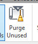

<head>
<meta http-equiv="Content-Type" content="text/html; charset=utf-8">
<link rel="stylesheet" type="text/css" href="bc.css">
<!--

-->

</head>

<!---

- https://forums.autodesk.com/t5/revit-api-forum/cf-1201-purge-unused-objects/m-p/7507455
  13551712 [CF-1201 Purge unused objects]

- https://forums.autodesk.com/t5/revit-api-forum/purge-unused-via-the-api/m-p/7525966
  [Determining purgeable elements](http://thebuildingcoder.typepad.com/blog/2013/03/determining-purgeable-elements.html) and the thread 
  [Writing a purge utility](http://forums.autodesk.com/t5/revit-api/writing-a-purge-utility/m-p/2735359/highlight/true)

- purge:
[Types, Families and Materials](http://thebuildingcoder.typepad.com/blog/2017/04/forgefader-ui-lookup-builds-purge-and-room-instances.html#4)
[Text Note Types](http://thebuildingcoder.typepad.com/blog/2010/11/purge-unused-text-note-types.html)
[Determining Purgeable Elements](http://thebuildingcoder.typepad.com/blog/2013/03/determining-purgeable-elements.html)
[Reference Planes Not Hosting Any Elements](http://thebuildingcoder.typepad.com/blog/2012/03/melbourne-devlab.html#2)
[Unnamed Non-Hosting Reference Planes](http://thebuildingcoder.typepad.com/blog/2014/02/deleting-unnamed-non-hosting-reference-planes.html)
09095866 [How to truly purge Project (Shared) Parameters](http://forums.autodesk.com/t5/Revit-API/How-to-truly-purge-Project-Shared-Parameters/m-p/4719271)
13551712 [CF-1201 Purge unused objects](https://forums.autodesk.com/t5/revit-api-forum/cf-1201-purge-unused-objects/m-p/7507455)
CF-1201 [Purge unused objects]

- [Detecting empty views] Philipp Kast

- https://chtammik.bandcamp.com/album/collection-from-the-past
tweet: My son Chris released a music album, collection from the past, https://chtammik.bandcamp.com/album/collection-from-the-past by http://tammik.ca

Purge and PostCommand #RevitAPI @AutodeskRevit #bim #dynamobim @AutodeskForge #ForgeDevCon http://bit.ly/purgepost
Detecting empty views #RevitAPI @AutodeskRevit #bim #dynamobim @AutodeskForge #ForgeDevCon http://bit.ly/purgepost

One topic that keeps cropping up is how to purge different kinds of Revit database elements
&ndash; Purge
&ndash; Detecting empty views
&ndash; JavaScript debugging tips
&ndash; Collection from the past...

--->

### Purge and Detecting an Empty View

I am behind schedule blogging, working too much on answering cases and participating in
the [Revit API discussion forum](http://forums.autodesk.com/t5/revit-api-forum/bd-p/160) thread 
while my colleagues are busy at DevCon and AU in Las Vegas.

In spite of that, this is blog number 1600, a nice round number to celebrate.

One topic that keeps cropping up is how to purge different kinds of Revit database elements:

- [Purge and `PostCommand`](#2)
- [Detecting empty views](#3)
- [JavaScript debugging tips](#4)
- [Collection from the past](#5)

####Purge and PostCommand

The topic of purging various elements came up repeatedly in the past:

- [Text note types](http://thebuildingcoder.typepad.com/blog/2010/11/purge-unused-text-note-types.html)
- [Reference planes not hosting any elements](http://thebuildingcoder.typepad.com/blog/2012/03/melbourne-devlab.html#2)
- [Determining purgeable elements](http://thebuildingcoder.typepad.com/blog/2013/03/determining-purgeable-elements.html)
- [Unnamed non-hosting reference planes](http://thebuildingcoder.typepad.com/blog/2014/02/deleting-unnamed-non-hosting-reference-planes.html)
- [Types, families and materials](http://thebuildingcoder.typepad.com/blog/2017/04/forgefader-ui-lookup-builds-purge-and-room-instances.html#4)

Two recent Revit API discussion threads re-raise the topic of programmatic access to the purge functionality:

- [CF-1201 Purge unused objects](https://forums.autodesk.com/t5/revit-api-forum/cf-1201-purge-unused-objects/m-p/7507455)
- [Purge unused via the API](https://forums.autodesk.com/t5/revit-api-forum/purge-unused-via-the-api/m-p/7525966)

In the latter, Thomas the Coder asks:

**Question:** So I've read The Building Coder article
on [determining purgeable elements](http://thebuildingcoder.typepad.com/blog/2013/03/determining-purgeable-elements.html) and
the discussion forum thread 
on [writing a purge utility](http://forums.autodesk.com/t5/revit-api/writing-a-purge-utility/m-p/2735359).
 
They both say that triggering the 'Purge Unused' button under the 'Manage' tab via code isn't possible and that you have to write your own code to handle the not so small task of doing it manually.

**Answer by Ali [@imaliasad](https://forums.autodesk.com/t5/user/viewprofilepage/user-id/5242763) Asad:**
I've come up with the solution, using [PostCommand](http://thebuildingcoder.typepad.com/blog/about-the-author.html#5.3) to launch the built-in Revit command:

<pre class="code">
&nbsp;&nbsp;UIApplication&nbsp;uiapp&nbsp;=&nbsp;commandData.Application;
 
&nbsp;&nbsp;//&nbsp;Store&nbsp;the&nbsp;ID&nbsp;of&nbsp;desired&nbsp;plugin&nbsp;button,
&nbsp;&nbsp;//&nbsp;in&nbsp;this&nbsp;case&nbsp;its&nbsp;&#39;purge&nbsp;unused&#39;
 
&nbsp;&nbsp;String&nbsp;s_commandToDisable&nbsp;=&nbsp;&quot;ID_PURGE_UNUSED&quot;;
&nbsp;&nbsp;RevitCommandId&nbsp;s_commandId&nbsp;=&nbsp;RevitCommandId
&nbsp;&nbsp;&nbsp;&nbsp;.LookupCommandId(&nbsp;s_commandToDisable&nbsp;);
 
&nbsp;&nbsp;//&nbsp;This&nbsp;revit&nbsp;button&nbsp;will&nbsp;run&nbsp;at&nbsp;the&nbsp;
&nbsp;&nbsp;//&nbsp;end&nbsp;of&nbsp;your&nbsp;application.&nbsp;
 
&nbsp;&nbsp;uiapp.PostCommand(&nbsp;s_commandId&nbsp;);
</pre>

The limitation I'm facing: I can't run the Revit command button instantly; it runs after the add-in external command terminates.

**Question:** How do I run the Revit command instantly within my add-in external command, before it terminates?

**Answer:** `PostCommand` launches a Revit command. The command cannot run in parallel with your add-in,
because there is [no multithreading support in the Revit API](http://thebuildingcoder.typepad.com/blog/2011/06/no-multithreading-in-revit.html)
and [the Revit API is never ever thread safe](http://thebuildingcoder.typepad.com/blog/2014/11/the-revit-api-is-never-ever-thread-safe.html).

Therefore, your add-in must terminate before the next command can run.

You can add another `PostCommand` to call a second add-in command to be executed afterwards to continue the process, or use other means, such
as [Idling and external events for modeless access and driving Revit from outside](http://thebuildingcoder.typepad.com/blog/about-the-author.html#5.28).

Also note 
Ali's [list of `PostCommand` limitations](https://stackoverflow.com/questions/47151567/how-to-call-revit-purge-button-from-the-revit-api) on
StackOverflow.

####Detecting Empty Views

On another related topic, my colleague Philipp Kast, Principal Engineer at Autodesk, shared an approach to detect empty views, i.e., views which do not display any visible object, and his research steps leading up to his current approach:

I am working on the Revit Extractor. We are creating so-called master views, which are views for each phase in the Revit model.
 
Recently we fixed an issue concerning empty views for phases that have no content.

So, we added the following code to detect whether a given view is empty:

<pre class="code">
&nbsp;&nbsp;private&nbsp;bool&nbsp;IsEmptyMasterView(&nbsp;View&nbsp;view&nbsp;)
&nbsp;&nbsp;{
&nbsp;&nbsp;&nbsp;&nbsp;using(&nbsp;FilteredElementCollector&nbsp;collector&nbsp;
&nbsp;&nbsp;&nbsp;&nbsp;&nbsp;&nbsp;=&nbsp;new&nbsp;FilteredElementCollector(&nbsp;doc,&nbsp;view.Id&nbsp;)&nbsp;)
&nbsp;&nbsp;&nbsp;&nbsp;{
&nbsp;&nbsp;&nbsp;&nbsp;&nbsp;&nbsp;return&nbsp;!collector.Any();
&nbsp;&nbsp;&nbsp;&nbsp;}
&nbsp;&nbsp;}
</pre>
 
That worked well. But then a model came along that had empty views again, because it contained division and curtain elements that are not visible.

So, we adapted this code, basically skipping those categories:
 
<pre class="code">
&nbsp;&nbsp;using(&nbsp;FilteredElementCollector&nbsp;collector&nbsp;
&nbsp;&nbsp;&nbsp;&nbsp;=&nbsp;new&nbsp;FilteredElementCollector(&nbsp;doc,&nbsp;view.Id&nbsp;)&nbsp;)
&nbsp;&nbsp;{
&nbsp;&nbsp;&nbsp;&nbsp;var&nbsp;invisibleCategories&nbsp;=&nbsp;new&nbsp;HashSet&lt;ElementId&gt;
&nbsp;&nbsp;&nbsp;&nbsp;{
&nbsp;&nbsp;&nbsp;&nbsp;&nbsp;&nbsp;&nbsp;new&nbsp;ElementId(BuiltInCategory.OST_Divisions),
&nbsp;&nbsp;&nbsp;&nbsp;&nbsp;&nbsp;&nbsp;new&nbsp;ElementId(BuiltInCategory.OST_CurtaSystemFaceManager)
&nbsp;&nbsp;&nbsp;&nbsp;};
&nbsp;&nbsp;&nbsp;&nbsp;return&nbsp;collector.All(&nbsp;
&nbsp;&nbsp;&nbsp;&nbsp;&nbsp;&nbsp;element&nbsp;=&gt;&nbsp;element.Category&nbsp;!=&nbsp;null&nbsp;
&nbsp;&nbsp;&nbsp;&nbsp;&nbsp;&nbsp;&amp;&amp;&nbsp;invisibleCategories.Contains(&nbsp;
&nbsp;&nbsp;&nbsp;&nbsp;&nbsp;&nbsp;&nbsp;&nbsp;element.Category.Id&nbsp;)&nbsp;);
&nbsp;&nbsp;}
</pre>
 
Now again, yet another model includes other invisible elements.

So, I came up with the following check, by experimenting around:

<pre class="code">
&nbsp;&nbsp;using(&nbsp;FilteredElementCollector&nbsp;collector&nbsp;
&nbsp;&nbsp;&nbsp;&nbsp;=&nbsp;new&nbsp;FilteredElementCollector(&nbsp;doc,&nbsp;view.Id&nbsp;)&nbsp;)
&nbsp;&nbsp;{
&nbsp;&nbsp;&nbsp;&nbsp;return&nbsp;collector.All(&nbsp;
&nbsp;&nbsp;&nbsp;&nbsp;&nbsp;&nbsp;element&nbsp;=&gt;&nbsp;element.Category&nbsp;!=&nbsp;null&nbsp;
&nbsp;&nbsp;&nbsp;&nbsp;&nbsp;&nbsp;&amp;&amp;&nbsp;!element.Category.get_AllowsVisibilityControl(&nbsp;
&nbsp;&nbsp;&nbsp;&nbsp;&nbsp;&nbsp;&nbsp;&nbsp;view&nbsp;)&nbsp;);
&nbsp;&nbsp;}
</pre>

This seems to work, but I’m not sure if it makes sense.

Any comment or input would be appreciated.

Thank you!

And thanks to Philipp for sharing this!

####JavaScript Debugging Tips

Philippe [@F3lipek](https://twitter.com/F3lipek) Leefsma just pointed
out [the 14 JavaScript debugging tips you probably didn't know](https://raygun.com/javascript-debugging-tips).

They are really helpful, so I'll make a note of them for myself here.

Thanks, Philippe!

####Collection from the Past

My son Chris released a music album, [collection from the past](https://chtammik.bandcamp.com/album/collection-from-the-past), by [Chris Tammik](http://tammik.ca), saying:

This collection spans my composition catalogue from around 2011 to 2015. This time was mainly centred around me learning to handle digital audio editing and composition tools. 

After some months playing around with the Traktor DJ software I started exploring electronic music production with Ableton Live. I started working with sound professionally and made my passion to a job. In between I discovered REAPER as my ideal sound design environment. 

Since then I have focused more on the programing side of things and am now creating audio tools for video games. The release of this collection shall serve as a reminder for the stems of my passion for sound and the incredible journey I still find myself on. Hopefully you find something enjoyable here.
There are songs in various genres, sound design exercises, and pretty much each track has its own story &ndash; :)

