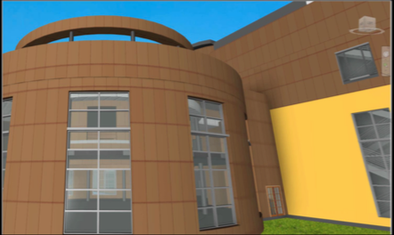

<head>
<meta http-equiv="Content-Type" content="text/html; charset=utf-8">
<link rel="stylesheet" type="text/css" href="bc.css">
<!--

-->

</head>

<!---

- ask scott for the material asset AU talk details and material
Material Render Appearance
[Q] How can I set the Material Render Appearance through the API in Revit 2018?
I can see there is the Autodesk.Revit.DB.Visual.Asset class, but how do I add to the list of Autodesk.Revit.DB.Visual.AssetProperty’s for a new material?
I didn’t want to invest too much time based on this forum thread: https://forums.autodesk.com/t5/revit-api-forum/create-or-modify-a-rendering-asset/td-p/6244577
[A] it’s not possible to do in Revit 2018.
But it is possible in 2018.1.
It happens that @Boris Shafiro is teaching a class at this topic at AU this week.
https://autodeskuniversity.smarteventscloud.com/connect/search.ww#loadSearch-searchPhrase=shafiro&searchType=session&tc=0&sortBy=relevance
https://autodeskuniversity.smarteventscloud.com/connect/search.ww#loadSearch-searchPhrase=shafiro&searchType=session&tc=0&sortBy=relevance&p=

Modifying material visual appearance using #RevitAPI @AutodeskRevit #bim #dynamobim @AutodeskForge #ForgeDevCon http://bit.ly/modifymaterial

Question: How can I set the Material Render Appearance through the API?
I can see there is the <code>Autodesk.Revit.DB.Visual.Asset</code> class, but how do I add to the list of <code>Autodesk.Revit.DB.Visual.AssetProperty</code> objects for a new material?
Answer: The good news is that this is possible in Revit 2018.1 using the Visual Materials API.
Check out Boris Shafiro's class at AU to learn about it...

--->

### Modifying Material Visual Appearance

Several queries concerning rendering issues were discussed recently and solved by the new Visual Materials API included in Revit 2018.1:

- [Revit 2018.1 and the Visual Materials API](http://thebuildingcoder.typepad.com/blog/2017/08/revit-20181-and-the-visual-materials-api.html)
- [Appearance Asset Editing SDK sample](http://thebuildingcoder.typepad.com/blog/2017/08/revit-20181-and-the-visual-materials-api.html#2)

Here comes another one, answered more completely by Boris Shafiro's Autodesk University class on this topic:

- AU class catalogue entry: [SD124625 &ndash; New API to Modify Visual Appearance of Materials in Revit](https://autodeskuniversity.smarteventscloud.com/connect/sessionDetail.ww?SESSION_ID=124625)
- Class handout and slides: [SD124625 &ndash; Visual Materials API](#3)

**Question:** How can I set the Material Render Appearance through the API in Revit 2018?

I can see there is the `Autodesk.Revit.DB.Visual.Asset` class, but how do I add to the list of `Autodesk.Revit.DB.Visual.AssetProperty` objects for a new material?

I noticed the forum thread
on how to [create or modify a rendering asset](https://forums.autodesk.com/t5/revit-api-forum/create-or-modify-a-rendering-asset/td-p/6244577) that
seems to indicate limitations in this area...

**Answer:** Unfortunately, this is not possible in Revit 2018.

The good news is that it <b><i>is</i></b> possible in Revit 2018.1 using the Visual Materials API.

Check out Boris Shafiro's class at AU to learn about it.

####SD124625 &ndash; Visual Materials API

The ability to use the Revit API to modify visual appearances of materials was among the top customer requests for years. This new API has been implemented in Revit 2018.1. This class presents the new Visual Materials API, coding workflows, and usage of multiple schemas for the visualization properties of materials in Revit software &ndash; by Boris Shafiro, Software Development Manager, Autodesk:

- [Handout document PDF](/a/doc/au/2017/doc2/sd124625_Visual_Appearance_of_Materials_API_Boris_Shafiro_handout.pdf)
- [Slide deck PDF](/a/doc/au/2017/doc2/sd124625_Visual_Appearance_of_Materials_API_Boris_Shafiro_slides.pdf)

For the sake of completeness and search engine findability, here is the pure text copied out of the slide deck:

- [Learning Objectives](#3.1)
- [The Basics](#4)
    - [Materials API](#4.1)
    - [Terminology](#4.2)
    - [Material API building blocks](#4.3)
    - [Visual Materials UI](#4.4)
- [New Editing Capabilities in Materials API](#5)
    - [Edit Scope](#5.1)
    - [New Writable Properties](#5.2)
    - [New Methods](#5.3)
    - [Coding Workflow to Edit a Color](#5.4)
    - [Connected Assets](#5.5)
    - [Coding Workflow to Edit a Connected Asset](#5.6)
- [Schemas and Property Names](#7)
    - [Standard Material Schemas](#7.1)
    - [Advanced Material Schemas](#7.2)
    - [Common Schema](#7.3)
    - [Schemas for Connected Assets](#7.4)
    - [UnifiedBitmap](#7.5)
    - [Property Names](#7.6)
    - [Special Cases](#7.7)
- [SDK Sample](#8)
    - [AppearanceAssetEditing](#8.1)

####Learning Objectives

Learn how to

- Use new API to modify visual appearance of Materials in Revit
- Navigate coding workflow to edit appearance assets
- Use multiple schemas for regular and advanced materials in Revit
- Write a sample plug-in for basic modification of the visual appearance of Revit materials

<h3 style="font-weight: bold">The Basics</h3>

####Materials API

- Basic Element Info (name, tags)
- Appearance properties
- Shaded view graphics
- Thermal & energy-related properties
- Physical & structural properties

####Terminology

- Revit Material &ndash; An element representing a material, made of a collection of property sets
- Asset &ndash; The class representing a package of properties
- Appearance Asset &ndash; Asset representing visual material properties
- Appearance Asset Element &ndash; An element that stores an appearance asset
- Asset Property &ndash; One particular property of an asset

####Material API building blocks

- Namespace Revit.DB Namespace Revit.DB.Visual
- Material &ndash; AppearanceAssetId
- AppearanceAssetElement &ndash; GetRenderingAsset()
- Asset &ndash; AssetProperty 1 ... AssetProperty N &ndash; [“name_string” ] or FindByName(name)
- AssetProperty &ndash; GetSingleConnectedAsset()

####Visual Materials UI

<h3 style="font-weight: bold">New Editing Capabilities in Materials API</h3>

####Edit Scope

- AppearanceAssetEditScope
    - Start()
    - Commit()
    - Cancel()
- Contains one Asset (plus all connected Assets)

####New Writable Properties

- AssetPropertyString.Value
- AssetPropertyBoolean.Value
- AssetPropertyInteger.Value
- AssetPropertyDouble.Value
- AssetPropertyFloat.Value
- AssetPropertyEnum.Value
- AssetPropertyDistance.Value (not always in feet)

####New Methods

- AssetPropertyDoubleArray3d.SetValueAsXYZ()
- AssetPropertyDoubleArray4d.SetValueAsDoubles()
- AssetPropertyDoubleArray4d.SetValueAsColor()
- AssetPropertyList &ndash; add, insert, remove

####Coding Workflow to Edit a Color

<pre class="code">
&nbsp;&nbsp;using(&nbsp;AppearanceAssetEditScope&nbsp;editScope
&nbsp;&nbsp;&nbsp;&nbsp;=&nbsp;new&nbsp;AppearanceAssetEditScope(&nbsp;document&nbsp;)&nbsp;)
&nbsp;&nbsp;{
&nbsp;&nbsp;&nbsp;&nbsp;Asset&nbsp;editableAsset&nbsp;=&nbsp;editScope.Start(&nbsp;assetElem.Id&nbsp;);
&nbsp;&nbsp;&nbsp;&nbsp;AssetPropertyDoubleArray4d&nbsp;genericDiffuseProperty
&nbsp;&nbsp;&nbsp;&nbsp;&nbsp;&nbsp;=&nbsp;editableAsset[&quot;generic_diffuse&quot;]
&nbsp;&nbsp;&nbsp;&nbsp;&nbsp;&nbsp;&nbsp;&nbsp;as&nbsp;AssetPropertyDoubleArray4d;
&nbsp;&nbsp;&nbsp;&nbsp;genericDiffuseProperty.SetValueAsColor(&nbsp;color&nbsp;);
&nbsp;&nbsp;&nbsp;&nbsp;editScope.Commit(&nbsp;true&nbsp;);
&nbsp;&nbsp;}
</pre>

####Connected Assets

- AssetProperty.GetSingleConnectedAsset()
- AssetProperty.RemoveConnectedAsset()
- AssetProperty.AddConnectedAsset( String schemaId )
- AssetProperty.AddCopyAsConnectedAsset( Asset renderingAsset )

####Coding Workflow to Edit a Connected Asset

<pre class="code">
&nbsp;&nbsp;using(&nbsp;AppearanceAssetEditScope&nbsp;editScope
&nbsp;&nbsp;&nbsp;&nbsp;=&nbsp;new&nbsp;AppearanceAssetEditScope(&nbsp;document&nbsp;)&nbsp;)
&nbsp;&nbsp;{
&nbsp;&nbsp;&nbsp;&nbsp;Asset&nbsp;editableAsset&nbsp;=&nbsp;editScope.Start(&nbsp;assetElem.Id&nbsp;);
&nbsp;&nbsp;&nbsp;&nbsp;AssetProperty&nbsp;bumpMapProperty&nbsp;=&nbsp;editableAsset[&quot;generic_bump_map&quot;];
&nbsp;&nbsp;&nbsp;&nbsp;Asset&nbsp;connectedAsset&nbsp;=&nbsp;bumpMapProperty.GetSingleConnectedAsset();
&nbsp;&nbsp;&nbsp;&nbsp;if(&nbsp;connectedAsset&nbsp;!=&nbsp;null&nbsp;)
&nbsp;&nbsp;&nbsp;&nbsp;{
&nbsp;&nbsp;&nbsp;&nbsp;&nbsp;&nbsp;AssetPropertyString&nbsp;bumpmapBitmapProperty
&nbsp;&nbsp;&nbsp;&nbsp;&nbsp;&nbsp;&nbsp;&nbsp;=&nbsp;connectedAsset[&quot;unifiedbitmap_Bitmap&quot;]&nbsp;
&nbsp;&nbsp;&nbsp;&nbsp;&nbsp;&nbsp;&nbsp;&nbsp;&nbsp;&nbsp;as&nbsp;AssetPropertyString;
 
&nbsp;&nbsp;&nbsp;&nbsp;&nbsp;&nbsp;if(&nbsp;bumpmapBitmapProperty.IsValidValue(&nbsp;bumpmapImageFilepath&nbsp;)&nbsp;)
&nbsp;&nbsp;&nbsp;&nbsp;&nbsp;&nbsp;&nbsp;&nbsp;bumpmapBitmapProperty.Value&nbsp;=&nbsp;bumpmapImageFilepath;
&nbsp;&nbsp;&nbsp;&nbsp;}
&nbsp;&nbsp;&nbsp;&nbsp;editScope.Commit(&nbsp;true&nbsp;);
&nbsp;&nbsp;}
</pre>

<h3 style="font-weight: bold">Schemas and Property Names</h3>

####Standard Material Schemas

- Ceramic
- Concrete
- Generic
- Glazing
- Hardwood
- MasonryCMU
- Metal
- MetallicPaint
- Mirror
- PlasticVinyl
- SolidGlass
- Stone
- WallPaint
- Water

####Advanced Material Schemas

- AdvancedLayered
- AdvancedMetal
- AdvancedOpaque
- AdvancedTransparent
- AdvancedWood

####Common Schema

####Schemas for Connected Assets

- BumpMap
- Checker
- Gradient
- Marble
- Noise
- Speckle
- Tile
- UnifiedBitmap
- Wave
- Wood

####UnifiedBitmap

####Property Names

<pre class="code">
&nbsp;&nbsp;AssetPropertyDoubleArray4d&nbsp;genericDiffuseProperty&nbsp;
&nbsp;&nbsp;&nbsp;&nbsp;=&nbsp;editableAsset[&quot;generic_diffuse&quot;]&nbsp;
&nbsp;&nbsp;&nbsp;&nbsp;&nbsp;&nbsp;as&nbsp;AssetPropertyDoubleArray4d;
</pre>

Equivalent:

<pre class="code">
&nbsp;&nbsp;AssetPropertyDoubleArray4d&nbsp;genericDiffuseProperty&nbsp;
&nbsp;&nbsp;&nbsp;&nbsp;=&nbsp;editableAsset[Generic.GenericDiffuse]&nbsp;
&nbsp;&nbsp;&nbsp;&nbsp;&nbsp;&nbsp;as&nbsp;AssetPropertyDoubleArray4d;
</pre>

####Special Cases

<pre class="code">
&nbsp;&nbsp;AssetPropertyString&nbsp;path
&nbsp;&nbsp;&nbsp;&nbsp;=&nbsp;asset[UnifiedBitmap.UnifiedbitmapBitmap]&nbsp;
&nbsp;&nbsp;&nbsp;&nbsp;&nbsp;&nbsp;as&nbsp;AssetPropertyString;
</pre>

- Path is relative if inside default Material Library or in Options/Rendering/Additional Render Appearance Paths;
- Path is absolute otherwise.

<pre class="code">
&nbsp;&nbsp;AssetPropertyDoubleArray4d&nbsp;color
&nbsp;&nbsp;&nbsp;&nbsp;=&nbsp;asset[Generic.DiffuseColor]&nbsp;
&nbsp;&nbsp;&nbsp;&nbsp;&nbsp;&nbsp;as&nbsp;AssetPropertyDoubleArray4d;
</pre>

- The Value of this AssetProperty is ignored if there is a connected Asset.

- AssetPropertyReference reference &ndash; Does not have a Value. Used only to have a connected Asset.

<h3 style="font-weight: bold">SDK Sample</h3>

####AppearanceAssetEditing

Edit appearance asset properties via a small control dialog &ndash; this sample demonstrates basic usage of the AppearanceAssetEditScope and AssetProperty classes to change the value of an asset property in a given material:

- Bring up a modeless dialog
- Select a Painted Face
- Get Appearance Asset
- Get Tint Color AssetProperty
- Increment red/green/blue
