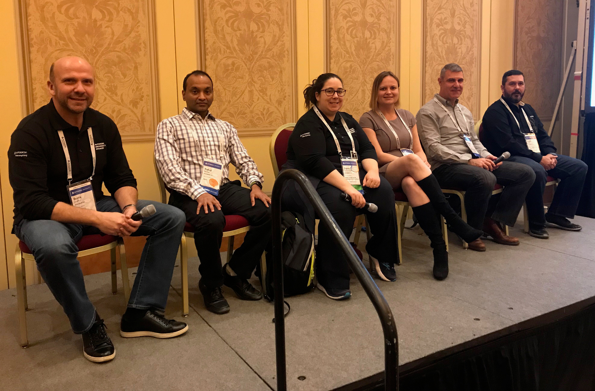

<head>
<meta http-equiv="Content-Type" content="text/html; charset=utf-8">
<link rel="stylesheet" type="text/css" href="bc.css">
<!--

-->

</head>

<!---

#RevitAPI panel @ AU Las Vegas 2017 @AutodeskRevit #bim #dynamobim @AutodeskForge #ForgeDevCon http://bit.ly/apipanel

Notes on the questions and answers at the Revit API panel at Autodesk University in Las Vegas November 2017
&ndash; Description
&ndash; Previous panels
&ndash; Panel members
&ndash; Learning objectives
&ndash; Questions and answers
&ndash; Recording and materials...

--->

### Revit API Panel @ AU Las Vegas 2017

I skipped AU in Las Vegas this year, for the first time since 2005.

The Revit API panel took place as normal, thanks to the Revit API development and consultancy team panel members and my
colleague [Augusto](http://adndevblog.typepad.com/autocad/augusto-goncalves.html)
[Gonçalves](https://www.linkedin.com/in/augustomaia),
who took the notes:

- [Description](#2)
- [Previous panels](#3)
- [Panel members](#4)
- [Learning objectives](#5)
- [Questions and answers](#6)
- [Recording and materials](#7)

####Description

The Revit API Panel class at Autodesk University 2017 is listed in the AU class catalogue entry
as [SD124063 &ndash; *Revit API Expert Roundtable: Open House on the Factory Floor*](https://autodeskuniversity.smarteventscloud.com/connect/sessionDetail.ww?SESSION_ID=124625):

Interact with a panel of Revit API experts to answer your questions and discuss all relevant topics of your choice. For anyone writing add-ins for Revit software, this is the perfect forum to better get to know the people who shape the APIs you work with and explain your views, ideas, and problems face to face. Please note that prior .NET programming and Revit add-in development experience is required. This class is not suitable for beginners.

####Previous Panels

Here are some notes from previous similar Revit API panel sessions:

- [SD5156 &ndash; The Revit API Expert Panel at Autodesk University 2014](http://thebuildingcoder.typepad.com/blog/2014/12/the-revit-api-panel-at-autodesk-university.html#1)
- [Revit Technology Conference RTC Europe 2015](http://thebuildingcoder.typepad.com/blog/2015/11/rtc-budapest-and-the-revit-api-panel.html#5)
- [SD10181 &ndash; Revit API Expert Roundtable at Autodesk University 2015](http://thebuildingcoder.typepad.com/blog/2015/12/au-keynote-and-revit-api-panel.html#9)
- [RTC Revit Technology Conference Europe 2016](http://thebuildingcoder.typepad.com/blog/2016/10/rtc-revit-api-panel-idea-station-edit-and-continue.html)
- [SD20891 &ndash; Autodesk University 2016](http://thebuildingcoder.typepad.com/blog/2016/11/au-day-two-ifc-and-revit-api-panel.html#4)

 
####Panel Members

- Boris Shafiro, Software Development Manager, Autodesk
- Diane Christoforo, Revit Development, Autodesk
- Keith White, Technical Consultant, Autodesk,
- Miroslav Schonauer, Senior Solutions Architect, Autodesk
- Rahul Bhobe, Principal Engineer, Autodesk
- Sasha Crotty, Revit Core Product Manager, Autodesk

####Learning Objectives

- Get answers to Revit programming questions that are bugging you
- Meet and make yourself heard to the Revit development team and developer support experts
- Discuss your needs, wishes, and solutions with Autodesk employees and your peers
- Gain a first-hand impression of the current hot Revit API issues

####Questions and Answers

Q: Start a project to import and having performance, looking how to reduce the cylinder mashes to reduce the complexity.

A: The first thing to remember when importing geometry is about scale. Revit works best in a specific range of scale, miles and fraction of centimeters are the edges of this range. On architectural scales, it should work best. Direct shapes is something new that still needs performance improvements. When importing Direct Shapes the Revit team needs to understand more about the mashes being used. Miroslav (on Consulting) is using Direct Shapes to visualize, but can’t attach parameters, therefore using it to import entire models are not best use of the API. In terms of performance, when having many elements with the same geometry, use types and instances to reuse graphical representation. Maybe IFC can help track what’s similar and avoid duplicated instances.

Q: Would grouping objects affect performance?

A: Should not.

Q: Code signing when dealing with single site, it doesn’t recognize the signer when moving versions. When having many different items, in case of a site license for Revit the developer doesn’t have to buy different signing.

A: If on the standard Microsoft storage, it should work better.

Q: If developing for local or for yourself.

A: In this case it goes on the local machine registry so it recognizes. If not, there is a fix from Jeremy to fix it. For every new build, there is a new version of the DLL, therefore needs a new signature. If after a time the license is lost, then it’s a Windows issue.

There is a group policy on Windows that prevents that on Windows networks. And you can create a signature provider for local networks.

Q: Is there a way to programmatically place keynotes.

A: No, by Miroslav. Now it’s noticed and Dev Team will check. And remember to place your suggestions on [Revit Ideas at www.autodesk.com/revitideas](http://www.autodesk.com/revitideas), which is being actively monitored, specially for APIs. One of the requirements for the teams is to include APIs on any new product feature.

Q: Room tag editing, select the views, update properties, sheets, etc., which works well when rooms are on the current model, but when rooms are on the linked model there is no way to find to which room that tag is connected to.

A: That’s something that Dev Team needs to work on, the `LinkElementId` should go on that direction, but still need some work.

Q: There is no way to determine if a link model exists on a view, like a room on a linked model. The workaround is to check the tag on the room and check that.

A: Same as above.

Q: On ray tracer, is there any precaution to make sure if it will find the nearest surface and filter by category.

A: Toposurface, if it is a mesh (not a Revit surface) it will not work at its best, make sure to use Revit Surface. It may be possible to use an element filter and pass as during the ray tracer, it should be one of the arguments.

Q: Having problems importing shared parameters to system families. The set function is causing problems.

A: It should be added as project parameters that will be imported. If the category is visible, the binding should work. It should require finishing the binding transaction before setting any parameter (e.g. finish the binding transaction, start another transaction). Before the transaction is committed, the parameter is not actually there. Between open and close transaction, the state is not consistent, the commit will then regenerate. Sometimes it is even required to create multiple transactions.

Q: How to edit family parameter programmatically without opening on the screen the reload family and to dismiss the “reload family dialog”

A: As the family is a document, you can open and access the manager from there. After saves, it needs to reload, so inherit from interface `LoadFamilyOptions` and handle how the family is reloaded. After changing the family, you need to reload the family. Edit the family is necessary as the family is a separated file.

Q: Display contour lines on AVF lines.

A: Revit 2018 has improvements, use Direct Contacts API which allow drawing anything without passing through Revit.

Q: And what about printing?

A: Direct Contact is different from AVF, about printing text/number, the direct contact is a graph only. If you do use AVF with colored surface with gradient color or solid color.

Q: Still not possible to assign material to family, what about improvements?

A: Revit 2018 have some improvements to modify visual materials. To assign material to a family instance is to open the family for editing and assign there. For walls, you need to assign material to layers. There is no unified way as Revit different types of elements. For custom material as a parameter, you should be able to look at the parameter. But this is an area that needs investigation.

Q: Replicate the project browser level and modify nested families to find them. As of now we need to go to every family.

A: Nested families do not exist on the project level.

Q: Spec wires and spec sheets that are sparse over several drawings.

A: There are some partner working on this, but Revit does not support it. A note: Revit is not the best place to store all of that information.

Q: Create legend on Revit using an empty that is modified to specific needs. `FindReference` on family symbol does not work for legends. Find by the UI is possible, but not on the API. Same for rotating these legends.

A: Nothing concrete on the roadmap around legends as of today. Note that these are not part of the native geometry with reference, so needs extra work. Please vote at the Revit Ideas.

Q: Have a requirement to accept design options on the project.

A: Not exposed on the API, but just accept design option is easier, but needs to be on Revit Ideas.

Q: Document opening event is missing the options to audit the model

A: Not available, post on Revit Ideas.

Q: Update the host based family loose the host when reattach.

A: Host parameter is read-only, probably the API is missing a re-host method, another topic for Revit Ideas.

Q: About piping via API, automate slopping piping, how this is done internally? The z coordinate is read-only via API.

A: Sorry, MEP developers are not present.

Audience: Workaround: do some math, calculate the points, create a line, then turn a line into a curve, then into a pipe.

Q: How to specify the flow on a pipe and make sure Revit uses that property, specially on complex systems.

A: Connectors are supposed to specify direction. Need to take this offline.

Q: Load as group not available on the API, so mimic, but the insertion point cannot be moved

A: Needs some extra work, not available.

Q: How to control how an object is mirrored.

A: Check (via API) if for the mirror property and use a shared parameter to monitor it.

Q: When moving groups the extensible storage is lost.

A: Change the level of a group loses the extensible storage as it changes the instance ID, but any problems on this should be reported.

Q: Rotation information is not kept.

A: Check the transform matrix of the group instance, if still null, then needs to be logged.

Q: Shared parameter file not able to rename, so needs compute power to iterate though the list

A: The longer term how to use parameter via cloud services instead shared parameter, which needs some extra work.

####Recording and Materials

- [Handout PDF](zip/sd124063-handout.pdf)
- [Slide desk PDF](zip/sd124063-presentation.pdf)
- [Recording M4A](zip/sd124063-recording.m4a)

Many thanks to Augusto for facilitating and all the panel members for allowing us to pick their valuable brains!
