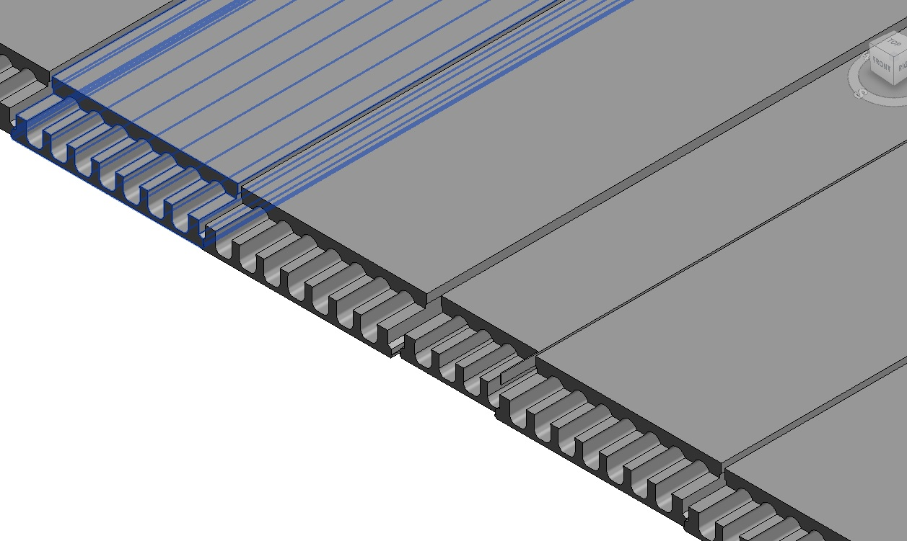
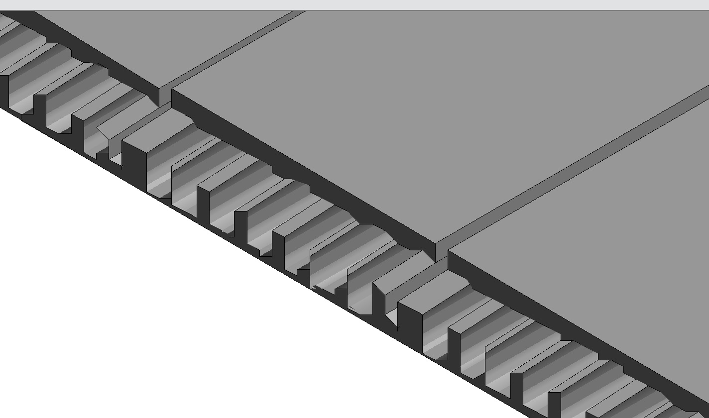
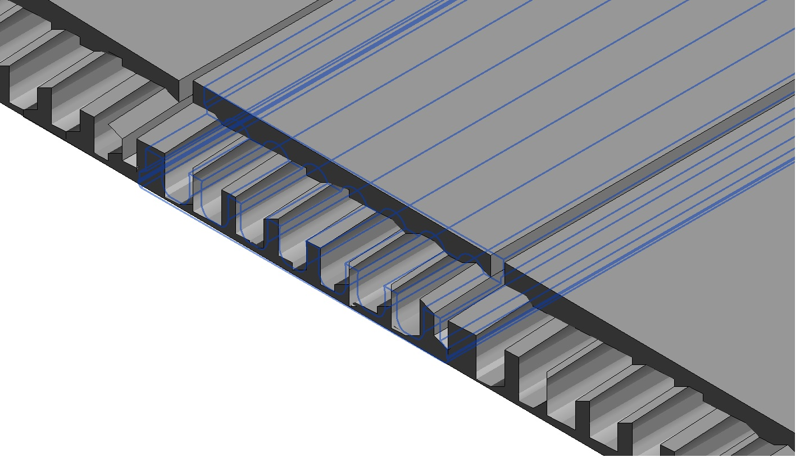

<head>
<meta http-equiv="Content-Type" content="text/html; charset=utf-8">
<link rel="stylesheet" type="text/css" href="bc.css">
<!--

-->

</head>

<!---

- 13559666 [Strange graphics in Revit 2016 from a plug-in working fine in 2015]
  REVIT-123143 [Strange graphics in Revit 2016 from a plug-in working fine in 2015 - case 13559666]
  avoid exorbitant coordinates
  https://en.wiktionary.org/wiki/exorbitant#English
  
Avoid exorbitant coordinates in #RevitAPI @AutodeskRevit #bim #dynamobim @AutodeskForge #ForgeDevCon http://bit.ly/exorbitantcoord

Slabs created by an add-in are displayed perfectly in Revit 2015.
In Revit 2016, they are not.
What can be the problem?
These slabs are located at an exorbitant distance from the origin.
Relocating them closer to the origin resolves the problem...

--->

### Avoid Exorbitant Coordinates

With help from the Revit API development team, my
colleague [Jim Jia](http://thebuildingcoder.typepad.com/blog/2017/11/cloud-model-predicate-and-set-parameter-regenerates.html#2) resolved an issue involving large coordinates beyond
the [20-mile limit](#2) that is important to be aware of:

**Question:** My program sets the parameters for a precast concrete slab family.

The family was created in Revit 2015 and all runs perfectly. 

The family has been upgraded to Revit 2016 and the plug in still runs fine. 

However, the slabs created in Revit 2016 look completely wrong.

Here is how they appear correctly in Revit 2015:

In Revit 2016, the slabs are displayed incorrectly and look like this:

If you hover the mouse over a slab in Revit 2016, the blue selection outline shows the correct slab geometry:

I tried two different Revit 2016 installations with different graphics cards and get the same problem.

I also tried Revit 2018 and get the same problem.

**Answer:** Is the slab possibly more than 20 miles from the origin?

Yes!

The instance locations I am getting from the input file are at:

<pre>
  X = ~355 miles
  Y = ~130 miles
</pre>

For testing, I added this line to the macro:

<pre class="code">
&nbsp;&nbsp;XYZ&nbsp;origin&nbsp;=&nbsp;new&nbsp;XYZ(&nbsp;slabDetail.OX&nbsp;/&nbsp;mmToFeetRatio,&nbsp;
&nbsp;&nbsp;&nbsp;&nbsp;slabDetail.OY&nbsp;/&nbsp;mmToFeetRatio,&nbsp;
&nbsp;&nbsp;&nbsp;&nbsp;slabDetail.OZ&nbsp;/&nbsp;mmToFeetRatio&nbsp;);
 
&nbsp;&nbsp;TaskDialog.Show(&nbsp;&quot;Instance&nbsp;location&quot;,&nbsp;origin.ToString()&nbsp;);
</pre>

This is where I see feet values of `>1.87` million for `X`.

These coordinates are truly [exorbitant](https://en.wiktionary.org/wiki/exorbitant#English)!

Revit expects geometry to be placed relatively near its origin.

If this is violated, graphical issues such as these can result.

Why did it work in Revit 2015?

No idea, but placing elements at these distances has never, ever, been a good idea.

**Response:** Wow, great!

I moved the family instances near to the origin and they are now created well.

####Why the Limit?

**Question:** David Veld asks [below](http://thebuildingcoder.typepad.com/blog/2017/11/avoid-exorbitant-coordinates.html#comment-3639729627): I've always wondered where this 20 mile limit comes from, from a coding-technical point of view. If Revit is written in native C++ and stores its coordinates in feet, as doubles, the limit should be 1.8 × 10^308 (right?) &ndash; this is waaaay beyond 20 miles. Or does this mean they are not and perhaps stored in another way?  

**Answer:** First of all, read about [demystifying floating point precision](https://blog.demofox.org/2017/11/21/floating-point-precision).
The precision is reduced the higher the number that is stored.

20 miles is 105600 feet. According to the table there, the precision is about 0.008 feet at that range for floats. This is about 0.2 cm, which is pretty close to Revit's built-in precision limit of about 1/16th of an inch that we repeatedly encountered in the past:

- [Think big in Revit](http://thebuildingcoder.typepad.com/blog/2009/07/think-big-in-revit.html)
- [DirectShape minimum size](http://thebuildingcoder.typepad.com/blog/2014/05/directshape-performance-and-minimum-size.html#3)

The Revit help clearly documents
the [maximum distance limit of 20 miles](https://knowledge.autodesk.com/support/revit-products/learn-explore/caas/CloudHelp/cloudhelp/2018/ENU/Revit-Model/files/GUID-3F79BF5A-F051-49F3-951E-D3E86F51BECC-htm.html).

It covers the projection of a plane onto a curved spherical surface, and also the double accuracy issue
that is probably causing the weird slabs.

**Response:** This makes sense and also raises more questions.

1. The shown calculations are based on 32bit floats; could it be that temporary upgrading to 64 bits environment Autodesk made coordinates 64 bit floats (thus showing Jim Jia's script working fine in 2015)? Then, later, when improving performance, they switched back to 32 bits? If this is possible could this be set as a variable setting (I'd love to be able to work beyond the 20-mile radius (with precision)).

2. Autodesk sets the precision of 1/16th of an inch for the ENTIRE 20-mile zone; however, this should only apply for the very far exorbitant areas of the circle. Doesn't this mean there is A LOT of potential precision in your normal range of let say 250 feet or so from the origin where most buildings would fit in?

3. Since we are talking about Cartesian coordinates (X & Y), should the zone be a square rather than a circle?

Food for thought, but Revit's (internal as well as shared) coordinate systems keeps surprising and confusing me.

**Answer:** Ours is not to wonder why; ours is but to do or die.

No answer to any of these questions is going to help you or affect your work in any way whatsoever.

I still find them interesting, of course, just as you and many others also.

It may well be that Revit uses floats internally. No idea.

Revit coordinates are not stored in floats.

However, even before precision issues actually cause full storage error as described in the article
on [demystifying floating point precision](https://blog.demofox.org/2017/11/21/floating-point-precision) mentioned
above, imprecision can affect double calculations, e.g., when is 10 not equal to 10? When you add 0.1 (double) 100 times and expect it to be exactly 10. It never is. These effects are exacerbated at higher orders of magnitude.

You cannot work beyond the 20-mile radius, and you cannot work below the 1/16th inch size, ca. 2mm.

That is a fact you have to accept.

That is why it is so clearly documented.

As always, you can work around it. Here is an example of doing so,
for [modelling small details](http://thebuildingcoder.typepad.com/blog/2016/02/modelling-small-details.html),
by importing a DWG file &ndash; however, please also be aware that it is in general recommended
to [avoid importing CAD into RFA](http://thebuildingcoder.typepad.com/blog/2016/09/avoid-cad-import-in-rfa-aag16-and-endtrip.html#2).

The recommendation to avoid exorbitant coordinates is not specific to Revit, by the way.

Almost all CAD systems behave weirdly at large distances from the origin.

AutoCAD used to be an exception, making use of doubles, as demonstrated by John Walkers planetary system sample way back then.

However, under certain circumstances, for certain workflows, this even applies to AutoCAD, I'm afraid.

I recommend getting into the habit of staying close to the origin always, for everything, and managing some kind of base point information to offset your design to wherever you really want it in the larger universe of things.
