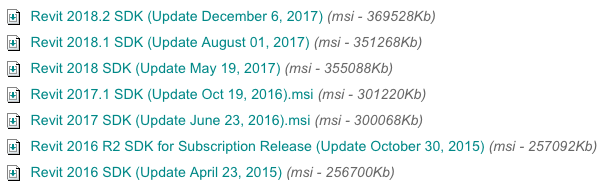

<head>
<meta http-equiv="Content-Type" content="text/html; charset=utf-8">
<link rel="stylesheet" type="text/css" href="bc.css">
<!--

-->

</head>

<!---

Revit 2018.2 @AutodeskRevit product, #RevitAPI and SDK update #bim #dynamobim @AutodeskForge #ForgeDevCon http://bit.ly/rvt2018_2

Let's discuss the Revit API enhancements added since the initial release of Revit 2018
&ndash; Revit 2018.2 Product Update and Resolved API Issues
&ndash; Revit 2018.2 SDK Update
&ndash; Major Additions to the Revit 2018.1 API
&ndash; Material API additions
&ndash; Geometry API additions
&ndash; BrowserOrganization API additions
&ndash; IFC additions
&ndash; Rebar API additions
&ndash; Major Additions to the Revit 2018.2 API
&ndash; Fabrication API additions...

--->

### What's New in the Revit 2018.2 API

Let's discuss the Revit API enhancements added since the initial release of Revit 2018.

Before getting to that, let me briefly mention the new AUGI material pointing
out [101 Best Practice Tips for Revit Model Management](https://issuu.com/iuidesign/docs/101_revit_tips-iftikhar_ismail), 
in case you are interested in such things.

- [Revit 2018.2 Product Update and Resolved API Issues](#2)
- [Revit 2018.2 SDK Update](#3)
- [What's New in Previous Versions](#4)
- [Major Additions to the Revit 2018.1 API](#5)
    - [Material API additions](#5.1)
        - [Editing the properties of an Appearance Asset](#5.1.1)
        - [Editing AssetProperty values](#5.1.2)
        - [Connected Assets](#5.1.3)
        - [Validation](#5.1.4)
        - [Schemas & Property Names](#5.1.5)
        - [Utilities](#5.1.6)
    - [Geometry API additions](#5.2)
        - [Surface API additions](#5.2.1)
        - [Curve API additions](#5.2.2)
    - [BrowserOrganization API additions](#5.3)
    - [IFC additions](#5.4)
    - [Rebar API additions](#5.5)
        - [BarTypeDiameterOptions](#5.5.1)
        - [GetDistributionPath()](#5.5.2)
        - [RebarUpdateCurvesData](#5.5.3)
- [Major Additions to the Revit 2018.2 API](#6)
    - [Fabrication API additions](#6.1)
        - [FabricationNetworkChangeService](#6.1.1)
        - [FabricationNetworkChangeServiceResult](#6.1.2)
        - [FabricationPartSizeMap](#6.1.3)
    - [Other API additions](#6.2)
        - [RevitLinkType API addition](#6.2.1)

####Revit 2018.2 Product Update and Resolved API Issues

I installed the Revit 2018.2 product update last week from
the [Autodesk Revit 2018 Product Updates](https://knowledge.autodesk.com/support/revit-products/downloads/caas/downloads/content/autodesk-revit-2018-product-updates.html?v=2018).

In the process, I checked out
the [release notes](http://revit.downloads.autodesk.com/download/2018_2_RVT/Docs/RelNotes/Autodesk_Revit_2018_2_ReleaseNotes.html) to
analyse what API issues have been addressed in the various 2018 updates, and extracted the following list of *reported issues resolved within Revit 2018*:

- 2018.0.2 Hot Fix &ndash; API:
    - Improved stability when using the API to print or export from modal dialogs.
- 2018.2 Update &ndash; Resolved Issues &ndash; API:
    - Enabled the FabricationPart.GeometryChecksum property to simplify the checking of fabrication part geometry.
    - Fixed an issue so that the crop box is correctly set using the API.
    - Improved stability when placing a wall-hosted family on a ceiling through Dynamo.
- 2018.1.1 Hot Fix &ndash; API:
    - Fixed an issue so that the extents of a crop box are correctly set using the API.
- 2018.1 Update &ndash; Improvements
    - Integrated Materials API.
- 2018.0.2 Hot Fix &ndash; API:
    - Improved stability when using the API to print or export from modal dialogs.

As we shall see below, a number of other enhancements have also been added.

####Revit 2018.2 SDK Update

Next, I visited 
the [Revit Developer Centre](http://www.autodesk.com/developrevit) to 
download and install
the [Revit 2018.2 SDK (Update December 6, 2017)](http://download.autodesk.com/us/revit-sdk/REVIT_2018_2_SDK.msi) (msi &ndash; 369528Kb).

As far as I can tell, it has no differences at all to the previous version in the `Samples` collection.

The only changes I see affect the help file and *changes and additions* document.

<pre>
C:\a\lib\revit>dir 2018.1\SDK
27/07/17  14:21      53'781 Revit Platform API Changes and Additions.docx
27/07/17  17:02  48'063'436 RevitAPI.chm

C:\a\lib\revit>dir 2018.2\SDK
05/12/17  13:31      55'881 Revit Platform API Changes and Additions.docx
05/12/17  15:05  48'155'903 RevitAPI.chm
</pre>

Studying those in more depth, I do notice significant enhancements.

I also notice that I did not document the updates listed in the corresponding *changes and additions* document for Revit 2018.1.

So here goes:

#### What's New in Previous Versions

Here are links to discussions of *What's New in the Revit API* for previous versions:

- [What's New in the Revit 2010 API](http://thebuildingcoder.typepad.com/blog/2013/02/whats-new-in-the-revit-2010-api.html)
- [What's New in the Revit 2011 API](http://thebuildingcoder.typepad.com/blog/2013/02/whats-new-in-the-revit-2011-api.html)
- [What's New in the Revit 2012 API](http://thebuildingcoder.typepad.com/blog/2013/02/whats-new-in-the-revit-2012-api.html)
- [What's New in the Revit 2013 API](http://thebuildingcoder.typepad.com/blog/2013/03/whats-new-in-the-revit-2013-api.html)
- [What's New in the Revit 2014 API](http://thebuildingcoder.typepad.com/blog/2013/04/whats-new-in-the-revit-2014-api.html)
- [What's New in the Revit 2015 API](http://thebuildingcoder.typepad.com/blog/2014/04/whats-new-in-the-revit-2015-api.html)
- [What's New in the Revit 2016 API](http://thebuildingcoder.typepad.com/blog/2015/04/whats-new-in-the-revit-2016-api.html)
- [What's New in the Revit 2017 API](http://thebuildingcoder.typepad.com/blog/2016/04/whats-new-in-the-revit-2017-api.html)
- [What's New in the Revit 2017.1 API](http://thebuildingcoder.typepad.com/blog/2016/11/whats-new-in-the-revit-20171-api.html)
- [What's New in the Revit 2018 API](http://thebuildingcoder.typepad.com/blog/2017/04/whats-new-in-the-revit-2018-api.html)
- [Revit 2018.1 and the Visual Materials API](http://thebuildingcoder.typepad.com/blog/2017/08/revit-20181-and-the-visual-materials-api.html)
- [Revit 2018.1.1 and 2018.1 API Docs Online](http://thebuildingcoder.typepad.com/blog/2017/09/revit-201811-fixes-cropbox-setting.html)
- [Revit 2018.1 Visual Materials API](http://thebuildingcoder.typepad.com/blog/2017/11/modifying-material-visual-appearance.html)

<h3 style="font-weight: bold">Major Additions to the Revit 2018.1 API</h3>

###Material API additions

####Editing the properties of an Appearance Asset

New Revit API capabilities have been introduced to edit the properties contained in an appearance asset of a material. These properties appear in the Appearance tab of the Materials dialog and govern the appearance of the material in realistic views and rendering.

Editing the properties in an appearance Asset requires establishment of an edit scope. The new class

- Autodesk.Revit.DB.Visual.AppearanceAssetEditScope

allows an application to create and maintain an editing session for an appearance asset. The scope provides access to an editable Asset object whose properties may be changed. Once all of the desired changes have been made to the asset's properties, the edit scope should be committed, which causes the changes to be sent back into the document. (This is the only part of the process when a transaction must be opened).

The new class has the following methods:

- AppearanceAssetEditScope.Start() &ndash; Starts the edit scope for the asset contained in a particular AppearanceAssetElement. The editable Asset is returned from this method.
- AppearanceAssetEditScope.Commit() &ndash; Finishes the edit scope: all changes made during the edit scope will be committed. Provides an option to forces the update of all open views.
- AppearanceAssetEditScope.Cancel() &ndash; Cancels the edit scope and discards any changes.

####Editing AssetProperty values

The following properties are now writeable from within an AppearanceAssetEditScope, to support modification of an asset property's stored value:

- AssetPropertyString.Value
- AssetPropertyBoolean.Value
- AssetPropertyString.Value
- AssetPropertyInteger.Value
- AssetPropertyDouble.Value
- AssetPropertyFloat.Value
- AssetPropertyEnum.Value
- AssetPropertyDistance.Value

In addition, the following new methods have been added to support modification of property values:

- AssetPropertyDouble3.SetValueAsXYZ()
- AssetPropertyDouble4.SetValueAsDoubles()
- AssetPropertyDouble4.SetValueAsColor()

AssetPropertyList now has new methods to allow changes to the members of the list:

- AssetPropertyList.AddNewAssetPropertyDouble()
- AssetPropertyList.InsertNewAssetPropertyDouble()
- AssetPropertyList.AddNewAssetAsColor()
- AssetPropertyList.InsertNewAssetAsColor()
- AssetPropertyList.AddNewAssetPropertyInteger()
- AssetPropertyList.InsertNewAssetPropertyInteger()
- AssetPropertyList.RemoveAssetProperty()

####Connected Assets

Connected assets are associated to properties in appearance assets, and represent subordinate objects encapsulating a collection of related properties. One example of a connected asset is the "Unified Bitmap" representing an image and its mapping parameters and values. AssetProperty offers new methods to provide the ability to modify, add or delete the asset connected to a property:

- AssetProperty.GetSingleConnectedAsset() &ndash; Gets the single connected asset of this property.
- AssetProperty.RemoveConnectedAsset() &ndash; Removes the single connected asset of this property.
- AssetProperty.AddConnectedAsset (String schemaId) &ndash; Create a new default asset of schema type and connects it to this property.
- AssetProperty.AddCopyAsConnectedAsset() &ndash; Connects the property to a copy of the asset.

####Validation

Inputs to change the value of asset properties are validated against the requirements of the associated schema. 

The new methods:

- AssetPropertyString.IsValidValue(String)
- AssetPropertyInteger.IsValidValue (int)
- AssetPropertyEnum.IsValidValue (int)
- AssetPropertyDouble.IsValidValue (double)
- AssetPropertyFloat.IsValidValue (float)
- AssetPropertyDistance.IsValidValue (double)
- AssetPropertyDouble3.IsValidValue (XYZ)
- AssetPropertyDouble4.IsValidValue (IList&lt;double&gt;)
- AssetPropertyDouble4.IsValidValue (Color)

identify if the input value is a valid value that can be set to the given asset property.

The new method: 

- AssetProperty.IsEditable()

identifies whether the AssetProperty can currently be edited.

####Schemas & Property Names

Appearance asset properties are aligned with specific schemas. Each schema contains necessary properties which define how the appearance of the material will be generated. There are 14 standard material schemas:

- Ceramic
- Concrete
- Generic
- Glazing
- Hardwood
- MasonryCMU
- Metal
- MetallicPaint
- Mirror
- PlasticVinyl
- SolidGlass
- Stone
- WallPaint
- Water

In addition, there are 5 schemas representing "advanced" materials &ndash; these may be encountered as a result of import from other Autodesk products:

- AdvancedLayered
- AdvancedMetal
- AdvancedOpaque
- AdvancedTransparent
- AdvancedWood

Finally, there are 10 schemas used for the aspects of the connected assets:

- BumpMap
- Checker
- Gradient
- Marble
- Noise
- Speckle
- Tile
- UnifiedBitmap
- Wave
- Wood

The new method:

- AssetProperty.IsValidSchemaIdentifier(String schemaName)

identifies if the input name is a valid name for a supported schema.

To assist in creating code accessing and manipulating the properties of a given schema, predefined properties have been introduced to allow a compile-time reference to a property name without requiring you to transcribe it as a string in your code. These predefined property names are available in static classes named similar to the schema names, above, e.g. Autodesk.Revit.DB.Visual.Ceramic.

####Utilities

The new method:

- Application.GetAssets(AssetType)

returns a list of assets available to the session.

The new method: 

- AppearanceAssetElement.Duplicate()

creates a copy of an appearance asset element and the asset contained by it.

The new operator: 

- Asset.operator[]

accesses a particular AssetProperty associated to the given asset. 

###Geometry API additions

####Surface API additions

Two new methods allow projecting a point onto a surface:

- Surface.Project() &ndash; Projects a 3D point orthogonally onto a surface (to find the nearest point).
- Surface.ProjectWithGuessPoint() &ndash; Projects a 3D point orthogonally onto a surface (to find the nearest point). This method is meant to be used when a good approximate solution for the projection is available.

####Curve API additions

The new class:

- ClosestPointsPairBetweenTwoCurves

captures the results of computation of closest points between two generic curves.

It has the following properties:

- ClosestPointsPairBetweenTwoCurves.XYZPointOnFirstCurve &ndash; The point on the first curve in 3d coordinates.
- ClosestPointsPairBetweenTwoCurves.XYZPointOnSecondCurve &ndash; The point on the second curve in 3d coordinates.
- ClosestPointsPairBetweenTwoCurves.ParameterOnFirstCurve &ndash; 1d raw (not normalized) parameter of the point on first curve.
- ClosestPointsPairBetweenTwoCurves.ParameterOnSecondCurve &ndash; 1d raw (not normalized) parameter of the point on second curve.
- ClosestPointsPairBetweenTwoCurves.Distance &ndash; Distance (as a double) from the point on the first curve to the point on the second curve.

The new Curve method:

- Curve.ComputeClosestPoints()

outputs a list of closest points between two generic curves using ClosestPointsPairBetweenTwoCurves.

###BrowserOrganization API additions

The new enumerated value: 

- BrowserOrganizationType.Schedules 

corresponds to the type of the browser organization definition for schedules. 

The new method:

- BrowserOrganization.GetCurrentBrowserOrganizationForSchedules() 

gets the BrowserOrganization that applies to the Schedules section of the project browser.

###IFC additions

The new functions:

- IFCImportOptions.GetExtraOptions()
- IFCImportOptions.SetExtraOptions()

allow for passing in arbitrary options for custom IFC importers. Users can pass in a string to string map specifying extra data they wish to pass for IFC import.

###Rebar API additions

####BarTypeDiameterOptions

The new options class:

- BarTypeDiameterOptions

allows creation of a new set of diameter values for a RebarBarType. It can be used when copying the diameter information as a bulk of data from one RebarBarType to another.

The diameter options can be set for a RebarBarType with the new method:

- Autodesk.Revit.DB.Structure.RebarBarType.setBarTypeDiameters 

which sets all input diameters from the input BarTypeDiameterOptions in the current RebarBarType.

####GetDistributionPath()

The new method:

- Autodesk.Revit.DB.Structure.RebarHandlePositionData.GetDistributionPath()

gets the distribution path currently stored in the rebar.

For a free form rebar set the distance between two consecutive bars may be different if it is calculated between different points on bars. The distribution path is an array of curves with the property that based on these curves the set was calculated to respect the layout rule and number of bars or spacing.

####RebarUpdateCurvesData

Several new properties have been added to Autodesk.Revit.DB.Structure.RebarUpdateCurvesData:

- Autodesk.Revit.DB.Structure.RebarUpdateCurvesData.HostMirrored &ndash; If true, then host of the rebar was mirrored (along with the rebar) before the most recent regeneration.
- Autodesk.Revit.DB.Structure.RebarUpdateCurvesData.IsReversed &ndash; Used to store the state of the bar referring to the direction of the bars. This is useful when using face intersection to calculate bars. After mirroring, curves created from intersecting faces may be reversed, so we use this to store the state and keep the rebar pointing in the correct direction.
- Autodesk.Revit.DB.Structure.RebarUpdateCurvesData.ErrorMessage &ndash; The reason for calculation failure. If the calculation fails, this message will be shown in an error, or warning if we are editing the constraints.

<h3 style="font-weight: bold">Major Additions to the Revit 2018.2 API</h3>

###Fabrication API additions

New APIs have been added to change the service or size of a selection of fabrication parts. 

####FabricationNetworkChangeService

The new class:

- Autodesk.Revit.DB.Fabrication.FabricationNetworkChangeService 

exposes the ability to change the service or size of a selection of fabrication parts.

It has the following methods:

- FabricationNetworkChangeService.Create() &ndash; Creates a new instance of a fabrication change service.
- FabricationNetworkChangeService.ChangeService() &ndash; Changes the service of a selection of element identifiers to the passed in service and group identifiers.
- FabricationNetworkChangeService.ChangeSize() &ndash; Changes the size of a selection of element identifiers to the passed in map of sizes.
- FabricationNetworkChangeService.SetSelection() &ndash; The set of element identifiers of fabrication parts to change the service or size for.
- FabricationNetworkChangeService.SetServiceId() &ndash; Sets the fabrication service identifier to change the elements to.
- FabricationNetworkChangeService.SetGroupId() &ndash; Sets the fabrication group identifier to change the elements to.
- FabricationNetworkChangeService.GetInLinePartTypes() &ndash; Gets a set of element identifiers of fabrication part types for in-line parts.
- FabricationNetworkChangeService.SetMapOfInLinePartTypes() &ndash; Sets the mapping of fabrication part types for in-line parts for the service and group to change to.
- FabricationNetworkChangeService.GetMapOfAllSizesForStraights() &ndash; Gets a set of FabricationPartSizeMapSet of all straight sizes for all services.
- FabricationNetworkChangeService.SetMapOfSizesForStraights() &ndash; Sets the mapping for sizes of fabrication part straights to change the sizes to.
- FabricationNetworkChangeService.Apply() &ndash; Applies the previously set changes to the selection of fabrication parts to change the size, change the service, or both.
- FabricationNetworkChangeService.GetElementsThatFailed() &ndash; Gets the set of fabrication parts that had failures. Possible reasons are: there was no corresponding part in the service, the size was out of range, or a connection could not be made.
- FabricationNetworkChangeService.GetStraightsThatWereNotChanged() &ndash; Gets the set of fabrication part straights that were not changed. Possible reasons are: there was no corresponding part in the service, or the size was out of range.

####FabricationNetworkChangeServiceResult

The new enum:

- Autodesk.Revit.DB.Fabrication.FabricationNetworkChangeServiceResult

provides a result status from applying changes to the service or size of fabrication parts.

It has the following values:

- Success &ndash; The change was successful.
- PartialFailure &ndash; The change contained partial failures and will need to be fixed manually.
- UserAborted &ndash; The change was aborted by the user.
- InvalidSelection &ndash; The selection of fabrication parts was invalid.

####FabricationPartSizeMap

The new class:

- Autodesk.Revit.DB.Fabrication.FabricationPartSizeMap

represents the fabrication part size map for straights. This class allows is an input to several functions of FabricationNetworkServiceChange, and allows multiple straights of different sizes to be changed at once. 

It has the following properties:

- FabricationPartSizeMap.WidthDiameter &ndash; Gets or sets the width or diameter of the straight
- FabricationPartSizeMap.Depth &ndash; Gets or sets the depth of the straight.
- FabricationPartSizeMap.IsProductList &ndash; Gets or sets whether the sizes are for a product listed fabrication part.
- FabricationPartSizeMap.ProfileType &ndash; Gets or sets the shape of the straight.
- FabricationPartSizeMap.ServiceId &ndash; Gets or sets the service identifier of the straight.
- FabricationPartSizeMap.GroupId &ndash; Gets or sets the group identifier of the straight.
- FabricationPartSizeMap.MappedWidthDiameter &ndash; Gets or sets the mapped width or diameter of the straight.
- FabricationPartSizeMap.MappedDepth &ndash; Gets or sets the mapped depth of the straight.
- FabricationPartSizeMap.IsMappedProductList &ndash; Gets or sets whether the mapped sizes are for a product listed fabrication part.
- FabricationPartSizeMap.MappedProfileType &ndash; Gets or sets the mapped shape of the straight.
- FabricationPartSizeMap.MappedServiceId &ndash; Gets or sets the mapped service identifier of the straight.
- FabricationPartSizeMap.AllowMultipleServiceSizes &ndash; Gets or sets the state flag to allow multiple services to include the same size.

####Other API additions

####RevitLinkType API addition

The new method:

- RevitLinkType.GetLinkedFileStatus()

returns the LinkedFileStatus enum value indicating the link's load status (loaded, unloaded, missing, etc.). This function returns the same value as ExternalFileReference.GetLinkedFileStatus() but can be called on Collaboration for Revit links. 

