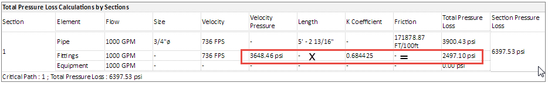
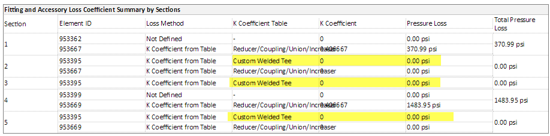
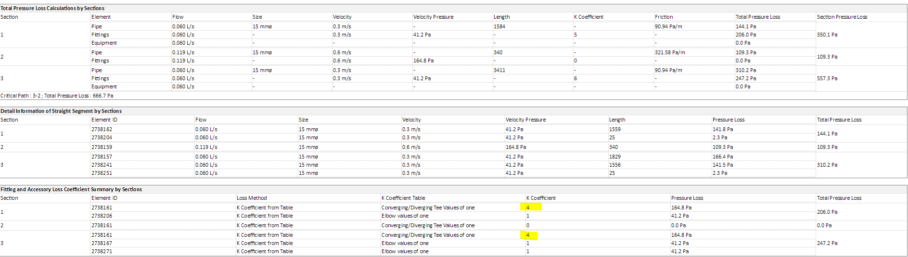
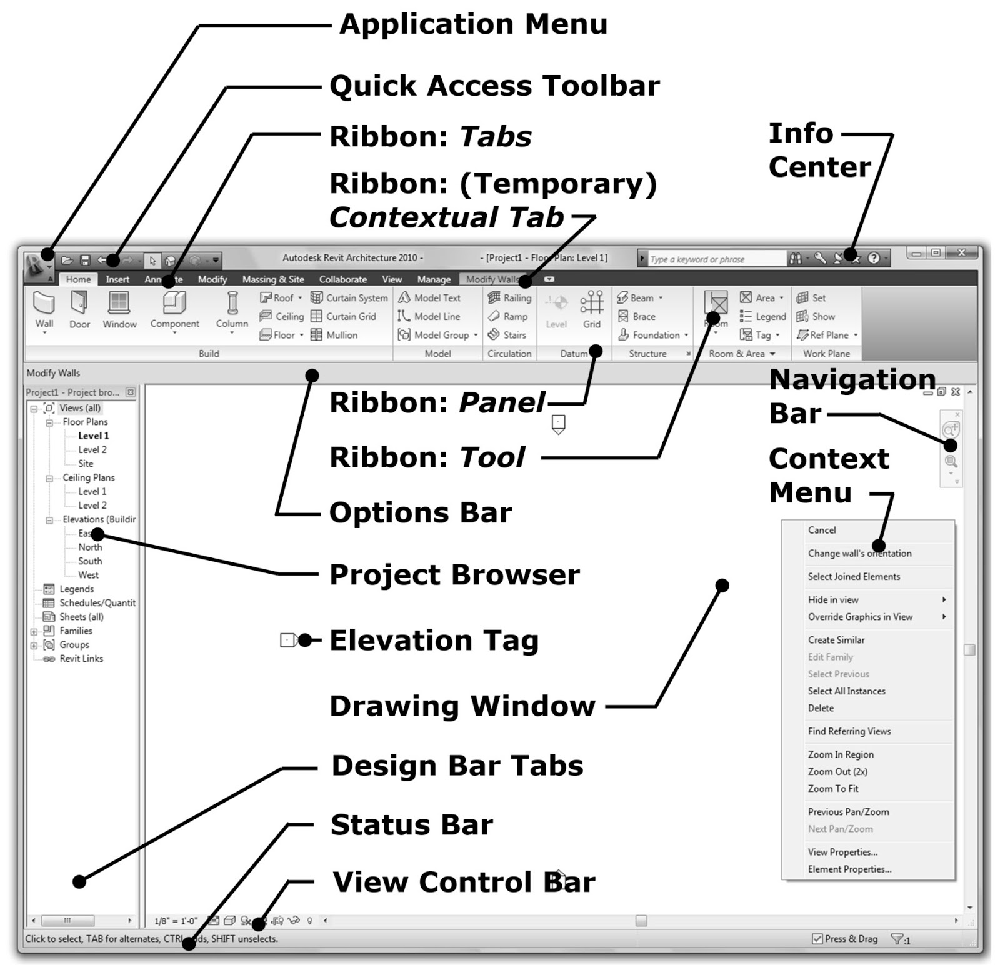

<head>
<meta http-equiv="Content-Type" content="text/html; charset=utf-8">
<link rel="stylesheet" type="text/css" href="bc.css">
<!--

-->

</head>

<!---

- 11843337 [PipeKfactor table]

- 11843886 [Custom K factor calculation for pipe fittings.]
  http://forums.autodesk.com/t5/revit-mep/custom-k-factor-calculation-for-pipe-fittings/m-p/6350133

- [Forge DevCon 2017 class recordings now available](https://forge.autodesk.com/blog/forge-devcon-2017-class-recordings-now-available?linkId=45816608)
Recordings of the presentations from Forge DevCon 2017 in Las Vegas are now available on the AU Online website. The recording library should include every class presented on Monday and most of the joint DevCon/AU classes presented on Tuesday, and can be watched online or downloaded. Many recordings are accompanied by additional downloadable material, such as handouts, slide decks and sample code. Thank you to all the speakers who contributed their expertise to make this Forge DevCon successful, and to fill this great knowledge repository.
This link takes you to a list of all the classes tagged as Forge DevCon Las Vegas 2017 - 
http://au.autodesk.com/au-online/classes-on-demand/search?full-text=DevCon&productName=&language=&year=2017&conference=Las+Vegas
You'll notice this library includes recordings for the Forge DevCon keynotes, but we recommend you watch the alternative (and better) recordings for those at https://forge.autodesk.com/devcon-2017#keynotes.
Enjoy!

- http://archi-lab.net/
  http://archi-lab.net/create-your-own-tab-and-buttons-in-revit/
  https://forums.autodesk.com/t5/revit-api-forum/api-to-make-installer-and-install-to-revit/m-p/7616236

Pipe Fitting K Factor, archi+lab blog and #RevitAPI add-in installer @AutodeskRevit #bim #dynamobim @AutodeskForge #ForgeDevCon http://bit.ly/pipekfactor

Two recent Revit MEP related cases brought up some new information on the pipe <code>K</code> factor table and custom calculations for pipe fittings, the Forge DevCon class recordings are now available, and I discovered Konrad Sobon's wonderful archi+lab Revit API blog, which helps resolve an installation and setup issue
&ndash; Pipe <code>K</code> factor table
&ndash; Custom <code>K</code> factor calculation for pipe fittings
&ndash; Dynamo code to change loss coefficient
&ndash; Forge DevCon 2017 class recordings
&ndash; Archi+Lab
&ndash; Revit add-in installer and buttons...

--->

### Pipe Fitting K Factor, Archi+Lab and Installer

Two recent Revit MEP related cases brought up some new information on the pipe `K` factor table and custom `K` factor calculation for pipe fittings.

Furthermore, the Forge DevCon class recordings are now available, and I discovered Konrad Sobon's
wonderful [archi+lab](http://archi-lab.net) Revit
API blog, which helps resolve an installation and setup issue:

- [Pipe `K` factor table](#2)
- [Custom `K` factor calculation for pipe fittings](#3)
- [Dynamo code to change loss coefficient](#4)
- [Forge DevCon 2017 class recordings](#5)
- [Archi+Lab](#6)
- [Revit add-in installer and buttons](#7)

####Pipe K Factor Table

**Question:** I know that Revit calculates the pressure loss for the fittings and some pipe accessories with the factors that are defined in the file `pipekfactor.xml`.

However, I do not know what formulas are actually user for the calculations. The mysterious numbers don't tell much.

Could you clarify which formulas are used for the calculation of the pressure loss or where this information is available, please?

Here are some fractions from `pipekfactors.xml`:

<pre class="prettyprint">
&lt;SubTable Dimensions="1" Number="3" Result="K"&gt;
&lt;SubTableData1D X="Theta"&gt;&lt;XAxis&gt;0 10 20 30 40 50 60 70 80 90 100 110 120 130 140 150 160 170 180&lt;/XAxis&gt;
&lt;Data&gt; 0.0 0.18 0.4 0.675 0.9 1.05 1.1 1.125 1.1 1.075 1.06 1.05 1.045 1.035 1.025 1.015 1.01 1.005 1.0 &lt;/Data&gt;
&lt;/SubTableData1D&gt;

&lt;SubTable Dimensions="0" Number="4" Result="K" DataUsage="UseLargePipeVelocity"&gt;
&lt;SubTableData Coefficient="Equation 2-27"/&gt;
&lt;Formula&gt;D1 &gt; D2 && Theta &gt; 45 && Theta &lt;= 180&lt;/Formula&gt;
&lt;/SubTable&gt;
&lt;Formula&gt;D1 &lt; D2 && Theta &lt; 180&lt;/Formula&gt;
&lt;/SubTable&gt;
</pre>

**Answer:** The Revit UI provides a lot of detail on these calculations if you navigate to
 
- Manage &gt; MEP Settings &gt; Mechanical Settings &gt; Pipe Settings &gt; Calculation
 
Additional information is provided in the Revit product help pages
on [Hydronic Pipe Sizing and Calculation Methods](http://help.autodesk.com/view/RVT/2017/ENU/?guid=GUID-7D4BF4BC-89DF-4EB2-93EB-52900B8583B5).
 
In general, the loss on a fitting is the velocity pressure multiplied by the loss coefficient. This can be confirmed in the pressure loss report:

####Custom K Factor Calculation for Pipe Fittings

A related question was raised by Js1900 and Jared in
the [Revit API discussion forum](http://forums.autodesk.com/t5/revit-api-forum/bd-p/160) thread 
on [custom `K` factor calculation for pipe fittings](http://forums.autodesk.com/t5/revit-mep/custom-k-factor-calculation-for-pipe-fittings/m-p/6350133):

**Question:** We have a requirement to use our own numbers for the K factor calculation for pipe fittings.
 
This could be done through the API by implementing the `IPipeFittingAndAccessoryPressureDropServer` interface, but it seems like it could be simpler to just add an entry to
the file `PipeKFactors.xml`:

- C:\Program Files\Autodesk\Revit 201x\PipeKFactors.xml

It looks to be a simple enough for elbows; we can just create a new table in the xml with the diameters and coefficients we need, and Revit will use it to get our value.
 
However, for Tees, the table is more complex and Revit seems to be doing more behind the scenes. For example, we can put our coefficients in, but Revit seems to output a number 4 times larger than expected every time. It gets even more complex for the table *Converging/Diverging Tee/Wye*, which seems to have no numbers in the xml and instead references equations defined elsewhere.
 
Does anyone have any insight into the algorithm used on these tables so we can be sure we can get the right values? Or have an idea why our edits to the Tee coefficients (*Custom Welded Tee* in the [attached xml pipe_k_factors.xml](zip/pipe_k_factors.xml)) result in in Revit giving a factor 4 times greater when we inspect it through the pressure loss report?

**Answer:** For the '4x greater' case of the custom tee, we tried to reproduce and were unable to do so.
 
I had a different problem with it altogether, namely, no friction factor was found in the table at all (see image below).
 
What would be helpful in this case is to get a sample model demonstrating this issue. In some cases, the family and/or its instance parameters are defined in such a way that factors are applied multiple times, so it may not necessarily be the XML at issue.
 
Can you provide details of where you are getting your data from for your ‘Custom Welded Tee’? E.g., do you have table(s) of data you can provide for the various conditions through the tee?
 
It looks like you are trying to input the 'Custom Welded Tee' data in a format similar to the 'Converging/Diverging/Side Tee' in the default .xml file. Can you confirm that? Any details of what exactly was changed would probably be helpful as well.

 
Converging/Diverging Tee/Wye is implemented in code, as it is not based on simple tabular data. It is based on the method in the Crane Technical Paper 410.

**Response:** We had looked through those calculations in Revit help which are well explained for pipes.

However, for fittings, it simply says you can choose a `K` Coefficient from table, without really saying how it gets the number.
 
You are right; 'Custom Tee' in our xml is simply the 'Converging/Diverging/Side Tee' table copied. Then we modified XAxis values, which appear to be diameter ratios, to be 2 numbers far apart. This was to cover all diameter values. We repeated data for these X values to avoid Revit interpolating between them (We only want this to cover equal tees, so perhaps we could have just had a single X value of 1.0?)

Then we just put the K coefficients we wanted in the data element, mapped to the flow ratio.
 
This was all based on guesswork and some testing, and it does appear the logic makes sense, apart from the factor of 4!
 
I have attached the data we are trying to get Revit to use for Tee coefficients, a basic test model and test PipeKFactors.xml
in [custom_tee_test.zip](zip/custom_tee_test.zip).

The XML includes a Tee table with the data we want to use/4, along with some test tables containing only values of 1. Replacing the default PipeKFactors.xml and running a pressure loss report gives this result:

 
We have just been using guesswork and experimentation to get this far in modifying the xml, but it does seem like we can get useful results, so appreciate any insight!
 
####Dynamo Code to Change Loss Coefficient

Hugh Compton adds:

> The attached Dynamo code
in [BV Change Coefficient Loss Fitting Pipes.dyn](zip/bv_change_coefficient_loss_fitting_pipes.dyn) can
change those values.
If the Loss Method is NOT 'Specific Coefficient' on the element, then the first run will fail, but the second run will work. 

Here are the main functions extracted from the Dynamo code, in case you prefer reading it in-line:

<pre class="prettyprint">
def getServerById(serverGUID, serviceId):
  service = ExternalServiceRegistry.GetService(serviceId)
  if service != "null" and serverGUID != "null":
    server = service.GetServer(serverGUID)
    if server != "null":
      return server
  return null

def getLossMethods(serviceId):
  service = ExternalServiceRegistry.GetService(serviceId)
  serverIds = service.GetRegisteredServerIds()
  list=List[ElementId]()
  for serverId in serverIds:
    server = getServerById(serverId, serviceId)
    
    id=serverId
    name=server.GetName()
    lc.append(id)
    lc.append(name)
    lc.append(server)
    
  return lc

# Set Coefficient?

  TransactionManager.Instance.EnsureInTransaction(doc)
  param = fitting.get_Parameter(BuiltInParameter.RBS_PIPE_FITTING_LOSS_METHOD_SERVER_PARAM)
  lc = getLossMethods(ExternalServices.BuiltInExternalServices.PipeFittingAndAccessoryPressureDropService)
  schema = lc[8].GetDataSchema()
  field = schema.GetField("Coefficient")
  entity=fitting.GetEntity(schema)
    
  param.Set(lc[6].ToString()) 
  TransactionManager.Instance.TransactionTaskDone()

# Set K Factor?

  fitting = doc.GetElement(eleId)
  param = fitting.get_Parameter(BuiltInParameter.RBS_PIPE_FITTING_LOSS_METHOD_SERVER_PARAM)
  lc = getLossMethods(ExternalServices.BuiltInExternalServices.PipeFittingAndAccessoryPressureDropService)
  schema = lc[8].GetDataSchema()
  field = schema.GetField("KFactor")
  entity=fitting.GetEntity(schema)
     
  oldval = entity.Get[field.ValueType](field) # obtaining values
  
  TransactionManager.Instance.EnsureInTransaction(doc)
  entity.Set[field.ValueType](field, SetNew) # installation of a new coefficient value of certain
  fitting.SetEntity(entity)
  TransactionManager.Instance.TransactionTaskDone()
</pre>

Many thanks to Hugh for sharing this!

####Forge DevCon 2017 Class Recordings

The [Forge DevCon 2017 class recordings are now available](https://forge.autodesk.com/blog/forge-devcon-2017-class-recordings-now-available?linkId=45816608).

Recordings of the presentations from Forge DevCon 2017 in Las Vegas are now available on
the [AU Online website](http://au.autodesk.com/au-online).

The recording library include every class presented on Monday and most of the joint DevCon/AU classes presented on Tuesday; they can be watched online or downloaded.

Many recordings are accompanied by additional downloadable material, such as handouts, slide decks and sample code.

This link takes you to a list of [all classes tagged as Forge DevCon Las Vegas 2017](http://au.autodesk.com/au-online/classes-on-demand/search?full-text=DevCon&year=2017&conference=Las+Vegas).

You'll notice this library also includes recordings for the Forge DevCon keynotes. Please watch the alternative (and better) recordings for those
at [forge.autodesk.com/devcon-2017#keynotes](https://forge.autodesk.com/devcon-2017#keynotes) instead.

Enjoy!

####Archi+Lab

The intro already said it all:

Konrad Sobon publishes a wonderful blog on the Revit API, [archi+lab](http://archi-lab.net).

Here are some of the recent posts:

- [How to maintain Revit plug-ins for multiple versions](http://archi-lab.net/how-to-maintain-revit-plug-ins-for-multiple-versions)
- [Code signing of your Revit plug-ins](http://archi-lab.net/code-signing-of-your-revit-plug-ins/)
- [Printing PDFs from Revit](http://archi-lab.net/printing-pdfs-from-revit-why-is-it-so-hard/)

Thank you very much, Konrad, for this great resource!

I searched unsuccessfully for an easy way to list all the posts... maybe Konrad can provide one.

For The Building Coder, for example, you can simply go to
the [tbc GitHub repository](https://github.com/jeremytammik/tbc) and look at
the [GitHub pages view of `index.html`](http://jeremytammik.github.io/tbc/a).

####Revit Add-in Installer and Buttons

I only noticed Konrad's blog thanks to [MarryTookMyCoffe](https://forums.autodesk.com/t5/user/viewprofilepage/user-id/3894260)'s answer to 
the [Revit API discussion forum](http://forums.autodesk.com/t5/revit-api-forum/bd-p/160) thread 
on [API to make installer and install to Revit](https://forums.autodesk.com/t5/revit-api-forum/api-to-make-installer-and-install-to-revit/m-p/7616236):

**Question:** Recently I finished my add-in coding using VS2013 and Revit 2016.

Now I want to deploy and create an installer; how can I do that?

Some mention WIX and Innosetup, also some blogs mention to use oneclick to make the installer.
 
I managed to create an installer, but I have a problem after installing the add in: nothing happens.

I copied the add-in file to the correct Revit location and ensured the path to reference my .DLL is correct.
 
Revit now recognises my add in. It displays the correct name in the ribbon. but the panel doesn't display anything and remains totally blank.
 
I'm not sure what exactly I missed out. Can somebody give me a hint which areas in VS I need to check? Is there a blog I can read on how to correctly deploy a Revit add-in?
 
**Answer:** The [Revit API getting started material](http://thebuildingcoder.typepad.com/blog/about-the-author.html#2) includes
all the information you require on the add-in architecture and installation basics.
  
For a totally comprehensive and complete summary of the relevant information, you can also jump straight to 
the [developer guide section on add-in installation](http://help.autodesk.com/view/RVT/2018/ENU/?guid=GUID-4BE74935-A15C-4536-BD9C-7778766CE392).

It does not cover the implementation of an installer or setup application, though.
 
For a sample of a very complete and professional working single-click setup installer, you might want to check out
the [RevitPythonShell](https://github.com/architecture-building-systems/revitpythonshell).
 
If your installer is working but the add-in ribbon panel is empty, you may have forgotten to add a button to it.

Here is a link to a good explanation
by [archi+lab](http://archi-lab.net) on how
to [create your own tab and buttons in Revit](http://archi-lab.net/create-your-own-tab-and-buttons-in-revit).

