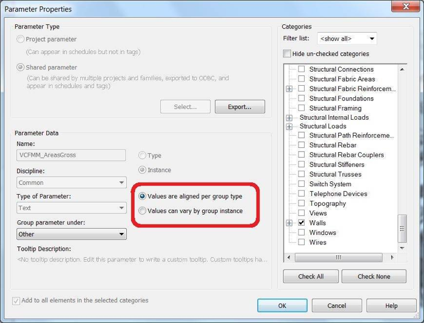

<head>
<meta http-equiv="Content-Type" content="text/html; charset=utf-8">
<link rel="stylesheet" type="text/css" href="bc.css">
<!--

-->

</head>

<!---

Setting parameter varies between groups in #RevitAPI @AutodeskRevit #bim #dynamobim @AutodeskForge #ForgeDevCon http://bit.ly/paramvarygroups

Looking at setting the <code>SetAllowVaryBetweenGroups</code> flag on a shared parameter;
is there any way to set <i>can vary by group instance</i> (what I need) the default for API-created bindings? ...

--->

### Setting Parameter Varies Between Groups

We already looked at the topic of setting the `SetAllowVaryBetweenGroups` flag on a shared parameter
in Scott Conover's [parameter definition overview](http://thebuildingcoder.typepad.com/blog/2016/12/parameter-definition-overview.html).

The setting was introduced in the [Revit 2014 API](http://thebuildingcoder.typepad.com/blog/2013/04/whats-new-in-the-revit-2014-api.html),
cf. *Parameter variance among group instances*.

Now Miroslav Schonauer raised it again, asking:

**Question:** Is the following option for group behaviour of shared param *instance* bindings exposed to API?
 

If yes, that solves all the issues :-)
 
If not &ndash; the default outcome seems to be *aligned per group type*.

Is there any way to set *can vary by group instance* (what I need) the default for API-created bindings?

Later: I found
this [Revit API discussion forum](http://forums.autodesk.com/t5/revit-api-forum/bd-p/160) thread 
on [creating a project parameter with *values can vary by group instance* selected](https://forums.autodesk.com/t5/revit-api-forum/create-project-parameter-with-quot-values-can-vary-by-group/m-p/5939455)
which explains that it is kind-of possible.
 
The problem remains that `SetAllowVaryBetweenGroups` is available only on `InternalDefinition`, while my programmatically created shared param has `ExternalDefinition`.

That thread explains that getting the binding after it has been created (i.e., in a 'Step 2') does return `InternalDefinition`, so this method can be used.
 
Can someone at least confirm that there is nothing simpler to do than the above 2-step process?

**Answer:** Yes. You need to do the two-step process:

- Register the shared parameter
- Find the internal definition
- Set the appropriate value for this property
 
The easiest way to go from one to the other:
 
- [SharedParameterElement.Lookup(GUID)](http://www.revitapidocs.com/2018.1/4dce82de-7495-523a-c8d4-4b3fc709e85e.htm)
- [ParameterElement.GetDefinition()](http://www.revitapidocs.com/2018.1/ec9b3cd3-4379-6eb8-7c7d-c220ba03f359.htm)

**Response:** I implemented this method to handle the setting of the `SetAllowVaryBetweenGroups` flag:
 
<pre class="code">
&nbsp;&nbsp;&nbsp;&nbsp;///&nbsp;&lt;summary&gt;
&nbsp;&nbsp;///&nbsp;Helper&nbsp;method&nbsp;to&nbsp;control&nbsp;`SetAllowVaryBetweenGroups`&nbsp;
&nbsp;&nbsp;///&nbsp;option&nbsp;for&nbsp;instance&nbsp;binding&nbsp;param
&nbsp;&nbsp;///&nbsp;&lt;/summary&gt;
&nbsp;&nbsp;static&nbsp;void&nbsp;SetInstanceParamVaryBetweenGroupsBehaviour(
&nbsp;&nbsp;&nbsp;&nbsp;Document&nbsp;doc,&nbsp;
&nbsp;&nbsp;&nbsp;&nbsp;Guid&nbsp;guid,&nbsp;
&nbsp;&nbsp;&nbsp;&nbsp;bool&nbsp;allowVaryBetweenGroups&nbsp;=&nbsp;true&nbsp;)
&nbsp;&nbsp;{
&nbsp;&nbsp;&nbsp;&nbsp;try&nbsp;//&nbsp;last&nbsp;resort
&nbsp;&nbsp;&nbsp;&nbsp;{
&nbsp;&nbsp;&nbsp;&nbsp;&nbsp;&nbsp;SharedParameterElement&nbsp;sp&nbsp;
&nbsp;&nbsp;&nbsp;&nbsp;&nbsp;&nbsp;&nbsp;&nbsp;=&nbsp;SharedParameterElement.Lookup(&nbsp;doc,&nbsp;guid&nbsp;);
 
&nbsp;&nbsp;&nbsp;&nbsp;&nbsp;&nbsp;//&nbsp;Should&nbsp;never&nbsp;happen&nbsp;as&nbsp;we&nbsp;will&nbsp;call&nbsp;
&nbsp;&nbsp;&nbsp;&nbsp;&nbsp;&nbsp;//&nbsp;this&nbsp;only&nbsp;for&nbsp;*existing*&nbsp;shared&nbsp;param.
 
&nbsp;&nbsp;&nbsp;&nbsp;&nbsp;&nbsp;if(&nbsp;null&nbsp;==&nbsp;sp&nbsp;)&nbsp;return;&nbsp;
 
&nbsp;&nbsp;&nbsp;&nbsp;&nbsp;&nbsp;InternalDefinition&nbsp;def&nbsp;=&nbsp;sp.GetDefinition();
 
&nbsp;&nbsp;&nbsp;&nbsp;&nbsp;&nbsp;if(&nbsp;def.VariesAcrossGroups&nbsp;!=&nbsp;allowVaryBetweenGroups&nbsp;)
&nbsp;&nbsp;&nbsp;&nbsp;&nbsp;&nbsp;{
&nbsp;&nbsp;&nbsp;&nbsp;&nbsp;&nbsp;&nbsp;&nbsp;//&nbsp;Must&nbsp;be&nbsp;within&nbsp;an&nbsp;outer&nbsp;transaction!
 
&nbsp;&nbsp;&nbsp;&nbsp;&nbsp;&nbsp;&nbsp;&nbsp;def.SetAllowVaryBetweenGroups(&nbsp;doc,&nbsp;allowVaryBetweenGroups&nbsp;);&nbsp;
&nbsp;&nbsp;&nbsp;&nbsp;&nbsp;&nbsp;}
&nbsp;&nbsp;&nbsp;&nbsp;}
&nbsp;&nbsp;&nbsp;&nbsp;catch&nbsp;{&nbsp;}&nbsp;//&nbsp;ideally,&nbsp;should&nbsp;report&nbsp;something&nbsp;to&nbsp;log...
&nbsp;&nbsp;}
</pre>

It assumes that `guid` comes from a known shared parameter.
 
Further good news: this can be called not only immediately after programmatically binding a new shared param, but also to *silently* change this specific setting for an *existing* shared parameter.

For example, we all typically have our own helper methods to get-or-create a shared parameter binding, cf., e.g., my method
to [add a category to a shared parameter binding](http://thebuildingcoder.typepad.com/blog/2012/04/adding-a-category-to-a-shared-parameter-binding.html).

Here is a code snippet providing enough to get the gist of how the above can be used (ignore my helper classes and error handling):

<pre class="code">
&nbsp;&nbsp;//&nbsp;Assumes&nbsp;outer&nbsp;transaction
&nbsp;&nbsp;public&nbsp;static&nbsp;Parameter&nbsp;GetOrCreateElemSharedParam(&nbsp;
&nbsp;&nbsp;&nbsp;&nbsp;Element&nbsp;elem,
&nbsp;&nbsp;&nbsp;&nbsp;string&nbsp;paramName,
&nbsp;&nbsp;&nbsp;&nbsp;string&nbsp;grpName,
&nbsp;&nbsp;&nbsp;&nbsp;ParameterType&nbsp;paramType,
&nbsp;&nbsp;&nbsp;&nbsp;bool&nbsp;visible,
&nbsp;&nbsp;&nbsp;&nbsp;bool&nbsp;instanceBinding,
&nbsp;&nbsp;&nbsp;&nbsp;bool&nbsp;userModifiable,
&nbsp;&nbsp;&nbsp;&nbsp;Guid&nbsp;guid,
&nbsp;&nbsp;&nbsp;&nbsp;bool&nbsp;useTempSharedParamFile,
&nbsp;&nbsp;&nbsp;&nbsp;string&nbsp;tooltip&nbsp;=&nbsp;&quot;&quot;,
&nbsp;&nbsp;&nbsp;&nbsp;BuiltInParameterGroup&nbsp;uiGrp&nbsp;=&nbsp;BuiltInParameterGroup.INVALID,
&nbsp;&nbsp;&nbsp;&nbsp;bool&nbsp;allowVaryBetweenGroups&nbsp;=&nbsp;true&nbsp;)
&nbsp;&nbsp;{
&nbsp;&nbsp;&nbsp;&nbsp;try
&nbsp;&nbsp;&nbsp;&nbsp;{
&nbsp;&nbsp;&nbsp;&nbsp;&nbsp;&nbsp;//&nbsp;Check&nbsp;if&nbsp;existing
&nbsp;&nbsp;&nbsp;&nbsp;&nbsp;&nbsp;Parameter&nbsp;param&nbsp;=&nbsp;elem.LookupParameter(&nbsp;paramName&nbsp;);
&nbsp;&nbsp;&nbsp;&nbsp;&nbsp;&nbsp;if(&nbsp;null&nbsp;!=&nbsp;param&nbsp;)
&nbsp;&nbsp;&nbsp;&nbsp;&nbsp;&nbsp;{
&nbsp;&nbsp;&nbsp;&nbsp;&nbsp;&nbsp;&nbsp;&nbsp;//&nbsp;NOTE:&nbsp;If&nbsp;you&nbsp;don&#39;t&nbsp;want&nbsp;forcefully&nbsp;setting&nbsp;
&nbsp;&nbsp;&nbsp;&nbsp;&nbsp;&nbsp;&nbsp;&nbsp;//&nbsp;the&nbsp;&quot;old&quot;&nbsp;instance&nbsp;params&nbsp;to&nbsp;
&nbsp;&nbsp;&nbsp;&nbsp;&nbsp;&nbsp;&nbsp;&nbsp;//&nbsp;allowVaryBetweenGroups&nbsp;=true,
&nbsp;&nbsp;&nbsp;&nbsp;&nbsp;&nbsp;&nbsp;&nbsp;//&nbsp;just&nbsp;comment&nbsp;the&nbsp;next&nbsp;3&nbsp;lines.
&nbsp;&nbsp;&nbsp;&nbsp;&nbsp;&nbsp;&nbsp;&nbsp;if(&nbsp;instanceBinding&nbsp;&amp;&amp;&nbsp;allowVaryBetweenGroups&nbsp;)
&nbsp;&nbsp;&nbsp;&nbsp;&nbsp;&nbsp;&nbsp;&nbsp;{
&nbsp;&nbsp;&nbsp;&nbsp;&nbsp;&nbsp;&nbsp;&nbsp;&nbsp;&nbsp;SetInstanceParamVaryBetweenGroupsBehaviour(&nbsp;
&nbsp;&nbsp;&nbsp;&nbsp;&nbsp;&nbsp;&nbsp;&nbsp;&nbsp;&nbsp;&nbsp;&nbsp;elem.Document,&nbsp;guid,&nbsp;allowVaryBetweenGroups&nbsp;);
&nbsp;&nbsp;&nbsp;&nbsp;&nbsp;&nbsp;&nbsp;&nbsp;}
&nbsp;&nbsp;&nbsp;&nbsp;&nbsp;&nbsp;&nbsp;&nbsp;return&nbsp;param;
&nbsp;&nbsp;&nbsp;&nbsp;&nbsp;&nbsp;}
 
&nbsp;&nbsp;&nbsp;&nbsp;&nbsp;&nbsp;//&nbsp;If&nbsp;here,&nbsp;need&nbsp;to&nbsp;create&nbsp;it&nbsp;(my&nbsp;custom&nbsp;
&nbsp;&nbsp;&nbsp;&nbsp;&nbsp;&nbsp;//&nbsp;implementation&nbsp;and&nbsp;classes…)
 
&nbsp;&nbsp;&nbsp;&nbsp;&nbsp;&nbsp;BindSharedParamResult&nbsp;res&nbsp;=&nbsp;BindSharedParam(&nbsp;
&nbsp;&nbsp;&nbsp;&nbsp;&nbsp;&nbsp;&nbsp;&nbsp;elem.Document,&nbsp;elem.Category,&nbsp;paramName,&nbsp;grpName,
&nbsp;&nbsp;&nbsp;&nbsp;&nbsp;&nbsp;&nbsp;&nbsp;paramType,&nbsp;visible,&nbsp;instanceBinding,&nbsp;userModifiable,
&nbsp;&nbsp;&nbsp;&nbsp;&nbsp;&nbsp;&nbsp;&nbsp;guid,&nbsp;useTempSharedParamFile,&nbsp;tooltip,&nbsp;uiGrp&nbsp;);
 
&nbsp;&nbsp;&nbsp;&nbsp;&nbsp;&nbsp;if(&nbsp;res&nbsp;!=&nbsp;BindSharedParamResult.eSuccessfullyBound
&nbsp;&nbsp;&nbsp;&nbsp;&nbsp;&nbsp;&nbsp;&nbsp;&amp;&amp;&nbsp;res&nbsp;!=&nbsp;BindSharedParamResult.eAlreadyBound&nbsp;)
&nbsp;&nbsp;&nbsp;&nbsp;&nbsp;&nbsp;{
&nbsp;&nbsp;&nbsp;&nbsp;&nbsp;&nbsp;&nbsp;&nbsp;return&nbsp;null;
&nbsp;&nbsp;&nbsp;&nbsp;&nbsp;&nbsp;}
 
&nbsp;&nbsp;&nbsp;&nbsp;&nbsp;&nbsp;//&nbsp;Set&nbsp;AllowVaryBetweenGroups&nbsp;for&nbsp;NEW&nbsp;Instance&nbsp;
&nbsp;&nbsp;&nbsp;&nbsp;&nbsp;&nbsp;//&nbsp;Binding&nbsp;Shared&nbsp;Param
 
&nbsp;&nbsp;&nbsp;&nbsp;&nbsp;&nbsp;if(&nbsp;instanceBinding&nbsp;)
&nbsp;&nbsp;&nbsp;&nbsp;&nbsp;&nbsp;{
&nbsp;&nbsp;&nbsp;&nbsp;&nbsp;&nbsp;&nbsp;&nbsp;SetInstanceParamVaryBetweenGroupsBehaviour(&nbsp;
&nbsp;&nbsp;&nbsp;&nbsp;&nbsp;&nbsp;&nbsp;&nbsp;&nbsp;&nbsp;elem.Document,&nbsp;guid,&nbsp;allowVaryBetweenGroups&nbsp;);
&nbsp;&nbsp;&nbsp;&nbsp;&nbsp;&nbsp;}
 
&nbsp;&nbsp;&nbsp;&nbsp;&nbsp;&nbsp;//&nbsp;If&nbsp;here,&nbsp;binding&nbsp;is&nbsp;OK&nbsp;and&nbsp;param&nbsp;seems&nbsp;to&nbsp;be
&nbsp;&nbsp;&nbsp;&nbsp;&nbsp;&nbsp;//&nbsp;IMMEDIATELY&nbsp;available&nbsp;from&nbsp;the&nbsp;very&nbsp;same&nbsp;command
 
&nbsp;&nbsp;&nbsp;&nbsp;&nbsp;&nbsp;return&nbsp;elem.LookupParameter(&nbsp;paramName&nbsp;);
&nbsp;&nbsp;&nbsp;&nbsp;}
&nbsp;&nbsp;&nbsp;&nbsp;catch(&nbsp;Exception&nbsp;ex&nbsp;)
&nbsp;&nbsp;&nbsp;&nbsp;{
&nbsp;&nbsp;&nbsp;&nbsp;&nbsp;&nbsp;System.Windows.Forms.MessageBox.Show(&nbsp;
&nbsp;&nbsp;&nbsp;&nbsp;&nbsp;&nbsp;&nbsp;&nbsp;string.Format(&nbsp;
&nbsp;&nbsp;&nbsp;&nbsp;&nbsp;&nbsp;&nbsp;&nbsp;&nbsp;&nbsp;&quot;Error&nbsp;in&nbsp;getting&nbsp;or&nbsp;creating&nbsp;Element&nbsp;Param:&nbsp;{0}&quot;,&nbsp;
&nbsp;&nbsp;&nbsp;&nbsp;&nbsp;&nbsp;&nbsp;&nbsp;&nbsp;&nbsp;ex.Message&nbsp;)&nbsp;);
 
&nbsp;&nbsp;&nbsp;&nbsp;&nbsp;&nbsp;return&nbsp;null;
&nbsp;&nbsp;&nbsp;&nbsp;}
&nbsp;&nbsp;}
</pre>

I added Miro's method `SetInstanceParamVaryBetweenGroupsBehaviour` 
to [The Building Coder samples release 2018.0.134.11](https://github.com/jeremytammik/the_building_coder_samples/releases/tag/2018.0.134.11) in
the module [CmdCreateSharedParams.cs L441-L470](https://github.com/jeremytammik/the_building_coder_samples/blob/master/BuildingCoder/BuildingCoder/CmdCreateSharedParams.cs#L441-L470).

Many thanks to Miro for raising this issue and sharing his approach to solve it!
