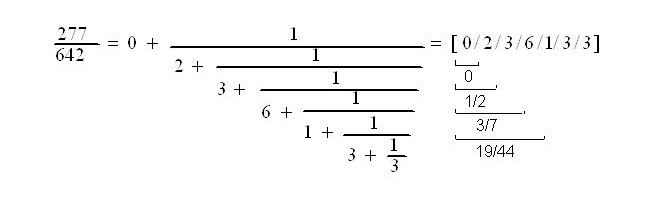

<head>
<meta http-equiv="Content-Type" content="text/html; charset=utf-8">
<link rel="stylesheet" type="text/css" href="bc.css">
<!--

-->

</head>

<!---

- 13713081 [the Unique Id in ProjectInformation is same in different project files]

- exact comparison is impossible
  13710363 [Problem with the function Curve.Intersect(Curve)]
  https://forums.autodesk.com/t5/revit-api-forum/problem-with-the-function-curve-intersect-curve/m-p/7632649

Project identifier and fuzzy comparison in #RevitAPI @AutodeskRevit #bim #dynamobim @AutodeskForge #ForgeDevCon http://bit.ly/projectidfuzz

I bring up two recurring topics, fresh every time around
&ndash; Project identifier
&ndash; Fuzzy comparison versus exact arithmetic for curve intersection...

--->

### Project Identifier and Fuzzy Comparison

I bring up two recurring topics...

Fresh every time around:

- [Project identifier](#2)
- [Fuzzy comparison versus exact arithmetic for curve intersection](#3)

####Project Identifier

**Question:** I have a problem with the unique id for `Document.ProjectInformation`.

If I create two Revit project files from the same Revit template file, the project information unique ids are identical.

How can I get the different unique ids for different project files, even when they are created from the same template?

**Answer:** As far as I know you cannot.

I am not aware of any way to change an existing unique id.

Furthermore, even if you could change it, how are you going to guarantee that an end user does not copy an existing project file later on to reuse in another different project, thus again duplicating the existing unique id?

Therefore, I would suggest that you create your own personal project identifier that you can control as you yourself see fit, in a way that perfectly matches your own requirements.

I implemented such a system for The Building Coder
using [named `GUID` storage for project identification](http://thebuildingcoder.typepad.com/blog/2016/04/named-guid-storage-for-project-identification.html).

I am not saying that my solution is perfect.

Furthermore, it is completely untested, as far as I know.

If anyone has made using of this or enhanced it in any way, please let us know.

Thank you!

####Fuzzy Comparison versus Exact Arithmetic for Curve Intersection

An interesting discussion ensued in 
the [Revit API discussion forum](http://forums.autodesk.com/t5/revit-api-forum/bd-p/160) thread on
a [problem with the function `Curve.Intersect(Curve)`](https://forums.autodesk.com/t5/revit-api-forum/problem-with-the-function-curve-intersect-curve/m-p/7632649):

**Question:**

I have a problem when I use this function with 2 lines intersecting each other in the case where they are parallel:

<pre class="code">
&nbsp;&nbsp;XYZ&nbsp;pt1&nbsp;=&nbsp;new&nbsp;XYZ();
&nbsp;&nbsp;XYZ&nbsp;pt2&nbsp;=&nbsp;new&nbsp;XYZ(&nbsp;1,&nbsp;0,&nbsp;0&nbsp;);
&nbsp;&nbsp;XYZ&nbsp;pt3&nbsp;=&nbsp;new&nbsp;XYZ(&nbsp;-1,&nbsp;0,&nbsp;0&nbsp;);
 
&nbsp;&nbsp;SetComparisonResult&nbsp;scr&nbsp;=&nbsp;Line.CreateBound(&nbsp;pt1,&nbsp;pt2&nbsp;)
&nbsp;&nbsp;&nbsp;&nbsp;.Intersect(&nbsp;Line.CreateBound(&nbsp;pt1,&nbsp;pt3&nbsp;),&nbsp;
&nbsp;&nbsp;&nbsp;&nbsp;&nbsp;&nbsp;out&nbsp;IntersectionResultArray&nbsp;ira&nbsp;);
 
&nbsp;&nbsp;if(&nbsp;scr&nbsp;==&nbsp;SetComparisonResult.Overlap&nbsp;)
&nbsp;&nbsp;&nbsp;&nbsp;monMessage&nbsp;+=&nbsp;&quot;\n&nbsp;Case&nbsp;1&nbsp;overlap&quot;&nbsp;+&nbsp;DonneXYZ(&nbsp;
&nbsp;&nbsp;&nbsp;&nbsp;&nbsp;&nbsp;ira.get_Item(&nbsp;0&nbsp;).XYZPoint&nbsp;);
 
&nbsp;&nbsp;if(&nbsp;scr&nbsp;==&nbsp;SetComparisonResult.Disjoint&nbsp;)
&nbsp;&nbsp;&nbsp;&nbsp;monMessage&nbsp;+=&nbsp;&quot;\n&nbsp;Case&nbsp;1&nbsp;disjoint&quot;;
 
&nbsp;&nbsp;if(&nbsp;scr&nbsp;!=&nbsp;SetComparisonResult.Overlap&nbsp;
&nbsp;&nbsp;&nbsp;&nbsp;&amp;&amp;&nbsp;scr&nbsp;!=&nbsp;SetComparisonResult.Disjoint&nbsp;)
&nbsp;&nbsp;&nbsp;&nbsp;&nbsp;&nbsp;monMessage&nbsp;+=&nbsp;&quot;\n&nbsp;Case&nbsp;1&nbsp;problem&quot;;
</pre>

This returns the Case 1, which is a problem (not overlap, not disjoint).

If the 2 lines are not parallel to each other, the result is overlap (correct):

<pre class="code">
&nbsp;&nbsp;XYZ&nbsp;pt4&nbsp;=&nbsp;new&nbsp;XYZ(&nbsp;0,&nbsp;1,&nbsp;0&nbsp;);

&nbsp;&nbsp;SetComparisonResult&nbsp;scr2&nbsp;=&nbsp;Line.CreateBound(&nbsp;pt1,&nbsp;pt2&nbsp;)
&nbsp;&nbsp;&nbsp;&nbsp;.Intersect(&nbsp;Line.CreateBound(&nbsp;pt1,&nbsp;pt4&nbsp;),&nbsp;
&nbsp;&nbsp;&nbsp;&nbsp;&nbsp;&nbsp;out&nbsp;IntersectionResultArray&nbsp;ira2&nbsp;);
 
&nbsp;&nbsp;if(&nbsp;scr2&nbsp;==&nbsp;SetComparisonResult.Overlap&nbsp;)
&nbsp;&nbsp;&nbsp;&nbsp;monMessage&nbsp;+=&nbsp;&quot;\n&nbsp;Case&nbsp;2&nbsp;overlap&quot;&nbsp;+&nbsp;DonneXYZ(&nbsp;
&nbsp;&nbsp;&nbsp;&nbsp;&nbsp;&nbsp;ira2.get_Item(&nbsp;0&nbsp;).XYZPoint&nbsp;);
 
&nbsp;&nbsp;if(&nbsp;scr2&nbsp;==&nbsp;SetComparisonResult.Disjoint&nbsp;)
&nbsp;&nbsp;&nbsp;&nbsp;monMessage&nbsp;+=&nbsp;&quot;\n&nbsp;Case&nbsp;2&nbsp;disjoint&quot;;
 
&nbsp;&nbsp;if(&nbsp;scr2&nbsp;!=&nbsp;SetComparisonResult.Overlap&nbsp;
&nbsp;&nbsp;&nbsp;&nbsp;&amp;&amp;&nbsp;scr&nbsp;!=&nbsp;SetComparisonResult.Disjoint&nbsp;)
&nbsp;&nbsp;&nbsp;&nbsp;&nbsp;&nbsp;monMessage&nbsp;+=&nbsp;&quot;\n&nbsp;Case&nbsp;2&nbsp;problem&quot;;
</pre>

I also tried to get a curve with tangent parallel with the other curve:

<pre class="code">
&nbsp;&nbsp;Arc&nbsp;myArc&nbsp;=&nbsp;Arc.Create(&nbsp;new&nbsp;XYZ(&nbsp;0,&nbsp;1,&nbsp;0&nbsp;),&nbsp;1.0,&nbsp;
&nbsp;&nbsp;&nbsp;&nbsp;-0.5&nbsp;*&nbsp;Math.PI,&nbsp;0.0,&nbsp;XYZ.BasisX,&nbsp;XYZ.BasisY&nbsp;);
 
&nbsp;&nbsp;SetComparisonResult&nbsp;scr3&nbsp;=&nbsp;myArc.Intersect(&nbsp;
&nbsp;&nbsp;&nbsp;&nbsp;Line.CreateBound(&nbsp;pt1,&nbsp;pt3&nbsp;),
&nbsp;&nbsp;&nbsp;&nbsp;&nbsp;&nbsp;out&nbsp;IntersectionResultArray&nbsp;ira3&nbsp;);
 
&nbsp;&nbsp;if(&nbsp;scr3&nbsp;==&nbsp;SetComparisonResult.Overlap&nbsp;)
&nbsp;&nbsp;&nbsp;&nbsp;monMessage&nbsp;+=&nbsp;&quot;\n&nbsp;Case&nbsp;2&nbsp;overlap&nbsp;&quot;&nbsp;+&nbsp;DonneXYZ(&nbsp;
&nbsp;&nbsp;&nbsp;&nbsp;&nbsp;&nbsp;ira3.get_Item(&nbsp;0&nbsp;).XYZPoint&nbsp;);
 
&nbsp;&nbsp;if(&nbsp;scr3&nbsp;==&nbsp;SetComparisonResult.Disjoint&nbsp;)
&nbsp;&nbsp;&nbsp;&nbsp;monMessage&nbsp;+=&nbsp;&quot;\n&nbsp;Case&nbsp;2&nbsp;disjoint&quot;;
 
&nbsp;&nbsp;if(&nbsp;scr3&nbsp;!=&nbsp;SetComparisonResult.Overlap&nbsp;
&nbsp;&nbsp;&nbsp;&nbsp;&amp;&amp;&nbsp;scr&nbsp;!=&nbsp;SetComparisonResult.Disjoint&nbsp;)
&nbsp;&nbsp;&nbsp;&nbsp;&nbsp;&nbsp;monMessage&nbsp;+=&nbsp;&quot;\n&nbsp;Case&nbsp;2&nbsp;problem&quot;;
</pre>

This result is also correct (overlap).

So, it appears that the only incorrect result is when you have 2 parallel lines.

This causes problems in my code (unexpected errors that I have to deal with) so if this could be fixed if would be great!

**Answer:** You say that you have a problem with the intersection of two parallel lines?

<pre>
  Point P = (-1,0,0)
  Point O = (0,0,0)
  Point Q = (0,0,+1)
  Line A from P to O
  Line B from O to Q
</pre>

These two lines have one single common point in (0,0,0).

Whether that is to be considered an intersection depends completely on your point of view.

If the lines are considered as closed sets of points in space, they intersect in one point.

If they are considered as open sets in space, they do not intersect.

Both of these way of looking at geometrical elements are completely valid.

Mathematically speaking, you can consider this equivalent question:

Do the two intervals [-1,0] and [0,1] intersect?

- The two closed intervals [-1,0] and [0,1] do intersect, in one single point 0.
The intersection is infinitesimally small and has a volume of zero.
- The two open intervals (-1,0) and (0,1) do not intersect.
- There is also no intersection between the two intervals if one of them is open and the second closed.

These cases can only be distinguished precisely
using [exact arithmetic](https://stackoverflow.com/questions/24352127/exact-arithmetic-in-c),
aka [arbitrary precision arithmetic](https://en.wikipedia.org/wiki/Arbitrary-precision_arithmetic).

The Revit API, just like most other current geometrical programming environments, does not specify which paradigm is considered valid.

In fact, it cannot, because it does not work with exact arithmetic.

As long as we are working with imprecise double precision floating point numbers, these two cases cannot be distinguished.

The line A is considered totally equivalent to the line

<pre>
  Line A' from P to (-0.000000000000000000001,0,0)
</pre>

What result would you consider correct for that case?

Remember, lines A and A' must be considered completely identical in all respects!

The only way I see for you to handle your problem properly using inexact floating point arithmetic is to perform
a [fuzzy comparison](http://thebuildingcoder.typepad.com/blog/2017/06/sensors-bim-ai-revitlookup-and-fuzzy-comparison.html#4) of
the edge cases such as these.

I would say that this is not a bug, and there is no way to decide whether parallel lines that meet in one single point intersect or not.

Any such attempt would be completely pointless  :-)

Your software needs to be implemented in a way that takes this possibility into account.

Exact comparison would be required to answer this precisely.

This is definitely not possible using floating point arithmetic.

**Response:** Your explanation is interesting.

Still, the bottom of the problem remains:

The way this is coded in Revit makes the results of very similar intersection problems inconsistent. 

- Case 1 : intersection between [(0,0) ; (1,0)] and [(0,0) ; (-1,0)] returns neither overlap nor disjoint.
- Case 2 : intersection between [(0,0) ; (1,0)] and [(0,0) ; (0,1)] returns overlap.
- Case 3 : intersection between [(0,0) ; (1,0)] and the arc of centre (0,10E9) and of radius 10E9 ending in (0,0) (which is locally a Line) returns overlap.

This problem arises only for Line which are parallel, not for the other types of Curves.

As I explained, this causes unexpected errors which should be avoided and can be difficult to find.

So, I believe the `Curve.Intersect` method should be updated on this particular point.

Except if there is a better argument not to do so...

**Answer:** As you can tell, I find the topic interesting and really want to help find a satisfactory solution.

If this only applies to parallel lines, I would suggest solving it for that case, because it is not hard to do.

I added `IsParallel` and `IsCollinear` predicates to The Building Coder samples for this:

<pre class="code">
  public&nbsp;static&nbsp;bool&nbsp;IsParallel(&nbsp;XYZ&nbsp;p,&nbsp;XYZ&nbsp;q&nbsp;)
  {
  &nbsp;&nbsp;return&nbsp;p.CrossProduct(&nbsp;q&nbsp;).IsZeroLength();
  }
   
  public&nbsp;static&nbsp;bool&nbsp;IsCollinear(&nbsp;Line&nbsp;a,&nbsp;Line&nbsp;b&nbsp;)
  {
  &nbsp;&nbsp;XYZ&nbsp;v&nbsp;=&nbsp;a.Direction;
  &nbsp;&nbsp;XYZ&nbsp;w&nbsp;=&nbsp;b.Origin&nbsp;-&nbsp;a.Origin;
  &nbsp;&nbsp;return&nbsp;IsParallel(&nbsp;v,&nbsp;b.Direction&nbsp;)
  &nbsp;&nbsp;&nbsp;&nbsp;&amp;&amp;&nbsp;IsParallel(&nbsp;v,&nbsp;w&nbsp;);
  }
</pre>

The next step would be to check for the overlap including the required fuzziness in case lines are collinear.

I also discussed this with the development team, and they say:

I believe the documentation covers this case and the return is [`SetComparisonResult.Subset`](http://www.revitapidocs.com/2018.1/3310a68d-b67a-79cb-ea54-deb00d9f60d9.htm):

> The inputs are parallel lines with only one common intersection point, or the curve used to invoke the intersection check is a line entirely within the unbound line passed as argument curve. If the former, the output argument has the details of the intersection point.

The customer didn't indicate what the return value was for them; if it is subset, that matches what we have told them it would be.

**Response:** Indeed, using `SetcomparisonResult.Subset` works for my problem and is much more elegant than my previous workaround solution (which was, in essence: check if `SetComparisonResult` is either `Overlap` or `Disjoint`; if not, check if the 2 elements are line, collinear, and have same end; if so, treat the case as `Overlap`).

The improved test is now:

<pre class="code">
&nbsp;&nbsp;if(&nbsp;scr&nbsp;!=&nbsp;SetComparisonResult.Overlap
&nbsp;&nbsp;&nbsp;&nbsp;&amp;&amp;&nbsp;scr&nbsp;!=&nbsp;SetComparisonResult.Disjoint
&nbsp;&nbsp;&nbsp;&nbsp;&amp;&amp;&nbsp;!(&nbsp;scr&nbsp;==&nbsp;SetComparisonResult.Subset&nbsp;
&nbsp;&nbsp;&nbsp;&nbsp;&nbsp;&nbsp;&amp;&amp;&nbsp;ira.Size&nbsp;==&nbsp;1&nbsp;)&nbsp;)
</pre>
