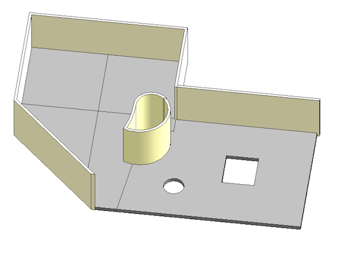

<head>
<meta http-equiv="Content-Type" content="text/html; charset=utf-8">
<link rel="stylesheet" type="text/css" href="bc.css">
<!--

-->

</head>

<!---

- updated https://github.com/jeremytammik/DirectShapeFromFace -- direct shape from face
  test sketch plane creation and refinding
  generics for searching faces, edges, etc.
  parameter filter

- loft form creation speed ---  >> directshape
  [Q] I have a developer from Revit Vanguard having a function which create a new mass family and load it in the project, but he cannot provide this function due to take much time to create a loft form.
  He creates a form by using Document.FamilyCreate.NewLoftForm with ReferenceArray of CurveByPoints or ModelCurve.
  I think that it seems to be general way to create Family.
  I tested the attached minimal sample code, I got a similar result as he mentioned.
  It takes about 4 minutes to create a family in the test code.
  Eventually, he wants to visualize calculation result of sky view factor by 3D model.
  And his addin already works well in ArchCad as the same function.
  Is there any work-around to create a loft form more faster?
  [A] depending on the kind of geometry he wants to create, he might be able to use a DirectShape element instead.
  that should be about 100 times faster.
  http://thebuildingcoder.typepad.com/blog/2014/05/directshape-performance-and-minimum-size.html
  http://thebuildingcoder.typepad.com/blog/2014/11/directshape-versus-families-category-and-texture.html
  http://thebuildingcoder.typepad.com/blog/2015/02/from-hack-to-app-obj-mesh-import-to-directshape.html

- directshape 10467085 [Create surface from face] -- another DirectShape example

- create direct shape instead of conceptual mass
  creating wall and roof elements on face of mass
  new topic group
  http://forums.autodesk.com/t5/revit-api/create-a-surface-through-revit-api/m-p/5867952

- 11770403 [Hermite,Nurbs Spline Do they need to be on a plane?]
http://forums.autodesk.com/t5/revit-api/hermite-nurbs-spline-do-they-need-to-be-on-a-plane/m-p/6301635
[Q] You state in Point 3 "... create a DirectShape element using the 'solid' geometry created above." Where can I find code which shows how to do that?
[A] You just have to package the solid in a GeometryObject Array, then DirectShape.CreateElement works: https://knowledge.autodesk.com/search-result/caas/CloudHelp/cloudhelp/2016/ENU/Revit-API/files/GUID-DF7B9D4A-5A8A-4E39-8721-B7782CBD7730-htm.html

- 12950253 [Using API to change color (and/or material) of DirectShape]
  https://forums.autodesk.com/t5/revit-api-forum/using-api-to-change-color-and-or-material-of-directshape/m-p/7064149

- Re: Create DirectShape without representation when generating shape -- Toshiaki Isezaki

- 12390855 [Create Direct Shape from Room]
  http://forums.autodesk.com/t5/revit-api-forum/create-direct-shape-from-room/m-p/6703123
  spatial geometry calculator versus room boundary

- control direct shape visibility in family definition
  13676056 [ファミリ内のDirectShapeについて -- About DirectShape in family]

DirectShape topics and Happy New Year in #RevitAPI @AutodeskRevit #bim #dynamobim @AutodeskForge #ForgeDevCon http://bit.ly/directshape2018

I'll begin the new year by discussing a bunch of topics addressing various aspects of <code>DirectShape</code> elements
&ndash; Updated DirectShapeFromFace
&ndash; Improve loft form creation speed using <code>DirectShape</code>
&ndash; Create <code>DirectShape</code> instead of conceptual mass
&ndash; Create surface from face
&ndash; Create <code>DirectShape</code> from solid
&ndash; Control <code>DirectShape</code> colour and material
&ndash; Improve family performance suppressing <code>DirectShape</code> generation
&ndash; Create <code>DirectShape</code> from room...

--->

### DirectShape Topics and Happy New Year!

Happy New Year!

<!-- The JavaScript Source http://www.javascriptsource.com Ben Joffe http://www.joffe.tk/ -->

I had a great break over Christmas and New Year and hope you did as well.

I'll begin the new year by discussing a bunch of topics addressing various aspects of `DirectShape` elements:

- [Updated DirectShapeFromFace](#2)
- [Improve loft form creation speed using `DirectShape`](#3)
- [Create `DirectShape` instead of conceptual mass](#4)
- [Create surface from face](#5)
- [Create `DirectShape` from solid](#6)
- [Control `DirectShape` colour and material](#7)
- [Improve family performance suppressing `DirectShape` generation](#8)
- [Create `DirectShape` from room](#9)

####Updated DirectShapeFromFace

One useful little `DirectShape` utility is  
the [DirectShapeFromFace](https://github.com/jeremytammik/DirectShapeFromFace) add-in.

It  creates a `DirectShape` element from a selected element face.

We initially discussed it in 2015, in the article
on [DirectShape From Face and Sketch Plane Reuse](http://thebuildingcoder.typepad.com/blog/2015/09/directshape-from-face-and-sketch-plane-reuse.html).

It demonstrates several approaches, including
a [simpler access to the picked face using `GetTotalTransform`](http://thebuildingcoder.typepad.com/blog/2015/09/simpler-directshape-from-face-restsharp-put-and-post.html#2).

Now I migrated it from Revit 2016 to Revit 2018, replacing a couple of obsolete API calls.

####Improve Loft Form Creation Speed using DirectShape

One of the most important features of direct shapes is the ability to generate geometry directly in place in the model without needing to create a separate family definition and instantiate that, resulting in a  vast speed improvement.

For example, a developer was creating a new mass family and loading it in the project, taking so much time to create a loft form that it ended up unusable.

The form was generated in a standard way to create families, using `Document.FamilyCreate.NewLoftForm` with a `ReferenceArray` of `CurveByPoint` or `ModelCurve` elements.

It takes about 4 minutes to create a family in this manner.

**Question:** Is there any work-around to create a loft form faster?

**Answer:** Depending on the kind of geometry you want to create, you might be able to use a `DirectShape` element instead:

- [DirectShape performance and minimum size](http://thebuildingcoder.typepad.com/blog/2014/05/directshape-performance-and-minimum-size.html)
- [DirectShape versus families, category and texture](http://thebuildingcoder.typepad.com/blog/2014/11/directshape-versus-families-category-and-texture.html)
- [From Hack to App &ndash; OBJ Mesh Import to DirectShape](http://thebuildingcoder.typepad.com/blog/2015/02/from-hack-to-app-obj-mesh-import-to-directshape.html)

####Create DirectShape Instead of Conceptual Mass

I the same vein,
the [Revit API discussion forum](http://forums.autodesk.com/t5/revit-api-forum/bd-p/160) thread
on [creating a surface through Revit API](http://forums.autodesk.com/t5/revit-api/create-a-surface-through-revit-api/m-p/5867952) suggests
using a `DirectShape` instead of a conceptual mass element and also introduces
the new topic group #5.50 dedicated to
the [`DirectShape` element](http://thebuildingcoder.typepad.com/blog/about-the-author.html#5.50).

####Create Surface from Face

Another discussion also deals with creating a surface from a picked element face:

**Question:** I'm working on a function that creates surfaces from selected faces.
It really does not matter what type of element the resulting surface is as long as it gets exported to Navisworks.

What I have been able to do is to collect the faces with the `PickObjects` method.
I have also succeeded creating a mass family representing a surface.
This I have achieved by collecting the edges of the face and then I have created the surface object by using `NewFormByCap`.

But this approach does not work on all faces, especially if one of the edges is a `HermiteSpline`.
I have tried to create a mesh out of the face and then create a tiny surface of each of the triangles using the `NewFormByCap` method. This do sort of works, but it takes way too long &ndash; hours for just a single face.

Do you have any idea how I can solve this issue? It does not have to be a surface; it can also be a very thin solid.
The function should work on all possible faces in Revit. Any help is appreciated.

**Answer:** Surprisingly, yes, I do have a viable suggestion for you.

It is even significantly easier and simpler and more efficient than what you have been trying so far, and I think it can work for all surfaces.

In Revit 2015, the DirectShape element was introduced as a possibility to generate faceted geometry directly in the project space.

All previous methods to define custom geometry required a family definition, like the method you describe.

Here is my simple suggestion:

- Grab the surface that you are interested in and tessellate it. You now have a bunch of triangles.
- Create a `DirectShape` based on these triangles.

This discussion ultimately gave rise to the [DirectShapeFromFace project discussed above](#2).

####Create DirectShape from Solid

Another question on creating direct shapes was raised in
the [Revit API discussion forum](http://forums.autodesk.com/t5/revit-api-forum/bd-p/160) thread
on whether [Hermite and Nurb Spline need to be created on a plane](http://forums.autodesk.com/t5/revit-api/hermite-nurbs-spline-do-they-need-to-be-on-a-plane/m-p/6301635).
It also compares `NewLoftForm` with `DirectShape`, and then ends up asking:

**Question:** You state that you can "... create a DirectShape element using the 'solid' geometry created above." Where can I find code which shows how to do that?

**Answer:** You just have to package the solid in a `GeometryObject` array, then `DirectShape.CreateElement` works, as described in
the [knowledge base article on `DirectShape`](https://knowledge.autodesk.com/search-result/caas/CloudHelp/cloudhelp/2016/ENU/Revit-API/files/GUID-DF7B9D4A-5A8A-4E39-8721-B7782CBD7730-htm.html).

####Control DirectShape Colour and Material

Let's round off with some aspects of controlling `DirectShape` colour and material, e.g., 
the [Revit API discussion forum](http://forums.autodesk.com/t5/revit-api-forum/bd-p/160) thread
on [using API to change color and/or material of DirectShape](https://forums.autodesk.com/t5/revit-api-forum/using-api-to-change-color-and-or-material-of-directshape/m-p/7064149):

**Question:** When importing my IFC file, all elements get converted to `DirectShape` elements.

But they now get colored fully black when viewing in shaded mode, and there seems to be no way to change this.

Only workaround is to overwrite graphics per view, but I would rather work to a more solid solution.
 
Is there some way to change the color of the `DirectShape` elements? From what I understood, a material could not be applied to a `DirectShape`.
 
When I import more IFC's from the same source with different export settings, it seems I sometimes get different color results.

So, I can conclude that the color is stored somewhere within these `DirectShape` elements. I still cannot find where, and whether it can be changed though API.

**Answer:** The best way to control the colour of a direct shape element is probably by setting an appropriate category or subcategory on it.
 
As you presumably know, there
are [many ways to control the material and colour of a Revit element](http://thebuildingcoder.typepad.com/blog/about-the-author.html#5.24)
 
If you prefer setting the colour explicitly, you can look at
 
- [Change element colour](http://thebuildingcoder.typepad.com/blog/2011/03/change-element-colour.html)
- [How to change the colour of an element](https://forums.autodesk.com/t5/revit-api-forum/how-change-the-color-a-element/td-p/5651177)
 
Here is some code for that using `OverrideGraphicSettings`
to [change the colour of an extrusion object](https://forums.autodesk.com/t5/revit-api-forum/change-colour-of-extrusion-object/m-p/7060824):
 
<pre class="code">
&nbsp;&nbsp;Color&nbsp;color&nbsp;=&nbsp;new&nbsp;Color(&nbsp;0,&nbsp;0,&nbsp;0&nbsp;);&nbsp;//&nbsp;RGB&nbsp;(0,&nbsp;255,&nbsp;255)
&nbsp;&nbsp;OverrideGraphicSettings&nbsp;ogs&nbsp;=&nbsp;new&nbsp;OverrideGraphicSettings();
&nbsp;&nbsp;ogs.SetProjectionLineColor(&nbsp;color&nbsp;);
&nbsp;&nbsp;ogs.SetProjectionFillColor(&nbsp;color&nbsp;);
&nbsp;&nbsp;ogs.SetCutFillColor(&nbsp;color&nbsp;);
&nbsp;&nbsp;ogs.SetCutLineColor(&nbsp;color&nbsp;);
&nbsp;&nbsp;doc.ActiveView.SetElementOverrides(&nbsp;fiProfile.Id,&nbsp;ogs&nbsp;);
</pre>

However, controlling the material and colour via the direct shape category is much more BIMish!
 
If your IFC DirectShapes do not provide `Material` parameters you can set, and if you cannot change their categories, then you could try to:
 
- Read their geometry
- Create new `DirectShape` elements using this geometry
- Delete the original IFC `DirectShape` elements

The advantage is that you have more control over the `DirectShape` properties at creation time.

####Improve Family Performance Suppressing DirectShape Generation

**Question:** I use `DirectShape` to accelerate creating shapes in my family definition.

It includes so many shapes now that Revit exhibits slow performance. 
 
Can I improve this?

Is it possible to temporarily suppress the representation and drawing of DirectShape regeneration?

**Answer:** Drawing of elements can be suppressed by hiding the associated category in the view, however it is unlikely that the impact of excessive element creation will be limited to creation. Having too many elements in a family will slow down family load and update times. Further I expect that performance problems may be encountered in the project environment as well. There is likely a better, more scalable solution to the problem they are trying to solve that doesn’t involve creation of too many elements.

When you add an element to a family definition, you can always specify its visibility using
the [FamilyElementVisibility class](http://www.revitapidocs.com/2017/fae58e2d-817c-77f6-1747-58b0a4e01c7a.htm).
 
This includes both view direction and level of detail:
 
- Fine / medium / coarse
- 2D front / top / back
- 3D
 
This applies to all geometry in a family definition.
 
Therefore, you can simply define the visibility for all complex direct shapes to be visible only in 3D views and only in fine level of detail.
 
I would expect that to solve the issue effectively.

Please note that unlike other elements, it is not yet possible to associate `DirectShape` elements in family definitions with visibility controls.
It should apply to all geometric elements, but the operation is actually element based, and has not been enabled for DirectShapes yet.
There doesn’t seem to be a Revit Ideas item filed for this functionality, although the team is already aware of the gap.

Happily, this can be worked around making use of the fact that visibility can be set for a family instance nested in the family definition document and creating a `FamilyInstance` containing the `DirectShape` inside the family document.

####Create DirectShape from Room

Finally, to round off this collectio0n of DirectShape topics, yet
another [Revit API discussion forum](http://forums.autodesk.com/t5/revit-api-forum/bd-p/160) thread
on [creating direct shape from room](http://forums.autodesk.com/t5/revit-api-forum/create-direct-shape-from-room/m-p/6703123) and 
using the spatial geometry calculator versus room boundary to achieve that:

**Question:** How can I create `DirectShape` from rooms with holes?
 
I read many discussion and post but I wasn't able to solve the problem!
 
More info and source in this GitHub issue:

- [GitHub issue](https://github.com/Tamu/Revit3Drooms/issues/1)
- [Revit3Drooms source code](https://github.com/Tamu/Revit3Drooms)
 
Last reading:

- [2D polygon areas and outer loop](http://thebuildingcoder.typepad.com/blog/2008/12/2d-polygon-areas-and-outer-loop.html)
- [Create mass from room](http://forums.autodesk.com/t5/revit-api-forum/create-mass-from-room/td-p/3674458)
 
Many thanks for help!

**Answer:** If you want the room with holes, then there will be nothing left.
 
The room is a hole.
 
What else is a room except a hole?
 
Do you mean that you would like to recreate the shape of all the walls with their openings?
 
Do you mean that you have a room whose plan view includes holes?
 
Let's assume the latter.
 
In that case, if your walls are all vertical, this is absolutely trivial.
 
You can collect the room boundary edges and assemble them into the outer and inner wall loops.
 
This is demonstrated very effectively by
the [2D room editor](https://github.com/jeremytammik/RoomEditorApp),
which retrieves this information, converts it to a simplified 2D view in SVG, and displays the room outline in a web browser:
 
Here is a [demo recording and lots of other supporting material](http://thebuildingcoder.typepad.com/blog/2016/10/connecting-desktop-and-cloud-at-rtc-material.html).
 
If you want a 3D direct shape instead of a 2D flat version, you will obviously need to determine the ceiling height and location and take that into account as well.
 
Update:
 
OK, I now went and read your problem description.
 
:-)
 
Very clear. Thank you for that.
 
Thank you also for your appreciation!
 
That issue is indeed addressed by
the [RoomEditorApp](https://github.com/jeremytammik/RoomEditorApp) that
I already pointed to.
 
When you retrieve the room boundary, the edges may not be contiguous in the right order.
 
You may need to order them yourself.
 
There are several ways of achieving that:
 
DIY. I love do it yourself. Search for `SortCurvesContiguous`.
 
ExporterIFCUtils.ValidateCurveLoops. Maybe. The Edge.AsCurveFollowingFace method. Maybe. But read on through the following, and note the note in the last of the discussions listed below.
 
For the former, here is some more reading material:
 
- [2D Polygon Areas and Outer Loop](http://thebuildingcoder.typepad.com/blog/2008/12/2d-polygon-areas-and-outer-loop.html)
- [Curve Following Face and Bounding Box Implementation](http://thebuildingcoder.typepad.com/blog/2013/03/sort-and-orient-curves-to-form-a-contiguous-loop.html)
- [Retrieving Plan View Room Boundary Polygon Loops](http://thebuildingcoder.typepad.com/blog/2013/03/revit-2014-api-and-room-plan-view-boundary-polygon-loops.html#3)
- [Extrusion Analyser and Plan View Boundaries](http://thebuildingcoder.typepad.com/blog/2013/04/extrusion-analyser-and-plan-view-boundaries.html)
- [Room and Furniture Loops Using Symbols](http://thebuildingcoder.typepad.com/blog/2013/04/room-and-furniture-loops-using-symbols.html)
- [ContiguousCurveSorter](ttps://github.com/jeremytammik/RoomEditorApp/blob/master/RoomEditorApp/ContiguousCurveSorter.cs)
- [Sorting Face Loop Edges](http://thebuildingcoder.typepad.com/blog/2015/01/autodesk-internship-in-california-and-sorting-edges.html#3)
 
I have explored and written lots more on this topic, as you can see if you follow the various links in the discussions listed above.
 
I am confident that this will give you all you need.
 
I see that what you are after is basically the floor slabs under the rooms.
 
I assume that you are not interested in querying the slabs for their geometry?
 
You want to create these shapes from the room boundaries?
 
Well, I think you have all you need now for that.
 
**Response:** You ask:

> "Do you mean that you have a room whose plan view includes holes?"
 
Yes, I would like to create the volume of the room. If the room has holes (Because walls), I would also like to subtract the volume of the hole.
 
In short, I feel ... that you translated perfectly my strange English !

> "You want to create these shapes from the room boundaries?"
 
Yes, exactly. For the elevation, I need only a fixed height (very simple).

Update &ndash; here is the solution: 

It was necessary to add a call in the boundary loop: `curveLoopList.Add(curveLoop);`

<pre class="code">
&nbsp;&nbsp;foreach(&nbsp;IList&lt;BoundarySegment&gt;&nbsp;b&nbsp;in&nbsp;boundaries&nbsp;)
&nbsp;&nbsp;{
&nbsp;&nbsp;&nbsp;&nbsp;List&lt;Curve&gt;&nbsp;profile&nbsp;=&nbsp;new&nbsp;List&lt;Curve&gt;();
&nbsp;&nbsp;&nbsp;&nbsp;++iBoundary;
&nbsp;&nbsp;&nbsp;&nbsp;iSegment&nbsp;=&nbsp;0;
 
&nbsp;&nbsp;&nbsp;&nbsp;foreach(&nbsp;BoundarySegment&nbsp;s&nbsp;in&nbsp;b&nbsp;)
&nbsp;&nbsp;&nbsp;&nbsp;{
&nbsp;&nbsp;&nbsp;&nbsp;&nbsp;&nbsp;++iSegment;
&nbsp;&nbsp;&nbsp;&nbsp;&nbsp;&nbsp;Curve&nbsp;curve&nbsp;=&nbsp;s.GetCurve();
 
&nbsp;&nbsp;&nbsp;&nbsp;&nbsp;&nbsp;profile.Add(&nbsp;curve&nbsp;);
&nbsp;&nbsp;&nbsp;&nbsp;}
 
&nbsp;&nbsp;&nbsp;&nbsp;try
&nbsp;&nbsp;&nbsp;&nbsp;{
&nbsp;&nbsp;&nbsp;&nbsp;&nbsp;&nbsp;CurveLoop&nbsp;curveLoop&nbsp;=&nbsp;CurveLoop.Create(&nbsp;profile&nbsp;);
&nbsp;&nbsp;&nbsp;&nbsp;&nbsp;&nbsp;curveLoopList.Add(&nbsp;curveLoop&nbsp;);
&nbsp;&nbsp;&nbsp;&nbsp;}
&nbsp;&nbsp;&nbsp;&nbsp;catch(&nbsp;Exception&nbsp;ex&nbsp;)
&nbsp;&nbsp;&nbsp;&nbsp;{
&nbsp;&nbsp;&nbsp;&nbsp;&nbsp;&nbsp;Debug.WriteLine(&nbsp;ex.Message&nbsp;);
&nbsp;&nbsp;&nbsp;&nbsp;}
&nbsp;&nbsp;}
</pre>

Full code/demo in
the [Revit3Drooms GitHub repository](https://github.com/Tamu/Revit3Drooms).

**Answer:** Maybe I'm missing something here, but why can't you use the `SpatialElementGeometryCalculator`?

That gives you the solid you require for the `DirectShape` immediately; I've used this for quite a few implementations. 

Does this not take holes into account?

**Response:** The `SpatialElementGeometryCalculator` works for rooms?
 
For a general case this works well but I did not succeed for rooms. Have you already tried ?
 
**Answer:** I haven't read through all your material, so I'm not sure about if your specific case needs something special, but it can extract solid geometry and I haven't seen any drawbacks. 

The `Room` type directly inherits `SpatialElement`, so yes, it sure works.

Here is a sample from the documentation:

<pre class="code">
&nbsp;&nbsp;//&nbsp;Calculate&nbsp;a&nbsp;room&#39;s&nbsp;geometry&nbsp;and&nbsp;find&nbsp;its&nbsp;boundary&nbsp;faces
 
&nbsp;&nbsp;SpatialElementGeometryCalculator&nbsp;calculator&nbsp;
&nbsp;&nbsp;&nbsp;&nbsp;=&nbsp;new&nbsp;SpatialElementGeometryCalculator(&nbsp;doc&nbsp;);
 
&nbsp;&nbsp;//&nbsp;Compute&nbsp;the&nbsp;room&nbsp;geometry&nbsp;
 
&nbsp;&nbsp;SpatialElementGeometryResults&nbsp;results&nbsp;
&nbsp;&nbsp;&nbsp;&nbsp;=&nbsp;calculator.CalculateSpatialElementGeometry(&nbsp;room&nbsp;);
 
&nbsp;&nbsp;//&nbsp;Get&nbsp;the&nbsp;solid&nbsp;representing&nbsp;the&nbsp;room&nbsp;geometry
 
&nbsp;&nbsp;Solid&nbsp;roomSolid&nbsp;=&nbsp;results.GetGeometry();&nbsp;
 
&nbsp;&nbsp;foreach(&nbsp;Face&nbsp;face&nbsp;in&nbsp;roomSolid.Faces&nbsp;)
&nbsp;&nbsp;{
&nbsp;&nbsp;&nbsp;&nbsp;double&nbsp;faceArea&nbsp;=&nbsp;face.Area;
 
&nbsp;&nbsp;&nbsp;&nbsp;//&nbsp;Get&nbsp;the&nbsp;sub-faces&nbsp;for&nbsp;the&nbsp;face&nbsp;of&nbsp;the&nbsp;room
 
&nbsp;&nbsp;&nbsp;&nbsp;IList&lt;SpatialElementBoundarySubface&gt;&nbsp;subfaceList&nbsp;
&nbsp;&nbsp;&nbsp;&nbsp;&nbsp;&nbsp;=&nbsp;results.GetBoundaryFaceInfo(&nbsp;face&nbsp;);&nbsp;
 
&nbsp;&nbsp;&nbsp;&nbsp;foreach(&nbsp;SpatialElementBoundarySubface&nbsp;subface&nbsp;in&nbsp;subfaceList&nbsp;)
&nbsp;&nbsp;&nbsp;&nbsp;{
&nbsp;&nbsp;&nbsp;&nbsp;&nbsp;&nbsp;//&nbsp;There&nbsp;are&nbsp;multiple&nbsp;sub-faces&nbsp;that&nbsp;define&nbsp;the&nbsp;face
 
&nbsp;&nbsp;&nbsp;&nbsp;&nbsp;&nbsp;if(&nbsp;subfaceList.Count&nbsp;&gt;&nbsp;1&nbsp;)&nbsp;
&nbsp;&nbsp;&nbsp;&nbsp;&nbsp;&nbsp;{
&nbsp;&nbsp;&nbsp;&nbsp;&nbsp;&nbsp;&nbsp;&nbsp;double&nbsp;subfaceArea&nbsp;=&nbsp;subface.GetSubface().Area;
&nbsp;&nbsp;&nbsp;&nbsp;&nbsp;&nbsp;&nbsp;&nbsp;//&nbsp;get&nbsp;the&nbsp;area&nbsp;of&nbsp;each&nbsp;sub-face
&nbsp;&nbsp;&nbsp;&nbsp;&nbsp;&nbsp;&nbsp;&nbsp;//&nbsp;sub-faces&nbsp;exist&nbsp;in&nbsp;situations&nbsp;such&nbsp;as&nbsp;
&nbsp;&nbsp;&nbsp;&nbsp;&nbsp;&nbsp;&nbsp;&nbsp;//&nbsp;when&nbsp;a&nbsp;room-bounding&nbsp;wall&nbsp;has&nbsp;been
&nbsp;&nbsp;&nbsp;&nbsp;&nbsp;&nbsp;&nbsp;&nbsp;//&nbsp;horizontally&nbsp;split&nbsp;and&nbsp;the&nbsp;faces&nbsp;of&nbsp;each
&nbsp;&nbsp;&nbsp;&nbsp;&nbsp;&nbsp;&nbsp;&nbsp;//&nbsp;split&nbsp;wall&nbsp;combine&nbsp;to&nbsp;create&nbsp;the&nbsp;
&nbsp;&nbsp;&nbsp;&nbsp;&nbsp;&nbsp;&nbsp;&nbsp;//&nbsp;entire&nbsp;face&nbsp;of&nbsp;the&nbsp;room
&nbsp;&nbsp;&nbsp;&nbsp;&nbsp;&nbsp;}
&nbsp;&nbsp;&nbsp;&nbsp;}
&nbsp;&nbsp;}
</pre>

**Response:** Thank you very much! That seems really good!
 
The only special thing: I must have a cut to 1 ft from the floor.

**Answer:** The `BooleanOperationsUtils` class gives you some options where I think the `CutWithHalfSpace` seems like the most useful one.

However, I mean, if your code works, then go for it. I was just hinting at a more easy solution for future use. 

<!---

####Control DirectShape Visibility in Family Definition

13676056 [ファミリ内のDirectShapeについて -- About DirectShape in family]

**Question:** 

**Answer:** 

<pre class="prettyprint">
</pre>

<pre class="code">
</pre>

--->

OK, that is more than enough on direct shapes for now, isn't it?
