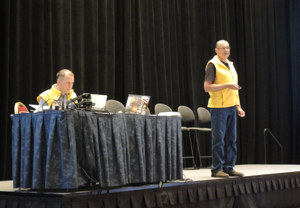

<head>
<meta http-equiv="Content-Type" content="text/html; charset=utf-8">
<link rel="stylesheet" type="text/css" href="bc.css">
<!--

-->

</head>

<!---

- move elem util inefficient
  use other method
  https://forums.autodesk.com/t5/revit-api-forum/is-there-a-batch-method-for-placing-adaptive-component-points/m-p/7666601

Transform Utils, DirectShape Builder and DevDays Online Webinars coming up for #RevitAPI @AutodeskRevit #bim #dynamobim @AutodeskForge #ForgeDevCon http://bit.ly/devdays2018

Revitalizer shared two important hints: a performance issue using <code>ElementTransformUtils</code> and a problem reporting mechanism built into the <code>TessellatedShapeBuilderResult</code> method <code>GetIssuesForFaceSet</code>.
First, though, let's highlight an even more important upcoming event, the series of DevDays online webinars
&ndash; Register now for Autodesk DevDays online webinars
&ndash; Avoid using <code>ElementTransformUtils</code> for batches
&ndash; Finding cause of <code>DirectShape</code> generation problem...

--->

### Transform Utils, DirectShape Builder and DevDays Online Webinars

Rudi [@Revitalizer](https://forums.autodesk.com/t5/user/viewprofilepage/user-id/1103138) Honke
shared two important hints: a performance issue using `ElementTransformUtils` and a problem reporting mechanism built into the `TessellatedShapeBuilderResult` method `GetIssuesForFaceSet`.

First, though, let's highlight an even more important upcoming event, the series of DevDays online webinars:

- [Register now for Autodesk DevDays online webinars](#2)
- [Avoid using `ElementTransformUtils` for batches](#3)
- [Finding cause of `DirectShape` generation problem](#4)

####Register now for Autodesk DevDays Online Webinars

Join us for the series of seven DevDays Webinars beginning on February 6th.  

DevDays Online is the best way to keep up to date with new and upcoming technology and features.
After the introductory business-oriented session that reviews Autodesk's business growth curves &ndash; past, present and future, most of the webinars focus on desktop application development, and additionally two on Forge and one on BIM 360 for cloud development. 

As in previous DevDays events, we have a theme: *The Journey Continues*.

In the first webinar &ndash; DevDays Keynotes &ndash; Jim Quanci, Senior Director, Software Partner Development, will cover the journey in-depth with a presentation on Autodesk's strategic direction.  This includes the move to subscription licenses, Forge strategy, the Autodesk App Store and more.  As he discusses the transition Autodesk is going through from a business and technical perspective, Jim will also explain the opportunities this transition creates for software partners, including our plans to build a much larger customer base &ndash; accessible to you.

In the desktop software webinars, you will learn about the product and API changes and enhancements for AutoCAD, Revit, Civil 3D, InfraWorks, Inventor, Vault and Fusion.
These sessions will help you prepare for the upcoming Autodesk 2019 family of products, so that you can be ready to delight our joint customers by having your applications compatible with the new releases. 

In addition to making sure you stay current with Autodesk desktop technology, now is the time to start investing in 'what's next' &ndash; the next wave in the journey.  Forge is Autodesk's answer to 'what's next'.  Forge is the foundation cloud/web technology platform that Autodesk is building its next generation of tools on &ndash; and also making available to you. Forge is not an Autodesk experiment.  It's your opportunity to catch the next wave &ndash; the shift to the cloud. Autodesk itself is the largest user of Forge in the world &ndash; with several hundred thousand users every day using BIM 360, Fusion 360, A360 and more. Join us &ndash; and over a thousand other companies that have built Forge into their apps/services already. Attend the two Forge webinars to learn how you too can deliver new capabilities to your customers.  [Learn more about Forge](https://forge.autodesk.com).

Register today for the webinars of your choice:

- Tue 2018-02-06 &ndash; DevDays Keynotes &ndash; [Register](https://register.gotowebinar.com/register/797707066268687619)
- Wed 2018-02-07 &ndash; Forge Platform overview and Roadmap &ndash; [Register](https://register.gotowebinar.com/register/4102861009595953155)
- Thu 2018-02-08 &ndash; Revit API, Civil 3D and InfraWorks updates &ndash; [Register](https://register.gotowebinar.com/register/490550796468203011)
- Tue 2018-02-13 &ndash; Forge API update (in detail) &ndash; [Register](https://register.gotowebinar.com/register/8531203464091738883)
- Wed 2018-02-14 &ndash; Inventor, Vault and Fusion API updates &ndash; [Register](https://register.gotowebinar.com/register/4033528005371724547)
- Thu 2018-02-15 &ndash; AutoCAD and Design Automation for AutoCAD API updates &ndash; [Register](https://register.gotowebinar.com/register/8219783288198582531)
- Tue 2018-02-20 &ndash; BIM 360 product and API update &ndash; [Register](https://register.gotowebinar.com/register/3690479277994010883)

####Avoid Using ElementTransformUtils for Batches

The `ElementTransformUtils` `MoveElement` method has an important performance issue when used on a large number of elements, as pointed out by Revitalizer in 
the [Revit API discussion forum](http://forums.autodesk.com/t5/revit-api-forum/bd-p/160) thread
on [a batch method for placing adaptive component points](https://forums.autodesk.com/t5/revit-api-forum/is-there-a-batch-method-for-placing-adaptive-component-points/m-p/7672487):

**Question:** I have a performance issue placing and moving adaptive components using the following code:

<pre class="prettyprint">
  # place family instance, get default placement points,
  # subtract from my desired coordinates (list) and move element
  
  inst = AdaptiveComponentInstanceUtils.CreateAdaptiveComponentInstance(
    doc, inst)
  
  placePointIds = []
  
  placePointIds = AdaptiveComponentInstanceUtils.GetInstancePlacementPointElementRefIds(
    inst)
  
  for ind, item in enumerate(placePointIds):
  
    # assign a point object to refpt
    # refpt is the orginal point of the family
    # newpt the new point derived from pt information
  
    refpt = doc.GetElement(item)
  
    newpt = pt[ind]
  
    trans = newpt.Subtract(refpt.Position)
  
    ElementTransformUtils.MoveElement(doc, item, trans)
</pre>

**Answer:** There is a performance problem with `ElementTransformUtils`, as pointed out in the thread
on [ElementTransformUtils: performance issue](https://forums.autodesk.com/t5/revit-api-forum/elementtransformutils-performance-issue/m-p/5775624).

It seems to auto regenerate after each movement.

In that case, you have to move every point separately. If the bad performance issue is related to the `ElementTransformUtils` methods, this might give better performance. To know for sure, you'd have to test.

Maybe you can use `SetCoordinateSystem` instead:

<pre class="prettyprint">
  (refpt as ReferencePoint).SetCoordinateSystem()
</pre>

Fleshed out a bit more, it could look like this:

<pre class="prettyprint">
  Element refpt = doc.GetElement(item);
  XYZ newpt = pt[ind];
  Transform tf = Transform.Identity;
  tf.Origin = newpt;
  (refpt as ReferencePoint).SetCoordinateSystem(tf);
</pre>

**Response:** Hey, awesome!!! It works! Performance is way better and the code runs fluid!

I suppose this is even better than moving components, although I would be interested to compare both methods once it is fixed.

My code now looks like this:

<pre class="prettyprint">
  placePointIds = AdaptiveComponentInstanceUtils.GetInstancePlacementPointElementRefIds(
    inst):
  
  for ind, item in enumerate(placePointIds):
    refpt = doc.GetElement(item)
    newpt = pt[ind]
    tf = Transform.Identity
    tf.Origin = newpt
    refpt.SetCoordinateSystem(tf);
</pre>

####Finding Cause of DirectShape Generation Problem

Revitalizer provided more important hints on detecting problems in 
the [Revit API discussion forum](http://forums.autodesk.com/t5/revit-api-forum/bd-p/160) thread
on a [problem with solid creation by `TessellatedShapeBuilder`](https://forums.autodesk.com/t5/revit-api-forum/problem-with-solid-creation-by-tessellatedshapebuilder/m-p/7678156):

**Question:** I want to import some solids created by an external library into Revit with TessellatedShapeBuilder.

All solids are correctly tessellated and closed.

But I got sometimes the following error on calling `TessellatedShapeBuilder.Build`:

> Could not create consistent vertex list

As far as I know there are some restriction about triangles, e.g., the distance between two vertices.

I could merge two vertices in this case.

But I don't know any other restriction, and how could I adjust my vertex list and triangle list to avoid the above error?

**Answer:**

The problem might indeed be due to vertices lying too close together; they need to
be [at least about 2 mm apart](http://thebuildingcoder.typepad.com/blog/2014/05/directshape-performance-and-minimum-size.html).

What I always do in these kind of cases:

While reading the input vertices one by one, I put them into a dictionary equipped with an `XYZ` comparison operator.

If a new vertex is very close to an existing one, my comparison operator considers the two vertices to be equal, so I ignore it and use the existing one instead.

The `GetVertices` method
in [The Building Coder samples CmdNestedInstanceGeo.cs](https://github.com/jeremytammik/the_building_coder_samples/blob/master/BuildingCoder/BuildingCoder/CmdNestedInstanceGeo.cs#L30-L85) does
something similar using an `XyzEqualityComparer`.

You would simply have to replace the face vertex index of any ignored vertex by the index of its replacement.

There is also an `Appliation.MinimumThickness` property. It says in
the [Revit API help file RevitAPI.chm](http://www.revitapidocs.com/2018.1/8bff8d69-bc8d-b0ea-ed2f-6af1bed07e75.htm):

> The minimum thickness allowed in Revit for a variety of geometric constructs. These include blends, extrusions, and wall layers.

Whatever problem you run into, try reproducing the same issue manually through the user interface.

That will probably provide more information on what the problem is than the Revit API does.

You should also have a look at `TessellatedShapeBuilderResult.GetIssuesForFaceSet`.

In fact, it may localize exactly the faces and vertices causing the problem.

Each `TesselatedBuildIssue` provides a `GetDescription` method.

####Addendum

Rudi disagrees with my statement in the introduction above and corrects it, saying:

> Thank you for mentioning me in the current TBC post!

> I must admit that for both topics (ElementTransformUtils and DirectShape), I could not help the people, in fact:

> - For the ElementTransformUtils method, FAIR59 provided the solution (SetCoordinateSystem), but he isn't even mentioned on TBC.
> - For the DirectShape problem, the user said that he already checked my suggestions, without any success.

I still think Rudi's suggestions are helpful and important and worth highlighting.

Many thanks to FAIR59 as well, of course, as so often before in the past couple of months.
