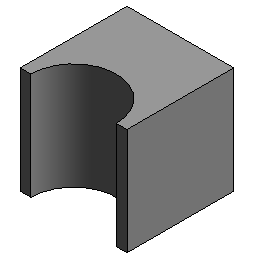

<head>
<meta http-equiv="Content-Type" content="text/html; charset=utf-8">
<link rel="stylesheet" type="text/css" href="bc.css">
<!--

-->

</head>

<!---

- 13849819 [DirectShape内にボイドを入れてジオメトリをカットできますか(すみませんが、少し急ぎでお願いします)]

DirectShape from BrepBuilder and Boolean #RevitAPI @AutodeskRevit #bim #dynamobim @AutodeskForge #ForgeDevCon http://bit.ly/brepbuilder

Here is an interesting code snippet illustrating the use of <code>BRepBuilder</code> and Boolean operations to generate a <code>DirectShape</code>.
It might come in useful somewhere, even though this approach is non-optimal to address the task at hand, as explained below...

--->

### DirectShape from BrepBuilder and Boolean

Here is an interesting code snippet illustrating the use of `BRepBuilder` and Boolean operations to generate a `DirectShape`.

It might come in useful somewhere, even though this approach is non-optimal to address the task at hand, as explained below.

**Question:** I want to create a `DirectShape` object which is cut by void geometry.

I found that
the [`BRepBuilder` constructor](http://www.revitapidocs.com/2018.1/b3eb95b6-2297-44dc-df94-38aed1940b8c.htm) accepts
both `BRepType.Void` and `BRepType.Solid`, so I tested if I could use that.

However, my attempts so far lead to an internal error.
 
Is there any mistake in my test code?

Does the `DirectShape.AppendShape` method not accept a void shape?

**Answer:** It seems to me that you actually want to do is create two solid geometries, and then use a Boolean operation to subtract one from the other.

This will give the desired shape.

Taking a look at the code, I notice that the function `CreateBrepVoid` is incorrect &ndash; it tells the `BRepBuilder` that it wants to create a void, but the geometry defines a solid, not a void. This is determined by the face and edge loop orientations. I assume that `BRepBuilder` complains about invalid input at some point in the process.
 
The orientation conventions are discussed in the descriptions of
BRepBuilder [AddFace](http://www.revitapidocs.com/2018.1/cb899f6d-c4e0-0983-ab70-bae0a620dc8d.htm)
and [AddCoEdge](http://www.revitapidocs.com/2018.1/c4713a48-712b-e293-6745-a266af97e195.htm) methods.
 
Please note that `BRepBuilder` wasn’t really meant for 'manually' constructing geometry. Its interface is very cumbersome for that purpose. It was meant for translating existing geometry into Revit, with rather thorough validation of the input geometry.

Here is the code that constructs two solid geometries and then applies the Boolean operation to find the difference.

The code constructs the desired `DirectShape` shown in the image above:

<pre class="code">
[Transaction(&nbsp;TransactionMode.Manual&nbsp;)]
class&nbsp;CmdBrepBuilder&nbsp;:&nbsp;IExternalCommand
{
&nbsp;&nbsp;///&nbsp;&lt;summary&gt;
&nbsp;&nbsp;///&nbsp;Create&nbsp;a&nbsp;cube&nbsp;100&nbsp;x&nbsp;100&nbsp;x&nbsp;100,&nbsp;from&nbsp;
&nbsp;&nbsp;///&nbsp;(0,0,0)&nbsp;to&nbsp;(100,&nbsp;100,&nbsp;100).
&nbsp;&nbsp;///&nbsp;&lt;/summary&gt;
&nbsp;&nbsp;public&nbsp;BRepBuilder&nbsp;CreateBrepSolid()
&nbsp;&nbsp;{
&nbsp;&nbsp;&nbsp;&nbsp;BRepBuilder&nbsp;b&nbsp;=&nbsp;new&nbsp;BRepBuilder(&nbsp;BRepType.Solid&nbsp;);
 
&nbsp;&nbsp;&nbsp;&nbsp;//&nbsp;1.&nbsp;Planes.
&nbsp;&nbsp;&nbsp;&nbsp;//&nbsp;naming&nbsp;convention&nbsp;for&nbsp;faces&nbsp;and&nbsp;planes:
&nbsp;&nbsp;&nbsp;&nbsp;//&nbsp;We&nbsp;are&nbsp;looking&nbsp;at&nbsp;this&nbsp;cube&nbsp;in&nbsp;an&nbsp;isometric&nbsp;view.&nbsp;
&nbsp;&nbsp;&nbsp;&nbsp;//&nbsp;X&nbsp;is&nbsp;down&nbsp;and&nbsp;to&nbsp;the&nbsp;left&nbsp;of&nbsp;us,&nbsp;Y&nbsp;is&nbsp;horizontal&nbsp;
&nbsp;&nbsp;&nbsp;&nbsp;//&nbsp;and&nbsp;points&nbsp;to&nbsp;the&nbsp;right,&nbsp;Z&nbsp;is&nbsp;up.
&nbsp;&nbsp;&nbsp;&nbsp;//&nbsp;front&nbsp;and&nbsp;back&nbsp;faces&nbsp;are&nbsp;along&nbsp;the&nbsp;X&nbsp;axis,&nbsp;left&nbsp;
&nbsp;&nbsp;&nbsp;&nbsp;//&nbsp;and&nbsp;right&nbsp;are&nbsp;along&nbsp;the&nbsp;Y&nbsp;axis,&nbsp;top&nbsp;and&nbsp;bottom&nbsp;
&nbsp;&nbsp;&nbsp;&nbsp;//&nbsp;are&nbsp;along&nbsp;the&nbsp;Z&nbsp;axis.
&nbsp;&nbsp;&nbsp;&nbsp;Plane&nbsp;bottom&nbsp;=&nbsp;Plane.CreateByOriginAndBasis(&nbsp;new&nbsp;XYZ(&nbsp;50,&nbsp;50,&nbsp;0&nbsp;),&nbsp;new&nbsp;XYZ(&nbsp;1,&nbsp;0,&nbsp;0&nbsp;),&nbsp;new&nbsp;XYZ(&nbsp;0,&nbsp;1,&nbsp;0&nbsp;)&nbsp;);&nbsp;//&nbsp;bottom.&nbsp;XY&nbsp;plane,&nbsp;Z&nbsp;=&nbsp;0,&nbsp;normal&nbsp;pointing&nbsp;inside&nbsp;the&nbsp;cube.
&nbsp;&nbsp;&nbsp;&nbsp;Plane&nbsp;top&nbsp;=&nbsp;Plane.CreateByOriginAndBasis(&nbsp;new&nbsp;XYZ(&nbsp;50,&nbsp;50,&nbsp;100&nbsp;),&nbsp;new&nbsp;XYZ(&nbsp;1,&nbsp;0,&nbsp;0&nbsp;),&nbsp;new&nbsp;XYZ(&nbsp;0,&nbsp;1,&nbsp;0&nbsp;)&nbsp;);&nbsp;//&nbsp;top.&nbsp;XY&nbsp;plane,&nbsp;Z&nbsp;=&nbsp;100,&nbsp;normal&nbsp;pointing&nbsp;outside&nbsp;the&nbsp;cube.
&nbsp;&nbsp;&nbsp;&nbsp;Plane&nbsp;front&nbsp;=&nbsp;Plane.CreateByOriginAndBasis(&nbsp;new&nbsp;XYZ(&nbsp;100,&nbsp;50,&nbsp;50&nbsp;),&nbsp;new&nbsp;XYZ(&nbsp;0,&nbsp;0,&nbsp;1&nbsp;),&nbsp;new&nbsp;XYZ(&nbsp;0,&nbsp;1,&nbsp;0&nbsp;)&nbsp;);&nbsp;//&nbsp;front&nbsp;side.&nbsp;ZY&nbsp;plane,&nbsp;X&nbsp;=&nbsp;0,&nbsp;normal&nbsp;pointing&nbsp;inside&nbsp;the&nbsp;cube.
&nbsp;&nbsp;&nbsp;&nbsp;Plane&nbsp;back&nbsp;=&nbsp;Plane.CreateByOriginAndBasis(&nbsp;new&nbsp;XYZ(&nbsp;0,&nbsp;50,&nbsp;50&nbsp;),&nbsp;new&nbsp;XYZ(&nbsp;0,&nbsp;0,&nbsp;1&nbsp;),&nbsp;new&nbsp;XYZ(&nbsp;0,&nbsp;1,&nbsp;0&nbsp;)&nbsp;);&nbsp;//&nbsp;back&nbsp;side.&nbsp;ZY&nbsp;plane,&nbsp;X&nbsp;=&nbsp;0,&nbsp;normal&nbsp;pointing&nbsp;outside&nbsp;the&nbsp;cube.
&nbsp;&nbsp;&nbsp;&nbsp;Plane&nbsp;left&nbsp;=&nbsp;Plane.CreateByOriginAndBasis(&nbsp;new&nbsp;XYZ(&nbsp;50,&nbsp;0,&nbsp;50&nbsp;),&nbsp;new&nbsp;XYZ(&nbsp;0,&nbsp;0,&nbsp;1&nbsp;),&nbsp;new&nbsp;XYZ(&nbsp;1,&nbsp;0,&nbsp;0&nbsp;)&nbsp;);&nbsp;//&nbsp;left&nbsp;side.&nbsp;ZX&nbsp;plane,&nbsp;Y&nbsp;=&nbsp;0,&nbsp;normal&nbsp;pointing&nbsp;inside&nbsp;the&nbsp;cube
&nbsp;&nbsp;&nbsp;&nbsp;Plane&nbsp;right&nbsp;=&nbsp;Plane.CreateByOriginAndBasis(&nbsp;new&nbsp;XYZ(&nbsp;50,&nbsp;100,&nbsp;50&nbsp;),&nbsp;new&nbsp;XYZ(&nbsp;0,&nbsp;0,&nbsp;1&nbsp;),&nbsp;new&nbsp;XYZ(&nbsp;1,&nbsp;0,&nbsp;0&nbsp;)&nbsp;);&nbsp;//&nbsp;right&nbsp;side.&nbsp;ZX&nbsp;plane,&nbsp;Y&nbsp;=&nbsp;100,&nbsp;normal&nbsp;pointing&nbsp;outside&nbsp;the&nbsp;cube
 
&nbsp;&nbsp;&nbsp;&nbsp;//&nbsp;2.&nbsp;Faces.
&nbsp;&nbsp;&nbsp;&nbsp;BRepBuilderGeometryId&nbsp;faceId_Bottom&nbsp;=&nbsp;b.AddFace(&nbsp;BRepBuilderSurfaceGeometry.Create(&nbsp;bottom,&nbsp;null&nbsp;),&nbsp;true&nbsp;);
&nbsp;&nbsp;&nbsp;&nbsp;BRepBuilderGeometryId&nbsp;faceId_Top&nbsp;=&nbsp;b.AddFace(&nbsp;BRepBuilderSurfaceGeometry.Create(&nbsp;top,&nbsp;null&nbsp;),&nbsp;false&nbsp;);
&nbsp;&nbsp;&nbsp;&nbsp;BRepBuilderGeometryId&nbsp;faceId_Front&nbsp;=&nbsp;b.AddFace(&nbsp;BRepBuilderSurfaceGeometry.Create(&nbsp;front,&nbsp;null&nbsp;),&nbsp;true&nbsp;);
&nbsp;&nbsp;&nbsp;&nbsp;BRepBuilderGeometryId&nbsp;faceId_Back&nbsp;=&nbsp;b.AddFace(&nbsp;BRepBuilderSurfaceGeometry.Create(&nbsp;back,&nbsp;null&nbsp;),&nbsp;false&nbsp;);
&nbsp;&nbsp;&nbsp;&nbsp;BRepBuilderGeometryId&nbsp;faceId_Left&nbsp;=&nbsp;b.AddFace(&nbsp;BRepBuilderSurfaceGeometry.Create(&nbsp;left,&nbsp;null&nbsp;),&nbsp;true&nbsp;);
&nbsp;&nbsp;&nbsp;&nbsp;BRepBuilderGeometryId&nbsp;faceId_Right&nbsp;=&nbsp;b.AddFace(&nbsp;BRepBuilderSurfaceGeometry.Create(&nbsp;right,&nbsp;null&nbsp;),&nbsp;false&nbsp;);
 
&nbsp;&nbsp;&nbsp;&nbsp;//&nbsp;3.&nbsp;Edges.
 
&nbsp;&nbsp;&nbsp;&nbsp;//&nbsp;3.a&nbsp;(define&nbsp;edge&nbsp;geometry)
&nbsp;&nbsp;&nbsp;&nbsp;//&nbsp;walk&nbsp;around&nbsp;bottom&nbsp;face
&nbsp;&nbsp;&nbsp;&nbsp;BRepBuilderEdgeGeometry&nbsp;edgeBottomFront&nbsp;=&nbsp;BRepBuilderEdgeGeometry.Create(&nbsp;new&nbsp;XYZ(&nbsp;100,&nbsp;0,&nbsp;0&nbsp;),&nbsp;new&nbsp;XYZ(&nbsp;100,&nbsp;100,&nbsp;0&nbsp;)&nbsp;);
&nbsp;&nbsp;&nbsp;&nbsp;BRepBuilderEdgeGeometry&nbsp;edgeBottomRight&nbsp;=&nbsp;BRepBuilderEdgeGeometry.Create(&nbsp;new&nbsp;XYZ(&nbsp;100,&nbsp;100,&nbsp;0&nbsp;),&nbsp;new&nbsp;XYZ(&nbsp;0,&nbsp;100,&nbsp;0&nbsp;)&nbsp;);
&nbsp;&nbsp;&nbsp;&nbsp;BRepBuilderEdgeGeometry&nbsp;edgeBottomBack&nbsp;=&nbsp;BRepBuilderEdgeGeometry.Create(&nbsp;new&nbsp;XYZ(&nbsp;0,&nbsp;100,&nbsp;0&nbsp;),&nbsp;new&nbsp;XYZ(&nbsp;0,&nbsp;0,&nbsp;0&nbsp;)&nbsp;);
&nbsp;&nbsp;&nbsp;&nbsp;BRepBuilderEdgeGeometry&nbsp;edgeBottomLeft&nbsp;=&nbsp;BRepBuilderEdgeGeometry.Create(&nbsp;new&nbsp;XYZ(&nbsp;0,&nbsp;0,&nbsp;0&nbsp;),&nbsp;new&nbsp;XYZ(&nbsp;100,&nbsp;0,&nbsp;0&nbsp;)&nbsp;);
 
&nbsp;&nbsp;&nbsp;&nbsp;//&nbsp;now&nbsp;walk&nbsp;around&nbsp;top&nbsp;face
&nbsp;&nbsp;&nbsp;&nbsp;BRepBuilderEdgeGeometry&nbsp;edgeTopFront&nbsp;=&nbsp;BRepBuilderEdgeGeometry.Create(&nbsp;new&nbsp;XYZ(&nbsp;100,&nbsp;0,&nbsp;100&nbsp;),&nbsp;new&nbsp;XYZ(&nbsp;100,&nbsp;100,&nbsp;100&nbsp;)&nbsp;);
&nbsp;&nbsp;&nbsp;&nbsp;BRepBuilderEdgeGeometry&nbsp;edgeTopRight&nbsp;=&nbsp;BRepBuilderEdgeGeometry.Create(&nbsp;new&nbsp;XYZ(&nbsp;100,&nbsp;100,&nbsp;100&nbsp;),&nbsp;new&nbsp;XYZ(&nbsp;0,&nbsp;100,&nbsp;100&nbsp;)&nbsp;);
&nbsp;&nbsp;&nbsp;&nbsp;BRepBuilderEdgeGeometry&nbsp;edgeTopBack&nbsp;=&nbsp;BRepBuilderEdgeGeometry.Create(&nbsp;new&nbsp;XYZ(&nbsp;0,&nbsp;100,&nbsp;100&nbsp;),&nbsp;new&nbsp;XYZ(&nbsp;0,&nbsp;0,&nbsp;100&nbsp;)&nbsp;);
&nbsp;&nbsp;&nbsp;&nbsp;BRepBuilderEdgeGeometry&nbsp;edgeTopLeft&nbsp;=&nbsp;BRepBuilderEdgeGeometry.Create(&nbsp;new&nbsp;XYZ(&nbsp;0,&nbsp;0,&nbsp;100&nbsp;),&nbsp;new&nbsp;XYZ(&nbsp;100,&nbsp;0,&nbsp;100&nbsp;)&nbsp;);
 
&nbsp;&nbsp;&nbsp;&nbsp;//&nbsp;sides
&nbsp;&nbsp;&nbsp;&nbsp;BRepBuilderEdgeGeometry&nbsp;edgeFrontRight&nbsp;=&nbsp;BRepBuilderEdgeGeometry.Create(&nbsp;new&nbsp;XYZ(&nbsp;100,&nbsp;100,&nbsp;0&nbsp;),&nbsp;new&nbsp;XYZ(&nbsp;100,&nbsp;100,&nbsp;100&nbsp;)&nbsp;);
&nbsp;&nbsp;&nbsp;&nbsp;BRepBuilderEdgeGeometry&nbsp;edgeRightBack&nbsp;=&nbsp;BRepBuilderEdgeGeometry.Create(&nbsp;new&nbsp;XYZ(&nbsp;0,&nbsp;100,&nbsp;0&nbsp;),&nbsp;new&nbsp;XYZ(&nbsp;0,&nbsp;100,&nbsp;100&nbsp;)&nbsp;);
&nbsp;&nbsp;&nbsp;&nbsp;BRepBuilderEdgeGeometry&nbsp;edgeBackLeft&nbsp;=&nbsp;BRepBuilderEdgeGeometry.Create(&nbsp;new&nbsp;XYZ(&nbsp;0,&nbsp;0,&nbsp;0&nbsp;),&nbsp;new&nbsp;XYZ(&nbsp;0,&nbsp;0,&nbsp;100&nbsp;)&nbsp;);
&nbsp;&nbsp;&nbsp;&nbsp;BRepBuilderEdgeGeometry&nbsp;edgeLeftFront&nbsp;=&nbsp;BRepBuilderEdgeGeometry.Create(&nbsp;new&nbsp;XYZ(&nbsp;100,&nbsp;0,&nbsp;0&nbsp;),&nbsp;new&nbsp;XYZ(&nbsp;100,&nbsp;0,&nbsp;100&nbsp;)&nbsp;);
 
&nbsp;&nbsp;&nbsp;&nbsp;//&nbsp;3.b&nbsp;(define&nbsp;the&nbsp;edges&nbsp;themselves)
&nbsp;&nbsp;&nbsp;&nbsp;BRepBuilderGeometryId&nbsp;edgeId_BottomFront&nbsp;=&nbsp;b.AddEdge(&nbsp;edgeBottomFront&nbsp;);
&nbsp;&nbsp;&nbsp;&nbsp;BRepBuilderGeometryId&nbsp;edgeId_BottomRight&nbsp;=&nbsp;b.AddEdge(&nbsp;edgeBottomRight&nbsp;);
&nbsp;&nbsp;&nbsp;&nbsp;BRepBuilderGeometryId&nbsp;edgeId_BottomBack&nbsp;=&nbsp;b.AddEdge(&nbsp;edgeBottomBack&nbsp;);
&nbsp;&nbsp;&nbsp;&nbsp;BRepBuilderGeometryId&nbsp;edgeId_BottomLeft&nbsp;=&nbsp;b.AddEdge(&nbsp;edgeBottomLeft&nbsp;);
&nbsp;&nbsp;&nbsp;&nbsp;BRepBuilderGeometryId&nbsp;edgeId_TopFront&nbsp;=&nbsp;b.AddEdge(&nbsp;edgeTopFront&nbsp;);
&nbsp;&nbsp;&nbsp;&nbsp;BRepBuilderGeometryId&nbsp;edgeId_TopRight&nbsp;=&nbsp;b.AddEdge(&nbsp;edgeTopRight&nbsp;);
&nbsp;&nbsp;&nbsp;&nbsp;BRepBuilderGeometryId&nbsp;edgeId_TopBack&nbsp;=&nbsp;b.AddEdge(&nbsp;edgeTopBack&nbsp;);
&nbsp;&nbsp;&nbsp;&nbsp;BRepBuilderGeometryId&nbsp;edgeId_TopLeft&nbsp;=&nbsp;b.AddEdge(&nbsp;edgeTopLeft&nbsp;);
&nbsp;&nbsp;&nbsp;&nbsp;BRepBuilderGeometryId&nbsp;edgeId_FrontRight&nbsp;=&nbsp;b.AddEdge(&nbsp;edgeFrontRight&nbsp;);
&nbsp;&nbsp;&nbsp;&nbsp;BRepBuilderGeometryId&nbsp;edgeId_RightBack&nbsp;=&nbsp;b.AddEdge(&nbsp;edgeRightBack&nbsp;);
&nbsp;&nbsp;&nbsp;&nbsp;BRepBuilderGeometryId&nbsp;edgeId_BackLeft&nbsp;=&nbsp;b.AddEdge(&nbsp;edgeBackLeft&nbsp;);
&nbsp;&nbsp;&nbsp;&nbsp;BRepBuilderGeometryId&nbsp;edgeId_LeftFront&nbsp;=&nbsp;b.AddEdge(&nbsp;edgeLeftFront&nbsp;);
 
&nbsp;&nbsp;&nbsp;&nbsp;//&nbsp;4.&nbsp;Loops.
&nbsp;&nbsp;&nbsp;&nbsp;BRepBuilderGeometryId&nbsp;loopId_Bottom&nbsp;=&nbsp;b.AddLoop(&nbsp;faceId_Bottom&nbsp;);
&nbsp;&nbsp;&nbsp;&nbsp;BRepBuilderGeometryId&nbsp;loopId_Top&nbsp;=&nbsp;b.AddLoop(&nbsp;faceId_Top&nbsp;);
&nbsp;&nbsp;&nbsp;&nbsp;BRepBuilderGeometryId&nbsp;loopId_Front&nbsp;=&nbsp;b.AddLoop(&nbsp;faceId_Front&nbsp;);
&nbsp;&nbsp;&nbsp;&nbsp;BRepBuilderGeometryId&nbsp;loopId_Back&nbsp;=&nbsp;b.AddLoop(&nbsp;faceId_Back&nbsp;);
&nbsp;&nbsp;&nbsp;&nbsp;BRepBuilderGeometryId&nbsp;loopId_Right&nbsp;=&nbsp;b.AddLoop(&nbsp;faceId_Right&nbsp;);
&nbsp;&nbsp;&nbsp;&nbsp;BRepBuilderGeometryId&nbsp;loopId_Left&nbsp;=&nbsp;b.AddLoop(&nbsp;faceId_Left&nbsp;);
 
&nbsp;&nbsp;&nbsp;&nbsp;//&nbsp;5.&nbsp;Co-edges.&nbsp;
&nbsp;&nbsp;&nbsp;&nbsp;//&nbsp;Bottom&nbsp;face.&nbsp;All&nbsp;edges&nbsp;reversed
&nbsp;&nbsp;&nbsp;&nbsp;b.AddCoEdge(&nbsp;loopId_Bottom,&nbsp;edgeId_BottomFront,&nbsp;true&nbsp;);&nbsp;//&nbsp;other&nbsp;direction&nbsp;in&nbsp;front&nbsp;loop
&nbsp;&nbsp;&nbsp;&nbsp;b.AddCoEdge(&nbsp;loopId_Bottom,&nbsp;edgeId_BottomLeft,&nbsp;true&nbsp;);&nbsp;&nbsp;//&nbsp;other&nbsp;direction&nbsp;in&nbsp;left&nbsp;loop
&nbsp;&nbsp;&nbsp;&nbsp;b.AddCoEdge(&nbsp;loopId_Bottom,&nbsp;edgeId_BottomBack,&nbsp;true&nbsp;);&nbsp;&nbsp;//&nbsp;other&nbsp;direction&nbsp;in&nbsp;back&nbsp;loop
&nbsp;&nbsp;&nbsp;&nbsp;b.AddCoEdge(&nbsp;loopId_Bottom,&nbsp;edgeId_BottomRight,&nbsp;true&nbsp;);&nbsp;//&nbsp;other&nbsp;direction&nbsp;in&nbsp;right&nbsp;loop
&nbsp;&nbsp;&nbsp;&nbsp;b.FinishLoop(&nbsp;loopId_Bottom&nbsp;);
&nbsp;&nbsp;&nbsp;&nbsp;b.FinishFace(&nbsp;faceId_Bottom&nbsp;);
 
&nbsp;&nbsp;&nbsp;&nbsp;//&nbsp;Top&nbsp;face.&nbsp;All&nbsp;edges&nbsp;NOT&nbsp;reversed.
&nbsp;&nbsp;&nbsp;&nbsp;b.AddCoEdge(&nbsp;loopId_Top,&nbsp;edgeId_TopFront,&nbsp;false&nbsp;);&nbsp;&nbsp;//&nbsp;other&nbsp;direction&nbsp;in&nbsp;front&nbsp;loop.
&nbsp;&nbsp;&nbsp;&nbsp;b.AddCoEdge(&nbsp;loopId_Top,&nbsp;edgeId_TopRight,&nbsp;false&nbsp;);&nbsp;&nbsp;//&nbsp;other&nbsp;direction&nbsp;in&nbsp;right&nbsp;loop
&nbsp;&nbsp;&nbsp;&nbsp;b.AddCoEdge(&nbsp;loopId_Top,&nbsp;edgeId_TopBack,&nbsp;false&nbsp;);&nbsp;&nbsp;&nbsp;//&nbsp;other&nbsp;direction&nbsp;in&nbsp;back&nbsp;loop
&nbsp;&nbsp;&nbsp;&nbsp;b.AddCoEdge(&nbsp;loopId_Top,&nbsp;edgeId_TopLeft,&nbsp;false&nbsp;);&nbsp;&nbsp;&nbsp;//&nbsp;other&nbsp;direction&nbsp;in&nbsp;left&nbsp;loop
&nbsp;&nbsp;&nbsp;&nbsp;b.FinishLoop(&nbsp;loopId_Top&nbsp;);
&nbsp;&nbsp;&nbsp;&nbsp;b.FinishFace(&nbsp;faceId_Top&nbsp;);
 
&nbsp;&nbsp;&nbsp;&nbsp;//&nbsp;Front&nbsp;face.
&nbsp;&nbsp;&nbsp;&nbsp;b.AddCoEdge(&nbsp;loopId_Front,&nbsp;edgeId_BottomFront,&nbsp;false&nbsp;);&nbsp;//&nbsp;other&nbsp;direction&nbsp;in&nbsp;bottom&nbsp;loop
&nbsp;&nbsp;&nbsp;&nbsp;b.AddCoEdge(&nbsp;loopId_Front,&nbsp;edgeId_FrontRight,&nbsp;false&nbsp;);&nbsp;&nbsp;//&nbsp;other&nbsp;direction&nbsp;in&nbsp;right&nbsp;loop
&nbsp;&nbsp;&nbsp;&nbsp;b.AddCoEdge(&nbsp;loopId_Front,&nbsp;edgeId_TopFront,&nbsp;true&nbsp;);&nbsp;//&nbsp;other&nbsp;direction&nbsp;in&nbsp;top&nbsp;loop.
&nbsp;&nbsp;&nbsp;&nbsp;b.AddCoEdge(&nbsp;loopId_Front,&nbsp;edgeId_LeftFront,&nbsp;true&nbsp;);&nbsp;//&nbsp;other&nbsp;direction&nbsp;in&nbsp;left&nbsp;loop.
&nbsp;&nbsp;&nbsp;&nbsp;b.FinishLoop(&nbsp;loopId_Front&nbsp;);
&nbsp;&nbsp;&nbsp;&nbsp;b.FinishFace(&nbsp;faceId_Front&nbsp;);
 
&nbsp;&nbsp;&nbsp;&nbsp;//&nbsp;Back&nbsp;face
&nbsp;&nbsp;&nbsp;&nbsp;b.AddCoEdge(&nbsp;loopId_Back,&nbsp;edgeId_BottomBack,&nbsp;false&nbsp;);&nbsp;//&nbsp;other&nbsp;direction&nbsp;in&nbsp;bottom&nbsp;loop
&nbsp;&nbsp;&nbsp;&nbsp;b.AddCoEdge(&nbsp;loopId_Back,&nbsp;edgeId_BackLeft,&nbsp;false&nbsp;);&nbsp;&nbsp;&nbsp;//&nbsp;other&nbsp;direction&nbsp;in&nbsp;left&nbsp;loop.
&nbsp;&nbsp;&nbsp;&nbsp;b.AddCoEdge(&nbsp;loopId_Back,&nbsp;edgeId_TopBack,&nbsp;true&nbsp;);&nbsp;//&nbsp;other&nbsp;direction&nbsp;in&nbsp;top&nbsp;loop
&nbsp;&nbsp;&nbsp;&nbsp;b.AddCoEdge(&nbsp;loopId_Back,&nbsp;edgeId_RightBack,&nbsp;true&nbsp;);&nbsp;//&nbsp;other&nbsp;direction&nbsp;in&nbsp;right&nbsp;loop.
&nbsp;&nbsp;&nbsp;&nbsp;b.FinishLoop(&nbsp;loopId_Back&nbsp;);
&nbsp;&nbsp;&nbsp;&nbsp;b.FinishFace(&nbsp;faceId_Back&nbsp;);
 
&nbsp;&nbsp;&nbsp;&nbsp;//&nbsp;Right&nbsp;face
&nbsp;&nbsp;&nbsp;&nbsp;b.AddCoEdge(&nbsp;loopId_Right,&nbsp;edgeId_BottomRight,&nbsp;false&nbsp;);&nbsp;//&nbsp;other&nbsp;direction&nbsp;in&nbsp;bottom&nbsp;loop
&nbsp;&nbsp;&nbsp;&nbsp;b.AddCoEdge(&nbsp;loopId_Right,&nbsp;edgeId_RightBack,&nbsp;false&nbsp;);&nbsp;&nbsp;//&nbsp;other&nbsp;direction&nbsp;in&nbsp;back&nbsp;loop
&nbsp;&nbsp;&nbsp;&nbsp;b.AddCoEdge(&nbsp;loopId_Right,&nbsp;edgeId_TopRight,&nbsp;true&nbsp;);&nbsp;&nbsp;&nbsp;//&nbsp;other&nbsp;direction&nbsp;in&nbsp;top&nbsp;loop
&nbsp;&nbsp;&nbsp;&nbsp;b.AddCoEdge(&nbsp;loopId_Right,&nbsp;edgeId_FrontRight,&nbsp;true&nbsp;);&nbsp;//&nbsp;other&nbsp;direction&nbsp;in&nbsp;front&nbsp;loop
&nbsp;&nbsp;&nbsp;&nbsp;b.FinishLoop(&nbsp;loopId_Right&nbsp;);
&nbsp;&nbsp;&nbsp;&nbsp;b.FinishFace(&nbsp;faceId_Right&nbsp;);
 
&nbsp;&nbsp;&nbsp;&nbsp;//&nbsp;Left&nbsp;face
&nbsp;&nbsp;&nbsp;&nbsp;b.AddCoEdge(&nbsp;loopId_Left,&nbsp;edgeId_BottomLeft,&nbsp;false&nbsp;);&nbsp;//&nbsp;other&nbsp;direction&nbsp;in&nbsp;bottom&nbsp;loop
&nbsp;&nbsp;&nbsp;&nbsp;b.AddCoEdge(&nbsp;loopId_Left,&nbsp;edgeId_LeftFront,&nbsp;false&nbsp;);&nbsp;//&nbsp;other&nbsp;direction&nbsp;in&nbsp;front&nbsp;loop
&nbsp;&nbsp;&nbsp;&nbsp;b.AddCoEdge(&nbsp;loopId_Left,&nbsp;edgeId_TopLeft,&nbsp;true&nbsp;);&nbsp;&nbsp;&nbsp;//&nbsp;other&nbsp;direction&nbsp;in&nbsp;top&nbsp;loop
&nbsp;&nbsp;&nbsp;&nbsp;b.AddCoEdge(&nbsp;loopId_Left,&nbsp;edgeId_BackLeft,&nbsp;true&nbsp;);&nbsp;&nbsp;//&nbsp;other&nbsp;direction&nbsp;in&nbsp;back&nbsp;loop
&nbsp;&nbsp;&nbsp;&nbsp;b.FinishLoop(&nbsp;loopId_Left&nbsp;);
&nbsp;&nbsp;&nbsp;&nbsp;b.FinishFace(&nbsp;faceId_Left&nbsp;);
 
&nbsp;&nbsp;&nbsp;&nbsp;b.Finish();
 
&nbsp;&nbsp;&nbsp;&nbsp;return&nbsp;b;
&nbsp;&nbsp;}
 
&nbsp;&nbsp;///&nbsp;&lt;summary&gt;
&nbsp;&nbsp;///&nbsp;Create&nbsp;a&nbsp;cylinder&nbsp;to&nbsp;subtract&nbsp;from&nbsp;the&nbsp;cube.
&nbsp;&nbsp;///&nbsp;&lt;/summary&gt;
&nbsp;&nbsp;public&nbsp;BRepBuilder&nbsp;CreateBrepVoid()
&nbsp;&nbsp;{
&nbsp;&nbsp;&nbsp;&nbsp;//&nbsp;Naming&nbsp;convention&nbsp;for&nbsp;faces&nbsp;and&nbsp;edges:&nbsp;we&nbsp;
&nbsp;&nbsp;&nbsp;&nbsp;//&nbsp;assume&nbsp;that&nbsp;x&nbsp;is&nbsp;to&nbsp;the&nbsp;left&nbsp;and&nbsp;pointing&nbsp;down,&nbsp;
&nbsp;&nbsp;&nbsp;&nbsp;//&nbsp;y&nbsp;is&nbsp;horizontal&nbsp;and&nbsp;pointing&nbsp;to&nbsp;the&nbsp;right,&nbsp;
&nbsp;&nbsp;&nbsp;&nbsp;//&nbsp;z&nbsp;is&nbsp;up.
 
&nbsp;&nbsp;&nbsp;&nbsp;BRepBuilder&nbsp;b&nbsp;=&nbsp;new&nbsp;BRepBuilder(&nbsp;BRepType.Solid&nbsp;);
 
&nbsp;&nbsp;&nbsp;&nbsp;//&nbsp;The&nbsp;surfaces&nbsp;of&nbsp;the&nbsp;four&nbsp;faces.
&nbsp;&nbsp;&nbsp;&nbsp;Frame&nbsp;basis&nbsp;=&nbsp;new&nbsp;Frame(&nbsp;new&nbsp;XYZ(&nbsp;50,&nbsp;0,&nbsp;0&nbsp;),&nbsp;new&nbsp;XYZ(&nbsp;0,&nbsp;1,&nbsp;0&nbsp;),&nbsp;new&nbsp;XYZ(&nbsp;-1,&nbsp;0,&nbsp;0&nbsp;),&nbsp;new&nbsp;XYZ(&nbsp;0,&nbsp;0,&nbsp;1&nbsp;)&nbsp;);
&nbsp;&nbsp;&nbsp;&nbsp;CylindricalSurface&nbsp;cylSurf&nbsp;=&nbsp;CylindricalSurface.Create(&nbsp;basis,&nbsp;40&nbsp;);
&nbsp;&nbsp;&nbsp;&nbsp;Plane&nbsp;top1&nbsp;=&nbsp;Plane.CreateByNormalAndOrigin(&nbsp;new&nbsp;XYZ(&nbsp;0,&nbsp;0,&nbsp;1&nbsp;),&nbsp;new&nbsp;XYZ(&nbsp;0,&nbsp;0,&nbsp;100&nbsp;)&nbsp;);&nbsp;&nbsp;//&nbsp;normal&nbsp;points&nbsp;outside&nbsp;the&nbsp;cylinder
&nbsp;&nbsp;&nbsp;&nbsp;Plane&nbsp;bottom1&nbsp;=&nbsp;Plane.CreateByNormalAndOrigin(&nbsp;new&nbsp;XYZ(&nbsp;0,&nbsp;0,&nbsp;1&nbsp;),&nbsp;new&nbsp;XYZ(&nbsp;0,&nbsp;0,&nbsp;0&nbsp;)&nbsp;);&nbsp;//&nbsp;normal&nbsp;points&nbsp;inside&nbsp;the&nbsp;cylinder
 
&nbsp;&nbsp;&nbsp;&nbsp;//&nbsp;Add&nbsp;the&nbsp;four&nbsp;faces
&nbsp;&nbsp;&nbsp;&nbsp;BRepBuilderGeometryId&nbsp;frontCylFaceId&nbsp;=&nbsp;b.AddFace(&nbsp;BRepBuilderSurfaceGeometry.Create(&nbsp;cylSurf,&nbsp;null&nbsp;),&nbsp;false&nbsp;);
&nbsp;&nbsp;&nbsp;&nbsp;BRepBuilderGeometryId&nbsp;backCylFaceId&nbsp;=&nbsp;b.AddFace(&nbsp;BRepBuilderSurfaceGeometry.Create(&nbsp;cylSurf,&nbsp;null&nbsp;),&nbsp;false&nbsp;);
&nbsp;&nbsp;&nbsp;&nbsp;BRepBuilderGeometryId&nbsp;topFaceId&nbsp;=&nbsp;b.AddFace(&nbsp;BRepBuilderSurfaceGeometry.Create(&nbsp;top1,&nbsp;null&nbsp;),&nbsp;false&nbsp;);
&nbsp;&nbsp;&nbsp;&nbsp;BRepBuilderGeometryId&nbsp;bottomFaceId&nbsp;=&nbsp;b.AddFace(&nbsp;BRepBuilderSurfaceGeometry.Create(&nbsp;bottom1,&nbsp;null&nbsp;),&nbsp;true&nbsp;);
 
&nbsp;&nbsp;&nbsp;&nbsp;//&nbsp;Geometry&nbsp;for&nbsp;the&nbsp;four&nbsp;semi-circular&nbsp;edges&nbsp;and&nbsp;two&nbsp;vertical&nbsp;linear&nbsp;edges
&nbsp;&nbsp;&nbsp;&nbsp;BRepBuilderEdgeGeometry&nbsp;frontEdgeBottom&nbsp;=&nbsp;BRepBuilderEdgeGeometry.Create(&nbsp;Arc.Create(&nbsp;new&nbsp;XYZ(&nbsp;10,&nbsp;0,&nbsp;0&nbsp;),&nbsp;new&nbsp;XYZ(&nbsp;90,&nbsp;0,&nbsp;0&nbsp;),&nbsp;new&nbsp;XYZ(&nbsp;50,&nbsp;40,&nbsp;0&nbsp;)&nbsp;)&nbsp;);
&nbsp;&nbsp;&nbsp;&nbsp;BRepBuilderEdgeGeometry&nbsp;backEdgeBottom&nbsp;=&nbsp;BRepBuilderEdgeGeometry.Create(&nbsp;Arc.Create(&nbsp;new&nbsp;XYZ(&nbsp;90,&nbsp;0,&nbsp;0&nbsp;),&nbsp;new&nbsp;XYZ(&nbsp;10,&nbsp;0,&nbsp;0&nbsp;),&nbsp;new&nbsp;XYZ(&nbsp;50,&nbsp;-40,&nbsp;0&nbsp;)&nbsp;)&nbsp;);
 
&nbsp;&nbsp;&nbsp;&nbsp;BRepBuilderEdgeGeometry&nbsp;frontEdgeTop&nbsp;=&nbsp;BRepBuilderEdgeGeometry.Create(&nbsp;Arc.Create(&nbsp;new&nbsp;XYZ(&nbsp;10,&nbsp;0,&nbsp;100&nbsp;),&nbsp;new&nbsp;XYZ(&nbsp;90,&nbsp;0,&nbsp;100&nbsp;),&nbsp;new&nbsp;XYZ(&nbsp;50,&nbsp;40,&nbsp;100&nbsp;)&nbsp;)&nbsp;);
&nbsp;&nbsp;&nbsp;&nbsp;BRepBuilderEdgeGeometry&nbsp;backEdgeTop&nbsp;=&nbsp;BRepBuilderEdgeGeometry.Create(&nbsp;Arc.Create(&nbsp;new&nbsp;XYZ(&nbsp;10,&nbsp;0,&nbsp;100&nbsp;),&nbsp;new&nbsp;XYZ(&nbsp;90,&nbsp;0,&nbsp;100&nbsp;),&nbsp;new&nbsp;XYZ(&nbsp;50,&nbsp;-40,&nbsp;100&nbsp;)&nbsp;)&nbsp;);
 
&nbsp;&nbsp;&nbsp;&nbsp;BRepBuilderEdgeGeometry&nbsp;linearEdgeFront&nbsp;=&nbsp;BRepBuilderEdgeGeometry.Create(&nbsp;new&nbsp;XYZ(&nbsp;90,&nbsp;0,&nbsp;0&nbsp;),&nbsp;new&nbsp;XYZ(&nbsp;90,&nbsp;0,&nbsp;100&nbsp;)&nbsp;);
&nbsp;&nbsp;&nbsp;&nbsp;BRepBuilderEdgeGeometry&nbsp;linearEdgeBack&nbsp;=&nbsp;BRepBuilderEdgeGeometry.Create(&nbsp;new&nbsp;XYZ(&nbsp;10,&nbsp;0,&nbsp;0&nbsp;),&nbsp;new&nbsp;XYZ(&nbsp;10,&nbsp;0,&nbsp;100&nbsp;)&nbsp;);
 
&nbsp;&nbsp;&nbsp;&nbsp;//&nbsp;Add&nbsp;the&nbsp;six&nbsp;edges
&nbsp;&nbsp;&nbsp;&nbsp;BRepBuilderGeometryId&nbsp;frontEdgeBottomId&nbsp;=&nbsp;b.AddEdge(&nbsp;frontEdgeBottom&nbsp;);
&nbsp;&nbsp;&nbsp;&nbsp;BRepBuilderGeometryId&nbsp;frontEdgeTopId&nbsp;=&nbsp;b.AddEdge(&nbsp;frontEdgeTop&nbsp;);
&nbsp;&nbsp;&nbsp;&nbsp;BRepBuilderGeometryId&nbsp;linearEdgeFrontId&nbsp;=&nbsp;b.AddEdge(&nbsp;linearEdgeFront&nbsp;);
&nbsp;&nbsp;&nbsp;&nbsp;BRepBuilderGeometryId&nbsp;linearEdgeBackId&nbsp;=&nbsp;b.AddEdge(&nbsp;linearEdgeBack&nbsp;);
&nbsp;&nbsp;&nbsp;&nbsp;BRepBuilderGeometryId&nbsp;backEdgeBottomId&nbsp;=&nbsp;b.AddEdge(&nbsp;backEdgeBottom&nbsp;);
&nbsp;&nbsp;&nbsp;&nbsp;BRepBuilderGeometryId&nbsp;backEdgeTopId&nbsp;=&nbsp;b.AddEdge(&nbsp;backEdgeTop&nbsp;);
 
&nbsp;&nbsp;&nbsp;&nbsp;//&nbsp;Loops&nbsp;of&nbsp;the&nbsp;four&nbsp;faces
&nbsp;&nbsp;&nbsp;&nbsp;BRepBuilderGeometryId&nbsp;loopId_Top&nbsp;=&nbsp;b.AddLoop(&nbsp;topFaceId&nbsp;);
&nbsp;&nbsp;&nbsp;&nbsp;BRepBuilderGeometryId&nbsp;loopId_Bottom&nbsp;=&nbsp;b.AddLoop(&nbsp;bottomFaceId&nbsp;);
&nbsp;&nbsp;&nbsp;&nbsp;BRepBuilderGeometryId&nbsp;loopId_Front&nbsp;=&nbsp;b.AddLoop(&nbsp;frontCylFaceId&nbsp;);
&nbsp;&nbsp;&nbsp;&nbsp;BRepBuilderGeometryId&nbsp;loopId_Back&nbsp;=&nbsp;b.AddLoop(&nbsp;backCylFaceId&nbsp;);
 
&nbsp;&nbsp;&nbsp;&nbsp;//&nbsp;Add&nbsp;coedges&nbsp;for&nbsp;the&nbsp;loop&nbsp;of&nbsp;the&nbsp;front&nbsp;face
&nbsp;&nbsp;&nbsp;&nbsp;b.AddCoEdge(&nbsp;loopId_Front,&nbsp;linearEdgeBackId,&nbsp;false&nbsp;);
&nbsp;&nbsp;&nbsp;&nbsp;b.AddCoEdge(&nbsp;loopId_Front,&nbsp;frontEdgeTopId,&nbsp;false&nbsp;);
&nbsp;&nbsp;&nbsp;&nbsp;b.AddCoEdge(&nbsp;loopId_Front,&nbsp;linearEdgeFrontId,&nbsp;true&nbsp;);
&nbsp;&nbsp;&nbsp;&nbsp;b.AddCoEdge(&nbsp;loopId_Front,&nbsp;frontEdgeBottomId,&nbsp;true&nbsp;);
&nbsp;&nbsp;&nbsp;&nbsp;b.FinishLoop(&nbsp;loopId_Front&nbsp;);
&nbsp;&nbsp;&nbsp;&nbsp;b.FinishFace(&nbsp;frontCylFaceId&nbsp;);
 
&nbsp;&nbsp;&nbsp;&nbsp;//&nbsp;Add&nbsp;coedges&nbsp;for&nbsp;the&nbsp;loop&nbsp;of&nbsp;the&nbsp;back&nbsp;face
&nbsp;&nbsp;&nbsp;&nbsp;b.AddCoEdge(&nbsp;loopId_Back,&nbsp;linearEdgeBackId,&nbsp;true&nbsp;);
&nbsp;&nbsp;&nbsp;&nbsp;b.AddCoEdge(&nbsp;loopId_Back,&nbsp;backEdgeBottomId,&nbsp;true&nbsp;);
&nbsp;&nbsp;&nbsp;&nbsp;b.AddCoEdge(&nbsp;loopId_Back,&nbsp;linearEdgeFrontId,&nbsp;false&nbsp;);
&nbsp;&nbsp;&nbsp;&nbsp;b.AddCoEdge(&nbsp;loopId_Back,&nbsp;backEdgeTopId,&nbsp;true&nbsp;);
&nbsp;&nbsp;&nbsp;&nbsp;b.FinishLoop(&nbsp;loopId_Back&nbsp;);
&nbsp;&nbsp;&nbsp;&nbsp;b.FinishFace(&nbsp;backCylFaceId&nbsp;);
 
&nbsp;&nbsp;&nbsp;&nbsp;//&nbsp;Add&nbsp;coedges&nbsp;for&nbsp;the&nbsp;loop&nbsp;of&nbsp;the&nbsp;top&nbsp;face
&nbsp;&nbsp;&nbsp;&nbsp;b.AddCoEdge(&nbsp;loopId_Top,&nbsp;backEdgeTopId,&nbsp;false&nbsp;);
&nbsp;&nbsp;&nbsp;&nbsp;b.AddCoEdge(&nbsp;loopId_Top,&nbsp;frontEdgeTopId,&nbsp;true&nbsp;);
&nbsp;&nbsp;&nbsp;&nbsp;b.FinishLoop(&nbsp;loopId_Top&nbsp;);
&nbsp;&nbsp;&nbsp;&nbsp;b.FinishFace(&nbsp;topFaceId&nbsp;);
 
&nbsp;&nbsp;&nbsp;&nbsp;//&nbsp;Add&nbsp;coedges&nbsp;for&nbsp;the&nbsp;loop&nbsp;of&nbsp;the&nbsp;bottom&nbsp;face
&nbsp;&nbsp;&nbsp;&nbsp;b.AddCoEdge(&nbsp;loopId_Bottom,&nbsp;frontEdgeBottomId,&nbsp;false&nbsp;);
&nbsp;&nbsp;&nbsp;&nbsp;b.AddCoEdge(&nbsp;loopId_Bottom,&nbsp;backEdgeBottomId,&nbsp;false&nbsp;);
&nbsp;&nbsp;&nbsp;&nbsp;b.FinishLoop(&nbsp;loopId_Bottom&nbsp;);
&nbsp;&nbsp;&nbsp;&nbsp;b.FinishFace(&nbsp;bottomFaceId&nbsp;);
 
&nbsp;&nbsp;&nbsp;&nbsp;b.Finish();
 
&nbsp;&nbsp;&nbsp;&nbsp;return&nbsp;b;
&nbsp;&nbsp;}
 
&nbsp;&nbsp;public&nbsp;Result&nbsp;Execute(&nbsp;
&nbsp;&nbsp;&nbsp;&nbsp;ExternalCommandData&nbsp;commandData,
&nbsp;&nbsp;&nbsp;&nbsp;ref&nbsp;string&nbsp;message,&nbsp;
&nbsp;&nbsp;&nbsp;&nbsp;ElementSet&nbsp;elements&nbsp;)
&nbsp;&nbsp;{
&nbsp;&nbsp;&nbsp;&nbsp;UIApplication&nbsp;app&nbsp;=&nbsp;commandData.Application;
&nbsp;&nbsp;&nbsp;&nbsp;UIDocument&nbsp;uidoc&nbsp;=&nbsp;app.ActiveUIDocument;
&nbsp;&nbsp;&nbsp;&nbsp;Document&nbsp;doc&nbsp;=&nbsp;uidoc.Document;
 
&nbsp;&nbsp;&nbsp;&nbsp;//&nbsp;Execute&nbsp;the&nbsp;BrepBuilder&nbsp;methods.
 
&nbsp;&nbsp;&nbsp;&nbsp;BRepBuilder&nbsp;brepBuilderSolid&nbsp;=&nbsp;CreateBrepSolid();
&nbsp;&nbsp;&nbsp;&nbsp;BRepBuilder&nbsp;brepBuilderVoid&nbsp;=&nbsp;CreateBrepVoid();
 
&nbsp;&nbsp;&nbsp;&nbsp;Solid&nbsp;cube&nbsp;=&nbsp;brepBuilderSolid.GetResult();
&nbsp;&nbsp;&nbsp;&nbsp;Solid&nbsp;cylinder&nbsp;=&nbsp;brepBuilderVoid.GetResult();
 
&nbsp;&nbsp;&nbsp;&nbsp;//&nbsp;Determine&nbsp;their&nbsp;Boolean&nbsp;difference.
 
&nbsp;&nbsp;&nbsp;&nbsp;Solid&nbsp;difference&nbsp;
&nbsp;&nbsp;&nbsp;&nbsp;&nbsp;&nbsp;=&nbsp;BooleanOperationsUtils.ExecuteBooleanOperation(&nbsp;
&nbsp;&nbsp;&nbsp;&nbsp;&nbsp;&nbsp;&nbsp;&nbsp;cube,&nbsp;cylinder,&nbsp;BooleanOperationsType.Difference&nbsp;);
 
&nbsp;&nbsp;&nbsp;&nbsp;IList&lt;GeometryObject&gt;&nbsp;list&nbsp;=&nbsp;new&nbsp;List&lt;GeometryObject&gt;();
&nbsp;&nbsp;&nbsp;&nbsp;list.Add(&nbsp;difference&nbsp;);
 
&nbsp;&nbsp;&nbsp;&nbsp;using(&nbsp;Transaction&nbsp;tr&nbsp;=&nbsp;new&nbsp;Transaction(&nbsp;doc&nbsp;)&nbsp;)
&nbsp;&nbsp;&nbsp;&nbsp;{
&nbsp;&nbsp;&nbsp;&nbsp;&nbsp;&nbsp;tr.Start(&nbsp;&quot;Create&nbsp;a&nbsp;DirectShape&quot;&nbsp;);
 
&nbsp;&nbsp;&nbsp;&nbsp;&nbsp;&nbsp;//&nbsp;Create&nbsp;a&nbsp;direct&nbsp;shape.
 
&nbsp;&nbsp;&nbsp;&nbsp;&nbsp;&nbsp;DirectShape&nbsp;ds&nbsp;=&nbsp;DirectShape.CreateElement(&nbsp;doc,&nbsp;
&nbsp;&nbsp;&nbsp;&nbsp;&nbsp;&nbsp;&nbsp;&nbsp;new&nbsp;ElementId(&nbsp;BuiltInCategory.OST_GenericModel&nbsp;)&nbsp;);
 
&nbsp;&nbsp;&nbsp;&nbsp;&nbsp;&nbsp;ds.SetShape(&nbsp;list&nbsp;);
 
&nbsp;&nbsp;&nbsp;&nbsp;&nbsp;&nbsp;tr.Commit();
&nbsp;&nbsp;&nbsp;&nbsp;}
&nbsp;&nbsp;&nbsp;&nbsp;return&nbsp;Result.Succeeded;
&nbsp;&nbsp;}
}
</pre>

Note that it’s much easier to use `GeometryCreationUtilities` functions to create extrusions than it is to use `BRepBuilder`, unless the whole point of this exercise is to use the latter.

As said, using `BRepBuilder` to 'manually' construct geometry is very inconvenient and error-prone, and that isn’t its purpose.

Many thanks to my colleagues Ryuji Ogasawara, Angel Velez, Boris Shafiro and John Mitchell for sharing, correcting, and commenting on this nice example!

I added it 
to [The Building Coder Samples](https://github.com/jeremytammik/the_building_coder_samples) 
[release 2018.0.136.0](https://github.com/jeremytammik/the_building_coder_samples/releases/tag/2018.0.136.0) in
the new [module CmdBrepBuilder.cs](https://github.com/jeremytammik/the_building_coder_samples/blob/master/BuildingCoder/BuildingCoder/CmdBrepBuilder.cs).
