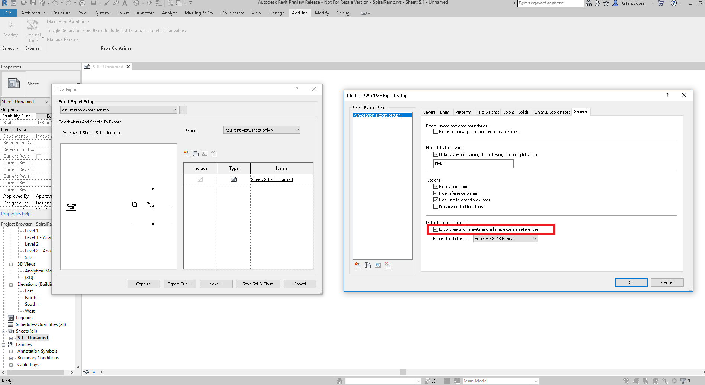

<head>
<meta http-equiv="Content-Type" content="text/html; charset=utf-8">
<link rel="stylesheet" type="text/css" href="bc.css">
<!--

-->

</head>

<!---

- 13865502 [export multi views into one dwg]

MergedViews and exporting to a single DWG #RevitAPI @AutodeskRevit #bim #dynamobim @AutodeskForge #ForgeDevCon http://bit.ly/mergedviews

Some insight on the use of the <code>MergedViews</code> property provided by the DGN, DWG and DWG export options classes and other ideas to export multiple views into a single DWG file
&ndash; Question: I want to combine and export multiple views into one single DWG file. I set the option <code>MergedViews</code>, but the code still generates multiple DWG files for the views...

--->

### MergedViews and Exporting to a Single DWG

My colleagues Stefan Dobre and Miroslav Schonauer shared some insight on the use of
the [`MergedViews` property](http://www.revitapidocs.com/2018.1/28b54043-59a4-a5a7-cca0-7a9aea1f6250.htm) provided
by the DGN, DWG and DWG export options classes and other ideas to export multiple views into a single DWG file:

**Question:** I want to combine and export multiple views into one single DWG file.

I set the option `MergedViews`, but the code still generates multiple DWG files for the views.

Is there any other way?

**Answer:** The `MergedViews` option is used only when we export a sheet.

Let’s suppose that we have two views on a sheet.

When `MergedViews` is false and we export the sheet, it will result in three files. Two DWGs showing the views exactly as they appear on the sheet and another DWG representing the sheet. This DWG contains two Xrefs that point to the views.

When `MergedViews` is true and we export the sheet, the result is only one file. The generated model contains both views (not as Xref).
 
So, if you want to export multiple views in the same DWG file, you should create a sheet, place all desired views on it, and export the sheet. If you want to export them as Xref files you should use set `MergedView` to false, otherwise you should set it to true.
 
Here is a picture showing where the `MergedViews` option is presented in the UI:
 

Another option may be to export individual DWGs using the Revit API and follow up with the AutoCAD I/O API &ndash; using either standalone AcCoreConsole, or, in the cloud, the Forge AutoCAD Design Automation API &ndash; to import all the created DWGs as `BlockReference` entities (and create `BlockRefInstance` entities too, if required) into a master DWG.

Thank you very much, Stefan and Miro, for the illuminating advice.

