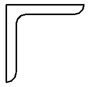
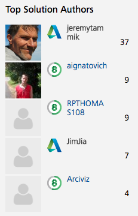

<head>
<meta http-equiv="Content-Type" content="text/html; charset=utf-8">
<link rel="stylesheet" type="text/css" href="bc.css">
<!--

-->

</head>

<!---

- implemented NewFamilySymbolProfile sample app
  https://github.com/jeremytammik/NewFamilySymbolProfile
  13871503 [Sweep Profile From Family]
  https://forums.autodesk.com/t5/revit-api-forum/sweep-profile-from-family/m-p/7751112
  https://forums.autodesk.com/t5/revit-api-forum/sweep-using-profile-family/m-p/6057115

NewFamilySymbolProfile sample #RevitAPI add-in @AutodeskRevit #bim #dynamobim @AutodeskForge #ForgeDevCon http://bit.ly/newfamilysymbolprofile

Questions on how to use <code>NewFamilySymbolProfile</code> have come up a couple of times in the Revit API discussion forum.
The short answer is: retrieve the family symbol from the profile family, then call the creation application <code>NewFamilySymbolProfile</code> method.
I implemented a new sample add-in for you to demonstrate the steps using the <i>Profiles_L-Angles.rfa</i> profile family...

--->

### NewFamilySymbolProfile Sample Add-In

I've been answering rather a lot of queries in
the [Revit API discussion forum](http://forums.autodesk.com/t5/revit-api-forum/bd-p/160) lately,
leading me to once again become [top solution author](#2); here is one of the latest:

####How to use NewFamilySymbolProfile

Questions on how to use `NewFamilySymbolProfile` have come up a couple of times, e.g., in the following threads:

- [Load profile for `NewSweep` command](https://forums.autodesk.com/t5/revit-api-forum/load-profile-for-newsweep-command/td-p/5117864)
- [Sweep using profile family](https://forums.autodesk.com/t5/revit-api-forum/sweep-using-profile-family/m-p/6057115)
- [Sweep profile from family](https://forums.autodesk.com/t5/revit-api-forum/sweep-profile-from-family/m-p/7751112)

In the second, Revitalizer provides a succinct answer, saying:

> The next step after retrieving the family symbol from the profile family is to call
> the [`Autodesk.Revit.Creation.Application` `NewFamilySymbolProfile` method](http://www.revitapidocs.com/2018.1/0fd22223-8ca8-2955-e2ee-7d83d853ee8f.htm):

<pre class="code">
  FamilySymbolProfile
    Application.NewFamilySymbolProfile(
      FamilySymbol familySymbol )
</pre>
 
However, the first two thread answers were insufficiently complete and clear, hence the third follow-up thread.

**Question:** I want to pass a profile from an existing profile family to `FamilyCreate.NewSweep`.

I looked at the thread
on [loading a profile for the `NewSweep` command](https://forums.autodesk.com/t5/revit-api-forum/load-profile-for-newsweep-command/td-p/5117864).

Jeremy's comments from this post indicate that the profile family cannot be passed directly, but that the profile geometry needs to be recreated. Am I reading this correctly?

You can certainly retrieve a profile for a sweep operation from a family file.

However, the family file does not provide any provision for storing a profile per se, so you will have to make use of the other geometrical options available in that context to define some kind of geometry specifying the sweep profile.

You can then parse that geometry, extract the profile information, and put together the required curve array in your add-in.

As mentioned in some other Sweep posts, there are many samples that create a new profile, but none that accept a `FamilySymbolProfile` directly.

Can this be done?

**Answer:** This question was actually answered in the thread
on [sweep using profile family](https://forums.autodesk.com/t5/revit-api-forum/sweep-using-profile-family/m-p/6057115).

One first needs to create a `FamilySymbolProfile` object from the `FamilySymbol` generated by loading the profile Family, then use the  `FamilyFactory.NewSweep` method passing in the `FamilySymbolProfile` as `SweepProfile`.

I implemented a new sample
add-in [NewFamilySymbolProfile](https://github.com/jeremytammik/NewFamilySymbolProfile) for
you to demonstrate the steps using the *Profiles_L-Angles.rfa* profile family.

- C:/Users/All Users/Autodesk/RVT 2018/Libraries/UK/Profiles/Framing/Steel/Profiles_L-Angles.rfa

Here is the code:

<pre class="code">
#region&nbsp;Namespaces
using&nbsp;System.Collections.Generic;
using&nbsp;System.Diagnostics;
using&nbsp;Autodesk.Revit.ApplicationServices;
using&nbsp;Autodesk.Revit.Attributes;
using&nbsp;Autodesk.Revit.DB;
using&nbsp;Autodesk.Revit.UI;
#endregion
 
namespace&nbsp;NewFamilySymbolProfile
{
&nbsp;&nbsp;[Transaction(&nbsp;TransactionMode.Manual&nbsp;)]
&nbsp;&nbsp;public&nbsp;class&nbsp;Command&nbsp;:&nbsp;IExternalCommand
&nbsp;&nbsp;{
&nbsp;&nbsp;&nbsp;&nbsp;const&nbsp;string&nbsp;_filepath&nbsp;=&nbsp;&quot;C:/Users/All&nbsp;Users/Autodesk&quot;
&nbsp;&nbsp;&nbsp;&nbsp;&nbsp;&nbsp;+&nbsp;&quot;/RVT&nbsp;2018/Libraries/UK/Profiles/Framing/Steel&quot;
&nbsp;&nbsp;&nbsp;&nbsp;&nbsp;&nbsp;+&nbsp;&quot;/Profiles_L-Angles.rfa&quot;;
 
&nbsp;&nbsp;&nbsp;&nbsp;public&nbsp;Result&nbsp;Execute(
&nbsp;&nbsp;&nbsp;&nbsp;&nbsp;&nbsp;ExternalCommandData&nbsp;commandData,
&nbsp;&nbsp;&nbsp;&nbsp;&nbsp;&nbsp;ref&nbsp;string&nbsp;message,
&nbsp;&nbsp;&nbsp;&nbsp;&nbsp;&nbsp;ElementSet&nbsp;elements&nbsp;)
&nbsp;&nbsp;&nbsp;&nbsp;{
&nbsp;&nbsp;&nbsp;&nbsp;&nbsp;&nbsp;UIApplication&nbsp;uiapp&nbsp;=&nbsp;commandData.Application;
&nbsp;&nbsp;&nbsp;&nbsp;&nbsp;&nbsp;UIDocument&nbsp;uidoc&nbsp;=&nbsp;uiapp.ActiveUIDocument;
&nbsp;&nbsp;&nbsp;&nbsp;&nbsp;&nbsp;Application&nbsp;app&nbsp;=&nbsp;uiapp.Application;
&nbsp;&nbsp;&nbsp;&nbsp;&nbsp;&nbsp;Document&nbsp;doc&nbsp;=&nbsp;uidoc.Document;
 
&nbsp;&nbsp;&nbsp;&nbsp;&nbsp;&nbsp;Document&nbsp;profile_doc&nbsp;=&nbsp;app.OpenDocumentFile(&nbsp;
&nbsp;&nbsp;&nbsp;&nbsp;&nbsp;&nbsp;&nbsp;&nbsp;_filepath&nbsp;);
 
&nbsp;&nbsp;&nbsp;&nbsp;&nbsp;&nbsp;//&nbsp;The&nbsp;profile&nbsp;document&nbsp;contains&nbsp;no&nbsp;family&nbsp;sybols:
 
&nbsp;&nbsp;&nbsp;&nbsp;&nbsp;&nbsp;FilteredElementCollector&nbsp;symbols
&nbsp;&nbsp;&nbsp;&nbsp;&nbsp;&nbsp;&nbsp;&nbsp;=&nbsp;new&nbsp;FilteredElementCollector(&nbsp;profile_doc&nbsp;)
&nbsp;&nbsp;&nbsp;&nbsp;&nbsp;&nbsp;&nbsp;&nbsp;&nbsp;&nbsp;.OfClass(&nbsp;typeof(&nbsp;FamilySymbol&nbsp;)&nbsp;);
 
&nbsp;&nbsp;&nbsp;&nbsp;&nbsp;&nbsp;Debug.Assert(&nbsp;0&nbsp;==&nbsp;symbols.GetElementCount(),&nbsp;
&nbsp;&nbsp;&nbsp;&nbsp;&nbsp;&nbsp;&nbsp;&nbsp;&quot;expected&nbsp;no&nbsp;family&nbsp;symbol&quot;&nbsp;);
 
&nbsp;&nbsp;&nbsp;&nbsp;&nbsp;&nbsp;//&nbsp;Load&nbsp;the&nbsp;profile&nbsp;family&nbsp;to&nbsp;generate&nbsp;them:
 
&nbsp;&nbsp;&nbsp;&nbsp;&nbsp;&nbsp;FamilySymbol&nbsp;profile_symbol&nbsp;=&nbsp;null;
 
&nbsp;&nbsp;&nbsp;&nbsp;&nbsp;&nbsp;using(&nbsp;Transaction&nbsp;tx&nbsp;=&nbsp;new&nbsp;Transaction(&nbsp;doc&nbsp;)&nbsp;)
&nbsp;&nbsp;&nbsp;&nbsp;&nbsp;&nbsp;{
&nbsp;&nbsp;&nbsp;&nbsp;&nbsp;&nbsp;&nbsp;&nbsp;tx.Start(&nbsp;&quot;Load&nbsp;Profile&nbsp;Family&quot;&nbsp;);
 
&nbsp;&nbsp;&nbsp;&nbsp;&nbsp;&nbsp;&nbsp;&nbsp;Family&nbsp;family;
 
&nbsp;&nbsp;&nbsp;&nbsp;&nbsp;&nbsp;&nbsp;&nbsp;doc.LoadFamily(&nbsp;_filepath,&nbsp;out&nbsp;family&nbsp;);
 
&nbsp;&nbsp;&nbsp;&nbsp;&nbsp;&nbsp;&nbsp;&nbsp;tx.Commit();
 
&nbsp;&nbsp;&nbsp;&nbsp;&nbsp;&nbsp;&nbsp;&nbsp;ISet&lt;ElementId&gt;&nbsp;ids&nbsp;=&nbsp;family.GetFamilySymbolIds();
 
&nbsp;&nbsp;&nbsp;&nbsp;&nbsp;&nbsp;&nbsp;&nbsp;foreach(&nbsp;ElementId&nbsp;id&nbsp;in&nbsp;ids&nbsp;)
&nbsp;&nbsp;&nbsp;&nbsp;&nbsp;&nbsp;&nbsp;&nbsp;{
&nbsp;&nbsp;&nbsp;&nbsp;&nbsp;&nbsp;&nbsp;&nbsp;&nbsp;&nbsp;profile_symbol&nbsp;=&nbsp;doc.GetElement(&nbsp;id&nbsp;)&nbsp;
&nbsp;&nbsp;&nbsp;&nbsp;&nbsp;&nbsp;&nbsp;&nbsp;&nbsp;&nbsp;&nbsp;&nbsp;as&nbsp;FamilySymbol;
 
&nbsp;&nbsp;&nbsp;&nbsp;&nbsp;&nbsp;&nbsp;&nbsp;&nbsp;&nbsp;Debug.Print(&nbsp;profile_symbol.Name&nbsp;);
&nbsp;&nbsp;&nbsp;&nbsp;&nbsp;&nbsp;&nbsp;&nbsp;}
&nbsp;&nbsp;&nbsp;&nbsp;&nbsp;&nbsp;}
 
&nbsp;&nbsp;&nbsp;&nbsp;&nbsp;&nbsp;//&nbsp;Generate&nbsp;the&nbsp;family&nbsp;symbol&nbsp;profile:
 
&nbsp;&nbsp;&nbsp;&nbsp;&nbsp;&nbsp;FamilySymbolProfile&nbsp;fsp&nbsp;=&nbsp;null;
 
&nbsp;&nbsp;&nbsp;&nbsp;&nbsp;&nbsp;if(&nbsp;null&nbsp;!=&nbsp;profile_symbol&nbsp;)
&nbsp;&nbsp;&nbsp;&nbsp;&nbsp;&nbsp;{
&nbsp;&nbsp;&nbsp;&nbsp;&nbsp;&nbsp;&nbsp;&nbsp;using(&nbsp;Transaction&nbsp;tx&nbsp;=&nbsp;new&nbsp;Transaction(&nbsp;doc&nbsp;)&nbsp;)
&nbsp;&nbsp;&nbsp;&nbsp;&nbsp;&nbsp;&nbsp;&nbsp;{
&nbsp;&nbsp;&nbsp;&nbsp;&nbsp;&nbsp;&nbsp;&nbsp;&nbsp;&nbsp;tx.Start(&nbsp;&quot;Create&nbsp;FamilySymbolProfile&quot;&nbsp;);
&nbsp;&nbsp;&nbsp;&nbsp;&nbsp;&nbsp;&nbsp;&nbsp;&nbsp;&nbsp;fsp&nbsp;=&nbsp;app.Create.NewFamilySymbolProfile(&nbsp;
&nbsp;&nbsp;&nbsp;&nbsp;&nbsp;&nbsp;&nbsp;&nbsp;&nbsp;&nbsp;&nbsp;&nbsp;profile_symbol&nbsp;);
&nbsp;&nbsp;&nbsp;&nbsp;&nbsp;&nbsp;&nbsp;&nbsp;&nbsp;&nbsp;tx.Commit();
&nbsp;&nbsp;&nbsp;&nbsp;&nbsp;&nbsp;&nbsp;&nbsp;}
&nbsp;&nbsp;&nbsp;&nbsp;&nbsp;&nbsp;}
 
&nbsp;&nbsp;&nbsp;&nbsp;&nbsp;&nbsp;return&nbsp;Result.Succeeded;
&nbsp;&nbsp;&nbsp;&nbsp;}
&nbsp;&nbsp;}
}
</pre>

The comments explain all the important steps.
 
####Top Solution Author

As said, I have been answering rather a lot of queries lately, leading to a new top solution author record score of 37, afaik:

