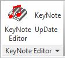

<head>
<meta http-equiv="Content-Type" content="text/html; charset=utf-8">
<link rel="stylesheet" type="text/css" href="bc.css">
<!--

-->

</head>

<!---

- https://github.com/akseidel/RevitAddinKeyNoteSystem
  https://github.com/akseidel/WpfRevitUserKeynoteManager
  http://thebuildingcoder.typepad.com/blog/2017/03/wta-firep-and-3d-aimer-tools.html
  https://forums.autodesk.com/t5/revit-api-forum/revit-addins/m-p/7767351
  WpfRevitUserKeynoteManager -- A Revit UserKeynote manager
  RevitAddinKeyNoteSystem -- A Revit add-in that is the Revit ribbon component to the WpfRevitUserKeynoteManager application.

- [REX extensions vs Revit add-ins](https://stackoverflow.com/questions/48707506/revit-extensions-vs-plugins)
  What is the difference between extensions and plug-ins? I've been writing many plug-ins, and while diffing througg the SDK folder I came across the REX framework and extensions, but im not really clear on what the benifets of one over the other are.
  The REX framework and extensions are Revit structure specific and built on top of pure simple Revit API add-ins:
  - [The REX SDK](http://thebuildingcoder.typepad.com/blog/2011/04/the-rex-sdk.html)
  - [REX content generator](http://thebuildingcoder.typepad.com/blog/2011/12/rex-content-generator.html)
  - [Structural Analytical Code Checking and Results Builder](http://thebuildingcoder.typepad.com/blog/2013/06/structural-analytical-code-checking-and-results-builder.html)
  - [Framing Cross Section Analyser and REX](http://thebuildingcoder.typepad.com/blog/2013/12/security-framing-cross-section-analyser-and-rex.html)
  - [Framing Cross Section Analyser and REX in Revit 2015](http://thebuildingcoder.typepad.com/blog/2015/03/framing-cross-section-analyser-and-rex-in-revit-2015.html)
  - [REX Add-In Development and Migration](http://thebuildingcoder.typepad.com/blog/2015/12/rex-app-development-and-migration.html)
  - [REX SDK FreezeDrawing Sample](http://thebuildingcoder.typepad.com/blog/2016/10/au-revit-20171-and-rex-freezedrawing.html#5)

- 13832283 [Reload Revit Links From...]
  https://forums.autodesk.com/t5/revit-api-forum/reload-revit-links-from/m-p/7722248

- https://forums.autodesk.com/t5/revit-api-forum/converting-all-parameter-values-from-imperial-units-to-metric/m-p/7707054
  Thanks for the solution I've used it to write a  UnitConverter  script that converts all imperial units to metric units automatically, here
  Please feel free to share it with the community.
  https://gist.github.com/imAliAsad/01893377dedef31b1e059a6241fc9b22#file-unitconvertor-cs
  https://gist.github.com/imAliAsad/01893377dedef31b1e059a6241fc9b22#file-extractfamilyparameterdata-cs

DevDays online presentations on #RevitAPI updates @AutodeskRevit #bim #dynamobim @AutodeskForge #ForgeDevCon http://bit.ly/keynotes_rex https://youtu.be/w1WskGTzX3s

External command with ribbon button sample and keynote manager add-in #RevitAPI @AutodeskRevit #bim #dynamobim @AutodeskForge #ForgeDevCon http://bit.ly/keynotes_rex

REX extensions versus Revit add-ins #RevitAPI @AutodeskRevit #bim #dynamobim @AutodeskForge #ForgeDevCon http://bit.ly/keynotes_rex

Let's highlight a few recent threads from the Revit API discussion forum.
Before getting to those, a quick pointer to the DevDays Online recording from last week
&ndash; DevDays online presentations on Revit API updates
&ndash; External command with ribbon button sample
&ndash; RevitAddinKeyNoteSystem keynote manager
&ndash; REX extensions versus Revit add-ins
&ndash; Reloading Revit links from user selected folder
&ndash; Converting all parameter values to metric...

--->

### DevDays, Keynote Manager and REX Extensions

Let's highlight a few recent threads from
the [Revit API discussion forum](http://forums.autodesk.com/t5/revit-api-forum/bd-p/160).

Before getting to those, a quick pointer to the DevDays Online recording from last week:

- [DevDays online presentations on Revit API updates](#2)
- [External command with ribbon button sample](#3)
- [RevitAddinKeyNoteSystem keynote manager](#4)
- [REX extensions versus Revit add-ins](#5)
- [Reloading Revit links from user selected folder](#6)
- [Converting all parameter values to metric](#7)

####DevDays Online Presentations on Revit API Updates

Here is the 55-minute YouTube recording of
the [Autodesk DevDays Online 2017 presentation on Revit API, Civil 3D and InfraWorks updates](https://youtu.be/w1WskGTzX3s):

<iframe width="480" height="270" src="https://www.youtube.com/embed/w1WskGTzX3s" frameborder="0" allow="autoplay; encrypted-media" allowfullscreen></iframe>

For ADN members only, a companion recording containing additional confidential information
on [Revit API updates for ADN members](https://adn.autodesk.io/index.php?r=custom_pages%2Fview&id=143) has
been posted to the ADN site.

####External Command with Ribbon Button Sample

Continuing with the forum threads, let's begin with this simple one
on [Revit add-ins](https://forums.autodesk.com/t5/revit-api-forum/revit-addins/m-p/7767351):

**Question:** I want to start an external tool from a button in the ribbon.

**Answer:** Read the [Revit API getting started material](http://thebuildingcoder.typepad.com/blog/about-the-author.html#2).
That explains all you need.

If you wish to skip all documentation, you can also just run through
the [hello world examples in the developer guide](http://help.autodesk.com/view/RVT/2018/ENU/?guid=Revit_API_Revit_API_Developers_Guide_Introduction_Getting_Started_Walkthroughs_html).

Finally, you can look at a real-world example in
the [RevitAddinKeyNoteSystem GitHub repository](https://github.com/akseidel/RevitAddinKeyNoteSystem).

It contains an add-in that does exactly what you are asking about.

It installs a ribbon panel where the *KeyNote Editor* button on the panel starts an external tool.

The file [AppKNS.cs](https://github.com/akseidel/RevitAddinKeyNoteSystem/blob/master/RevitAddinKeyNoteSystem/AppKNS.cs) contains
the code that builds the ribbon.

[OpenKeyNoteSystemCommand.cs](https://github.com/akseidel/RevitAddinKeyNoteSystem/blob/master/RevitAddinKeyNoteSystem/OpenKeyNoteSystemCommand.cs) implements
the code that starts the external application.

####RevitAddinKeyNoteSystem Keynote Manager

The pointer above from [Allan 'aksaks' 'akseidel' Seidel](https://github.com/akseidel) of [WmTao](http://wmtao.com) answers
a very basic query on getting started with the Revit API.

Allan's [RevitAddinKeyNoteSystem keynote manager](https://github.com/akseidel/RevitAddinKeyNoteSystem) does much more, though.

It implements the Revit ribbon component for the [WpfRevitUserKeynoteManager](https://github.com/akseidel/WpfRevitUserKeynoteManager) application.

The ribbon panel it creates handles four basic user needs in regard to Revit User Keynotes:

- **KeyNote Editor** &ndash; launches the WpfRevitUserKeynoteManager application, a user keynote editor, with the current Revit project's user keynote file loaded up ready for creating and editing user keynotes. This editor provides a few convenient editing features germane to user keynote table files. It allows more than one person to edit the same user keynotes file at the same time, provided they edit different keynote categories.
- **UpDate** &ndash; reloads the current Revit project's user keynote table file.
- **KeyNote** &ndash; launches the Revit place keynote command.
- **Display Help** &ndash; explains how to use the WpfRevitUserKeynoteManager application by launching it in its own documentation mode.

Many thanks to Allan for sharing this!

Here are some other of Allan's contributions here:

- [Stacked Ribbon Button Panel Options](http://thebuildingcoder.typepad.com/blog/2016/09/stacked-ribbon-button-panel-options.html)
- [WTA Elec, FireP and 3D Aimer Tools](http://thebuildingcoder.typepad.com/blog/2017/03/wta-firep-and-3d-aimer-tools.html)
- [WTA Mechanical Family Placement Add-in](http://thebuildingcoder.typepad.com/blog/2017/03/wta-mech-and-ttt-for-provision-for-voids.html#3)
- [AKS Opener](http://thebuildingcoder.typepad.com/blog/2017/04/work-half-aks-opener-rvtfader-and-forgefader.html#3)

####REX Extensions versus Revit Add-Ins

This should really be pretty obvious, but somebody asked
about [REX extensions vs Revit add-ins](https://stackoverflow.com/questions/48707506/revit-extensions-vs-plugins):

**Question:** What is the difference between extensions and plug-ins?

I've been writing many plug-ins, and while diffing through the SDK folder I came across the REX framework and extensions.

What are the benefits of one over the other?

**Answer:** The REX framework and extensions are Revit structure specific and built on top of pure simple Revit API add-ins.

Here are some previous discussions of various aspects of REX:

- [The REX SDK](http://thebuildingcoder.typepad.com/blog/2011/04/the-rex-sdk.html)
- [REX content generator](http://thebuildingcoder.typepad.com/blog/2011/12/rex-content-generator.html)
- [Structural Analytical Code Checking and Results Builder](http://thebuildingcoder.typepad.com/blog/2013/06/structural-analytical-code-checking-and-results-builder.html)
- [Framing Cross Section Analyser and REX](http://thebuildingcoder.typepad.com/blog/2013/12/security-framing-cross-section-analyser-and-rex.html)
- [Framing Cross Section Analyser and REX in Revit 2015](http://thebuildingcoder.typepad.com/blog/2015/03/framing-cross-section-analyser-and-rex-in-revit-2015.html)
- [REX Add-In Development and Migration](http://thebuildingcoder.typepad.com/blog/2015/12/rex-app-development-and-migration.html)
- [REX SDK FreezeDrawing Sample](http://thebuildingcoder.typepad.com/blog/2016/10/au-revit-20171-and-rex-freezedrawing.html#5)

####Reloading Revit Links from User Selected Folder

We discussed [automatically reloading links after migration](http://thebuildingcoder.typepad.com/blog/2016/08/automatically-reload-links-after-migration.html)
and [loading and unloading Revit links](http://thebuildingcoder.typepad.com/blog/2014/12/last-western-european-devdays-links-textures-ur4-vs-r2.html#2)
quite a while ago.

A pretty basic question on how to use this functionality was raised and solved
by Andrea [@ATassera](https://forums.autodesk.com/t5/user/viewprofilepage/user-id/5528189) Tassera in
the [Revit API discussion forum](http://forums.autodesk.com/t5/revit-api-forum/bd-p/160) thread
on [reloading Revit links from...](https://forums.autodesk.com/t5/revit-api-forum/reload-revit-links-from/m-p/7722248).

**Question:** My add-in is currently getting the names of all linked files in the model, reading the file path from each; the user is prompted to choose from a folder depending on whether the name of the link is contained in the file path; now, what I want to do is to actually reload the files from the new file path ... but it's not working.

I actually had a look at the discussion
on [automatically reloading links after migration](http://thebuildingcoder.typepad.com/blog/2016/08/automatically-reload-links-after-migration.html) while developing my script.

Later, after several iterations, Andrea ended up sharing the following solution:

**Solution:** Thanks a lot for your reply and for the suggestions. I actually applied that bit of methodology that you suggested and I ended up finding the solution and making the tool work!

The error was the `revLinkType` parameter that was pointing to the wrong thing.

I modified the loading part completely pairing `ModelPath` from where to reload (taken by the user selection) and the `RevitLinkType` to actually reload (the files linked in the folder) through the `Zip` and `Tuple.Create` methods.

The final code is available in the forum thread.

The purpose of the script is to prompt the use with a file browser to select which files wants to be reloaded, then match file path of the new files where they contain the name of the linked file, create a tuple so you have the same order of `ModelPath` and `RevitLinkOption` and you `LoadFrom` with a for each file.

####Converting All Parameter Values to Metric

Another solution was shared by [Ali Asad](https://forums.autodesk.com/t5/user/viewprofilepage/user-id/5242763) in
the [Revit API discussion forum](http://forums.autodesk.com/t5/revit-api-forum/bd-p/160) thread
on [converting all parameter values from imperial units to metric units](https://forums.autodesk.com/t5/revit-api-forum/converting-all-parameter-values-from-imperial-units-to-metric/m-p/7707054):

**Question:** Following up [Jeremy's solution on converting imperial unit to metric unit](https://forums.autodesk.com/t5/revit-api-forum/reading-wrong-type-parameters-values/m-p/7693187).

It's hard for me to figure out which enumeration value of `DisplayUnitType` to choose for all parameters, because all parameters may have values in different formats i.e., mm, V, VA.

Currently, I'm retrieving the properties values in imperial units and I'd like to know, does the Revit API provide any easy way to automatically convert the return value format of any type-parameter to metric units?

I cannot determine which `DisplayUnityType` enum I should use to get the value in the right format.

**Answer:** I do not think there is a generic method to convert all imperial units to metric.

Basically, Revit uses standard metric SI units for everything except length, which is in feet.

This is (almost) the only non-SI unit used.

You will probably need to implement a conversion for each unit type you encounter.

It is probably quite easy once you understand the basic principles.

I looked at [The Building Coder category on units](http://thebuildingcoder.typepad.com/blog/units).

Here are the posts that look most useful to me to help answer your question:

- [Unit abbreviations](http://thebuildingcoder.typepad.com/blog/2017/08/unit-abbreviations.html)
- [UnitUtils converting units for unit weight](http://thebuildingcoder.typepad.com/blog/2016/08/unitutils-converting-units-for-unit-weight.html)
- [Localised unit abbreviations](http://thebuildingcoder.typepad.com/blog/2013/11/localised-unit-abbreviations.html)
- [Mapping display unit type to unit types](http://thebuildingcoder.typepad.com/blog/2013/11/mapping-display-unit-type-to-unit-types.html)
- [Unit abbreviations](http://thebuildingcoder.typepad.com/blog/2013/11/unit-abbreviations.html)
- [Revit 2013 unit conversion utility](http://thebuildingcoder.typepad.com/blog/2013/01/revit-2013-unit-conversion-utility.html)
- [Unit conversion and display string formatting](http://thebuildingcoder.typepad.com/blog/2011/12/unit-conversion-and-display-string-formatting.html)

You could parse the unit abbreviation string, determine how many inches, feet, mm, metres, etc. it contains, and multiply by a conversion factor from imperial to metric for each imperial unit encountered.

**Response:** Thanks for the solution!

I used it to write
a [UnitConverter](https://gist.github.com/imAliAsad/01893377dedef31b1e059a6241fc9b22#file-unitconvertor-cs) script
that converts all imperial units to metric units automatically.

Here is
the [ExtractFamilyParameterData.cs module](https://gist.github.com/imAliAsad/01893377dedef31b1e059a6241fc9b22#file-extractfamilyparameterdata-cs) showing how it is used.

Please feel free to share it with the community.

