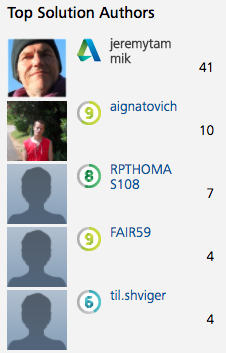

<head>
<meta http-equiv="Content-Type" content="text/html; charset=utf-8">
<link rel="stylesheet" type="text/css" href="bc.css">
<!--

-->

</head>

<!---

- the [Autodesk Developer Network ADN web site](https://www.autodesk.com/developer-network)
  at [www.autodesk.com/developer-network](https://www.autodesk.com/developer-network) has been updated.
  New ADN Open pages are live now, and all the specific URLs are working again. Make sure to clean your cache when using them.
  The one of greatest interest to us here, of course, is the [Revit Developer Centre](http://www.autodesk.com/developrevit)
  at [www.autodesk.com/developrevit](http://www.autodesk.com/developrevit).
  I took this opportunity to migrate the [ADN Revit API training labs](https://github.com/ADN-DevTech/RevitTrainingMaterial) to Revit 2018.
  I alson finally eliminated all deprecated API usage warnings from the [AdnRevitApiLabsXtra](https://github.com/jeremytammik/AdnRevitApiLabsXtra).
  The last one to go was the deprecated usage of the
  Autodesk.Revit.Creation.Document [`NewTag` method](http://www.revitapidocs.com/2018.1/ede92095-e554-9cc7-5286-a9d053466d1b.htm),
  replaced by [`IndependentTag` `Create`](http://www.revitapidocs.com/2018.1/1f622654-786a-b8fd-1f81-278698bacd5b.htm).
  You should get ready for future versions as well.
  Eliminating all warning messages is a fool-proof no-brainer first step to get started with that.

Updated ADN web site, Revit API Labs and tag creation in #RevitAPI @AutodeskRevit #bim #dynamobim @AutodeskForge #ForgeDevCon http://bit.ly/adnlabstagcreation

Here are a couple of Revit API related updates to take note of
&ndash; Autodesk Developer Network ADN web site update
&ndash; Revit Developer Centre update
&ndash; ADN Revit API Training Labs update
&ndash; Revit API Training Labs Xtra update
&ndash; New top solution author record score...

--->

### Updated ADN Web Site, Revit API Labs, Tag Creation

Here are a couple of Revit API related updates to take note of:

- [Autodesk Developer Network ADN web site update](#2)
- [Revit Developer Centre update](#3)
- [ADN Revit API Training Labs update](#4)
- [Revit API Training Labs Xtra update](#5)
- [New top solution author record score](#6)

####Autodesk Developer Network ADN Web Site Update

The [Autodesk Developer Network ADN web site](https://www.autodesk.com/developer-network)
at [www.autodesk.com/developer-network](https://www.autodesk.com/developer-network) has been updated.

New ADN Open pages are live now, and all the product- and API-specific URLs are working again.

Make sure to clean your cache when using them.

####Revit Developer Centre Update

The ADN page of greatest interest to us here, of course, is
the [Revit Developer Centre](http://www.autodesk.com/developrevit)
at [www.autodesk.com/developrevit](http://www.autodesk.com/developrevit).

Check it out in its new guise.

####ADN Revit API Training Labs Update

I took this opportunity to migrate
the [ADN Revit API training labs](https://github.com/ADN-DevTech/RevitTrainingMaterial) to Revit 2018.

####ADN Revit API Training Labs Xtra Update

I also finally eliminated all deprecated API usage warnings from
the [AdnRevitApiLabsXtra](https://github.com/jeremytammik/AdnRevitApiLabsXtra).

The last one to go was the deprecated usage of the
Autodesk.Revit.Creation.Document [`NewTag` method](http://www.revitapidocs.com/2018.1/ede92095-e554-9cc7-5286-a9d053466d1b.htm),
replaced by [`IndependentTag` `Create`](http://www.revitapidocs.com/2018.1/1f622654-786a-b8fd-1f81-278698bacd5b.htm).

Here are two code snippets from the relevant commit to the GitHub repository
to [eliminate deprecated API usage of the creation document `NewTag` method](https://github.com/jeremytammik/AdnRevitApiLabsXtra/commit/ec063bca10f168a2fb5870152495de94e67ef2f0) for
C# and VB:

C# for Revit 2017 API:

<pre class="code">
  IndependentTag&nbsp;tag&nbsp;=&nbsp;createDoc.NewTag(
  &nbsp;&nbsp;view,&nbsp;inst,&nbsp;false,&nbsp;TagMode.TM_ADDBY_CATEGORY,
  &nbsp;&nbsp;TagOrientation.Horizontal,&nbsp;midpoint&nbsp;);&nbsp;//&nbsp;2017
</pre>

C# for Revit 2018 API:

<pre class="code">
  IndependentTag&nbsp;tag&nbsp;=&nbsp;IndependentTag.Create(
  &nbsp;&nbsp;doc,&nbsp;view.Id,&nbsp;new&nbsp;Reference(&nbsp;inst&nbsp;),
  &nbsp;&nbsp;false,&nbsp;TagMode.TM_ADDBY_CATEGORY,
  &nbsp;&nbsp;TagOrientation.Horizontal,&nbsp;midpoint&nbsp;);&nbsp;//&nbsp;2018
</pre>

VB for Revit 2017 API:

<pre class="code">
  Dim&nbsp;tag&nbsp;As&nbsp;IndependentTag&nbsp;=&nbsp;createDoc.NewTag(
  &nbsp;&nbsp;view,&nbsp;inst,&nbsp;False,&nbsp;TagMode.TM_ADDBY_CATEGORY,
  &nbsp;&nbsp;TagOrientation.Horizontal,&nbsp;midpoint)&nbsp;&#39;&nbsp;2017
</pre>

VB for Revit 2018 API:

<pre class="code">
  Dim&nbsp;tag&nbsp;As&nbsp;IndependentTag&nbsp;=&nbsp;IndependentTag.Create(
  &nbsp;&nbsp;doc,&nbsp;view.Id,&nbsp;New&nbsp;Reference(inst),
  &nbsp;&nbsp;False,&nbsp;TagMode.TM_ADDBY_CATEGORY,
  &nbsp;&nbsp;TagOrientation.Horizontal,&nbsp;midpoint)&nbsp;&#39;&nbsp;2018
</pre>

You should get your code ready for upcoming future versions as well.

Eliminating all warning messages is a fool-proof no-brainer first step to get started with that.

####New Top Solution Author Record Score

I reached a new record score of 41 (as far as I know) as top solution author in
the [Revit API discussion forum](http://forums.autodesk.com/t5/revit-api-forum/bd-p/160):

I very much enjoy watching your scores rise, too, guys!
