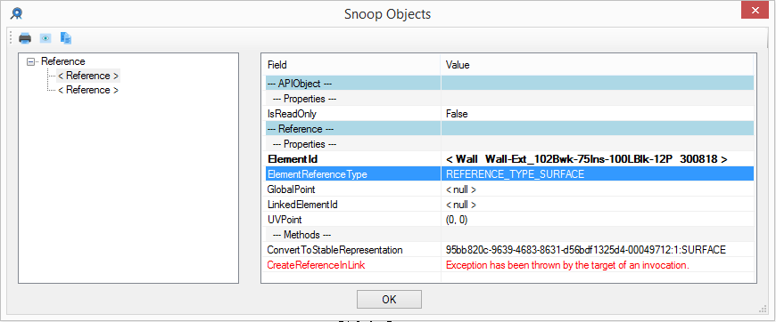
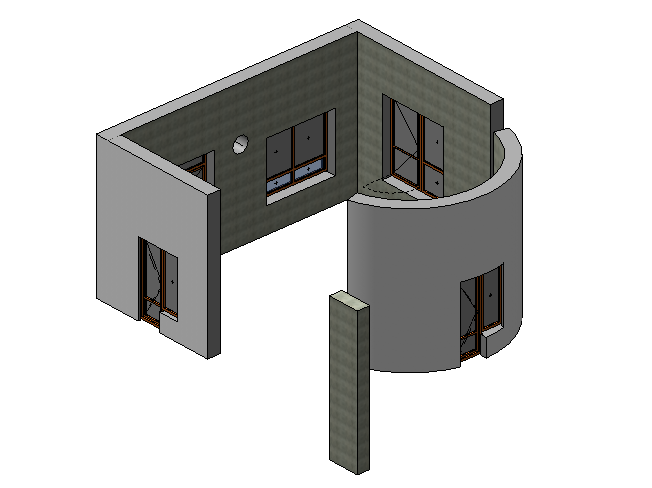
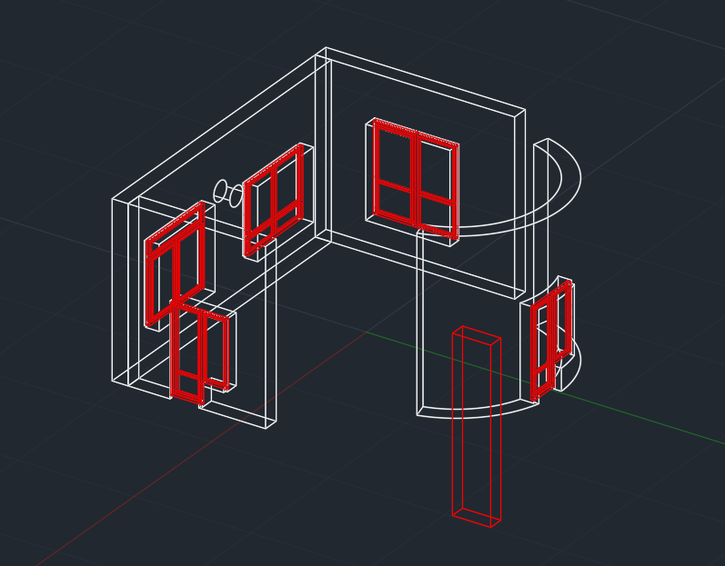

<head>
<meta http-equiv="Content-Type" content="text/html; charset=utf-8">
<link rel="stylesheet" type="text/css" href="bc.css">
<!--

-->

</head>

<!---

RevitLookup snoops stable representation of references in #RevitAPI @AutodeskRevit #bim #dynamobim @AutodeskForge #ForgeDevCon http://bit.ly/snoopstablerep
Export geometry to AutoCAD via XML using #RevitAPI @AutodeskRevit #bim #dynamobim @AutodeskForge #ForgeDevCon http://bit.ly/snoopstablerep

Александр Пекшев aka Modis @Pekshev submitted
a very succinct and useful pull request for RevitLookup that
I integrated right away, and provides many other valuable inputs as well
&ndash; Snoop stable representation of References
&ndash; Project point on plane correction
&ndash; Revit export geometry to AutoCAD via XML
&ndash; RevitExportGeometryToAutocad
&ndash; Description
&ndash; Versions
&ndash; Using
&ndash; Example...

--->

### Export Geometry and Snoop Stable Representation

Александр Пекшев aka Modis [@Pekshev](https://github.com/Pekshev) submitted
a very succinct and useful pull request for [RevitLookup](https://github.com/jeremytammik/RevitLookup) that
I integrated right away, and provides many other valuable inputs as well:

- [Snoop stable representation of References](#2)
- [Project point on plane correction](#3)
- [Revit export geometry to AutoCAD via XML](#4)
    - [RevitExportGeometryToAutocad](#4.1)
    - [Description](#4.2)
    - [Versions](#4.3)
    - [Using](#4.4)
    - [Example](#4.5)

####Snoop Stable Representation of References

Alexander's raised
the [issue #40](https://github.com/jeremytammik/RevitLookup/issues/40) and subsequently
submitted [pull request #41](https://github.com/jeremytammik/RevitLookup/pull/41) to
display the result of the `ConvertToStableRepresentation` method when snooping `Reference` objects.

I integrated his improvements
in [RevitLookup](https://github.com/jeremytammik/RevitLookup)
[release 2018.0.0.7](https://github.com/jeremytammik/RevitLookup/releases/tag/2018.0.0.7).

Here is the result of snooping a reference from a dimension between two walls:

Many thanks to Alexander for his efficient enhancement!

Take a look at
the [diff from the previous version](https://github.com/jeremytammik/RevitLookup/compare/2018.0.0.6...2018.0.0.7) to
see how elegantly this was achieved.

####Project Point on Plane Correction

Alexander also raised some other interesting issues in in the past in comments on
the [wall graph](http://thebuildingcoder.typepad.com/blog/2008/12/wall-graph.html#comment-3490286732),
[point in polygon algorithm](http://thebuildingcoder.typepad.com/blog/2010/12/point-in-polygon-containment-algorithm.html#comment-3504414240),
[wall elevation profile](http://thebuildingcoder.typepad.com/blog/2015/01/getting-the-wall-elevation-profile.html#comment-3759178237) and,
most recently and significantly,
on [projecting](http://thebuildingcoder.typepad.com/blog/2014/09/planes-projections-and-picking-points.html#comment-3765799540)
[a point](http://thebuildingcoder.typepad.com/blog/2014/09/planes-projections-and-picking-points.html#comment-3779858513)
[onto a plane](http://thebuildingcoder.typepad.com/blog/2014/09/planes-projections-and-picking-points.html#comment-3779960537),
uncovering an error in The Building Coder samples `ProjectOnto` method that projects a given 3D `XYZ` point onto a plane.

I originally presented this method in the discussion
on [planes, projections and picking points](http://thebuildingcoder.typepad.com/blog/2014/09/planes-projections-and-picking-points.html):
[projecting a 3D point onto a plane](http://thebuildingcoder.typepad.com/blog/2014/09/planes-projections-and-picking-points.html#12).

Swapping the sign seems to have fixed it, as proved
by [Alexander's ProjectPointOnPlanetest sample add-in](https://github.com/Pekshev/ProjectPointOnPlanetest):

<pre class="code">
///&nbsp;&lt;summary&gt;
///&nbsp;Project&nbsp;given&nbsp;3D&nbsp;XYZ&nbsp;point&nbsp;onto&nbsp;plane.
///&nbsp;&lt;/summary&gt;
public&nbsp;static&nbsp;XYZ&nbsp;ProjectOnto(
&nbsp;&nbsp;this&nbsp;Plane&nbsp;plane,
&nbsp;&nbsp;XYZ&nbsp;p&nbsp;)
{
&nbsp;&nbsp;double&nbsp;d&nbsp;=&nbsp;plane.SignedDistanceTo(&nbsp;p&nbsp;);

&nbsp;&nbsp;//XYZ&nbsp;q&nbsp;=&nbsp;p&nbsp;+&nbsp;d&nbsp;*&nbsp;plane.Normal;&nbsp;//&nbsp;wrong&nbsp;according&nbsp;to&nbsp;Ruslan&nbsp;Hanza&nbsp;and&nbsp;Alexander&nbsp;Pekshev&nbsp;in&nbsp;their&nbsp;comments&nbsp;http://thebuildingcoder.typepad.com/blog/2014/09/planes-projections-and-picking-points.html#comment-3765750464
&nbsp;&nbsp;XYZ&nbsp;q&nbsp;=&nbsp;p&nbsp;-&nbsp;d&nbsp;*&nbsp;plane.Normal;

&nbsp;&nbsp;Debug.Assert(
&nbsp;&nbsp;&nbsp;&nbsp;Util.IsZero(&nbsp;plane.SignedDistanceTo(&nbsp;q&nbsp;)&nbsp;),
&nbsp;&nbsp;&nbsp;&nbsp;&quot;expected&nbsp;point&nbsp;on&nbsp;plane&nbsp;to&nbsp;have&nbsp;zero&nbsp;distance&nbsp;to&nbsp;plane&quot;&nbsp;);

&nbsp;&nbsp;return&nbsp;q;
}
</pre>

####Revit Export Geometry to AutoCAD via XML

Browsing Alexander's other GitHub repositories, one that particularly caught my eye is his
[RevitExportGeometryToAutocad add-in](https://github.com/Pekshev/RevitExportGeometryToAutocad),
documented in Russian.

I read the Google-translated English description and think this sounds as if it might be very useful to others as well:

####RevitExportGeometryToAutocad

Auxiliary libraries for rendering geometry from Revit to AutoCAD in the form of simple objects (a segment, an arc, a point) by exporting to XML.

####Description

Libraries are useful in the development of plug-ins related to geometry, for convenient visual perception of the results.
In my opinion, viewing the result in AutoCAD is much more convenient.

This project provides two libraries (one for Revit, the second for AutoCAD) and a demo project for Revit.

####Versions

The project for AutoCAD is built using libraries from AutoCAD 2013. It will work with all subsequent versions of AutoCAD.

The Revit project is built using Revit 2015 libraries. It should work with subsequent versions as well (tested for 2015-2018).

####Using

The solution also contains a demo project for Revit.
Description of use for the example of this project:

**In Revit**

Connect to the project a link to the `RevitGeometryExporter.dll` library.

Before using export methods, you need to specify the folder to export xml

<pre class="code">
&nbsp;&nbsp;//&nbsp;setup&nbsp;export&nbsp;folder
&nbsp;&nbsp;ExportGeometryToXml.FolderName&nbsp;=&nbsp;@&nbsp;&quot;C:\Temp&quot;;
</pre>

By default, the library has the path *C:\Temp\RevitExportXml*.
In the absence of a directory, it will be created.

Call one or more methods for exporting geometry, for example:

<pre class="code">
&nbsp;&nbsp;List&lt;Wall&gt;&nbsp;wallsToExport&nbsp;=&nbsp;new&nbsp;List&lt;Wall&gt;();
&nbsp;&nbsp;foreach(&nbsp;Reference&nbsp;reference&nbsp;in&nbsp;selectionResult&nbsp;)
&nbsp;&nbsp;{
&nbsp;&nbsp;&nbsp;&nbsp;Wall&nbsp;wall&nbsp;=&nbsp;(Wall)&nbsp;doc.GetElement(&nbsp;reference&nbsp;);
&nbsp;&nbsp;&nbsp;&nbsp;wallsToExport.Add(&nbsp;wall&nbsp;);
&nbsp;&nbsp;}
&nbsp;&nbsp;ExportGeometryToXml.ExportWallsByFaces(&nbsp;wallsToExport,&nbsp;&quot;walls&quot;&nbsp;);
</pre>

Or

<pre class="code">
&nbsp;&nbsp;List&lt;FamilyInstance&gt;&nbsp;familyInstances&nbsp;=&nbsp;new&nbsp;List&lt;FamilyInstance&gt;();
&nbsp;&nbsp;foreach(&nbsp;Reference&nbsp;reference&nbsp;in&nbsp;selectionResult&nbsp;)
&nbsp;&nbsp;{
&nbsp;&nbsp;&nbsp;&nbsp;Element&nbsp;el&nbsp;=&nbsp;doc.GetElement(&nbsp;reference&nbsp;);
&nbsp;&nbsp;&nbsp;&nbsp;if(&nbsp;el&nbsp;is&nbsp;FamilyInstance&nbsp;familyInstance)
&nbsp;&nbsp;&nbsp;&nbsp;familyInstances.Add(&nbsp;familyInstance&nbsp;);
&nbsp;&nbsp;}
&nbsp;&nbsp;ExportGeometryToXml.ExportFamilyInstancesByFaces(&nbsp;familyInstances,&nbsp;&quot;families&quot;,&nbsp;false&nbsp;);
</pre>

**In AutoCAD**

Use the NETLOAD command to load the `CadDrawGeometry.dll` library.

Use one of the two available commands:

- DrawFromOneXml &ndash; Draw geometry from one specified XML file
- DrawXmlFromFolder &ndash; Draw the geometry from the specified folder in which the XML files reside

####Example

Elements in Revit:

The result of exporting and rendering geometry in AutoCAD:

Many thanks again to Alexander for sharing this!
