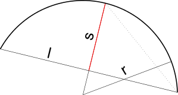

<head>
<meta http-equiv="Content-Type" content="text/html; charset=utf-8">
<link rel="stylesheet" type="text/css" href="bc.css">
<!--

-->

</head>

<!---

- [Retrieving All Family Instances in a Room](http://thebuildingcoder.typepad.com/blog/2017/04/forgefader-ui-lookup-builds-purge-and-room-instances.html#5)
  [Filter for Family Instances in a Room](http://thebuildingcoder.typepad.com/blog/2013/03/filter-for-family-instances-in-a-room.html)
  [irregular room shape](http://thebuildingcoder.typepad.com/blog/2013/03/filter-for-family-instances-in-a-room.html#comment-3781548196)

- Find Intersecting Elements
  http://thebuildingcoder.typepad.com/blog/2010/12/find-intersecting-elements.html#comment-3783584153
  http://thebuildingcoder.typepad.com/blog/2010/12/find-intersecting-elements.html#comment-3783587401
  https://stackoverflow.com/questions/49070566/bounding-box-intersection

 #RevitAPI @AutodeskRevit #bim #dynamobim @AutodeskForge #ForgeDevCon

&ndash; 
...

--->

### Filtering for Intersecting Elements

Several questions on filtering for intersecting elements came up recently.

It is pretty easy as long as a bounding box can be used.

However, the bounding box is generally aligned with the cardinal X, Y and Z axes.

If the containing volume is not, too many elements may be selected.

This can be addressed in various ways, e.g., post-processing the bounding box results, or using a more precise intersection filter.

- [Family instances in a diagonal room](#2) 
- [Conduits intersecting a junction box](#3) 
- [Generate 2D arc from radius, start and end points](#4) 

####Family Instances in a Diagonal Room

Kavitha asked the question in
his [comment](http://thebuildingcoder.typepad.com/blog/2013/03/filter-for-family-instances-in-a-room.html#comment-3781548196)
on [Filtering for Family Instances in a Room](http://thebuildingcoder.typepad.com/blog/2013/03/filter-for-family-instances-in-a-room.html):

**Question:** Can someone explain for me: if the room is diagonal, then the bounding box value will be wrong; in that case, how can I get the elements properly?

**Answer:** You are right, of course.

The bounding box will be too large and therefore possibly contain too many elements.

You can eliminate the elements outside the room by many means.

[IsPointInRoom](http://www.revitapidocs.com/2018.1/21d28ce3-3c1a-43cd-9714-0fe7223c5636.htm), for example, determines whether a given point lies within the volume of the room.

If you have an element with some geometry, e.g., a solid, you could test each of its vertices with that method.

If you are interested in the 2D plan view only, you could also implement a more precise test by performing a Boolean operation between a polygon containing the element and the room boundary polygon.

My [RoomEditorApp](https://github.com/jeremytammik/RoomEditorApp) exports
rooms and the family instances they contain to a cloud database; for that, it obviously determines which instances lie within which room, as mentioned in the note 
on [retrieving all family instances in a room](http://thebuildingcoder.typepad.com/blog/2017/04/forgefader-ui-lookup-builds-purge-and-room-instances.html#5) elsewhere,

It just uses a filtered element collector based on the room bounding box, though, in the
method [`GetFurniture( Room room )`](https://github.com/jeremytammik/RoomEditorApp/blob/master/RoomEditorApp/CmdUploadRooms.cs#L157-L217),
so it does not answer your question on the diagonal case.

For a precise handling of the diagonal or any other irregularly shaped case, you could also retrieve the room solid from
its [`ClosedShell` property](http://www.revitapidocs.com/2018.1/1a510aef-63f6-4d32-c0ff-a8071f5e23b8.htm) and use
an [`ElementIntersectsSolidFilter`](http://www.revitapidocs.com/2018.1/19276b94-fa39-64bb-bfb8-c16967c83485.htm) based on that, cf. below.

####Conduits Intersecting a Junction Box

Right after that, I started out discussing another intersection and containment issue with Tiago Cerqueria
in [his](http://thebuildingcoder.typepad.com/blog/2010/12/find-intersecting-elements.html#comment-3783584153)
[comments](http://thebuildingcoder.typepad.com/blog/2010/12/find-intersecting-elements.html#comment-3783587401)
on [finding intersecting elements](http://thebuildingcoder.typepad.com/blog/2010/12/find-intersecting-elements.html)
and StackOverflow question on [bounding box intersection](https://stackoverflow.com/questions/49070566/bounding-box-intersection):

**Question:** To find elements that are intersecting a geometry, I am using the example
to [find intersecting elements](http://thebuildingcoder.typepad.com/blog/2010/12/find-intersecting-elements.html).

The main goal of my addin was find conduits clashing with a junction box and acess all the elemenets connected with it to insert information.

But the bounding box is always parallel to the cardinal X, Y and Z axes, and this may cause a problem, like returning elements that are not really clashing, because sometimes the bounding box is not coincident with the geometry because the family instance is rotated.

Besides that, there is the problem that the bounding box will consider the geometry of the symbol and not the instance, and will consider the flipped geometry too, meaning that the bounding box is bigger than I am looking for.

Is there a way to get the real geometry that are in the currently view? How can I solve this problem?

**Answer:** There are many way to address this. Generally, when performing clash detection, you will always run a super fast pre-processing step first to determine candidate elements, and then narrow down the search step by step more precisely in following steps. In this case, you can consider the bounding box intersection the first step, and then perform post-processing afterwards to narrow down the result to your exact goal.

One important question is: does the bounding box really give you all the elements you need, plus more? Are you sure there are none missing?

Once that is settled, all you need to do is add post-processing steps applying the detailed considerations that you care about to remove superfluous elements.

A simple property to check might be: are all the target element geometry vertices contained in the target volume?

A more complex one might involve retrieving the full solid of the target element and the target volume and performing a Boolean intersection between them to determine completely and exactly whether they intersect, are disjunct, or contained in each other.

Many others are conceivable.

**Response:** I am using another strategy that accesses the geometry of the instance to verify whether the face of the family instace clashes with a closer conduit:

Here follows the code that I created and that works perfectly.

I am acessing the geometry of the family by the method `get_Geometry(options)` to retrieve the instance geometry  located in project coordinates. From this I get the face and verify whther there is an intersection:

<pre class="code">
class&nbsp;FindIntersection
{
&nbsp;&nbsp;public&nbsp;Conduit&nbsp;ConduitRun&nbsp;{&nbsp;get;&nbsp;set;&nbsp;}

&nbsp;&nbsp;public&nbsp;FamilyInstance&nbsp;Jbox&nbsp;{&nbsp;get;&nbsp;set;&nbsp;}

&nbsp;&nbsp;public&nbsp;List&lt;Conduit&gt;&nbsp;GetListOfConduits&nbsp;=&nbsp;new&nbsp;List&lt;Conduit&gt;();

&nbsp;&nbsp;public&nbsp;FindIntersection(
&nbsp;&nbsp;&nbsp;&nbsp;FamilyInstance&nbsp;jbox,
&nbsp;&nbsp;&nbsp;&nbsp;UIDocument&nbsp;uiDoc&nbsp;)
&nbsp;&nbsp;{
&nbsp;&nbsp;&nbsp;&nbsp;XYZ&nbsp;jboxPoint&nbsp;=&nbsp;(&nbsp;jbox.Location
&nbsp;&nbsp;&nbsp;&nbsp;&nbsp;&nbsp;as&nbsp;LocationPoint&nbsp;).Point;

&nbsp;&nbsp;&nbsp;&nbsp;FilteredElementCollector&nbsp;filteredCloserConduits
&nbsp;&nbsp;&nbsp;&nbsp;&nbsp;&nbsp;=&nbsp;new&nbsp;FilteredElementCollector(&nbsp;uiDoc.Document&nbsp;);

&nbsp;&nbsp;&nbsp;&nbsp;List&lt;Element&gt;&nbsp;listOfCloserConduit
&nbsp;&nbsp;&nbsp;&nbsp;&nbsp;&nbsp;=&nbsp;filteredCloserConduits
&nbsp;&nbsp;&nbsp;&nbsp;&nbsp;&nbsp;&nbsp;&nbsp;.OfClass(&nbsp;typeof(&nbsp;Conduit&nbsp;)&nbsp;)
&nbsp;&nbsp;&nbsp;&nbsp;&nbsp;&nbsp;&nbsp;&nbsp;.ToList()
&nbsp;&nbsp;&nbsp;&nbsp;&nbsp;&nbsp;&nbsp;&nbsp;.Where(&nbsp;x
&nbsp;&nbsp;&nbsp;&nbsp;&nbsp;&nbsp;&nbsp;&nbsp;&nbsp;&nbsp;=&gt;&nbsp;(&nbsp;(&nbsp;x&nbsp;as&nbsp;Conduit&nbsp;).Location&nbsp;as&nbsp;LocationCurve&nbsp;).Curve
&nbsp;&nbsp;&nbsp;&nbsp;&nbsp;&nbsp;&nbsp;&nbsp;&nbsp;&nbsp;&nbsp;&nbsp;.GetEndPoint(&nbsp;0&nbsp;).DistanceTo(&nbsp;jboxPoint&nbsp;)&nbsp;&lt;&nbsp;30
&nbsp;&nbsp;&nbsp;&nbsp;&nbsp;&nbsp;&nbsp;&nbsp;&nbsp;&nbsp;||&nbsp;(&nbsp;(&nbsp;x&nbsp;as&nbsp;Conduit&nbsp;).Location&nbsp;as&nbsp;LocationCurve&nbsp;).Curve
&nbsp;&nbsp;&nbsp;&nbsp;&nbsp;&nbsp;&nbsp;&nbsp;&nbsp;&nbsp;&nbsp;&nbsp;.GetEndPoint(&nbsp;1&nbsp;).DistanceTo(&nbsp;jboxPoint&nbsp;)&nbsp;&lt;&nbsp;30&nbsp;)
&nbsp;&nbsp;&nbsp;&nbsp;&nbsp;&nbsp;&nbsp;&nbsp;.ToList();

&nbsp;&nbsp;&nbsp;&nbsp;//&nbsp;getting&nbsp;the&nbsp;location&nbsp;of&nbsp;the&nbsp;box&nbsp;and&nbsp;all&nbsp;conduit&nbsp;around.

&nbsp;&nbsp;&nbsp;&nbsp;Options&nbsp;opt&nbsp;=&nbsp;new&nbsp;Options();
&nbsp;&nbsp;&nbsp;&nbsp;opt.View&nbsp;=&nbsp;uiDoc.ActiveView;
&nbsp;&nbsp;&nbsp;&nbsp;GeometryElement&nbsp;geoEle&nbsp;=&nbsp;jbox.get_Geometry(&nbsp;opt&nbsp;);

&nbsp;&nbsp;&nbsp;&nbsp;//&nbsp;getting&nbsp;the&nbsp;geometry&nbsp;of&nbsp;the&nbsp;element&nbsp;to&nbsp;
&nbsp;&nbsp;&nbsp;&nbsp;//&nbsp;access&nbsp;the&nbsp;geometry&nbsp;of&nbsp;the&nbsp;instance.

&nbsp;&nbsp;&nbsp;&nbsp;foreach(&nbsp;GeometryObject&nbsp;geomObje1&nbsp;in&nbsp;geoEle&nbsp;)
&nbsp;&nbsp;&nbsp;&nbsp;{
&nbsp;&nbsp;&nbsp;&nbsp;&nbsp;&nbsp;GeometryElement&nbsp;geoInstance&nbsp;=&nbsp;(&nbsp;geomObje1
&nbsp;&nbsp;&nbsp;&nbsp;&nbsp;&nbsp;&nbsp;&nbsp;as&nbsp;GeometryInstance&nbsp;).GetInstanceGeometry();

&nbsp;&nbsp;&nbsp;&nbsp;&nbsp;&nbsp;//&nbsp;the&nbsp;geometry&nbsp;of&nbsp;the&nbsp;family&nbsp;instance&nbsp;can&nbsp;be&nbsp;
&nbsp;&nbsp;&nbsp;&nbsp;&nbsp;&nbsp;//&nbsp;accessed&nbsp;by&nbsp;this&nbsp;method&nbsp;that&nbsp;returns&nbsp;a&nbsp;
&nbsp;&nbsp;&nbsp;&nbsp;&nbsp;&nbsp;//&nbsp;GeometryElement&nbsp;type.&nbsp;so&nbsp;we&nbsp;must&nbsp;get&nbsp;the&nbsp;
&nbsp;&nbsp;&nbsp;&nbsp;&nbsp;&nbsp;//&nbsp;GeometryObject&nbsp;again&nbsp;to&nbsp;access&nbsp;the&nbsp;Face&nbsp;of&nbsp;
&nbsp;&nbsp;&nbsp;&nbsp;&nbsp;&nbsp;//&nbsp;the&nbsp;family&nbsp;instance.

&nbsp;&nbsp;&nbsp;&nbsp;&nbsp;&nbsp;if(&nbsp;geoInstance&nbsp;!=&nbsp;null&nbsp;)
&nbsp;&nbsp;&nbsp;&nbsp;&nbsp;&nbsp;{
&nbsp;&nbsp;&nbsp;&nbsp;&nbsp;&nbsp;&nbsp;&nbsp;foreach(&nbsp;GeometryObject&nbsp;geomObje2&nbsp;in&nbsp;geoInstance&nbsp;)
&nbsp;&nbsp;&nbsp;&nbsp;&nbsp;&nbsp;&nbsp;&nbsp;{
&nbsp;&nbsp;&nbsp;&nbsp;&nbsp;&nbsp;&nbsp;&nbsp;&nbsp;&nbsp;Solid&nbsp;geoSolid&nbsp;=&nbsp;geomObje2&nbsp;as&nbsp;Solid;
&nbsp;&nbsp;&nbsp;&nbsp;&nbsp;&nbsp;&nbsp;&nbsp;&nbsp;&nbsp;if(&nbsp;geoSolid&nbsp;!=&nbsp;null&nbsp;)
&nbsp;&nbsp;&nbsp;&nbsp;&nbsp;&nbsp;&nbsp;&nbsp;&nbsp;&nbsp;{
&nbsp;&nbsp;&nbsp;&nbsp;&nbsp;&nbsp;&nbsp;&nbsp;&nbsp;&nbsp;&nbsp;&nbsp;foreach(&nbsp;Face&nbsp;face&nbsp;in&nbsp;geoSolid.Faces&nbsp;)
&nbsp;&nbsp;&nbsp;&nbsp;&nbsp;&nbsp;&nbsp;&nbsp;&nbsp;&nbsp;&nbsp;&nbsp;{
&nbsp;&nbsp;&nbsp;&nbsp;&nbsp;&nbsp;&nbsp;&nbsp;&nbsp;&nbsp;&nbsp;&nbsp;&nbsp;&nbsp;foreach(&nbsp;Element&nbsp;cond&nbsp;in&nbsp;listOfCloserConduit&nbsp;)
&nbsp;&nbsp;&nbsp;&nbsp;&nbsp;&nbsp;&nbsp;&nbsp;&nbsp;&nbsp;&nbsp;&nbsp;&nbsp;&nbsp;{
&nbsp;&nbsp;&nbsp;&nbsp;&nbsp;&nbsp;&nbsp;&nbsp;&nbsp;&nbsp;&nbsp;&nbsp;&nbsp;&nbsp;&nbsp;&nbsp;Conduit&nbsp;con&nbsp;=&nbsp;cond&nbsp;as&nbsp;Conduit;
&nbsp;&nbsp;&nbsp;&nbsp;&nbsp;&nbsp;&nbsp;&nbsp;&nbsp;&nbsp;&nbsp;&nbsp;&nbsp;&nbsp;&nbsp;&nbsp;Curve&nbsp;conCurve&nbsp;=&nbsp;(&nbsp;con.Location&nbsp;as&nbsp;LocationCurve&nbsp;).Curve;
&nbsp;&nbsp;&nbsp;&nbsp;&nbsp;&nbsp;&nbsp;&nbsp;&nbsp;&nbsp;&nbsp;&nbsp;&nbsp;&nbsp;&nbsp;&nbsp;SetComparisonResult&nbsp;set&nbsp;=&nbsp;face.Intersect(&nbsp;conCurve&nbsp;);
&nbsp;&nbsp;&nbsp;&nbsp;&nbsp;&nbsp;&nbsp;&nbsp;&nbsp;&nbsp;&nbsp;&nbsp;&nbsp;&nbsp;&nbsp;&nbsp;if(&nbsp;set.ToString()&nbsp;==&nbsp;&quot;Overlap&quot;&nbsp;)
&nbsp;&nbsp;&nbsp;&nbsp;&nbsp;&nbsp;&nbsp;&nbsp;&nbsp;&nbsp;&nbsp;&nbsp;&nbsp;&nbsp;&nbsp;&nbsp;{
&nbsp;&nbsp;&nbsp;&nbsp;&nbsp;&nbsp;&nbsp;&nbsp;&nbsp;&nbsp;&nbsp;&nbsp;&nbsp;&nbsp;&nbsp;&nbsp;&nbsp;&nbsp;//getting&nbsp;the&nbsp;conduit&nbsp;the&nbsp;intersect&nbsp;the&nbsp;box.

&nbsp;&nbsp;&nbsp;&nbsp;&nbsp;&nbsp;&nbsp;&nbsp;&nbsp;&nbsp;&nbsp;&nbsp;&nbsp;&nbsp;&nbsp;&nbsp;&nbsp;&nbsp;GetListOfConduits.Add(&nbsp;con&nbsp;);
&nbsp;&nbsp;&nbsp;&nbsp;&nbsp;&nbsp;&nbsp;&nbsp;&nbsp;&nbsp;&nbsp;&nbsp;&nbsp;&nbsp;&nbsp;&nbsp;}
&nbsp;&nbsp;&nbsp;&nbsp;&nbsp;&nbsp;&nbsp;&nbsp;&nbsp;&nbsp;&nbsp;&nbsp;&nbsp;&nbsp;}
&nbsp;&nbsp;&nbsp;&nbsp;&nbsp;&nbsp;&nbsp;&nbsp;&nbsp;&nbsp;&nbsp;&nbsp;}
&nbsp;&nbsp;&nbsp;&nbsp;&nbsp;&nbsp;&nbsp;&nbsp;&nbsp;&nbsp;}
&nbsp;&nbsp;&nbsp;&nbsp;&nbsp;&nbsp;&nbsp;&nbsp;}
&nbsp;&nbsp;&nbsp;&nbsp;&nbsp;&nbsp;}
&nbsp;&nbsp;&nbsp;&nbsp;}
&nbsp;&nbsp;}
}
</pre>

**Answer:** I considered this problem myself as well in the meantime and thought of two filters that may achieve a similar result more efficiently.

Using those, you do not have to retrieve the conduits and their geometry one by one and analyse them yourself, because the filters already do it for you.

One is quick and compares the axis-aligned bounding box.

The other is slow and intersects the exact element geometry.

It is important to realise and always have in mind
the [important difference between quick and slow filters](http://thebuildingcoder.typepad.com/blog/2015/12/quick-slow-and-linq-element-filtering.html#3).

You may want to try them out yourself:

<pre class="code">
&nbsp;&nbsp;Element&nbsp;e&nbsp;=&nbsp;Util.SelectSingleElement(
&nbsp;&nbsp;&nbsp;&nbsp;uidoc,&nbsp;&quot;a&nbsp;junction&nbsp;box&quot;&nbsp;);

&nbsp;&nbsp;BoundingBoxXYZ&nbsp;bb&nbsp;=&nbsp;e.get_BoundingBox(&nbsp;null&nbsp;);

&nbsp;&nbsp;Outline&nbsp;outLne&nbsp;=&nbsp;new&nbsp;Outline(&nbsp;bb.Min,&nbsp;bb.Max&nbsp;);

&nbsp;&nbsp;//&nbsp;Use&nbsp;a&nbsp;quick&nbsp;bounding&nbsp;box&nbsp;filter&nbsp;-&nbsp;axis&nbsp;aligned

&nbsp;&nbsp;ElementQuickFilter&nbsp;fbb
&nbsp;&nbsp;&nbsp;&nbsp;=&nbsp;new&nbsp;BoundingBoxIntersectsFilter(&nbsp;outLne&nbsp;);

&nbsp;&nbsp;FilteredElementCollector&nbsp;conduits
&nbsp;&nbsp;&nbsp;&nbsp;=&nbsp;new&nbsp;FilteredElementCollector(&nbsp;doc&nbsp;)
&nbsp;&nbsp;&nbsp;&nbsp;&nbsp;&nbsp;.OfClass(&nbsp;typeof(&nbsp;Conduit&nbsp;)&nbsp;)
&nbsp;&nbsp;&nbsp;&nbsp;&nbsp;&nbsp;.WherePasses(&nbsp;fbb&nbsp;);

&nbsp;&nbsp;//&nbsp;How&nbsp;many&nbsp;elements&nbsp;did&nbsp;we&nbsp;find?

&nbsp;&nbsp;int&nbsp;nbb&nbsp;=&nbsp;conduits.GetElementCount();

&nbsp;&nbsp;//&nbsp;Use&nbsp;a&nbsp;slow&nbsp;intersection&nbsp;filter&nbsp;-&nbsp;exact&nbsp;results

&nbsp;&nbsp;ElementSlowFilter&nbsp;intersect_junction
&nbsp;&nbsp;&nbsp;&nbsp;=&nbsp;new&nbsp;ElementIntersectsElementFilter(&nbsp;e&nbsp;);

&nbsp;&nbsp;conduits&nbsp;=&nbsp;new&nbsp;FilteredElementCollector(&nbsp;doc&nbsp;)
&nbsp;&nbsp;&nbsp;&nbsp;&nbsp;&nbsp;.OfClass(&nbsp;typeof(&nbsp;Conduit&nbsp;)&nbsp;)
&nbsp;&nbsp;&nbsp;&nbsp;&nbsp;&nbsp;.WherePasses(&nbsp;intersect_junction&nbsp;);

&nbsp;&nbsp;//&nbsp;How&nbsp;many&nbsp;elements&nbsp;did&nbsp;we&nbsp;find?

&nbsp;&nbsp;int&nbsp;nintersect&nbsp;=&nbsp;conduits.GetElementCount();

&nbsp;&nbsp;Debug.Assert(&nbsp;nbb&nbsp;&lt;=&nbsp;nintersect,
&nbsp;&nbsp;&nbsp;&nbsp;&quot;expected&nbsp;element&nbsp;intersection&nbsp;to&nbsp;be&nbsp;stricter&quot;
&nbsp;&nbsp;&nbsp;&nbsp;+&nbsp;&quot;than&nbsp;bounding&nbsp;box&nbsp;containment&quot;&nbsp;);

&nbsp;&nbsp;return&nbsp;Result.Succeeded;
}
</pre>

I implemented a new external
command [CmdIntersectJunctionBox](https://github.com/jeremytammik/the_building_coder_samples/blob/master/BuildingCoder/BuildingCoder/CmdIntersectJunctionBox.cs)
in [The Building Coder samples](https://github.com/jeremytammik/the_building_coder_samples) to try this out, in 
[release 2018.0.137.0](https://github.com/jeremytammik/the_building_coder_samples/releases/tag/2018.0.137.0).

Waiting for a suitable sample model to test this on...

####Generate 2D Arc from Radius, Start and End Points

Finally, a pure geometric non-filtering question that came up today and was answered very precisely and exhaustively by Scott Wilson,
on [creating an arc when only the radius, start and end point is known](https://forums.autodesk.com/t5/revit-api-forum/create-a-curve-when-only-the-start-point-end-point-amp-radius-is/m-p/7830079):

**Question:** I am attempting to create an arc, but I only know the following properties:

- Radius
- Start point (`XYZ`)
- End point (`XYZ`)

Afaik, there aren't any functions that can create an arc using this information.

**Answer:** Technically speaking, 2 points and a radius are not enough to define a unique arc, as there are up to 4 possible arcs that will fit for any plane of reference. Test this yourself by drawing 2 circles of the same size that overlap each other and then draw a line between the 2 intersecting points. Each side of the line will contain 2 arcs that have the same end points and radius.

You can get away with it if you firstly adopt the convention that all arcs are to be drawn in the same direction from start to end (say, anticlockwise) when looking at them in the negative Z direction of the target plane, and secondly, that you always want either the arc with included angle of less than or equal to 180 degrees or the larger arc of over 180 degrees.

That aside, your best option is to calculate a point that lies on the arc and use the 3 points method that you have already used, but this time you will be giving it the correct 3rd point, and there will be no need to attempt changing the radius afterwards. We will use the anti-clockwise convention as that is what Revit also uses, we will also assume that the smaller arc is desired.

Here is a little bit of code I just whipped up for you; I have done some minimal testing and it appears to be working fine. I have assumed that you have the 3 following variables already defined and in scope:

- `XYZ end0`
- `XYZ end1`
- `Double radius`

I have also assumed that the arc lies on a plane with a normal vector of `XYZ.BasisZ`:

<pre class="code">
Double sagitta = radius - Math.Sqrt(Math.Pow(radius, 2.0) - Math.Pow((end1 - end0).GetLength() / 2.0, 2.0));

XYZ midPointOfChord = (end0 + end1) / 2.0;

XYZ midPointOfArc = midPointOfChord + Transform.CreateRotation(XYZ.BasisZ, Math.PI / 2.0).OfVector((end0 - end1).Normalize().Multiply(sagitta));

Arc myArc = Arc.Create(end0, end1, midPointOfArc);
</pre>

If you want the larger arc, simply change the sagitta calculation to be `radius +` instead of `radius -`.

If you aren't familiar with the mathematics used to calculate arcs, I would suggest heading over
to the [Math Open Reference sagitta explanation](http://www.mathopenref.com/sagitta.html).

No problems, I've just recently been doing some work on line-based families with arc location lines so it was all fresh in my head.

I think you may have some issues acheiving what you are after though; the solution I gave will only really work accurately for 2D data unless you also plug in the correct normal vector (axis) of each arc, basically everywhere that I have used `XYZ.BasisZ` would need to be replaced with the correct normal vector.

From the data you have it is not possible to determine the correct orientation of the arcs. You will need either a 3rd point on the arc provided for you (which would solve all your problems), or a normal vector of the target plane. Are you sure that there isn't any other information exported for arcs? If not, then the exporter isn't doing a very good job.

A possible solution then could be to see if you can first tesselate the arcs in the source software and then export just the straight line data. You could then rebuild the arcs from the lines as they will give you enough points to define a plane, but the trick would be knowing which lines belong to an arc and which don't. To solve this you could export 2 sets of data, one with tesselation and one without and then mtach the end points found in the tesselated data against the other set to determine whether you need to build an arc or not.

Ok, I'll stop rambling now. Long story short: you need more data!

Edit: I just had the thought that if you have a mixture of arcs and lines and the lines are always tangent to the arcs, you could use the lines each side of an arc to calculate the correct plane.

If your data is actually 2D (null Z value), you should be fine unless you also encounter data with Z-values.

Many thanks to Scott for this nice nice solution and complete explanation!

I added it
to [The Building Coder samples](https://github.com/jeremytammik/the_building_coder_samples) as well, in C#,
in [release 2018.0.137.1](https://github.com/jeremytammik/the_building_coder_samples/releases/tag/2018.0.137.1),
[like this](https://github.com/jeremytammik/the_building_coder_samples/compare/2018.0.137.0...2018.0.137.1):

<pre class="code">
///&nbsp;&lt;summary&gt;
///&nbsp;Create&nbsp;an&nbsp;arc&nbsp;in&nbsp;the&nbsp;XY&nbsp;plane&nbsp;from&nbsp;a&nbsp;given
///&nbsp;start&nbsp;point,&nbsp;end&nbsp;point&nbsp;and&nbsp;radius.&nbsp;
///&nbsp;&lt;/summary&gt;
public&nbsp;static&nbsp;Arc&nbsp;CreateArc2dFromRadiusStartAndEndPoint(&nbsp;
&nbsp;&nbsp;XYZ&nbsp;ps,&nbsp;
&nbsp;&nbsp;XYZ&nbsp;pe,&nbsp;
&nbsp;&nbsp;double&nbsp;radius,&nbsp;
&nbsp;&nbsp;bool&nbsp;largeSagitta&nbsp;=&nbsp;false&nbsp;)
{
&nbsp;&nbsp;//&nbsp;https://forums.autodesk.com/t5/revit-api-forum/create-a-curve-when-only-the-start-point-end-point-amp-radius-is/m-p/7830079
 
&nbsp;&nbsp;XYZ&nbsp;midPointChord&nbsp;=&nbsp;0.5&nbsp;*&nbsp;(&nbsp;ps&nbsp;+&nbsp;pe&nbsp;);
&nbsp;&nbsp;XYZ&nbsp;v&nbsp;=&nbsp;pe&nbsp;-&nbsp;ps;
&nbsp;&nbsp;double&nbsp;d&nbsp;=&nbsp;0.5&nbsp;*&nbsp;v.GetLength();&nbsp;//&nbsp;half&nbsp;chord&nbsp;length
 
&nbsp;&nbsp;//&nbsp;Small&nbsp;and&nbsp;large&nbsp;circle&nbsp;sagitta:
&nbsp;&nbsp;//&nbsp;http://www.mathopenref.com/sagitta.html
&nbsp;&nbsp;//&nbsp;https://en.wikipedia.org/wiki/Sagitta_(geometry)
 
&nbsp;&nbsp;double&nbsp;s&nbsp;=&nbsp;largeSagitta
&nbsp;&nbsp;&nbsp;&nbsp;?&nbsp;radius&nbsp;+&nbsp;Math.Sqrt(&nbsp;radius&nbsp;*&nbsp;radius&nbsp;-&nbsp;d&nbsp;*&nbsp;d&nbsp;)&nbsp;//&nbsp;sagitta&nbsp;large
&nbsp;&nbsp;&nbsp;&nbsp;:&nbsp;radius&nbsp;-&nbsp;Math.Sqrt(&nbsp;radius&nbsp;*&nbsp;radius&nbsp;-&nbsp;d&nbsp;*&nbsp;d&nbsp;);&nbsp;//&nbsp;sagitta&nbsp;small
 
&nbsp;&nbsp;XYZ&nbsp;midPointArc&nbsp;=&nbsp;midPointChord&nbsp;
&nbsp;&nbsp;&nbsp;&nbsp;+&nbsp;Transform.CreateRotation(&nbsp;XYZ.BasisZ,&nbsp;0.5&nbsp;*&nbsp;Math.PI&nbsp;)
&nbsp;&nbsp;&nbsp;&nbsp;&nbsp;&nbsp;.OfVector(&nbsp;v.Normalize().Multiply(&nbsp;s&nbsp;)&nbsp;);
 
&nbsp;&nbsp;return&nbsp;Arc.Create(&nbsp;ps,&nbsp;pe,&nbsp;midPointArc&nbsp;);
}
</pre>

