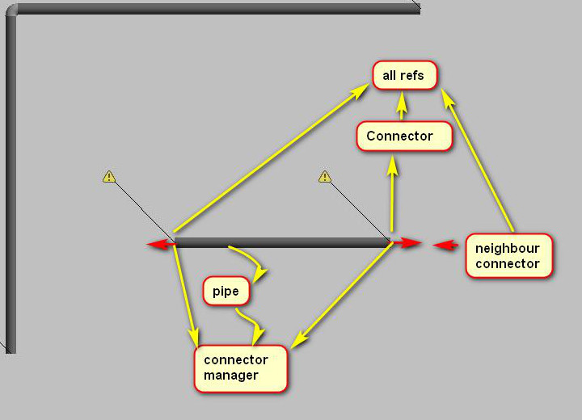
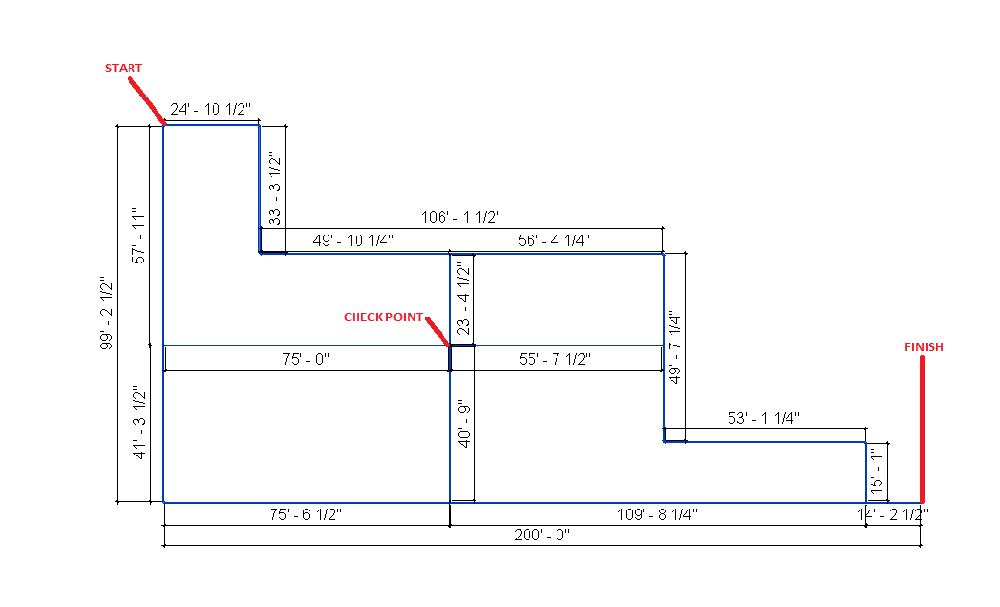
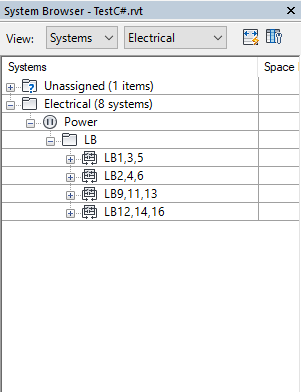

<head>
<meta http-equiv="Content-Type" content="text/html; charset=utf-8">
<link rel="stylesheet" type="text/css" href="bc.css">
<!--

-->

</head>

<!---

- https://forums.autodesk.com/t5/revit-api-forum/get-tree-view-from-system-browser-revit-mep/m-p/7855032

- connector neighbours
  https://forums.autodesk.com/t5/revit-api-forum/connector-neighbours/m-p/7816952
  https://github.com/geoffoverfield/RevitAPI_SystemSearch
  https://github.com/jeremytammik/the_building_coder_samples/blob/master/BuildingCoder/BuildingCoder/MepSystemSearch.cs

- connect into
  https://forums.autodesk.com/t5/revit-api-forum/connect-into/m-p/7834417

- 13840360 [How do I create conduit between 2 connectors?]
  https://forums.autodesk.com/t5/revit-api-forum/how-do-i-create-conduit-between-2-connectors/m-p/7727929

- [read-only transition diameter](https://forums.autodesk.com/t5/revit-api-forum/transition-diameter-read-only/m-p/7620036)
  Q: in pipe transition, parameters for Diameter is Read Only, any one know how to walk around this?
  I thing I can do small pipes on both site, but I would like to avoid this.
  A: you can use dummy pipes for creating transitions.
  Create two pipes of the desired diameters somewhere outside all other elements.
  Connect them by doc.NewTransitionFitting.
  Delete the dummy pipes.
  The remaining transition FamilyInstance will still have the correct diameter parameter values.
  Move it to the desired location.
  Revitalizer

Traversing an MEP system and retrieving connected elements in #RevitAPI @AutodeskRevit #bim #dynamobim @AutodeskForge #ForgeDevCon http://bit.ly/connectorneighbour
Reproducing the MEP electrical system browser hierarchy in #RevitAPI @AutodeskRevit #bim #dynamobim @AutodeskForge #ForgeDevCon http://bit.ly/connectorneighbour

Here are a couple of threads from
the Revit API discussion forum related
to MEP and connectors from the past few weeks that seem worth taking note of
&ndash; Traversing an MEP system and retrieving connected elements
&ndash; Reproducing the MEP electrical system browser hierarchy
&ndash; Creating a conduit between two connectors
&ndash; Dealing with the read-only transition diameter...

--->

### Connector, Neighbour, Conduit, Transition

Here are a couple of threads from
the [Revit API discussion forum](http://forums.autodesk.com/t5/revit-api-forum/bd-p/160) related
to MEP and connectors from the past few weeks that seem worth taking note of:

- [Traversing an MEP system and retrieving connected elements](#2)
- [Reproducing the MEP electrical system browser hierarchy](#3)
- [Creating a conduit between two connectors](#4)
- [Dealing with the read-only transition diameter](#5)

####Traversing an MEP System and Retrieving Connected Elements

The discussion 
on [connector neighbours](https://forums.autodesk.com/t5/revit-api-forum/connector-neighbours/m-p/7816952)
brought up a number of aspects of and solutions for traversing an MEP system and retrieving connected elements:

**Question:** Connectors seems like a pretty powerful system. It started to give me some ideas for other Connector uses regarding mechanical systems.  I was hoping to be able to do something like the following:

- Get an element
- Get its connectors
- Find the connector ends
- Use the ends to "climb" down the system branch by finding the neighbouring element and repeating the process

The issues that have been arising are the following:

An element can have more than two ends

- I'm not sure how to get a reference to a neighbouring element using connected Connectors.
- Branching through systems in this fashion could cause you to essentially get lost in the branches unless you map N number of forks.
- The directions of the connectors are often bi-directional, so how does one know you're progressing in the correct direction even if you could get the neighbours?

Essentially, if you wanted to grab piece A on a duct, and iterate through the neighbouring ducts to Piece B, what would be the correct method to do this? You don't have to get super detailed with source, I'm just looking for the high-level approach.

**Answer:** Nice task!

Maybe these discussions and other ones they point to will help:

- [Traversing and exporting all MEP system graphs](http://thebuildingcoder.typepad.com/blog/2016/06/traversing-and-exporting-all-mep-system-graphs.html)
- [MEP system structure in hierarchical JSON graph](http://thebuildingcoder.typepad.com/blog/2016/06/store-mep-systems-in-hierarchical-json-graph.html)

I work on pipes, but maybe it is not that different from ducts.

- First, RevitLookup will help you with what is reference to what, so I suggest installing it, if you didn't already.
- All pipes have connector manager with connectors, connectors have all ref (that show to what there are connected), with pipe there is this little thing that you have to check: is connector from all refs is not the second connector from connector manager.
- You need to check if connector is right kind (physicalConn).
- Usually the neighbour connector has the same origin and opposite direction (this is not always the rule, like in placeholders).

In family, you can check which connector is prime and which is secondary  and go with this link.

With branches, you can always make a list of points to look at to detect if you make a full loop, not the best solution, but for big project.

In my case, I only needed to go through all connectors until I will find pipe (I had like 4 or 5 families connected with each other).

Here are some additional pinpointed leads to answer your questions that should help in accompaniment with Jeremy's posts:

- *An element can have more than two ends*
&ndash; Check if the `connector.connectortype == connectortype.end`.
- *I'm not sure how to get a reference to a neighbouring element using connected Connectors*
&ndash; `Connector.AllRefs` will return connectors connected to the one you're looking at, then you can look at their hosts
- *Branching through systems in this fashion could cause you to essentially get lost in the branches unless you map N number of forks* &ndash; Yup. But this is why you're a programmer, you're the bad ass that will get this licked ;)
- *The directions of the connectors are often bi-directional, so how does one know you're progressing in the correct direction even if you could get the neighbours?* &ndash; `Connector.CoordinateSystem.BasisZ` will help you make sure you're facing OUT from the fitting if airflow is not the concern.

I've had to do this for a couple different tools, so I thought I'd just create a
quick [Revit API SystemSearch repo](https://github.com/geoffoverfield/RevitAPI_SystemSearch) for you to check it out.

It's a pretty basic bit of source that I threw together real quick, but the general idea is there.  You'll definitely need to tweak it to meet your needs, but I hope it helps:

It is now also included in [The Building Coder samples](https://github.com/jeremytammik/the_building_coder_samples),
in [the module MepSystemSearch.cs](https://github.com/jeremytammik/the_building_coder_samples/blob/master/BuildingCoder/BuildingCoder/MepSystemSearch.cs).

You also need to be aware of the Revit SDK TraverseSystem sample. It determines the correct order of the individual system elements in the direction of the flow and stores the entire directed graph in XML.

Here are some discussions of it:

- [The Revit MEP 2010 API](http://thebuildingcoder.typepad.com/blog/2009/06/revit-mep-api.html)
- [The Revit MEP API](http://thebuildingcoder.typepad.com/blog/2009/09/the-revit-mep-api.html) and some [Revit MEP sample applications](http://thebuildingcoder.typepad.com/blog/2009/09/the-revit-mep-api.html#6)
- [Revit MEP API Samples](http://thebuildingcoder.typepad.com/blog/2010/05/the-revit-mep-2011-api.html#samples)

My [AdnRme sample](https://github.com/jeremytammik/AdnRme) performs
traversal of electrical systems, and is discussed further in
the [AdnRme topic group](http://thebuildingcoder.typepad.com/blog/about-the-author.html#5.40).

Here is [yet another much simpler traversal implementation](http://thebuildingcoder.typepad.com/blog/2013/02/simple-mep-system-traversal.html).

**Question:** Another high-level question regarding these branching systems:

Considering the potential for loops to be present, am I right in assuming that finding the shortest/all routes from a given start and end is non-trivial?

My workflow intention was something like:

1. Select start and end point in a given system.
2. Find the user's intended route through the system (likely the shortest one).
3. Do a calculation on the given run using connectors and their references.

I'm wondering if at step two the intended route could be ambiguous, and if so, how do you handle it?

I'm also wondering how you use the map once you map the system to proceed from the start in a direction that brings you closer to the end. This can't really be done with spacial location because to assume the end is specially further from the start than the middle may be a false assumption.

At the moment I'm considering making the user select the entire run, but the original intent would be a lot simpler (for the user...).

**Answer:** So, it seems to me that you have a couple options on your hand.  You can:

1. Let the user pick their own route.
2. Offer the most direct route.
3. Offer the shortest route (not necessarily the same as #2).
4. Take a path that passes points (like if you have some kind check system everything needs to pass).

Based on that, you'll have to do some math & logic on the search process.  Check out the image below (it's pipes - not ductwork... but same principle):

You'll encounter tons of systems that have an infinite number of ways of laying them out.  In the drawing above, if you were to go from start to finish taking the "direct route", which may be the least amount of turns, you'd go straight down south, the east - covering 300' of pipe/ductwork in your case.  If you wanted the shortest route, you could take the top route (follow the most northern pipes) and you would only pass through 296' 1/12" of pipe...

Never presume to know what the user wants...  Most users will all have different ways of doing things - from East Coast to West Coast; North to South America and Europe...  If you want to give them options (which I would always recommend for enhanced UX), give them options.  Otherwise just build what you can, and add to it later.

If you really want to explore this and make a powerful tool, look at the differences between depth-first vs breadth-first searches, which are intended for graph systems like this:

- [When is it practical to use Depth-First Search (DFS) vs Breadth-First Search (BFS)?](https://stackoverflow.com/questions/3332947/when-is-it-practical-to-use-depth-first-search-dfs-vs-breadth-first-search-bf)
- [Breadth First Vs Depth First](https://stackoverflow.com/questions/687731/breadth-first-vs-depth-first/687752)
- 10-minute video on [Graph Traversals &ndash; Breadth First and Depth First](https://www.youtube.com/watch?v=bIA8HEEUxZI)
- [Graph searching: Breadth-first vs. depth-first](https://cs.stackexchange.com/questions/298/graph-searching-breadth-first-vs-depth-first)
- [Depth First Traversal or DFS for a Graph](https://www.geeksforgeeks.org/depth-first-traversal-for-a-graph)
- [Breadth First Traversal or BFS for a Graph](https://www.geeksforgeeks.org/breadth-first-traversal-for-a-graph)

There really isn't a 'right' answer for this.

It's got to be a balanced combination of what the users want and what you can reasonably create in a timely manner.  What's important is that whatever you create, make it scalable so you can always come back and build on it later!  So, if you start by making them select their entire path, make it so that you can make edits and build on it without having to rewrite the whole thing...  I've had to do that.  It's not fun.

Many thanks to MarryTookMyCoffe, r.singleton
and Geoff Overfield, Software Engineer at [FabPro1, LLC](https://fabpro1.com),
for sharing all these useful suggestions!

I am not sure which of the approaches is best.

It can't hurt to check them out and compare them.

Please let me know what you think and how well they suit your needs.

####Reproducing the MEP Electrical System Browser Hierarchy

A related, simpler question was raised on
[getting the tree view from the Revit MEP system browser](https://forums.autodesk.com/t5/revit-api-forum/get-tree-view-from-system-browser-revit-mep/m-p/7855032):

**Question:** How can I get tree view in the System Browser in Revit?

I need it to create a form has tree view like this:

**Answer:** My [AdnRme HVAC sample](https://github.com/jeremytammik/AdnRme) does that.

I implemented two different methods to reproduce the MEP Electrical System Browser Hierarchy structure.

- Before the advent of any MEP specific functionality in the Revit API, I made use of generic parameter values stored on the respective system elements.
- After the introduction of the Revit MEP API, I implemented a simpler and safer solution making use of that and the connector information it provides.

<!----
####Connect Into

[connect into](https://forums.autodesk.com/t5/revit-api-forum/connect-into/m-p/7834417)
---->

####Creating a Conduit Between Two Connectors

We also discussed 
[how to create a conduit between two connectors](https://forums.autodesk.com/t5/revit-api-forum/how-do-i-create-conduit-between-2-connectors/m-p/7727929):

**Question:** I have conduit connectors on junction box family instances and I'd like to connect two boxes using a conduit.

I couldn't find any method to achieve this.

**Answer:** In general, Revit will automatically and happily connect everything that can be connected.

Of course, in order to achieve this, I assume that the boxes need to be equipped with connector elements.

Are they?

Furthermore, have you tested and verified that the connection you wish to achieve works as expected when you drive it manually through the user interface?

In general, if a feature is not available in the Revit product manually through the user interface, then the Revit API will not provide it either.

You should therefore research the optimal workflow and best practices to address your task at hand manually through the user interface first.

To do so, please discuss and analyse it with an application engineer, product usage expert, or product support.

Once you have got that part sorted out, it is time to step into the programming environment.

Assuming you have (or can get) the connector points, simply substitute the `XYZ` below:

<pre class="code">
  Autodesk.Revit.DB.Electrical.Conduit.Create(
    pDoc, type.Id, new XYZ(0, 0, 0), new XYZ(10, 0, 0), level.Id );
</pre>

**Response:** Yes. I have created a conduit connector in the box. I can manually connect 2 boxes with conduit.

I tried `Conduit.Create`, and this method only requests coordinates as parameter.
I successfully created a conduit between two boxes, but they are not connected.

I used this method, but the conduit didn't connect to the boxes.

**Answer:** What happens if you ask the connector on one of the boxes to connect to the connector on the other box?

Does it automatically create a conduit between them?

Please study the series of research articles on [rolling offset creation](http://thebuildingcoder.typepad.com/blog/2014/01/final-rolling-offset-using-pipecreate.html).

**Response:** Yes, it worked.

Thank you again.

####Dealing with the Read-Only Transition Diameter

Finally, a question on transitions between different pipe diameters:

In the
corresponding [Revit API discussion forum](http://forums.autodesk.com/t5/revit-api-forum/bd-p/160) thread,
Rudi [@Revitalizer](https://forums.autodesk.com/t5/user/viewprofilepage/user-id/1103138) Honke
explained how to deal with
the [read-only transition diameter](https://forums.autodesk.com/t5/revit-api-forum/transition-diameter-read-only/m-p/7620036):

**Question:** In a pipe transition the parameters defining the diameter are read-only; does anyone know how to walk around this?

I think I can create small dummy pipes on both sides, but I would like to avoid this.

**Answer:** You can use dummy pipes for creating transitions.

- Create two pipes of the desired diameters somewhere far away from all other elements.
- Connect them by calling `doc.NewTransitionFitting`.
- Delete the dummy pipes.

The remaining transition `FamilyInstance` will retain the correct diameter parameter values.

Move it to the desired location.

Many thanks to Revitalizer for this hint!
