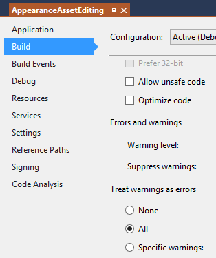

<head>
<meta http-equiv="Content-Type" content="text/html; charset=utf-8">
<link rel="stylesheet" type="text/css" href="bc.css">
<!--

-->

</head>

<!---

Compiling the Revit 2019 SDK samples with NET Framework 4.7 #RevitAPI @AutodeskRevit #bim #dynamobim @AutodeskForge #ForgeDevCon http://bit.ly/rvt2019sdk

I installed Revit 2019 and compiled the Revit 2019 SDK.
That was quite a struggle
&ndash; Installing Revit 2019
&ndash; Installing the Revit 2019 SDK
&ndash; Installing the .NET Framework 4.7
&ndash; Compiling the Revit 2019 SDK samples
&ndash; Processor architecture mismatch warnings
&ndash; DimensionLeaderEnd <code>OutputPath</code> missing
&ndash; Numerous Revit API assembly reference conflicts
&ndash; SampleCommandsSteelElements lacks components
&ndash; AppearanceAssetEditing using deprecated API...

--->

### Compiling the Revit 2019 SDK Samples

I installed Revit 2019 and compiled the Revit 2019 SDK.

That was quite a struggle:

- [Installing Revit 2019](#2) 
- [Installing the Revit 2019 SDK](#3) 
- [Installing the .NET Framework 4.7](#4) 
- [Compiling the Revit 2019 SDK samples](#5) 
- [Processor architecture mismatch warnings](#6) 
- [DimensionLeaderEnd `OutputPath` missing](#7) 
- [Numerous Revit API assembly reference conflicts](#8) 
- [SampleCommandsSteelElements lacks components](#9) 
- [AppearanceAssetEditing using deprecated API](#10) 

####Installing Revit 2019

That was easy and unproblematic.

####Installing the Revit 2019 SDK

I searched the installation subfolders for `RevitSDK.exe` and found it here:

- C:\Autodesk\Revit_2019_G1_Win_64bit_dlm\Utilities\SDK\RevitSDK.exe

That was easy to install as well.

####Installing the .NET Framework 4.7

I set about compiling the SDK samples and discovered that this is not possible without first installing the .NET framework 4.7.

I am still using Visual Studio 2015, by the way.

For that information, all further API details and system requirements, please refer to
the [Revit 2019 API Developers Guide](http://help.autodesk.com/view/RVT/2019/ENU/?guid=Revit_API_Revit_API_Developers_Guide_html).

I searched for `install .net 4.7 framework` and was led
to [download it from the Microsoft download centre](https://www.microsoft.com/en-us/download/confirmation.aspx?id=55167),
providing *NDP47-KB3186497-x86-x64-AllOS-ENU.exe*.

The .NET framework 4.7 was still not listed in the Visual Studio 2015 target framework options, though.

How to fix that is explained in the StackOverflow thread
on [using Visual Studio 2015 to target .NET framework 4.7](https://stackoverflow.com/questions/43420178/can-i-use-visual-studio-2015-to-target-net-framework-4-7):

> Having the 4.7 runtime and having the "4.7 Targeting pack" to write code in 4.7 are two very different things.

> The targeting packs are available from [microsoft.com/net/targeting]().

Accordingly, I installed the 4.7 targeting pack *NDP47-DevPack-KB3186612-ENU.exe* (86492264 bytes).

Now the .NET framework 4.7 is indeed listed in the VS target framework options, and I can load the SDK samples successfully with no warnings.

Unfortunately, though, compiling them is quite another matter:

####Compiling the Revit 2019 SDK Samples

The SDK samples solution now contains 186 projects.

On the first attempt, many of them compiled successfully.

In fact, there
were [182 projects succeeded and 4 failed with 2 errors and 70 warnings, cf. the error and warning list](zip/revit_2019_sdk_samples_errors_warnings_1.txt).

<!---
The two errors concern DimensionLeaderEnd and ExtensibleStorageManager:

- Error: The OutputPath property is not set for project 'DimensionLeaderEnd.csproj'.  Please check to make sure that you have specified a valid combination of Configuration and Platform for this project.  Configuration='Debug'  Platform='AnyCPU'.  This error may also appear if some other project is trying to follow a project-to-project reference to this project, this project has been unloaded or is not included in the solution, and the referencing project does not build using the same or an equivalent Configuration or Platform.	DimensionLeaderEnd			
- Error: Metadata file 'C:\a\lib\revit\2019\SDK\Samples\ExtensibleStorageManager\SchemaWrapperTools\CS\bin\Debug\SchemaWrapperTools.dll' could not be found	ExtensibleStorageManager	C:\a\lib\revit\2019\SDK\Samples\ExtensibleStorageManager\ExtensibleStorageManager\CS\CSC		
-->

####Processor Architecture Mismatch Warnings

Many of the warnings concern
an [architecture mismatch warning](http://thebuildingcoder.typepad.com/blog/2013/06/processor-architecture-mismatch-warning.html):

- Warning: There was a mismatch between the processor architecture of the project being built "MSIL" and the processor architecture of the reference "RevitAPI", "AMD64". This mismatch may cause runtime failures. Please consider changing the targeted processor architecture of your project through the Configuration Manager so as to align the processor architectures between your project and references, or take a dependency on references with a processor architecture that matches the targeted processor architecture of your project.	RebarFreeForm			

These warnings can be suppressed using
my [DisableMismatchWarning exe utility](https://github.com/jeremytammik/DisableMismatchWarning) 
to [recursively disable architecture mismatch warnings](http://thebuildingcoder.typepad.com/blog/2013/07/recursively-disable-architecture-mismatch-warning.html).

After running that, the number of problems is reduced
to [183 succeeded and 3 failed with 1 error and 40 warnings](zip/revit_2019_sdk_samples_errors_warnings_2.txt).

####DimensionLeaderEnd OutputPath Missing

Next, I addressed the first serious hurdle for successful compilation, which took me a while to figure out:

- Error: The OutputPath property is not set for project 'DimensionLeaderEnd.csproj'.  Please check to make sure that you have specified a valid combination of Configuration and Platform for this project.  Configuration='Debug'  Platform='AnyCPU'.  This error may also appear if some other project is trying to follow a project-to-project reference to this project, this project has been unloaded or is not included in the solution, and the referencing project does not build using the same or an equivalent Configuration or Platform.	DimensionLeaderEnd			

After some head scratching, I finally fixed it very easily, by manually adding an `OutputPath` tag to `Debug` `AnyCPU` `PropertyGroup` the project file:

<pre class="code">
&nbsp;&nbsp;&lt;PropertyGroup&gt;
&nbsp;&nbsp;&nbsp;&nbsp;&lt;Configuration&nbsp;Condition=&quot;&nbsp;&#39;$(Configuration)&#39;&nbsp;==&nbsp;&#39;&#39;&nbsp;&quot;&gt;Debug&lt;/Configuration&gt;
&nbsp;&nbsp;&nbsp;&nbsp;&lt;Platform&nbsp;Condition=&quot;&nbsp;&#39;$(Platform)&#39;&nbsp;==&nbsp;&#39;&#39;&nbsp;&quot;&gt;AnyCPU&lt;/Platform&gt;
&nbsp;&nbsp;&nbsp;&nbsp;&lt;ProductVersion&gt;9.0.30729&lt;/ProductVersion&gt;
&nbsp;&nbsp;&nbsp;&nbsp;&lt;SchemaVersion&gt;2.0&lt;/SchemaVersion&gt;
&nbsp;&nbsp;&nbsp;&nbsp;&lt;ProjectGuid&gt;{4E3C160F-1FC8-4BD7-8E01-B62C58E79CD4}&lt;/ProjectGuid&gt;
&nbsp;&nbsp;&nbsp;&nbsp;&lt;OutputType&gt;Library&lt;/OutputType&gt;
&nbsp;&nbsp;&nbsp;&nbsp;&lt;AppDesignerFolder&gt;Properties&lt;/AppDesignerFolder&gt;
&nbsp;&nbsp;&nbsp;&nbsp;&lt;RootNamespace&gt;Revit.SDK.Samples.DimensionLeaderEnd.CS&lt;/RootNamespace&gt;
&nbsp;&nbsp;&nbsp;&nbsp;&lt;AssemblyName&gt;DimensionLeaderEnd&lt;/AssemblyName&gt;
&nbsp;&nbsp;&nbsp;&nbsp;&lt;StartupObject&gt;
&nbsp;&nbsp;&nbsp;&nbsp;&lt;/StartupObject&gt;
&nbsp;&nbsp;&nbsp;&nbsp;&lt;TargetFrameworkVersion&gt;v4.7&lt;/TargetFrameworkVersion&gt;
&nbsp;&nbsp;&nbsp;&nbsp;&lt;TargetFrameworkProfile&nbsp;/&gt;
&nbsp;&nbsp;&nbsp;&nbsp;&lt;OutputPath&gt;bin\x64\Debug\&lt;/OutputPath&gt;
&nbsp;&nbsp;&lt;/PropertyGroup&gt;
</pre>

This results in [0 errors, 29 warnings, 184 succeeded, 2 failed](zip/revit_2019_sdk_samples_errors_warnings_3.txt).

####Numerous Revit API Assembly Reference Conflicts

Some of the remaining warnings are caused by the AppearanceAssetEditing project and concern an assembly reference conflict:

- Warning: Could not resolve this reference. Could not locate the assembly "RevitAPIUI". Check to make sure the assembly exists on disk. If this reference is required by your code, you may get compilation errors.	AppearanceAssetEditing			
- Warning: No way to resolve conflict between "RevitAPIUI, Version=19.0.0.0, Culture=neutral, PublicKeyToken=null" and "RevitAPIUI". Choosing "RevitAPIUI, Version=19.0.0.0, Culture=neutral, PublicKeyToken=null" arbitrarily.	AppearanceAssetEditing			

I deleted the existing references to RevitAPI.dll and RevitAPIUI.dll and added them again manually, pointing to the installed assemblies in the Revit.exe folder.

That reduced the number of warnings from 29 to 25, so we now have [0 errors, 25 warnings, 184 succeeded, 2 failed](zip/revit_2019_sdk_samples_errors_warnings_4.txt).

I did the same for the RebarFreeForm project, resulting in 21 warnings, leaving [0 errors, 21 warnings, 184 succeeded, 2 failed](zip/revit_2019_sdk_samples_errors_warnings_5.txt).

RebarFreeForm still has a problem with the RevitAddInUtility reference, though:

- Warning: Could not resolve this reference. Could not locate the assembly "RevitAddInUtility". Check to make sure the assembly exists on disk. If this reference is required by your code, you may get compilation errors.	RebarFreeForm			
- Warning: No way to resolve conflict between "RevitAddInUtility, Version=19.0.0.0, Culture=neutral, PublicKeyToken=null" and "RevitAddInUtility". Choosing "RevitAddInUtility, Version=19.0.0.0, Culture=neutral, PublicKeyToken=null" arbitrarily.	RebarFreeForm			

That one did not even need re-referencing; it is superfluous.

I simply removed it entirely, resulting in 19 warnings, leaving [0 errors, 19 warnings, 184 succeeded, 2 failed](zip/revit_2019_sdk_samples_errors_warnings_6.txt).

####SampleCommandsSteelElements Lacks Components

The SampleCommandsSteelElements cannot be compiled due to numerous unresolved references:

- Warning: Could not resolve this reference. Could not locate the assembly "RevitAddInUtility". Check to make sure the assembly exists on disk. If this reference is required by your code, you may get compilation errors.	SampleCommandsSteelElements			
- Warning: Could not resolve this reference. Could not locate the assembly "RvtDwgAddon". Check to make sure the assembly exists on disk. If this reference is required by your code, you may get compilation errors.	SampleCommandsSteelElements			
- Warning: Could not resolve this reference. Could not locate the assembly "ASObjectsMgd". Check to make sure the assembly exists on disk. If this reference is required by your code, you may get compilation errors.	SampleCommandsSteelElements			
- Warning: Could not resolve this reference. Could not locate the assembly "RevitAPI". Check to make sure the assembly exists on disk. If this reference is required by your code, you may get compilation errors.	SampleCommandsSteelElements			
- Warning: No way to resolve conflict between "RevitAddInUtility, Version=19.0.0.0, Culture=neutral, PublicKeyToken=null" and "RevitAddInUtility". Choosing "RevitAddInUtility, Version=19.0.0.0, Culture=neutral, PublicKeyToken=null" arbitrarily.	SampleCommandsSteelElements			
- Warning: The referenced component 'RevitAPISteel' could not be found.	SampleCommandsSteelElements			
- Warning: Could not resolve this reference. Could not locate the assembly "RevitAPISteel". Check to make sure the assembly exists on disk. If this reference is required by your code, you may get compilation errors.	SampleCommandsSteelElements			
- Warning: The referenced component 'RvtDwgAddon' could not be found.	SampleCommandsSteelElements			
- Warning: Could not resolve this reference. Could not locate the assembly "ASCADLinkMgd". Check to make sure the assembly exists on disk. If this reference is required by your code, you may get compilation errors.	SampleCommandsSteelElements			
- Warning: The referenced component 'ASCADLinkMgd' could not be found.	SampleCommandsSteelElements			
- Warning: No way to resolve conflict between "RevitAPIUI, Version=19.0.0.0, Culture=neutral, PublicKeyToken=null" and "RevitAPIUI". Choosing "RevitAPIUI, Version=19.0.0.0, Culture=neutral, PublicKeyToken=null" arbitrarily.	SampleCommandsSteelElements			
- Warning: Could not resolve this reference. Could not locate the assembly "ASGeometryMgd". Check to make sure the assembly exists on disk. If this reference is required by your code, you may get compilation errors.	SampleCommandsSteelElements			
- Warning: The referenced component 'ASGeometryMgd' could not be found.	SampleCommandsSteelElements			
- Warning: Could not resolve this reference. Could not locate the assembly "RevitAPIUI". Check to make sure the assembly exists on disk. If this reference is required by your code, you may get compilation errors.	SampleCommandsSteelElements			
- Warning: No way to resolve conflict between "RevitAPI, Version=19.0.0.0, Culture=neutral, PublicKeyToken=null" and "RevitAPI". Choosing "RevitAPI, Version=19.0.0.0, Culture=neutral, PublicKeyToken=null" arbitrarily.	SampleCommandsSteelElements			
- Warning: The referenced component 'ASObjectsMgd' could not be found.	SampleCommandsSteelElements			

One of these references refers to the module ASObjectsMgd.

This is in fact available in the add-ins packaged with Revit itself, in the subdirectory */AddIns/SteelConnections*:

<pre>
/v/C/Program Files/Autodesk/Revit 2019 $ find . | grep ASObjectsMgd
./AddIns/SteelConnections/ASObjectsMgd.dll
</pre>

I found and re-referenced all the required references:

It now compiles successfully, so we have just one failing project left.

SampleCommandsSteelElements is now producing other warnings, though.

####AppearanceAssetEditing Using Deprecated API

The remaining failing project is AppearanceAssetEditing.

It is producing new errors, so we now
see [185 succeeded, 1 failed, 7 errors, 9 warnings](zip/revit_2019_sdk_samples_errors_warnings_7.txt).

The seven errors in AppearanceAssetEditing are caused by deprecated API calls:

- Error	CS0618: 'AssetProperties.this[string]' is obsolete: ' This property is deprecated in Revit 2019 and will be removed in the next version of Revit. We suggest you use the 'FindByName(String)' or 'Get(int)' method instead.'	AppearanceAssetEditing	C:\a\lib\revit\2019\SDK\Samples\AppearanceAssetEditing\CS\Application.cs	208	Active

These calls are classed as errors instead of warnings, causing the project compilation to fail, because this is explicitly requested in the project build properties &ndash; treat all warnings as errors:

I changed the setting from 'All' to 'None'.

Now I can build that project as well, and finally the Revit 2019 SDK compilation is complete.

186 projects succeeded, 0 failed and 0 were skipped.

Zero errors now, but [16 warnings still remain](revit_2019_sdk_samples_errors_warnings_8.txt).

I will ask the development team to clean this up asap to avoid forcing other Revit add-in developers to repeat these utterly unneccessary and frustrating steps.

