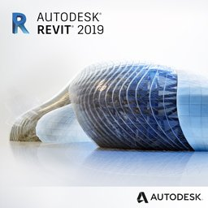

<head>
<meta http-equiv="Content-Type" content="text/html; charset=utf-8">
<link rel="stylesheet" type="text/css" href="bc.css">
<!--

-->
</head>

<!---

- https://www.autodesk.com/campaigns/whats-new-revit-2019-webinar
  /a/doc/revit/tbc/git/a/img/revit_2019.jpg
  Join Autodesk Revit experts for a Webinar on May 2nd to see what's new in #Revit 2019.
  Find out about the new features and functionalities for Architects, MEP Engineers, Structural Engineers and more.
  Register here https://autode.sk/2votIaM 

What’s New Webinar and comparing Forge with A360 and BIM360 @AutodeskRevit #RevitAPI #bim #dynamobim @AutodeskForge #ForgeDevCon http://bit.ly/rvt2019webinar

Following up on yesterday's discussion of <i>What's New in the Revit 2019 API</i>, here is a webinar invitation to walk through the results live from the product point of view.
I also share a high-level comparison of some aspects of Forge versus A360 for a total newbie thinking about building a solution for a client to manage 3D models and collaborate on them with sub-contractors
&ndash; Webinar on What’s New in Revit 2019
&ndash; Forge versus A360...

--->

### What’s New Webinar and Forge vs. A360

Following up on yesterday's discussion
of [What's New in the Revit 2019 API](http://thebuildingcoder.typepad.com/blog/2018/04/whats-new-in-the-revit-2019-api.html),
here is a webinar invitation to walk through the results live from the product point of view.

I also share a high-level comparison of some aspects of Forge versus A360 for a total newbie thinking about building a solution for a client to manage 3D models and collaborate on them with sub-contractors:

- [Webinar on What’s New in Revit 2019](#2) 
- [Forge versus A360 and BIM360](#3) 

####Webinar on What’s New in Revit 2019

Join Autodesk Revit technical experts as they walk through what’s new and improved in the latest release of Revit for BIM.

See which customer suggestions made it into this version of the software and get a view into the Revit roadmap and the future of BIM in the AEC Collection.

Improvements include new tools for consistent, coordinated, and complete modelling for:

- Architects
- MEP Engineers
- Structural Engineers
- Detailers
- Construction Contractors

[Register here for the free webinar](https://www.autodesk.com/campaigns/whats-new-revit-2019-webinar), 
presented by Harlan Brumm, Revit Product Manager, Autodesk.
  

####Forge versus A360 and BIM360

Let's clarify some basic questions on differences between Forge and A360.

**Question:** I am looking into different possibilities to provide a client, a hospital owner, with a good solution to manage their 3D models and provide them to their (sub)contractors.

They want to use Revit and Navisworks to provide information about all the on-going internal refurbishment projects, add planning data and visualise which parts of the hospital need to temporarily relocate, are closed down, and so on.

They don't want to use Navisworks and/or Revit directly because of the UI complexity &ndash; it would probably force their employees to spend entire days pointing out something on the screen to the (sub)contractors. 

Plus, in future, they will probably have alternate software to connect to the BIM models.

I've been looking at A360 and Forge.

I would appreciate a functional and economical comparison of the two.

For that, I need some technical and commercial information:

Technical questions:

- If I am well informed, both Forge and A360 use essentially the same viewer. Both have the same functionality. Is that correct?
- Can Forge be integrated in a separate website? Can we build an online portal for our client that they can use to manage access to their Forge applications and such? Technically speaking this shouldn't be an issue, but is it allowed / supported?
- Is it possible to have user access restricted based on roles or other rights for either platform? My research shows it's not possible with BIM360 but is possible with Forge. Am I correct?

Commercial: 

- How does the pricing structure for Forge work? The website says it's 1.5 credits for each model. But does that also constitute each update? E.g.: if a new project is planned, and the model is updated in Forge, does that constitute as a new upload?
- The Forge website also says you will need a BIM360 account. Does that mean the pricing for Forge comes on top of the BIM360 pricing? And would we need a separate BIM360 Account for every Forge user or can we use one "master" account and provide access to the models without having to create a BIM360 account for everyone that needs to view the files?
- How does the pricing structure for BIM360 work? I can only find the stand-alone single license pricing. I can't seem to find anything for site-licenses and such.

**Answer:** We can provide answers to some of these.

However, some of your questions also indicate a certain newbie-ness and may reflect misunderstandings due to lack of basic web technology and common use best practice knowledge.

Your questions also indicate that you are confusing what BIM360 versus Forge is.

Note that A360 and BIM360 are end user products.

Forge is not. Forge is a platform for building applications.

Forge has no concept of a 'user'. It provides web services to a client. The client can be the viewer, or a web app. A web app can include the viewer. The cost for Forge services is paid by the client owner, e.g., the company running the app.

You could say that A360 and BIM360 are Forge clients, as well.

You have the choice of including them with your customer offering, or building your own clients that may or may not partially replace the functionality they provide.

If you want to integrate use of A360 or BIM360 with your own Forge application, it will probably need to access user data stored in one of the end user products.

In order to fully enable this in an efficient manner, you will need to understand and implement 2-legged and 3-legged authorisation.

Please read some background information on that topic, e.g.,
by [searching the Internet for '2-legged versus 3-legged'](https://duckduckgo.com/?q=2-legged+versus+3-legged).

One of the useful articles that leads me to is the StackOverflow discussion of
the [difference between `OAuth 2.0` two legged and three legged implementation](https://stackoverflow.com/questions/5593348/difference-between-oauth-2-0-two-legged-and-three-legged-implementation).

With that said, here come the quick answers to your questions:
 
- Do both Forge and A360 use essentially the same viewer?
 &rarr; Yes, essentially the same; A360 might not use the latest version, though.

- Both have the same functionality. Is that correct? 
 &rarr; The viewer is shared. Nothing else is comparable, though.
No, A360 has additional customizations that are not part of the public viewer API.
Separate source code for that not available to third parties.

- Can Forge be integrated in a separate website?
 &rarr; Yes. Of course.

- Can we build an online portal for our client that they can use to manage access to their Forge applications and such? 
 &rarr; No, there is no API to manage Forge accounts.
What would be the point?
You charge your customers for your app and pay Autodesk for Forge (2-legged), or you allow your app to access their Autodesk data (3-legged).
Actually, it is hard to tell what you are asking here.
To build an extranet with name and passwords to give customers access to specific data, you can use normal web architecture and technology that has little to do with Forge.
Does Forge deliver this user management? No.
Could Docs folder structure and permissions along with HQ and DM APIs deliver an experience like this?  Maybe.
In any case, a simple yes or no answer to this will be completely misleading, given we really don't know what the question means and what you want to accomplish.
 
- Technically speaking, this shouldn't be an issue, but is it allowed / supported?
 &rarr; Makes no sense; see above.

- Is it possible to have user access restricted based on roles or other rights for either platform? 
 &rarr; Makes no sense; see above. Obviously, with Forge, you can implement anything you like yourself.

- My research shows it's not possible with BIM360 but is possible with Forge. Am I correct?
 &rarr; No; there is no concept of 'user' in 2-legged.
For 3-legged, an app would be able to access the hubs and project that are accessible to the user.
This has to be managed through A360; there is no API to control of that at the moment. 

- How does the pricing structure for Forge work? The website says it's 1.5 credits for each model.
 &rarr; Please look at the [Forge pricing page](https://forge.autodesk.com/pricing).

- Does that also constitute each update?
 &rarr; Yes.

- E.g., if a new project is planned, and the model is updated in Forge, does that constitute as a new upload?
 &rarr; Yes. Each new upload requires a new translation, so the cloud credit fee applies.

- The Forge website says you will need a BIM360 account. Does that mean the pricing for Forge comes on top of the BIM360 pricing? 
 &rarr; You don't need a BIM360 account to use Forge; it's independent.

- Would we need a separate BIM360 account for every Forge user or can we use one 'master' account and provide access to the models without having to create a BIM360 account for everyone that needs to view the files?
 &rarr; As said, you can use Forge without BIM360 and BIM360 without Forge. You can also connect the two.
It depends the business model, 2-legged vs 3-legged app.

My recommendations:

- If your users require BIM360 functionality, use it.
- If you have to implement functionality for them yourself, you might be better off just using Forge.
- You might also want consider data and user ownership: with Forge, the models are sent to a server that you have little control over for translation. All else remains your own: your app data, your users' data, and your users themselves.
- As a developer, simplification and optimisation fanatic, I would try to avoid all unnecessary complexity and cost.
Forge is probably simpler for you to integrate with than A360, you have total control, and much more work to do.
[DIY](https://en.wikipedia.org/wiki/Do_it_yourself)
and [KISS](https://en.wikipedia.org/wiki/KISS_principle).

**Response:** Thank you.

I do actually know the difference between Forge (backend) and BIM360 (front-end implementation).

Perhaps I didn't state the question correctly.

The question I am researching is this:

- Would using Forge to create a custom viewer give me an advantage over simply implementing BIM360?

One of the major issues my client has is that they manage a large set of buildings, over 100.000 square metres.
At any given moment, multiple refurbishment projects are running with different design teams and contractors working on them.
My client wants to provide all necessary information through 3D models.
However, they don't want contractor A to see all specific information meant for contractor B, C, and D.
And vice-versa.
 
In my opinion, the only way to do this with BIM360 is to provide each contractor with a tailored version of the Master Model that only contains the specific information for their project and use folder rights to give different contractors their own folder with their own tailored submodel.
This would require some serious work in managing all those tailored submodels.

I was hoping Forge would allow me to build an application that would provide me with the means of visualising tailored versions of the Master Model based on which project a contractor is working on, and still keep a single Master Model without having to actually create physical copies as tailored submodels.
 
Does that make more sense?

Again: thanks a lot for your answers and clarifications.

I think I have enough info to give proper advice on this now.

Looks like the client can choose to start with BIM360 and may sooner or later run into its limitations.

Then, they might have to switch to Forge.
