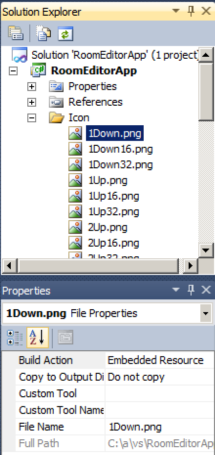

<head>
<meta http-equiv="Content-Type" content="text/html; charset=utf-8">
<link rel="stylesheet" type="text/css" href="bc.css">
<!--

-->
</head>

<!---

Scaling a bitmap for the #RevitAPI external application large and small image icons @AutodeskRevit #bim #dynamobim @AutodeskForge #ForgeDevCon http://bit.ly/scaleribbonicon

Every time I created a ribbon button, I was faced with the task of creating appropriately scaled icons for it to populate the <code>PushButton</code> large and small image icon properties <code>LargeImage</code> and <code>Image</code>.
They seem to expect a 32 x 32 and 16 x 16 icon, respectively.
I finally solved that once and for all by implementing a couple of methods to perform automatic bitmap scaling
&ndash; BitmapImageToBitmap &ndash; convert a <code>BitmapImage</code> to <code>Bitmap</code>
&ndash; BitmapToBitmapSource &ndash; convert a <code>Bitmap</code> to a <code>BitmapSource</code>
&ndash; ResizeImage &ndash; resize an image to the specified width and height
&ndash; ScaledIcon &ndash; scale down large icon to desired size for Revit ribbon button
&ndash; Usage sample &ndash; putting them together...

--->

### Scaling a Bitmap for the Large and Small Image Icons

Every time I created a ribbon button, I was faced with the task of creating appropriately scaled icons for it to populate the `PushButton` large and small image icon properties `LargeImage` and `Image`.

They seem to expect a 32 x 32 and 16 x 16 icon, respectively.

I finally solved that once and for all by implementing a couple of methods to perform automatic bitmap scaling:

- [BitmapImageToBitmap](#3) &ndash; convert a `BitmapImage` to `Bitmap`
- [BitmapToBitmapSource](#4) &ndash; convert a `Bitmap` to a `BitmapSource`
- [ResizeImage](#5) &ndash; resize an image to the specified width and height
- [ScaledIcon](#6) &ndash; return a scaled down icon of desired size for Revit ribbon button
- [Usage sample](#7) &ndash; putting them together

Here they are one by one:

####BitmapImageToBitmap

<pre class="code">
///&nbsp;&lt;summary&gt;
///&nbsp;Convert&nbsp;a&nbsp;BitmapImage&nbsp;to&nbsp;Bitmap
///&nbsp;&lt;/summary&gt;
static&nbsp;Bitmap&nbsp;BitmapImageToBitmap(&nbsp;
&nbsp;&nbsp;BitmapImage&nbsp;bitmapImage&nbsp;)
{
&nbsp;&nbsp;//BitmapImage&nbsp;bitmapImage&nbsp;=&nbsp;new&nbsp;BitmapImage(
&nbsp;&nbsp;//&nbsp;new&nbsp;Uri(&quot;../Images/test.png&quot;,&nbsp;UriKind.Relative));
 
&nbsp;&nbsp;using(&nbsp;MemoryStream&nbsp;outStream&nbsp;=&nbsp;new&nbsp;MemoryStream()&nbsp;)
&nbsp;&nbsp;{
&nbsp;&nbsp;&nbsp;&nbsp;BitmapEncoder&nbsp;enc&nbsp;=&nbsp;new&nbsp;BmpBitmapEncoder();
&nbsp;&nbsp;&nbsp;&nbsp;enc.Frames.Add(&nbsp;BitmapFrame.Create(&nbsp;bitmapImage&nbsp;)&nbsp;);
&nbsp;&nbsp;&nbsp;&nbsp;enc.Save(&nbsp;outStream&nbsp;);
&nbsp;&nbsp;&nbsp;&nbsp;Bitmap&nbsp;bitmap&nbsp;=&nbsp;new&nbsp;Bitmap(&nbsp;outStream&nbsp;);
 
&nbsp;&nbsp;&nbsp;&nbsp;return&nbsp;new&nbsp;Bitmap(&nbsp;bitmap&nbsp;);
&nbsp;&nbsp;}
}
</pre>

####BitmapToBitmapSource

<pre class="code">
[System.Runtime.InteropServices.DllImport(&nbsp;&quot;gdi32.dll&quot;&nbsp;)]
public&nbsp;static&nbsp;extern&nbsp;bool&nbsp;DeleteObject(&nbsp;IntPtr&nbsp;hObject&nbsp;);
 
///&nbsp;&lt;summary&gt;
///&nbsp;Convert&nbsp;a&nbsp;Bitmap&nbsp;to&nbsp;a&nbsp;BitmapSource
///&nbsp;&lt;/summary&gt;
static&nbsp;BitmapSource&nbsp;BitmapToBitmapSource(&nbsp;Bitmap&nbsp;bitmap&nbsp;)
{
&nbsp;&nbsp;IntPtr&nbsp;hBitmap&nbsp;=&nbsp;bitmap.GetHbitmap();
 
&nbsp;&nbsp;BitmapSource&nbsp;retval;
 
&nbsp;&nbsp;try
&nbsp;&nbsp;{
&nbsp;&nbsp;&nbsp;&nbsp;retval&nbsp;=&nbsp;Imaging.CreateBitmapSourceFromHBitmap(
&nbsp;&nbsp;&nbsp;&nbsp;&nbsp;&nbsp;hBitmap,&nbsp;IntPtr.Zero,&nbsp;Int32Rect.Empty,
&nbsp;&nbsp;&nbsp;&nbsp;&nbsp;&nbsp;BitmapSizeOptions.FromEmptyOptions()&nbsp;);
&nbsp;&nbsp;}
&nbsp;&nbsp;finally
&nbsp;&nbsp;{
&nbsp;&nbsp;&nbsp;&nbsp;DeleteObject(&nbsp;hBitmap&nbsp;);
&nbsp;&nbsp;}
&nbsp;&nbsp;return&nbsp;retval;
}
</pre>

####ResizeImage

<pre class="code">
///&nbsp;&lt;summary&gt;
///&nbsp;Resize&nbsp;the&nbsp;image&nbsp;to&nbsp;the&nbsp;specified&nbsp;width&nbsp;and&nbsp;height.
///&nbsp;&lt;/summary&gt;
///&nbsp;&lt;param&nbsp;name=&quot;image&quot;&gt;The&nbsp;image&nbsp;to&nbsp;resize.&lt;/param&gt;
///&nbsp;&lt;param&nbsp;name=&quot;width&quot;&gt;The&nbsp;width&nbsp;to&nbsp;resize&nbsp;to.&lt;/param&gt;
///&nbsp;&lt;param&nbsp;name=&quot;height&quot;&gt;The&nbsp;height&nbsp;to&nbsp;resize&nbsp;to.&lt;/param&gt;
///&nbsp;&lt;returns&gt;The&nbsp;resized&nbsp;image.&lt;/returns&gt;
static&nbsp;Bitmap&nbsp;ResizeImage(
&nbsp;&nbsp;Image&nbsp;image,&nbsp;
&nbsp;&nbsp;int&nbsp;width,
&nbsp;&nbsp;int&nbsp;height&nbsp;)
{
&nbsp;&nbsp;var&nbsp;destRect&nbsp;=&nbsp;new&nbsp;System.Drawing.Rectangle(&nbsp;
&nbsp;&nbsp;&nbsp;&nbsp;0,&nbsp;0,&nbsp;width,&nbsp;height&nbsp;);
 
&nbsp;&nbsp;var&nbsp;destImage&nbsp;=&nbsp;new&nbsp;Bitmap(&nbsp;width,&nbsp;height&nbsp;);
 
&nbsp;&nbsp;destImage.SetResolution(&nbsp;image.HorizontalResolution,&nbsp;
&nbsp;&nbsp;&nbsp;&nbsp;image.VerticalResolution&nbsp;);
 
&nbsp;&nbsp;using(&nbsp;var&nbsp;g&nbsp;=&nbsp;Graphics.FromImage(&nbsp;destImage&nbsp;)&nbsp;)
&nbsp;&nbsp;{
&nbsp;&nbsp;&nbsp;&nbsp;g.CompositingMode&nbsp;=&nbsp;CompositingMode.SourceCopy;
&nbsp;&nbsp;&nbsp;&nbsp;g.CompositingQuality&nbsp;=&nbsp;CompositingQuality.HighQuality;
&nbsp;&nbsp;&nbsp;&nbsp;g.InterpolationMode&nbsp;=&nbsp;InterpolationMode.HighQualityBicubic;
&nbsp;&nbsp;&nbsp;&nbsp;g.SmoothingMode&nbsp;=&nbsp;SmoothingMode.HighQuality;
&nbsp;&nbsp;&nbsp;&nbsp;g.PixelOffsetMode&nbsp;=&nbsp;PixelOffsetMode.HighQuality;
 
&nbsp;&nbsp;&nbsp;&nbsp;using(&nbsp;var&nbsp;wrapMode&nbsp;=&nbsp;new&nbsp;ImageAttributes()&nbsp;)
&nbsp;&nbsp;&nbsp;&nbsp;{
&nbsp;&nbsp;&nbsp;&nbsp;&nbsp;&nbsp;wrapMode.SetWrapMode(&nbsp;WrapMode.TileFlipXY&nbsp;);
&nbsp;&nbsp;&nbsp;&nbsp;&nbsp;&nbsp;g.DrawImage(&nbsp;image,&nbsp;destRect,&nbsp;0,&nbsp;0,&nbsp;image.Width,&nbsp;
&nbsp;&nbsp;&nbsp;&nbsp;&nbsp;&nbsp;&nbsp;&nbsp;image.Height,&nbsp;GraphicsUnit.Pixel,&nbsp;wrapMode&nbsp;);
&nbsp;&nbsp;&nbsp;&nbsp;}
&nbsp;&nbsp;}
&nbsp;&nbsp;return&nbsp;destImage;
}
</pre>

####ScaledIcon

`ScaledIcon` simply calls the three helper methods defined above to return a scaled version of the input image:

<pre class="code">
///&nbsp;&lt;summary&gt;
///&nbsp;Scale&nbsp;down&nbsp;large&nbsp;icon&nbsp;to&nbsp;desired&nbsp;size&nbsp;for&nbsp;Revit&nbsp;
///&nbsp;ribbon&nbsp;button,&nbsp;e.g.,&nbsp;32&nbsp;x&nbsp;32&nbsp;or&nbsp;16&nbsp;x&nbsp;16
///&nbsp;&lt;/summary&gt;
static&nbsp;BitmapSource&nbsp;ScaledIcon(&nbsp;
&nbsp;&nbsp;BitmapImage&nbsp;large_icon,
&nbsp;&nbsp;int&nbsp;w,
&nbsp;&nbsp;int&nbsp;h&nbsp;)
{
&nbsp;&nbsp;return&nbsp;BitmapToBitmapSource(&nbsp;ResizeImage(&nbsp;
&nbsp;&nbsp;&nbsp;&nbsp;BitmapImageToBitmap(&nbsp;large_icon&nbsp;),&nbsp;w,&nbsp;h&nbsp;)&nbsp;);
}
</pre>

####Usage Sample

Within the external application `PopulatePanel` method, simply read the embedded resource icon image and apply `ScaledIcon` to it to populate the large and small image properties with appropriately scaled images:

<pre class="code">
&nbsp;&nbsp;BitmapImage&nbsp;bmi&nbsp;=&nbsp;new&nbsp;BitmapImage(&nbsp;new&nbsp;Uri(&nbsp;
&nbsp;&nbsp;&nbsp;&nbsp;&quot;icons/cmdx.png&quot;,&nbsp;UriKind.Relative&nbsp;)&nbsp;);
 
&nbsp;&nbsp;PushButton&nbsp;pb&nbsp;=&nbsp;p.AddItem(&nbsp;new&nbsp;PushButtonData(&nbsp;
&nbsp;&nbsp;&nbsp;&nbsp;&quot;Command&quot;,&nbsp;&quot;Command&quot;,&nbsp;path,&nbsp;&quot;CmdX&quot;&nbsp;)&nbsp;)&nbsp;as&nbsp;PushButton;
 
&nbsp;&nbsp;pb.ToolTip&nbsp;=&nbsp;&quot;Do&nbsp;something&nbsp;fantastic&quot;;
&nbsp;&nbsp;pb.LargeImage&nbsp;=&nbsp;ScaledIcon(&nbsp;bmi,&nbsp;32,&nbsp;32&nbsp;);
&nbsp;&nbsp;pb.Image&nbsp;=&nbsp;ScaledIcon(&nbsp;bmi,&nbsp;16,&nbsp;16&nbsp;);
</pre>

