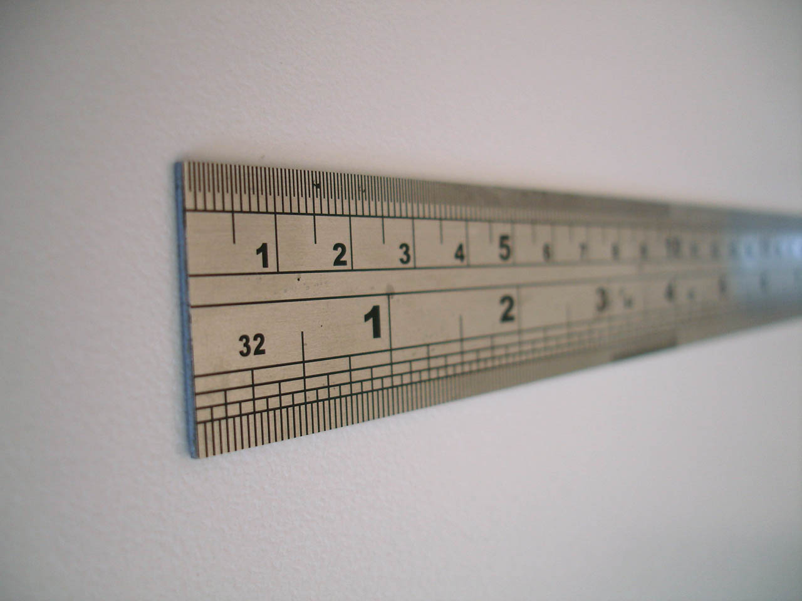

<head>
<meta http-equiv="Content-Type" content="text/html; charset=utf-8">
<link rel="stylesheet" type="text/css" href="bc.css">
<!--

-->
</head>

<!---

- 14200462 [Using FilterCategoryRule in the Revit API]
  https://forums.autodesk.com/t5/revit-api-forum/using-filtercategoryrule-in-the-revit-api/m-p/7983645

How to use FilterCategoryRule in the #RevitAPI @AutodeskRevit #bim #dynamobim @AutodeskForge #ForgeDevCon http://bit.ly/filtercategoryrule

@CaptainDan raised a very pertinent question in
the discussion forum on using <code>FilterCategoryRule</code> in the Revit API that
led to some discussion and clarification with the development team:
I have three questions regarding the filter rule represented by this class...

--->

### How to use FilterCategoryRule

[@CaptainDan](https://forums.autodesk.com/t5/user/viewprofilepage/user-id/1003305) raised
a very pertinent question in
the [Revit API discussion forum](http://forums.autodesk.com/t5/revit-api-forum/bd-p/160) thread
on [using `FilterCategoryRule` in the Revit API](https://forums.autodesk.com/t5/revit-api-forum/using-filtercategoryrule-in-the-revit-api/m-p/7983645) that
led to some discussion and clarification with the development team:

**Question:** I have three questions regarding the filter rule represented by the class `FilterCategoryRule`:

1. What does this rule correspond to in the Revit user interface?
2. If this filters by category, then what is the relationship between the set of categories assigned to this rule and the set of categories passed
to [`ParameterFilterElement.Create`](http://www.revitapidocs.com/2018.1/afa22520-52de-c6b3-fac8-246fe2f8e4fe.htm)?
3. How do I successfully create a filter based on this filter rule?

Whenever I try to create a filter using this filter rule, it throws a Revit exception of type `InternalException` saying:

- *An internal error has occurred*

I tried the same code in Revit 2017 and 2018 with the same exception occurring.

I searched the Internet and SDK and couldn't find much mention of it anywhere.

The Revit API help docs on [FilterCategoryRule](http://www.revitapidocs.com/2018.1/7df5b10b-c423-b5c8-6492-1274d7a447d9.htm) just
say *A filter rule that matches elements of a set of categories*.

**Answer:** Yes, the only significant mention of this that I can find is from The Building Coder
on [What's New in the Revit 2014 API](http://thebuildingcoder.typepad.com/blog/2013/04/whats-new-in-the-revit-2014-api.html)
[small enhancements &amp; interface changes](http://thebuildingcoder.typepad.com/blog/2013/04/whats-new-in-the-revit-2014-api.html#3):

####FilterCategoryRule

The new class FilterCategoryRule can be used in the definition of a ParameterFilterElement.
It represents a filter rule that matches elements of a set of categories.

The related method:

- ParameterFilterElement.AllCategoriesFilterable()

has been replaced by

- FilterCategoryRule.AllCategoriesFilterable()

I passed on your questions to the development team, and they reply:

1. Q: What does `FilterCategoryRule` correspond to in the Revit user interface?
 &ndash; A: There is no direct correspondence in Revit UI, this is the FilterRule to be used in API.

2. Q: If this filters by category, then what is the relationship between the set of categories assigned to this rule and the set of categories passed to `ParameterFilterElement.Create()`?
 &ndash; A: There is no relation to `ParameterFilterElement.Create`.

3. Q: How do I successfully create a filter based on this filter rule?
 &ndash; A: You cannot create a `ParameterFilterElement` based on this `FilterCategoryRule`, but you can create an `ElementParameterFilter`, an API construct, based on it.

Here is an example:

<pre class="code">
  // Find all walls and windows in the document

  IList&lt;ElementId&gt;&nbsp;cats&nbsp;=&nbsp;new&nbsp;List&lt;ElementId&gt;();
  cats.Add(&nbsp;new&nbsp;ElementId(&nbsp;BuiltInCategory.OST_Walls&nbsp;)&nbsp;);
  cats.Add(&nbsp;new&nbsp;ElementId(&nbsp;BuiltInCategory.OST_Windows&nbsp;)&nbsp;);
  FilterCategoryRule&nbsp;r&nbsp;=&nbsp;new&nbsp;FilterCategoryRule(&nbsp;cats&nbsp;);
   
  ElementParameterFilter&nbsp;f&nbsp;
  &nbsp;&nbsp;=&nbsp;new&nbsp;ElementParameterFilter(&nbsp;r,&nbsp;true&nbsp;);
   
  FilteredElementCollector&nbsp;wallsAndWindows&nbsp;
  &nbsp;&nbsp;=&nbsp;new&nbsp;FilteredElementCollector(&nbsp;doc&nbsp;)
  &nbsp;&nbsp;&nbsp;&nbsp;.WherePasses(&nbsp;f&nbsp;);
</pre>

The Revit API docs are confusing and not entirely correct, especially this statement: "The new class FilterCategoryRule can be used in the definition of a ParameterFilterElement". the `ParameterFilterElement.Create` method could potentially take a `FilterCategoryRule` object instead of a set of category ids, but this flavour of the `Create` method was never introduced. We have filed a development task to either correct the docs or add the method. Additional confusion comes from the two API names: `ParameterFilterElement` and `ElementParameterFilter` &nbsp; :-~ 

Just as [Benoit](https://forums.autodesk.com/t5/user/viewprofilepage/user-id/4496032) points
out, `FilterCategoryRule` can simply be seen as an extension of
the [ElementCategoryFilter](http://www.revitapidocs.com/2018.1/b492ddf4-3058-8f9b-dfcc-8d5c4abb3605.htm)
and the associated quick filter shortcut methods 
[OfCategory](http://www.revitapidocs.com/2018.1/c3523c35-4a07-9723-3c28-de3cc47b2ad0.htm)
and [OfCategoryId](http://www.revitapidocs.com/2018.1/63304108-73f8-844e-82fc-5b8fad9839b0.htm).

It seems to me that it is completely equivalent to a logical or of a bunch of `ElementCategoryFilter` instances, such as I used in the MEP and structural filtered element collector examples:

- [Retrieve MEP elements](http://thebuildingcoder.typepad.com/blog/2010/06/retrieve-mep-elements-and-connectors.html)
- [Retrieve structural elements](http://thebuildingcoder.typepad.com/blog/2010/07/retrieve-structural-elements.html)

