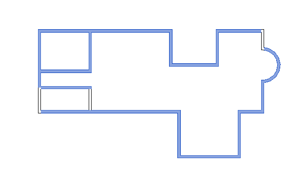
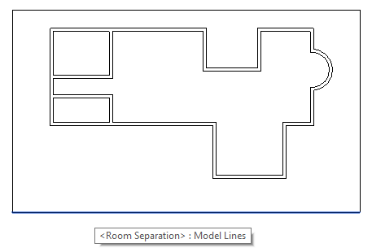
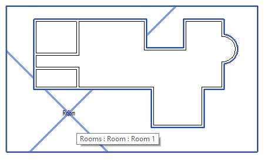
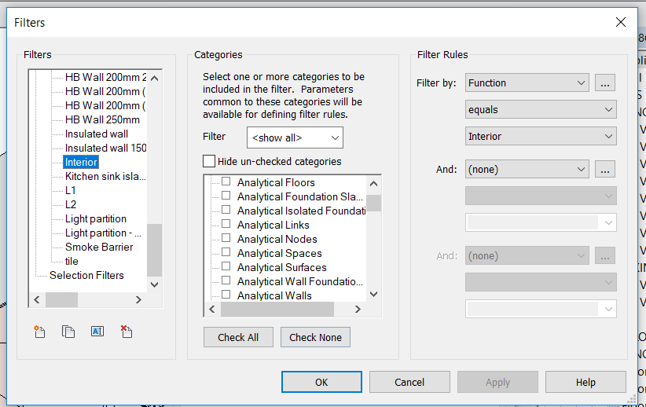

<head>
<meta http-equiv="Content-Type" content="text/html; charset=utf-8">
<link rel="stylesheet" type="text/css" href="bc.css">
<!--

-->

</head>

<!---

- 14230846 [How do I get all the outermost walls in the model?]
  https://forums.autodesk.com/t5/revit-api-forum/how-do-i-get-all-the-outermost-walls-in-the-model/m-p/7998948

- https://forums.autodesk.com/t5/revit-api-forum/how-to-filter-element-which-satisfy-filter-rule/m-p/8020317

Retrieving exterior walls for an incomplete BIM in the #RevitAPI @AutodeskRevit #bim #dynamobim @AutodeskForge #ForgeDevCon http://bit.ly/exteriorwalls
Retrieving family instances satisfying a filter rule in the #RevitAPI @AutodeskRevit #bim #dynamobim @AutodeskForge #ForgeDevCon http://bit.ly/exteriorwalls

Today, we revisit the interesting and generic question on retrieving all exterior walls.
That may be easy in a perfect and complete model.
However, it raises some challenges in an incomplete BIM
&ndash; Retrieving all exterior walls 
&ndash; Several possible approaches 
&ndash; Using a computational geometry approach 
&ndash; Manually adding the huge surrounding room 
&ndash; Encapsulate transactions and roll back instead of deleting 
&ndash; Determining model extents via wall bounding box 
&ndash; Implementing the huge surrounding room approach 
&ndash; Retrieving family instances satisfying a filter rule...

--->

### FilterRule Use and Retrieving Exterior Walls

Today, we revisit the interesting and generic question on retrieving all exterior walls.

That may be easy in a perfect and complete model.

However, it raises some challenges in an incomplete BIM:

- [Retrieving all exterior walls](#2) 
- [Several possible approaches](#3) 
- [Using a computational geometry approach](#4) 
- [Manually adding the huge surrounding room](#5) 
- [Encapsulate transactions and roll back instead of deleting](#6) 
- [Determining model extents via wall bounding box](#7) 
- [Implementing the huge surrounding room approach](#8) 
- [Retrieving family instances satisfying a filter rule](#9) 

####Retrieving All Exterior Walls

This time around, this question was raised
by Feng [@718066900](https://forums.autodesk.com/t5/user/viewprofilepage/user-id/6055195) Wang in
the [Revit API discussion forum](http://forums.autodesk.com/t5/revit-api-forum/bd-p/160) thread
on [how to get all the outermost walls in the model](https://forums.autodesk.com/t5/revit-api-forum/how-do-i-get-all-the-outermost-walls-in-the-model/m-p/7998948).

We already explored some aspects last week,
on [retrieving all exterior walls](http://thebuildingcoder.typepad.com/blog/2018/05/drive-revit-via-a-wcf-service-wall-directions-and-parameters.html#8).

Today, we can present a working solution for an incomplete BIM.

**Question:** How do I get all the outermost walls in the model?

Here is a picture showing what I mean:

Here is the [sample model `exterior_walls.rvt`](zip/exterior_walls_2018.rvt).

####Several Possible Approaches

Several approaches to solve this were already brought up [last week](http://thebuildingcoder.typepad.com/blog/2018/05/drive-revit-via-a-wcf-service-wall-directions-and-parameters.html#8):

- The `DirectionCalculation` Revit SDK sample and The Building Coder discussion of it 
on [south facing walls](http://thebuildingcoder.typepad.com/blog/2010/01/south-facing-walls.html) solves
using the built-in wall function parameter `FUNCTION_PARAM` to filter for exterior walls.
However, the function parameter is not always correctly set on the wall type, and the wall type is not always correctly assigned.
- The Revit API provides a `BuildingEnvelopeAnalyzer` class that will retrieve all exterior walls for you.
However, it relies on the building model being properly enclosed, i.e., roof and floor elements must be added to form properly enclosed spaces in order for the analyser to work.
- Workaround suggestion: Temporarily place room separation lines outside the building envelope and create a huge room around the entire building.
Then, it’s just a matter of retrieving the room boundaries, filtering out the separation lines, appending the remaining elements to your list and deleting the room and separation lines again.

As we discovered, the first two approaches above cannot be applied to the incomplete BIM at hand.

For instance, here is the erroneous result of applying the `BuildingEnvelopeAnalyzer` to it:

There is no closure, no ceiling or floor, because I want to determine the outermost walls first to automatically create the ceiling and floor.

Getting the outermost walls first will enable more automation.

If the building is 'open' upward and downward, in theory, all walls are exposed to the outside, and therefore all of them are 'exterior'.

Happily, the third approach above can still be used in this 2D situation.

####Using a Computational Geometry Approach

It would also be possible to solve this task through a geometric algorithm, of course.

Many different approaches can be taken here as well.

I would love to discover a really reliable one that works under all circumstances.

Here is an idea that comes to mind right now on the fly:

You can easily [determine whether a given point lies within a given polygon](https://www.ics.uci.edu/~eppstein/161/960307.html).

I also implemented a [point containment algorithm for the Revit API](http://thebuildingcoder.typepad.com/blog/2010/12/point-in-polygon-containment-algorithm.html),
and a [room in area predicate using it](http://thebuildingcoder.typepad.com/blog/2012/08/room-in-area-predicate-via-point-in-polygon-test.html).

Now, if you have all your walls, their location curves (if they are non-linear, things get trickier), and endpoints, and are sure that they all form closed polygons, you could determine the maximal polygon enclosing all others by choosing the one that contains the maximum number of wall endpoints.

You might also be able to use some library providing 2D polygon or Boolean operations for this.

Some such libraries, other options and helpful ideas are discussed in The Building Coder topic group
on [2D Booleans and adjacent areas](http://thebuildingcoder.typepad.com/blog/about-the-author.html#5.2).

We also recently discussed [determining the outermost loop of a face](http://thebuildingcoder.typepad.com/blog/2017/10/disjunct-outer-loops-from-planar-face-with-separate-parts.html).

However, in this case, making use of the built-in Revit room generation functionality is probably the easiest way to go.

####Manually Adding the Huge Surrounding Room

I tried it out manually in the sample model, and it seems to work perfectly!

Add room separation lines around the outside of the building:

Create a room around the building using them:

This can easily be achieved programmatically as well.

Now all you need to do is retrieve the room boundary, eliminate the exterior separation line boundary segments, delete the separation lines and room, and you are done.

####Encapsulate Transactions and Roll Back Instead of Deleting

Feng Wang implemented a solution based on these suggestions in [CmdGetOutermosWallByCreateRoom.zip](zip/CmdGetOutermosWallByCreateRoom.zip).

Here are my initial comments on his code that I keep repeating again and again, and therefore here now yet again:

- [Encapsulate transactions in a `using` statement](http://thebuildingcoder.typepad.com/blog/2012/04/using-using-automagically-disposes-and-rolls-back.html)
- You can encapsulate your multiple transactions in a [transaction group](http://thebuildingcoder.typepad.com/blog/about-the-author.html#5.53)
- Instead of creating objects in the model, extracting information from them, and then deleting them again, you could roll back the outermost transaction group to revert back to the original, unmodified, state. I nicknamed that
the ['temporary transaction trick'](http://thebuildingcoder.typepad.com/blog/about-the-author.html#5.53).

####Determining Model Extents via Wall Bounding Box

To add a room around the entire building, we need to determine the building extents, or, at least, the maximal extents of all exterior walls.

One approach to achieve that might be to query each wall for its geometry or location curve, extract all their vertices, and construct a bounding box from them.

However, querying a Revit element for its bounding box is much faster and more efficient than accessing and analysing its geometry or location curve.

Moreover, [The Building Coder samples](https://github.com/jeremytammik/the_building_coder_samples)
[`Util` class](https://github.com/jeremytammik/the_building_coder_samples/blob/master/BuildingCoder/BuildingCoder/Util.cs) already
implements a bounding box extension method `ExpandToContain` that we can use here, which expands a given bounding box to encompass another one:

<pre class="code">
public&nbsp;static&nbsp;class&nbsp;JtBoundingBoxXyzExtensionMethods
{
&nbsp;&nbsp;///&nbsp;&lt;summary&gt;
&nbsp;&nbsp;///&nbsp;Expand&nbsp;the&nbsp;given&nbsp;bounding&nbsp;box&nbsp;to&nbsp;include&nbsp;
&nbsp;&nbsp;///&nbsp;and&nbsp;contain&nbsp;the&nbsp;given&nbsp;point.
&nbsp;&nbsp;///&nbsp;&lt;/summary&gt;
&nbsp;&nbsp;public&nbsp;static&nbsp;void&nbsp;ExpandToContain(
&nbsp;&nbsp;&nbsp;&nbsp;this&nbsp;BoundingBoxXYZ&nbsp;bb,
&nbsp;&nbsp;&nbsp;&nbsp;XYZ&nbsp;p&nbsp;)
&nbsp;&nbsp;{
&nbsp;&nbsp;&nbsp;&nbsp;bb.Min&nbsp;=&nbsp;new&nbsp;XYZ(&nbsp;Math.Min(&nbsp;bb.Min.X,&nbsp;p.X&nbsp;),
&nbsp;&nbsp;&nbsp;&nbsp;&nbsp;&nbsp;Math.Min(&nbsp;bb.Min.Y,&nbsp;p.Y&nbsp;),
&nbsp;&nbsp;&nbsp;&nbsp;&nbsp;&nbsp;Math.Min(&nbsp;bb.Min.Z,&nbsp;p.Z&nbsp;)&nbsp;);
 
&nbsp;&nbsp;&nbsp;&nbsp;bb.Max&nbsp;=&nbsp;new&nbsp;XYZ(&nbsp;Math.Max(&nbsp;bb.Max.X,&nbsp;p.X&nbsp;),
&nbsp;&nbsp;&nbsp;&nbsp;&nbsp;&nbsp;Math.Max(&nbsp;bb.Max.Y,&nbsp;p.Y&nbsp;),
&nbsp;&nbsp;&nbsp;&nbsp;&nbsp;&nbsp;Math.Max(&nbsp;bb.Max.Z,&nbsp;p.Z&nbsp;)&nbsp;);
&nbsp;&nbsp;}
 
&nbsp;&nbsp;///&nbsp;&lt;summary&gt;
&nbsp;&nbsp;///&nbsp;Expand&nbsp;the&nbsp;given&nbsp;bounding&nbsp;box&nbsp;to&nbsp;include&nbsp;
&nbsp;&nbsp;///&nbsp;and&nbsp;contain&nbsp;the&nbsp;given&nbsp;other&nbsp;one.
&nbsp;&nbsp;///&nbsp;&lt;/summary&gt;
&nbsp;&nbsp;public&nbsp;static&nbsp;void&nbsp;ExpandToContain(
&nbsp;&nbsp;&nbsp;&nbsp;this&nbsp;BoundingBoxXYZ&nbsp;bb,
&nbsp;&nbsp;&nbsp;&nbsp;BoundingBoxXYZ&nbsp;other&nbsp;)
&nbsp;&nbsp;{
&nbsp;&nbsp;&nbsp;&nbsp;bb.ExpandToContain(&nbsp;other.Min&nbsp;);
&nbsp;&nbsp;&nbsp;&nbsp;bb.ExpandToContain(&nbsp;other.Max&nbsp;);
&nbsp;&nbsp;}
}</pre>

With that functionality, we can easily retrieve the maximum  extents of all the walls:

<pre class="code">
///&nbsp;&lt;summary&gt;
///&nbsp;Return&nbsp;a&nbsp;bounding&nbsp;box&nbsp;around&nbsp;all&nbsp;the&nbsp;
///&nbsp;walls&nbsp;in&nbsp;the&nbsp;entire&nbsp;model;&nbsp;for&nbsp;just&nbsp;a
///&nbsp;building,&nbsp;or&nbsp;several&nbsp;buildings,&nbsp;this&nbsp;is&nbsp;
///&nbsp;obviously&nbsp;equal&nbsp;to&nbsp;the&nbsp;model&nbsp;extents.
///&nbsp;&lt;/summary&gt;
static&nbsp;BoundingBoxXYZ&nbsp;GetBoundingBoxAroundAllWalls(&nbsp;
&nbsp;&nbsp;Document&nbsp;doc,
&nbsp;&nbsp;View&nbsp;view&nbsp;=&nbsp;null&nbsp;)
{
&nbsp;&nbsp;//&nbsp;Default&nbsp;constructor&nbsp;creates&nbsp;cube&nbsp;from&nbsp;-100&nbsp;to&nbsp;100;
&nbsp;&nbsp;//&nbsp;maybe&nbsp;too&nbsp;big,&nbsp;but&nbsp;who&nbsp;cares?
 
&nbsp;&nbsp;BoundingBoxXYZ&nbsp;bb&nbsp;=&nbsp;new&nbsp;BoundingBoxXYZ();
 
&nbsp;&nbsp;FilteredElementCollector&nbsp;walls
&nbsp;&nbsp;&nbsp;&nbsp;=&nbsp;new&nbsp;FilteredElementCollector(&nbsp;doc&nbsp;)
&nbsp;&nbsp;&nbsp;&nbsp;&nbsp;&nbsp;.OfClass(&nbsp;typeof(&nbsp;Wall&nbsp;)&nbsp;);
 
&nbsp;&nbsp;foreach(&nbsp;Wall&nbsp;wall&nbsp;in&nbsp;walls&nbsp;)
&nbsp;&nbsp;{
&nbsp;&nbsp;&nbsp;&nbsp;bb.ExpandToContain(&nbsp;
&nbsp;&nbsp;&nbsp;&nbsp;&nbsp;&nbsp;wall.get_BoundingBox(&nbsp;
&nbsp;&nbsp;&nbsp;&nbsp;&nbsp;&nbsp;&nbsp;&nbsp;view&nbsp;)&nbsp;);
&nbsp;&nbsp;}
&nbsp;&nbsp;return&nbsp;bb;
}
</pre>

####Implementing the Huge Surrounding Room Approach

Now we are ready to apply the temporary transaction trick, create the room, query it for its boundary and retrieve the exterior walls.

This is implemented by the following methods:

- `RetrieveWallsGeneratingRoomBoundaries` retrieves all walls that generate boundary segments for the given room using the `BoundarySegment` `ElementId` property.
- `GetOutermostWalls` determines the maximum model extents, temporarily generates room boundary lines and a new room outside them, and retrieves the room boundary walls.
- The external command `Execute` method determines the exterior walls and highlights them for the user by adding them to the current selection set.

<pre class="code">
&nbsp;&nbsp;///&nbsp;&lt;summary&gt;
&nbsp;&nbsp;///&nbsp;过滤出需要的墙体&nbsp;--
&nbsp;&nbsp;///&nbsp;Return&nbsp;all&nbsp;walls&nbsp;that&nbsp;are&nbsp;generating&nbsp;boundary
&nbsp;&nbsp;///&nbsp;segments&nbsp;for&nbsp;the&nbsp;given&nbsp;room.&nbsp;Includes&nbsp;debug
&nbsp;&nbsp;///&nbsp;code&nbsp;to&nbsp;compare&nbsp;wall&nbsp;lengths&nbsp;and&nbsp;wall&nbsp;areas.
&nbsp;&nbsp;///&nbsp;&lt;/summary&gt;
&nbsp;&nbsp;static&nbsp;List&lt;ElementId&gt;&nbsp;
&nbsp;&nbsp;&nbsp;&nbsp;RetrieveWallsGeneratingRoomBoundaries(
&nbsp;&nbsp;&nbsp;&nbsp;&nbsp;&nbsp;Document&nbsp;doc,
&nbsp;&nbsp;&nbsp;&nbsp;&nbsp;&nbsp;Room&nbsp;room&nbsp;)
&nbsp;&nbsp;{
&nbsp;&nbsp;&nbsp;&nbsp;List&lt;ElementId&gt;&nbsp;ids&nbsp;=&nbsp;new&nbsp;List&lt;ElementId&gt;();
 
&nbsp;&nbsp;&nbsp;&nbsp;IList&lt;IList&lt;BoundarySegment&gt;&gt;&nbsp;boundaries
&nbsp;&nbsp;&nbsp;&nbsp;&nbsp;&nbsp;=&nbsp;room.GetBoundarySegments(&nbsp;
&nbsp;&nbsp;&nbsp;&nbsp;&nbsp;&nbsp;&nbsp;&nbsp;new&nbsp;SpatialElementBoundaryOptions()&nbsp;);
 
&nbsp;&nbsp;&nbsp;&nbsp;int&nbsp;n&nbsp;=&nbsp;boundaries.Count;
 
&nbsp;&nbsp;&nbsp;&nbsp;int&nbsp;iBoundary&nbsp;=&nbsp;0,&nbsp;iSegment;
 
&nbsp;&nbsp;&nbsp;&nbsp;foreach(&nbsp;IList&lt;BoundarySegment&gt;&nbsp;b&nbsp;in&nbsp;boundaries&nbsp;)
&nbsp;&nbsp;&nbsp;&nbsp;{
&nbsp;&nbsp;&nbsp;&nbsp;&nbsp;&nbsp;++iBoundary;
&nbsp;&nbsp;&nbsp;&nbsp;&nbsp;&nbsp;iSegment&nbsp;=&nbsp;0;
&nbsp;&nbsp;&nbsp;&nbsp;&nbsp;&nbsp;foreach(&nbsp;BoundarySegment&nbsp;s&nbsp;in&nbsp;b&nbsp;)
&nbsp;&nbsp;&nbsp;&nbsp;&nbsp;&nbsp;{
&nbsp;&nbsp;&nbsp;&nbsp;&nbsp;&nbsp;&nbsp;&nbsp;++iSegment;
 
&nbsp;&nbsp;&nbsp;&nbsp;&nbsp;&nbsp;&nbsp;&nbsp;//&nbsp;Retrieve&nbsp;the&nbsp;id&nbsp;of&nbsp;the&nbsp;element&nbsp;that&nbsp;
&nbsp;&nbsp;&nbsp;&nbsp;&nbsp;&nbsp;&nbsp;&nbsp;//&nbsp;produces&nbsp;this&nbsp;boundary&nbsp;segment
 
&nbsp;&nbsp;&nbsp;&nbsp;&nbsp;&nbsp;&nbsp;&nbsp;Element&nbsp;neighbour&nbsp;=&nbsp;doc.GetElement(
&nbsp;&nbsp;&nbsp;&nbsp;&nbsp;&nbsp;&nbsp;&nbsp;&nbsp;&nbsp;s.ElementId&nbsp;);
 
&nbsp;&nbsp;&nbsp;&nbsp;&nbsp;&nbsp;&nbsp;&nbsp;Curve&nbsp;curve&nbsp;=&nbsp;s.GetCurve();
&nbsp;&nbsp;&nbsp;&nbsp;&nbsp;&nbsp;&nbsp;&nbsp;double&nbsp;length&nbsp;=&nbsp;curve.Length;
 
&nbsp;&nbsp;&nbsp;&nbsp;&nbsp;&nbsp;&nbsp;&nbsp;if(&nbsp;neighbour&nbsp;is&nbsp;Wall&nbsp;)
&nbsp;&nbsp;&nbsp;&nbsp;&nbsp;&nbsp;&nbsp;&nbsp;{
&nbsp;&nbsp;&nbsp;&nbsp;&nbsp;&nbsp;&nbsp;&nbsp;&nbsp;&nbsp;Wall&nbsp;wall&nbsp;=&nbsp;neighbour&nbsp;as&nbsp;Wall;
 
&nbsp;&nbsp;&nbsp;&nbsp;&nbsp;&nbsp;&nbsp;&nbsp;&nbsp;&nbsp;Parameter&nbsp;p&nbsp;=&nbsp;wall.get_Parameter(
&nbsp;&nbsp;&nbsp;&nbsp;&nbsp;&nbsp;&nbsp;&nbsp;&nbsp;&nbsp;&nbsp;&nbsp;BuiltInParameter.HOST_AREA_COMPUTED&nbsp;);
 
&nbsp;&nbsp;&nbsp;&nbsp;&nbsp;&nbsp;&nbsp;&nbsp;&nbsp;&nbsp;double&nbsp;area&nbsp;=&nbsp;p.AsDouble();
 
&nbsp;&nbsp;&nbsp;&nbsp;&nbsp;&nbsp;&nbsp;&nbsp;&nbsp;&nbsp;LocationCurve&nbsp;lc
&nbsp;&nbsp;&nbsp;&nbsp;&nbsp;&nbsp;&nbsp;&nbsp;&nbsp;&nbsp;&nbsp;&nbsp;=&nbsp;wall.Location&nbsp;as&nbsp;LocationCurve;
 
&nbsp;&nbsp;&nbsp;&nbsp;&nbsp;&nbsp;&nbsp;&nbsp;&nbsp;&nbsp;double&nbsp;wallLength&nbsp;=&nbsp;lc.Curve.Length;
 
&nbsp;&nbsp;&nbsp;&nbsp;&nbsp;&nbsp;&nbsp;&nbsp;&nbsp;&nbsp;ids.Add(&nbsp;wall.Id&nbsp;);
&nbsp;&nbsp;&nbsp;&nbsp;&nbsp;&nbsp;&nbsp;&nbsp;}
&nbsp;&nbsp;&nbsp;&nbsp;&nbsp;&nbsp;}
&nbsp;&nbsp;&nbsp;&nbsp;}
&nbsp;&nbsp;&nbsp;&nbsp;return&nbsp;ids;
&nbsp;&nbsp;}
 
&nbsp;&nbsp;///&nbsp;&lt;summary&gt;
&nbsp;&nbsp;///&nbsp;获取当前模型指定视图内的所有最外层的墙体
&nbsp;&nbsp;///&nbsp;Get&nbsp;all&nbsp;the&nbsp;outermost&nbsp;walls&nbsp;in&nbsp;the&nbsp;
&nbsp;&nbsp;///&nbsp;specified&nbsp;view&nbsp;of&nbsp;the&nbsp;current&nbsp;model
&nbsp;&nbsp;///&nbsp;&lt;/summary&gt;
&nbsp;&nbsp;///&nbsp;&lt;param&nbsp;name=&quot;doc&quot;&gt;&lt;/param&gt;
&nbsp;&nbsp;///&nbsp;&lt;param&nbsp;name=&quot;view&quot;&gt;视图,默认是当前激活的视图&nbsp;
&nbsp;&nbsp;///&nbsp;View,&nbsp;default&nbsp;is&nbsp;currently&nbsp;active&nbsp;view&lt;/param&gt;
&nbsp;&nbsp;public&nbsp;static&nbsp;List&lt;ElementId&gt;&nbsp;GetOutermostWalls(&nbsp;
&nbsp;&nbsp;&nbsp;&nbsp;Document&nbsp;doc,&nbsp;
&nbsp;&nbsp;&nbsp;&nbsp;View&nbsp;view&nbsp;=&nbsp;null&nbsp;)
&nbsp;&nbsp;{
&nbsp;&nbsp;&nbsp;&nbsp;double&nbsp;offset&nbsp;=&nbsp;Util.MmToFoot(&nbsp;1000&nbsp;);
 
&nbsp;&nbsp;&nbsp;&nbsp;if(&nbsp;view&nbsp;==&nbsp;null&nbsp;)
&nbsp;&nbsp;&nbsp;&nbsp;{
&nbsp;&nbsp;&nbsp;&nbsp;&nbsp;&nbsp;view&nbsp;=&nbsp;doc.ActiveView;
&nbsp;&nbsp;&nbsp;&nbsp;}
 
&nbsp;&nbsp;&nbsp;&nbsp;BoundingBoxXYZ&nbsp;bb&nbsp;=&nbsp;GetBoundingBoxAroundAllWalls(&nbsp;
&nbsp;&nbsp;&nbsp;&nbsp;&nbsp;&nbsp;doc,&nbsp;view&nbsp;);
 
&nbsp;&nbsp;&nbsp;&nbsp;XYZ&nbsp;voffset&nbsp;=&nbsp;offset&nbsp;*&nbsp;(&nbsp;XYZ.BasisX&nbsp;+&nbsp;XYZ.BasisY&nbsp;);
&nbsp;&nbsp;&nbsp;&nbsp;bb.Min&nbsp;-=&nbsp;voffset;
&nbsp;&nbsp;&nbsp;&nbsp;bb.Max&nbsp;+=&nbsp;voffset;
 
&nbsp;&nbsp;&nbsp;&nbsp;XYZ[]&nbsp;bottom_corners&nbsp;=&nbsp;Util.GetBottomCorners(&nbsp;
&nbsp;&nbsp;&nbsp;&nbsp;&nbsp;&nbsp;bb,&nbsp;0&nbsp;);
 
&nbsp;&nbsp;&nbsp;&nbsp;CurveArray&nbsp;curves&nbsp;=&nbsp;new&nbsp;CurveArray();
&nbsp;&nbsp;&nbsp;&nbsp;for(&nbsp;int&nbsp;i&nbsp;=&nbsp;0;&nbsp;i&nbsp;&lt;&nbsp;4;&nbsp;++i&nbsp;)
&nbsp;&nbsp;&nbsp;&nbsp;{
&nbsp;&nbsp;&nbsp;&nbsp;&nbsp;&nbsp;int&nbsp;j&nbsp;=&nbsp;i&nbsp;&lt;&nbsp;3&nbsp;?&nbsp;i&nbsp;+&nbsp;1&nbsp;:&nbsp;0;
&nbsp;&nbsp;&nbsp;&nbsp;&nbsp;&nbsp;curves.Append(&nbsp;Line.CreateBound(&nbsp;
&nbsp;&nbsp;&nbsp;&nbsp;&nbsp;&nbsp;&nbsp;&nbsp;bottom_corners[i],&nbsp;bottom_corners[j]&nbsp;)&nbsp;);
&nbsp;&nbsp;&nbsp;&nbsp;}
 
&nbsp;&nbsp;&nbsp;&nbsp;using(&nbsp;TransactionGroup&nbsp;group&nbsp;
&nbsp;&nbsp;&nbsp;&nbsp;&nbsp;&nbsp;=&nbsp;new&nbsp;TransactionGroup(&nbsp;doc&nbsp;)&nbsp;)
&nbsp;&nbsp;&nbsp;&nbsp;{
&nbsp;&nbsp;&nbsp;&nbsp;&nbsp;&nbsp;Room&nbsp;newRoom&nbsp;=&nbsp;null;
 
&nbsp;&nbsp;&nbsp;&nbsp;&nbsp;&nbsp;group.Start(&nbsp;&quot;Find&nbsp;Outermost&nbsp;Walls&quot;&nbsp;);
 
&nbsp;&nbsp;&nbsp;&nbsp;&nbsp;&nbsp;using(&nbsp;Transaction&nbsp;transaction&nbsp;
&nbsp;&nbsp;&nbsp;&nbsp;&nbsp;&nbsp;&nbsp;&nbsp;=&nbsp;new&nbsp;Transaction(&nbsp;doc&nbsp;)&nbsp;)
&nbsp;&nbsp;&nbsp;&nbsp;&nbsp;&nbsp;{
&nbsp;&nbsp;&nbsp;&nbsp;&nbsp;&nbsp;&nbsp;&nbsp;transaction.Start(&nbsp;
&nbsp;&nbsp;&nbsp;&nbsp;&nbsp;&nbsp;&nbsp;&nbsp;&nbsp;&nbsp;&quot;Create&nbsp;New&nbsp;Room&nbsp;Boundary&nbsp;Lines&quot;&nbsp;);
 
&nbsp;&nbsp;&nbsp;&nbsp;&nbsp;&nbsp;&nbsp;&nbsp;SketchPlane&nbsp;sketchPlane&nbsp;=&nbsp;SketchPlane.Create(&nbsp;
&nbsp;&nbsp;&nbsp;&nbsp;&nbsp;&nbsp;&nbsp;&nbsp;&nbsp;&nbsp;doc,&nbsp;view.GenLevel.Id&nbsp;);
 
&nbsp;&nbsp;&nbsp;&nbsp;&nbsp;&nbsp;&nbsp;&nbsp;ModelCurveArray&nbsp;modelCaRoomBoundaryLines&nbsp;
&nbsp;&nbsp;&nbsp;&nbsp;&nbsp;&nbsp;&nbsp;&nbsp;&nbsp;&nbsp;=&nbsp;doc.Create.NewRoomBoundaryLines(&nbsp;
&nbsp;&nbsp;&nbsp;&nbsp;&nbsp;&nbsp;&nbsp;&nbsp;&nbsp;&nbsp;&nbsp;&nbsp;sketchPlane,&nbsp;curves,&nbsp;view&nbsp;);
 
&nbsp;&nbsp;&nbsp;&nbsp;&nbsp;&nbsp;&nbsp;&nbsp;//&nbsp;创建房间的坐标点&nbsp;--&nbsp;Create&nbsp;room&nbsp;coordinates
 
&nbsp;&nbsp;&nbsp;&nbsp;&nbsp;&nbsp;&nbsp;&nbsp;double&nbsp;d&nbsp;=&nbsp;Util.MmToFoot(&nbsp;600&nbsp;);
&nbsp;&nbsp;&nbsp;&nbsp;&nbsp;&nbsp;&nbsp;&nbsp;UV&nbsp;point&nbsp;=&nbsp;new&nbsp;UV(&nbsp;bb.Min.X&nbsp;+&nbsp;d,&nbsp;bb.Min.Y&nbsp;+&nbsp;d&nbsp;);
 
&nbsp;&nbsp;&nbsp;&nbsp;&nbsp;&nbsp;&nbsp;&nbsp;//&nbsp;根据选中点，创建房间&nbsp;当前视图的楼层&nbsp;doc.ActiveView.GenLevel
&nbsp;&nbsp;&nbsp;&nbsp;&nbsp;&nbsp;&nbsp;&nbsp;//&nbsp;Create&nbsp;room&nbsp;at&nbsp;selected&nbsp;point&nbsp;on&nbsp;the&nbsp;current&nbsp;view&nbsp;level
 
&nbsp;&nbsp;&nbsp;&nbsp;&nbsp;&nbsp;&nbsp;&nbsp;newRoom&nbsp;=&nbsp;doc.Create.NewRoom(&nbsp;view.GenLevel,&nbsp;point&nbsp;);
 
&nbsp;&nbsp;&nbsp;&nbsp;&nbsp;&nbsp;&nbsp;&nbsp;if(&nbsp;newRoom&nbsp;==&nbsp;null&nbsp;)
&nbsp;&nbsp;&nbsp;&nbsp;&nbsp;&nbsp;&nbsp;&nbsp;{
&nbsp;&nbsp;&nbsp;&nbsp;&nbsp;&nbsp;&nbsp;&nbsp;&nbsp;&nbsp;string&nbsp;msg&nbsp;=&nbsp;&quot;创建房间失败。&quot;;
&nbsp;&nbsp;&nbsp;&nbsp;&nbsp;&nbsp;&nbsp;&nbsp;&nbsp;&nbsp;TaskDialog.Show(&nbsp;&quot;xx&quot;,&nbsp;msg&nbsp;);
&nbsp;&nbsp;&nbsp;&nbsp;&nbsp;&nbsp;&nbsp;&nbsp;&nbsp;&nbsp;transaction.RollBack();
&nbsp;&nbsp;&nbsp;&nbsp;&nbsp;&nbsp;&nbsp;&nbsp;&nbsp;&nbsp;return&nbsp;null;
&nbsp;&nbsp;&nbsp;&nbsp;&nbsp;&nbsp;&nbsp;&nbsp;}
 
&nbsp;&nbsp;&nbsp;&nbsp;&nbsp;&nbsp;&nbsp;&nbsp;RoomTag&nbsp;tag&nbsp;=&nbsp;doc.Create.NewRoomTag(&nbsp;
&nbsp;&nbsp;&nbsp;&nbsp;&nbsp;&nbsp;&nbsp;&nbsp;&nbsp;&nbsp;new&nbsp;LinkElementId(&nbsp;newRoom.Id&nbsp;),&nbsp;
&nbsp;&nbsp;&nbsp;&nbsp;&nbsp;&nbsp;&nbsp;&nbsp;&nbsp;&nbsp;point,&nbsp;view.Id&nbsp;);
 
&nbsp;&nbsp;&nbsp;&nbsp;&nbsp;&nbsp;&nbsp;&nbsp;transaction.Commit();
&nbsp;&nbsp;&nbsp;&nbsp;&nbsp;&nbsp;}
 
&nbsp;&nbsp;&nbsp;&nbsp;&nbsp;&nbsp;//获取房间的墙体&nbsp;--&nbsp;Get&nbsp;the&nbsp;room&nbsp;walls
 
&nbsp;&nbsp;&nbsp;&nbsp;&nbsp;&nbsp;List&lt;ElementId&gt;&nbsp;ids&nbsp;
&nbsp;&nbsp;&nbsp;&nbsp;&nbsp;&nbsp;&nbsp;&nbsp;=&nbsp;RetrieveWallsGeneratingRoomBoundaries(&nbsp;
&nbsp;&nbsp;&nbsp;&nbsp;&nbsp;&nbsp;&nbsp;&nbsp;&nbsp;&nbsp;doc,&nbsp;newRoom&nbsp;);
 
&nbsp;&nbsp;&nbsp;&nbsp;&nbsp;&nbsp;group.RollBack();&nbsp;//&nbsp;撤销
 
&nbsp;&nbsp;&nbsp;&nbsp;&nbsp;&nbsp;return&nbsp;ids;
&nbsp;&nbsp;&nbsp;&nbsp;}
&nbsp;&nbsp;}
 
&nbsp;&nbsp;public&nbsp;Result&nbsp;Execute(
&nbsp;&nbsp;&nbsp;&nbsp;ExternalCommandData&nbsp;commandData,
&nbsp;&nbsp;&nbsp;&nbsp;ref&nbsp;string&nbsp;message,
&nbsp;&nbsp;&nbsp;&nbsp;ElementSet&nbsp;elements&nbsp;)
&nbsp;&nbsp;{
&nbsp;&nbsp;&nbsp;&nbsp;UIApplication&nbsp;uiapp&nbsp;=&nbsp;commandData.Application;
&nbsp;&nbsp;&nbsp;&nbsp;UIDocument&nbsp;uidoc&nbsp;=&nbsp;uiapp.ActiveUIDocument;
&nbsp;&nbsp;&nbsp;&nbsp;Document&nbsp;doc&nbsp;=&nbsp;uidoc.Document;
 
&nbsp;&nbsp;&nbsp;&nbsp;List&lt;ElementId&gt;&nbsp;ids&nbsp;=&nbsp;GetOutermostWalls(&nbsp;doc&nbsp;);
 
&nbsp;&nbsp;&nbsp;&nbsp;uidoc.Selection.SetElementIds(&nbsp;ids&nbsp;);
 
&nbsp;&nbsp;&nbsp;&nbsp;return&nbsp;Result.Succeeded;
&nbsp;&nbsp;}
</pre>

Many thanks to Feng Wang and the development team for helping to sort this out!

####Retrieving Family Instances Satisfying a Filter Rule

Once again, in a completely unrelated area,
Frank [@Fair59](https://forums.autodesk.com/t5/user/viewprofilepage/user-id/2083518) Aarssen
comes to the rescue, providing a succinct answer to 
the [Revit API discussion forum](http://forums.autodesk.com/t5/revit-api-forum/bd-p/160) thread
on ‎[how to filter for elements which satisfy a filter rule](https://forums.autodesk.com/t5/revit-api-forum/how-to-filter-element-which-satisfy-filter-rule/m-p/8021978):

**Question:** I'm trying to get the family instances which satisfy a filter rule as shown in this image:

So far, I'm able to get the list of a category that has a specific filter name.

However, I'd like to get the family instances of those categories which satisfy the filter rule.

I'm not sure how to do that via API.

**Explanation:** Let's say, in Revit, someone needs to find all the walls on the Level 1 or a wall that has some thickness value xyz; they apply a filter rule, and all the walls that satisfy a filter rule get highlighted. 

We need this functionality in an add-in, so we could develop a BIM-Explorer for our modellers to explore and navigate any element easily.

The same idea was implemented by Ideate Software in their explorer add-in, cf. the 12-minute demo on [Auditing Your Revit Project with Ideate Explorer](https://youtu.be/KP7XFv_VL6M):

<iframe width="480" height="270" src="https://www.youtube.com/embed/KP7XFv_VL6M" frameborder="0" allow="autoplay; encrypted-media" allowfullscreen></iframe>

For further understanding, you can check out the [Boost Your BIM](https://boostyourbim.wordpress.com) explanation 
of [Filter Rule data &ndash; where is it hiding](https://boostyourbim.wordpress.com/2016/05/11/filter-rule-data-where-is-it-hiding)?

**Answer:** You can filter the document, first for the categories of the filter, then for each filter rule:

<pre class="code">
&nbsp;&nbsp;FilteredElementCollector&nbsp;pfes
&nbsp;&nbsp;&nbsp;&nbsp;=&nbsp;new&nbsp;FilteredElementCollector(&nbsp;doc&nbsp;)
&nbsp;&nbsp;&nbsp;&nbsp;&nbsp;&nbsp;.OfClass(&nbsp;typeof(&nbsp;ParameterFilterElement&nbsp;)&nbsp;);
 
&nbsp;&nbsp;foreach(&nbsp;ParameterFilterElement&nbsp;pfe&nbsp;in&nbsp;pfes&nbsp;)
&nbsp;&nbsp;{
&nbsp;&nbsp;&nbsp;&nbsp;#region&nbsp;Get&nbsp;Filter&nbsp;Name,&nbsp;Category&nbsp;and&nbsp;Elements&nbsp;underlying&nbsp;the&nbsp;categories
 
&nbsp;&nbsp;&nbsp;&nbsp;ElementMulticategoryFilter&nbsp;catfilter&nbsp;
&nbsp;&nbsp;&nbsp;&nbsp;&nbsp;&nbsp;=&nbsp;new&nbsp;ElementMulticategoryFilter(&nbsp;
&nbsp;&nbsp;&nbsp;&nbsp;&nbsp;&nbsp;&nbsp;&nbsp;pfe.GetCategories()&nbsp;);
 
&nbsp;&nbsp;&nbsp;&nbsp;FilteredElementCollector&nbsp;elemsByFilter
&nbsp;&nbsp;&nbsp;&nbsp;&nbsp;=&nbsp;new&nbsp;FilteredElementCollector(&nbsp;doc&nbsp;)
&nbsp;&nbsp;&nbsp;&nbsp;&nbsp;&nbsp;&nbsp;&nbsp;.WhereElementIsNotElementType()
&nbsp;&nbsp;&nbsp;&nbsp;&nbsp;&nbsp;&nbsp;&nbsp;.WherePasses(&nbsp;catfilter&nbsp;);
 
&nbsp;&nbsp;&nbsp;&nbsp;foreach(&nbsp;FilterRule&nbsp;rule&nbsp;in&nbsp;pfe.GetRules()&nbsp;)
&nbsp;&nbsp;&nbsp;&nbsp;{
&nbsp;&nbsp;&nbsp;&nbsp;&nbsp;&nbsp;IEnumerable&lt;Element&gt;&nbsp;elemsByFilter2&nbsp;
&nbsp;&nbsp;&nbsp;&nbsp;&nbsp;&nbsp;&nbsp;&nbsp;=&nbsp;elemsByFilter.Where(&nbsp;e&nbsp;
&nbsp;&nbsp;&nbsp;&nbsp;&nbsp;&nbsp;&nbsp;&nbsp;&nbsp;&nbsp;=&gt;&nbsp;rule.ElementPasses(&nbsp;e&nbsp;)&nbsp;);
&nbsp;&nbsp;&nbsp;&nbsp;}
&nbsp;&nbsp;&nbsp;&nbsp;#endregion
</pre>

By the way, `ParameterFilterElement.GetRules` is obsolete in Revit 2019 and can be replaced by `GetElementFilter` in future.

Many thanks to Frank for the solution and to Ali [@imaliasad](https://forums.autodesk.com/t5/user/viewprofilepage/user-id/5242763) Asad for raising the question and explaining it further to me.
