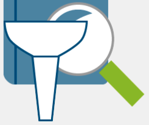

<head>
<meta http-equiv="Content-Type" content="text/html; charset=utf-8">
<link rel="stylesheet" type="text/css" href="bc.css">
<!--

-->

</head>

<!---

- 14282442 [Filter elements by parameter value]
  https://forums.autodesk.com/t5/revit-api-forum/filter-elements-by-parameter-value/m-p/8035505

- [Learn Forge Tutorials](http://learnforge.autodesk.io)
Our various http://learnforge.autodesk.io tutorials have been live for a few months (see individual launch date).
So far, we used and validated them in the San Francisco, Boston, Bangalore and Munich accelerators.
I loved how attendees (accelerators) cloud just followed it and got a starting app!
Here are some data: we had around 1900 unique visitors, 1402 went to the 2-legged tutorial first page and 517 (37%) completed one of the languages (last page). 284 went to the 3-legged one and 46 completed (16%). 302 unique visitors on the extensions tutorials.
         2legged 3legged
Tutorial 1402 284
Nodejs 229 Feb, 23 37 April, 27
.NET 193 Feb, 23 9 May, 18
Go 13 March, 15
PHP 37 April, 12
Java 45 May, 9
Total 517 46
      37% 16%
Extensions 302 April, 17

Forge Tutorials and filtering for a parameter value in the #RevitAPI @AutodeskRevit #bim #dynamobim @AutodeskForge #ForgeDevCon http://bit.ly/filterforparam

Today, let's revisit the topic of filtering for a parameter value, and mention the updated Forge tutorials
&ndash; Learning Forge tutorials
&ndash; Filtering for a specific parameter value
&ndash; Filtered element collector optimisation...

--->

### Forge Tutorials and Filtering for a Parameter Value

As always, I am active in
the [Revit API discussion forum](http://forums.autodesk.com/t5/revit-api-forum/bd-p/160).

Today, let's revisit the topic of filtering for a parameter value, and mention the updated Forge tutorials:

- [Learning Forge tutorials](#2) 
- [Filtering for a specific parameter value](#3) 
- [Filtered element collector optimisation](#4)

####Learning Forge Tutorials

The new [Learning Forge Tutorials](http://learnforge.autodesk.io) have
been live for a few months &ndash; cf. individual launch dates below.

So far, they have been used and validated in the San Francisco, Boston, Bangalore and Munich accelerators.

It is wonderful to behold how the accelerator attendees just follow them and get a starting app up and running in days!

Here is some data gathered so far: we had around 1900 unique visitors; 1402 went to the 2-legged tutorial first page, and 517 (37%) completed one of the languages (last page); 284 went for the 3-legged one, and 46 completed it (16%). 302 unique visitors to the extensions tutorials:

<table>
<tr><td class="r"></td><td class="r"></td><td class="r">2legged</td><td class="r"></td><td class="r">3legged</td></tr>
<tr><td class="r">Tutorial</td><td class="r">Date</td><td class="r">1402</td><td></td><td class="r">284</td></tr>
<tr><td class="r">Nodejs</td>  <td class="r">Feb, 23</td><td class="r">229</td><td class="r">&nbsp;&nbsp;&nbsp;&nbsp;April, 27</td><td class="r">37</td></tr>
<tr><td class="r">.NET</td>    <td class="r">Feb, 23</td><td class="r">193</td><td class="r">May, 18</td><td class="r">9</td></tr>
<tr><td class="r">Go</td>      <td class="r">&nbsp;&nbsp;&nbsp;&nbsp;March, 15</td><td class="r">13</td><td></td><td class="r">&ndash;</td></tr>
<tr><td class="r">PHP</td>     <td class="r">April, 12</td><td class="r">37</td><td></td><td class="r">&ndash;</td></tr>
<tr><td class="r">Java</td>    <td class="r">May, 9</td><td class="r">45</td><td></td><td class="r">&ndash;</td></tr>
<tr><td class="r">Total</td>   <td class="r"></td><td class="r">517</td><td class="r"></td><td class="r">46</td></tr>
<tr><td class="r"></td><td class="r"></td><td class="r">37%</td><td class="r"></td><td class="r">16%</td></tr>
<tr><td class="r">Extensions</td><td class="r">April, 17</td><td class="r">302</td></tr>
</table>

 

Check them out for yourself at your leisure at

[learnforge.autodesk.io](http://learnforge.autodesk.io)

####Filtering for a Specific Parameter Value

Returning to the Revit API, a frequent  task is to extract elements based on specific parameter values.

This question was raised yet again and brought up some fresh aspects in
the [Revit API discussion forum](http://forums.autodesk.com/t5/revit-api-forum/bd-p/160) thread
on [filtering for elements by parameter value](https://forums.autodesk.com/t5/revit-api-forum/filter-elements-by-parameter-value/m-p/8035505):

**Question:** Hi, I've searched the forums for this but couldn't find a clear answer.

I'm trying to select all elements in a filtered element collector where a parameter, let's say, "house number", equals "12".

Any other solution where I'd be able to loop through or list all elements that have this parameter value are welcome too.

**Answer:** I think you can just do the following:

<pre class="code">
  var collector = new FilteredElementCollector(doc)
    .Where(a => a.LookupParameter("house number")
      .AsString() == "12")
</pre>

Assuming that the storage type of your parameter is string.

**Response:** I tried using it (also checked whether the parameter was a string just to be sure), but the var `collector` end up `null`.

The message I get when looking at it in the locals is: "The collector does not have a filter applied.  Extraction or iteration of elements is not permitted without a filter."

**Answer 1:** My mistake.

The `Where` clause is actually a .NET post-processing `LINQ` statement, so the filtered element collector does not see any filter at all.

I normally always look for a specific element type when using a collector. 

This code filters for family instances first and works for me:

<pre class="code">
  List<FamilyInstance> list
    = new FilteredElementCollector(doc)
      .OfClass(typeof(FamilyInstance))
      .Where(a => a.LookupParameter("house number")
        .AsString() == "12")
      .Cast<FamilyInstance>()
      .ToList();
</pre>

It creates a list of `FamilyInstance` elements.

You can change the type to any desired one.

There are other ways to not apply a filter
and [get all element types in one go](http://thebuildingcoder.typepad.com/blog/2010/06/filter-for-all-elements.html);
however, I would not recommend that, because you never know beforehand which kind of elements may pass the filter if you do.

**Answer 2:** The first answer uses post-processing in .NET.

That means that the initial filtering takes place in Revit; then, all family instances are transferred to .NET to check the parameter value.

That causes a huge overhead.

The overhead can be eliminated by using a parameter filter instead, that checks for the parameter value directly in Revit, before transferring any data to .NET.

If you don't care, the first solution is fine, of course.

Here are some examples of using parameter filters:

- [Parameter filter](http://thebuildingcoder.typepad.com/blog/2010/06/parameter-filter.html)
- [Element name parameter filter correction](http://thebuildingcoder.typepad.com/blog/2010/06/element-name-parameter-filter-correction.html)
- [Parameter filter units](http://thebuildingcoder.typepad.com/blog/2009/12/parameter-filter-units.html)
- [Finding all possible `ElementId` values for a specific parameter](http://thebuildingcoder.typepad.com/blog/2017/06/finding-an-exit-path-and-elementid-parameter-values.html#3)

[The Building Coder](http://thebuildingcoder.typepad.com) provides many more.

####Filtered Element Collector Optimisation

**Response:** Hmmm...

Now I'm in doubt about whether or not I should rewrite the collectors in all my own add-ins to remove that overhead myself...

Some commands that take a long time might actually benefit from that if it's a big difference.

Most commands are nearly instant, though, so I don't think it would matter in that case.

Thanks for the insight Jeremy, as always, very helpful! &nbsp; :-)

**Answer:** Thank you for your appreciation and very glad to hear you find it useful.

Years ago, [I benchmarked different filtered element collectors](http://thebuildingcoder.typepad.com/blog/2010/04/collector-benchmark.html) and
found that moving from .NET post-processing to a parameter filter will save at least 50% overhead.

In a large model, it might be more.

Benchmark first, before you do anything!

If it works, don't fix it.

Also, the most important thing to start with is to always be aware of the differences between quick and slow filters, and post-processing in .NET,
cf. [Quick, Slow and LINQ Element Filtering](http://thebuildingcoder.typepad.com/blog/2015/12/quick-slow-and-linq-element-filtering.html).

To start with, apply as many filter shortcuts to the filtered element collector as you can.
All filter shortcuts are quick filters.
They are provided by methods that are available directly 
as [`FilteredElementCollector` member methods](http://www.revitapidocs.com/2018/163d1fae-e9d8-e4de-7452-c3b140b6daad.htm).

