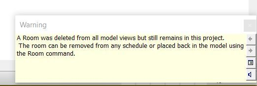

<head>
<meta http-equiv="Content-Type" content="text/html; charset=utf-8">
<link rel="stylesheet" type="text/css" href="bc.css">
<!--

-->

</head>

<!---

Creating a warning using the Failure API in the #RevitAPI @AutodeskRevit #bim #dynamobim @AutodeskForge #ForgeDevCon http://bit.ly/newwarning

The Failure API enables both failure definition and handling capabilities
&ndash; The ability to define and post failures from within API code when a user-visible problem has occurred
&ndash; The ability to respond to failures posted by Revit and by API code through code in your application
This also enables the creation of a modeless warning message to the user...

--->

### Creating a Warning Using the Failure API

The [Failure API](http://thebuildingcoder.typepad.com/blog/2010/04/failure-api.html) was
introduced a long time ago, back in 2010, for Revit 2011.

Time enough to forget that it enables both failure definition and handling capabilities:

- The ability to define and post failures from within API code when a user-visible problem has occurred.
- The ability to respond to failures posted by Revit and by API code through code in your application.

Luckily, Frank [@Fair59](https://forums.autodesk.com/t5/user/viewprofilepage/user-id/2083518) Aarssen is
there to help and remind us, in his answer to 
the [Revit API discussion forum](http://forums.autodesk.com/t5/revit-api-forum/bd-p/160) thread
on [how to create a warning](https://forums.autodesk.com/t5/revit-api-forum/how-to-create-a-warning/m-p/8058817):

**Question:** I've a routine which moves elements around, but on some occasions, it comes across an element that can't be moved.

I can get the routine to filter them out, so it's not an issue, but I'd like to create a warning message for the user.

I can do this with the `TaskDialog` class, and it has rather a large number of options
&ndash; cf., the [Revit UI API labs in 2_Revit_UI_API](https://github.com/jeremytammik/AdnRevitApiLabsXtra) &ndash;
however, it cannot be used in a modeless manner, so it always stops the user and forces them to hit OK.

Really, I'd like to create a non-critical Warning message that warns the user, but does not stop them working &ndash; the same sort of warning you get if you delete a room from the model:

I can't see a way of creating this in the API &ndash; can it be done?

**Answer:** For a non-Revit-API approach, you could indeed use a modeless Windows form and close it automatically after a specified time period. Here is a description
of [showing and closing modeless a form](https://drive-cad-with-code.blogspot.com/2014/02/showing-and-closing-modeless-formdialog.html).
It was written with AutoCAD in mind, and exceptionally applies to Revit as well, since it has nothing to do with either of them, really.

Much better, though, is to implement exactly what you ask: the Revit API does indeed provide complete support for creating your own modeless warning messages just like you require.

To do so, you can define your own failure, and let Revit display it.

First, you create a `FailureDefinitionId` and `FailureDefinition`:

<pre class="code">
&nbsp;&nbsp;//&nbsp;Create&nbsp;youw&nbsp;own&nbsp;new&nbsp;failure&nbsp;definition&nbsp;Ids
 
&nbsp;&nbsp;Guid&nbsp;guid1&nbsp;=&nbsp;new&nbsp;Guid(&nbsp;
&nbsp;&nbsp;&nbsp;&nbsp;&quot;d0cf2412-08fe-476b-a6e6-e9a98583c52c&quot;&nbsp;);
 
&nbsp;&nbsp;FailureDefinitionId&nbsp;m_idWarning&nbsp;
&nbsp;&nbsp;&nbsp;&nbsp;=&nbsp;new&nbsp;FailureDefinitionId(&nbsp;guid1&nbsp;);
 
&nbsp;&nbsp;//&nbsp;Create&nbsp;failure&nbsp;definitions&nbsp;and&nbsp;add&nbsp;resolutions
 
&nbsp;&nbsp;FailureDefinition&nbsp;m_fdWarning&nbsp;
&nbsp;&nbsp;&nbsp;&nbsp;=&nbsp;FailureDefinition.CreateFailureDefinition(&nbsp;
&nbsp;&nbsp;&nbsp;&nbsp;&nbsp;&nbsp;m_idWarning,&nbsp;FailureSeverity.Warning,&nbsp;
&nbsp;&nbsp;&nbsp;&nbsp;&nbsp;&nbsp;&quot;Textvalue&nbsp;is&nbsp;changed&nbsp;for&nbsp;all&nbsp;instances&nbsp;&quot;
&nbsp;&nbsp;&nbsp;&nbsp;&nbsp;&nbsp;+&nbsp;&quot;in&nbsp;textchain&quot;&nbsp;);
 
&nbsp;&nbsp;m_fdWarning.SetDefaultResolutionType(&nbsp;
&nbsp;&nbsp;&nbsp;&nbsp;FailureResolutionType.SetValue&nbsp;);
</pre>

Then, you can display the warning:

<pre class="code">
&nbsp;&nbsp;FailureMessage&nbsp;fm&nbsp;=&nbsp;new&nbsp;FailureMessage(&nbsp;
&nbsp;&nbsp;&nbsp;&nbsp;ExternalApplication.m_idWarning&nbsp;);
 
&nbsp;&nbsp;doc.PostFailure(&nbsp;fm&nbsp;);
</pre>

These steps are also demonstrated in the Revit SDK ErrorHandling and PerformanceAdviserControl samples, in the files Command.cs and FlippedDoorCheck.cs, respectively.

The failure is displayed as a Revit warning as depicted above.

You can totally ignore it, and continue working.

One possible caveat: it will probably be displayed when control reverts back to Revit (not sure).

Many thanks to Frank for his invaluable help!

