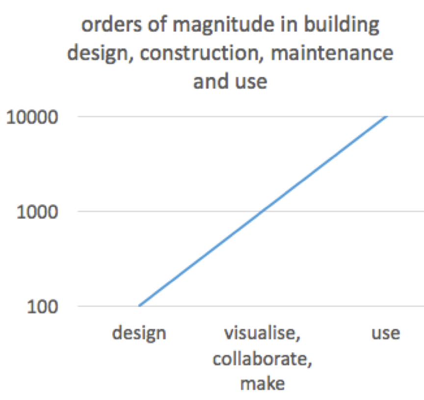

<head>
<meta http-equiv="Content-Type" content="text/html; charset=utf-8">
<link rel="stylesheet" type="text/css" href="bc.css">
<!--

-->
</head>

<!---

BIM360 and Forge for digital construction message and samples #RevitAPI @AutodeskRevit #bim #dynamobim @AutodeskForge #ForgeDevCon http://bit.ly/bim360forgeaecsamples

I am participating in a <i>Digital Construction Live</i> event in the UK next week and presenting there on Forge for the BIM domain. Today, let's focus on the real message and some live samples putting it to use:
&ndash; The real message
&ndash; BIM collaboration roles and magnitudes
&ndash; Forge for AEC Sample Live
&ndash; Connecting Forge with BIM360 Sample...

--->

### BIM360 and Forge for AEC Message and Samples

As I pointed out in
the [overview of Forge for AEC and BIM360](http://thebuildingcoder.typepad.com/blog/2018/06/forge-for-aec-and-bim360-overview.html),
I am participating in a *Digital Construction Live* event in the UK next week and presenting there on Forge for the BIM domain.

Today, let's focus on the real message and some live samples putting it to use:

- [The real message](#2) 
- [BIM collaboration roles and magnitudes](#3) 
- [Forge for AEC sample](#4) 
- [Connecting Forge with BIM360 sample](#5) 

####  The Real Message 

The real message about Forge for AEC and BIM360, according to Jim Quanci, with whom I luckily was able to chat yesterday, is this:

- A number of people work on the project team, in a BIM360 project: managers, plumbers, projects superintendents, etc., on both desktop and mobile.
- The rest of the organisation, a much larger number of people, does not work in that (rather complex, specialised) environment.
- The organisation can save cost and time by letting everybody concerned always see what is going on in each project.
- A majority of the collaborators do not need or want the full BIM360.
- Using Forge, you can easily pop up your own web page to provide them with whatever information they need.

I explained this principle in more depth in my presentation
on [rational BIM programming](http://thebuildingcoder.typepad.com/blog/2017/10/rational-bim-programming-at-au-darmstadt.html) at
Autodesk University in Darmstadt, Germany, last year.

One of the main motivating aspects in that talk is basically exactly what Jim points out:

####  BIM Collaboration Roles and Magnitudes

I am not a very graphical person, and generally use much too few images in my presentations.

Exceptionally, though, I did create a graph for that one, to explain the orders of magnitude of difference in numbers of BIM collaboration participants in different kinds of roles in the design process segments targeted by Autodesk and supported by the Forge platform:

- Design &ndash; architect, engineer &ndash; Revit
- Visualise &ndash; client, everybody &ndash; Forge Viewer
- Collaborate &ndash; management &ndash; Glue + Plan
- Make &ndash; construction &ndash; Field + Layout
- Use &ndash; inhabit, maintain, FM &ndash; Building Ops

Please excuse the obsolete BIM360 naming in the list above. It keeps changing all the time &mdash; the principles remain the same.

In extreme cases, these numbers might vary by several orders of magnitude:

For more details, please refer
to [my presentation mentioned above](http://thebuildingcoder.typepad.com/blog/2017/10/rational-bim-programming-at-au-darmstadt.html).

####  Forge for AEC Sample Live

One of Jim's favourite Forge AEC examples
is [BLDNG360](https://bldng360.com)
by [CAD &amp; Company](http://www.cadcompany.nl) in
the Netherlands.

It provides a gallery of building including detailed BIM information.

One very nice example is the [Duijpaviljoen 'Zuin am See'](https://bldng360.com/gebouwen/TqOCqXo9I0CrW9h_vAIG4A).

It includes a large amount of detailed BIM information, numerous drawings, lists all the content, all the structure and other information on the model quality, e.g., the percentage of components equipped with assembly codes, materials, areas per level and material types.

This kind of dashboard information can be used to easily assess how complete the BIM is in various respects.

This kind of application can be built using the generic Forge components, for any type of CAD model.

####  Connecting Forge with BIM360 Sample

Another sample specifically targeted at BIM360
is the [BIM360 Visual Reports app](https://bim360reports.autodesk.io) written by my FPD colleague Augusto Gonçalves.

Full source code for this app is provided in  
the [bim360appstore-viewer-nodejs-visual.reports GitHub repository](https://github.com/Autodesk-Forge/bim360appstore-viewer-nodejs-visual.reports).

As explained in
the [GitHub project documentation](https://github.com/Autodesk-Forge/bim360appstore-viewer-nodejs-visual.reports),
it is a BIM360 project dashboard example demonstrating how to extract properties from BIM360 elements and display them in a project dashboard.

It enables you to load and analyse Revit models hosted on BIM360, list the versions available, switch between the 2D and 3D views, select elements in one type of view to be highlighted in the other, select and highlight element groups, examine the BIM element properties and dimensions, look at different kinds of graphs and dashboards presenting statistics on various aspects of quantities, types, levels, constraints, assembly codes, materials, and more.

The Urban House model is a good one to explore here.

For a closer look at this sample in action, watch Jaime Rosales' one-and-a-half-minute video recording
showing [how to use bim360reports](https://youtu.be/4g9FFFlQMjU):

<iframe width="480" height="270" src="https://www.youtube.com/embed/4g9FFFlQMjU" frameborder="0" allow="autoplay; encrypted-media" allowfullscreen></iframe>

