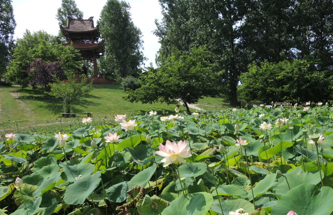
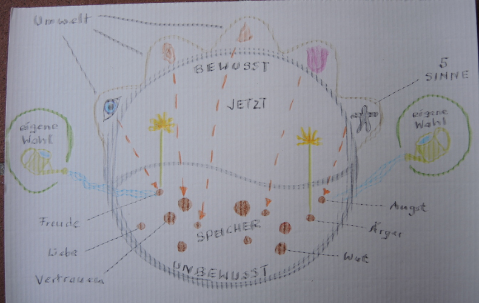

<head>
<meta http-equiv="Content-Type" content="text/html; charset=utf-8">
<link rel="stylesheet" type="text/css" href="bc.css">
<!--

-->
</head>

<!---

- [Revit API. ReferenceIntersector with TopografySurfaces]
  https://stackoverflow.com/questions/51498527/revit-api-referenceintersector-with-topografysurfaces
  Does anyone know if ReferenceIntersector works with TopografySurfaces? Cannot make it work. I need to find a point on the surface based on a intersection with a line.
  Regardless of whether the `ReferenceIntersector` does or does not work with topography surfaces, you can pretty easily solve the problem you describe yourself using other means. Simply ask the surface for its tessellated representation. That will return a bunch of triangles. Then, implement your own [algorithm to intersect a triangle with the line](https://duckduckgo.com/?q=line+triangle+intersect). That should give you all you need, really.

Mindful living, smiling to myself and line intersection with topography surface in the #RevitAPI @AutodeskRevit #bim #dynamobim @AutodeskForge #ForgeDevCon http://bit.ly/struggetosmile

I am back from my July vacation.
As planned, I visited the Buddhist monastery Plum Village near Bordeaux.
Here are some personal notes from my experiences there, followed by a Revit API related issue that just cropped up
&ndash; Plum Village and its visitors
&ndash; Mindfulness and relaxation
&ndash; My struggle with the smile
&ndash; Mindful watering of seeds
&ndash; Line intersection with topography surface...

--->

### Mindful Living and Smiling to Myself

I am back from my July vacation.

[As planned](http://thebuildingcoder.typepad.com/blog/2018/07/vacation-and-multi-version-revit-add-in-template.html), 
I visited the Buddhist monastery [Plum Village](https://plumvillage.org) near Bordeaux, founded
by the Vietnamese monk and Zen master [Thich Nhat Hanh](https://plumvillage.org/about/thich-nhat-hanh).

On the way there, I also visited my school classmate Gerald's fablab FabD'Oc in Brassac and spent two nights sleeping out on the beach of the Atlantic at Le Porge. Here are some photos from the trip:

- [The FabLab FabD'Oc in Brassac](https://flic.kr/s/aHsmjY48Ud)
- [Sleeping on the beach of the Atlantic at Le Porge](https://flic.kr/s/aHskFjTwhd)
- [Plum Village](https://flic.kr/s/aHsmnjabHR)

Below, I share some personal notes from my experiences in Plum Village, followed by a Revit API related issue that just cropped up:

- [Plum Village and its visitors](#2) 
- [Mindfulness and relaxation](#3) 
- [My struggle with the smile](#4) 
- [Mindful watering of seeds](#5) 
- [Line intersection with topography surface](#6) 

I translated the following text from English to German language to share with some of our friends.
Please click here for the German version:

- [Achtsames Leben und mein Ringen mit dem L&auml;cheln](zip/plumvillage_de.pdf)

####  Plum Village and Its Visitors

This is a sort of *What I did in my holidays* primary school essay &nbsp; :-)

I could also summarise it as my fruitful struggle to smile at myself.

Above all, [Plum Village](https://plumvillage.org) is a school and practice opportunity for mindful living.

It is also a Buddhist monastery, and the monks and nuns living there provide the opportunity for anybody to come for a retreat to live and learn.

Finally, it is a very beautiful place in a beautiful part of the French countryside.

It welcomes all kinds of people and all ages, children, teens and adults. It is very open to families with children, individuals and couples.

It is a really wonderful place for families; the kids are allowed and encouraged to really enjoy themselves. They go wild and practice mindfulness as well.

I went as a couple with my partner Moni.
In a ceremony at the end of the retreat, we both made a commitment to practice one particular aspect of mindfulness in our everyday lives, *Loving Speech and Deep Listening*. 
We are thus now disciples of Thich Nhat Hanh and members of the 43rd generation of disciples of Siddhartha Buddha.

####  Mindfulness and Relaxation

Mindful living obviously begins with myself and requires continuous practice.

The most effective practice field is with my closest connections, e.g., partner, children, parents, family, friends and colleagues.

The theory and practice of mindful living is free of any kind of religious context; it is more like a philosophy and an art.

You could call it a school of happiness, a *Lebensschule*, a place to learn and practice the art of relationship with yourself and others.

I spent one week there.

The first day or two was strongly focused on deep relaxation, completely devoted to conscious breathing and relaxation.

That helped create space for awareness, contentment and happiness.

Other important teachings included noble silence, conscious eating (incl. queueing and taking only what you need), walking and breathing meditations, stopping each time you hear a bell and numerous songs describing the practices.

Glocke der Achtsamkeit.

####  My Struggle with the Smile

After a day or two of relaxation and slowing down, we were given one specific piece of homework:

When you wake up in the morning, before doing anything else, smile to yourself.

If you forget and get up, go back to bed again.

Repeat until successful.

I found that a very hard thing to do.

I woke up in the morning and remembered the exercise, but felt unwilling to smile.

I longed to smile, but it felt unauthentic.

I practiced doing so anyway and learned a lot from that.

I realised that a strong part in me does not wish to feel happy and tries to make other people around me responsible to care for my happiness instead.

Making the conscious choice to smile at myself first thing after waking up, and as often as possible during the day as well, really made a difference to my mood.

I finally took responsibility for my own happiness.

Sometimes my smile still does not feel completely true and authentic; however, I persist.

What does feel true and authentic to me, always: enjoying the fact that I can breathe in and breathe out, that I am alive, that I have a body.

What a gift, what a pleasure, what ecstasy just being alive!

I have food and shelter and freedom.

I can walk and be aware of each step I take.

Now, after returning from Plum Village, as a result of the week of mindful practice, I feel more alive.

I am more active and I go more for what I enjoy.

I realise and promise myself that this is not a temporary effect that will gradually dissipate, because I have the power to keep making this conscious choice as long as I please.

Yesterday, after returning to Switzerland, we went for a quick short swim en route in the Melezza River, and another one in the Lago Maggiore.

Normally, I would not have initiated both and motivated my partner to join me.

Now I feel more initiative and aliveness, more connected with myself, more expressive and authentic.

I am very grateful for the teaching!

####  Mindful Watering of Seeds

Here is a picture to illustrate the practice of mindfulness as the mindful watering of seeds stored in the unconscious:

All our input comes through the five senses (top).

All experiences are stored as seeds in the unconscious (bottom).

We can make a conscious choice, which of the seeds to water and nourish.

The conscious manifestation always happens in the current moment.

The unconscious seeds can be traumata or good experiences and can be associated with all kinds of feelings.

Depending on whether we nourish and water them, they flourish and manifest more or less.

We have a choice of which seeds we choose to manifest.

If we notice that we are reacting to a sensation in a way that does not do us or our environment any good, such as destructive anger, we can consciously choose to take a step back, breathe, relax, walk and do nothing else.

There is no need to fight or suppress those seeds.
Just do nothing, and they will shrink and wither all by themselves.

The more we water specific seeds, the more powerful they become, and vice versa.

None of the seeds are per se good or bad.
Some may be associated with good or bad feelings.
Some may cause harmful effects when we choose to manifest them, others may cause beneficial effects.

Buddhists often use the image of the lotus flower growing out of the mud.
The mud consists of all kinds of things, and some of them may stink.
The lotus extracts what it needs from the mud and manifests in a beautiful way.
The mud is in no way bad or negative &ndash; it is everything, both good and bad, negative and positive.
The lotus stands for the result of a conscious choice that we make.

Englishmen may prefer the image of roses growing out of compost and horse dung.

<!--

German translation

Plum Village und seine Besucher

Das ist eine Art von Grundschulaufsatz: Was ich in meinen Ferien erlebt habe :-)

Ich könnte es auch beschreiben als mein fruchtbares Ringen, mich selbst anzulächeln.

Eigentlich ist Plum Village eine Schule und ein Übungsfeld für achtsames Leben.

Es ist auch ein buddhistisches Kloster, und die dort lebenden Mönche und Nonnen bieten jedem die Möglichkeit, zu einem Retreat zum Leben und Lernen zu kommen.

Es ist ein sehr schöner Ort in einem schönen Teil der französischen Landschaft.

Alle Menschen und alle Altersgruppen sind willkommen, Kinder, Jugendliche und Erwachsene. Plum Village steht offen für Familien mit Kindern, Einzelpersonen und Paare.

Es ist ein wunderbarer Ort für Familien; Die Kinder werden ermutigt sich frei auszuleben, dürfen wild sein und üben auch Achtsamkeit.

Ich ging zusammen mit meiner Partnerin Moni hin. Wir haben uns beide am Schluss des Retreats in einer Zeremonie verpflichtet, einen bestimmten Aspekt der Achtsamkeit in unserem täglichen Leben zu praktizieren, nämlich Liebevolles Sprechen und Tiefes Zuhören. Wir sind nun Schüler von Thich Nhat Hanh und Mitglieder der 43. Generation von Schülern von Siddhartha Buddha.

Achtsamkeit und Entspannung

Achtsames Leben beginnt natürlich bei mir selbst und bedarf ständiger Übung.

Das effektivste Übungsfeld ist im Umgang mit meinen engsten Beziehungen, z. B. Partner, Kinder, Eltern, Familie, Freunde und Kollegen.

Die Theorie und Praxis des achtsamen Lebens sind frei von jeglichem religiösen Kontext und stellen eher eine Philosophie und Lebenskunst dar.

Man könnte es eine Schule des Glücklichseins nennen, eine Lebensschule, einen Ort, um die Kunst der Beziehung mit sich selbst und anderen zu lernen und zu praktizieren.

Ich verbrachte eine Woche dort.

Die ersten zwei Tage standen ganz im Zeichen der Tiefenentspannung und waren ganz dem bewussten Atmen und Entspannen gewidmet.

Das hat dazu beigetragen, Raum für Aufmerksamkeit, Zufriedenheit und Glück zu schaffen.

Weitere wichtige Lehren waren edle Stille (noble silence), bewusstes Essen (inkl. Schlangestehen und bewusstes Schöpfen), Geh- und Atemmeditation, jedes Mal Stopp machen, wenn eine Glocke erklingt, und zahlreiche Lieder, die die Praktiken beschreiben.

Mein Ringen mit dem Lächeln

Nach den Tagen der Entspannung und Verlangsamung bekamen wir eine konkrete Hausaufgabe:

Wenn du morgens aufwachst, bevor du irgendetwas anderes machst, lächle dir selbst zu.

Wenn du es vergisst und aufstehst, geh gleich wieder ins Bett.

Wiederholen bis erfolgreich.

Ich fand das sehr schwer.

Ich wachte morgens auf und erinnerte mich an die Übung, aber ich wollte nicht lächeln.

Ich sehnte mich danach zu lächeln, aber es fühlte sich unecht an.

Ich habe es trotzdem geübt und viel daraus gelernt.

Ich erkannte, dass ein starker Teil in mir nicht glücklich sein will und versucht, andere Menschen um mich herum dazu zu bringen, sich um mein Glück zu kümmern.

Die bewusste Entscheidung, nach dem Aufwachen und so oft wie möglich auch tagsüber mich selbst anzulächeln, hat meine Stimmung wirklich verändert.

Ich übernahm endlich nach und nach immer mehr die Verantwortung für mein eigenes Glück.

Manchmal fühlt sich mein Lächeln immer noch nicht echt und authentisch an; ich bleibe jedoch beharrlich.

Was sich für mich immer wahr und authentisch anfühlt: die Tatsache genießen, dass ich einatmen und ausatmen kann, dass ich lebe, dass ich einen Körper habe.

Was für ein Geschenk, was für ein Vergnügen, welche Ekstase lebt gerade!

Ich habe Essen und Schutz und Freiheit.

Ich kann gehen und mir jedes Schrittes bewusst sein.

Jetzt, nach der Rückkehr aus Plum Village, fühle ich mich durch die Woche der bewussten Übung lebendiger.

Ich bin aktiver und ich gehe mehr für das, was mir Spaß macht.

Ich erkenne und verspreche mir selbst, dass dies kein vorübergehender Effekt ist, der sich allmählich auflösen wird, weil ich die Kraft habe, diese bewusste Entscheidung so lange zu treffen, wie ich will.

Zum Beispiel machten wir gestern nach der Rückkehr in die Schweiz eine kurze Pause zum Schwimmen in der Melezza, einem Tessiner Fluss, und kurz danach eine weitere Schwimmpause in dem Lago Maggiore.

Normalerweise hätte ich nicht alle beide initiiert und meine Partnerin motiviert, sich mir anzuschließen.

Jetzt fühle ich mich mehr initiativ und lebendig, mehr mit mir selbst verbunden und authentischer.

Ich bin sehr dankbar für diesen Lebensunterricht!

Achtsame Bewässerung von Samen

Hier ist ein Bild, das die Praxis der Achtsamkeit als bewusste Bewässerung der im Unbewussten gespeicherten Samen veranschaulicht:

Bewusstes Bewässern von im Unbewussten gespeicherten Samen

All unser Input kommt durch die fünf Sinne (oben).

Alle Erfahrungen sind als Samen im Unbewussten gespeichert (unten).

Wir können eine bewusste Wahl treffen, welche der Samen bewässert und genährt werden.

Die bewusste Manifestation geschieht immer im aktuellen Moment.

Die gespeicherten Samen im Unterbewussten können Traumata oder gute Erfahrungen darstellen und mit allen Arten von Gefühlen verbunden sein.

Je nachdem, ob wir sie nähren und bewässern, gedeihen sie und manifestieren sich mehr oder weniger.

Wir haben die Wahl, welche Samen genährt werden sollen.

Wenn wir bemerken, dass wir auf einen Sinneseindruck in einer Art reagieren, die uns oder unserer Umwelt nicht gut tut, wie z. B. destruktive Wut, können wir bewusst einen Schritt zurücktreten, atmen, entspannen, gehen und nichts anderes tun.

Es besteht keine Notwendigkeit, diese Samen zu bekämpfen oder zu unterdrücken. Tun wir einfach nichts und reagieren nicht, werden sie schrumpfen und verdorren.

Je mehr wir bestimmte Samen gießen, desto mächtiger werden sie, und umgekehrt.

Keiner der Samen ist per se gut oder schlecht. Einige können mit guten oder schlechten Gefühlen verbunden sein. Einige können schädliche Auswirkungen haben, wenn wir uns dafür entscheiden, sie zu manifestieren, andere können positive Auswirkungen haben.

Buddhisten benutzen oft das Bild der Lotusblume, die aus dem Schlamm wächst. Der Schlamm besteht aus allen möglichen Komponenten, und einige von ihnen mögen stinken. Der Lotus zieht sich, was er braucht, heraus dem Schlamm und manifestiert sich auf schöne Weise. Der Schlamm ist nicht nur schlecht oder negativ - er ist alles, sowohl gut als auch schlecht, negativ und positiv. Der Lotus steht für das Resultat der bewussten Entscheidung, die wir treffen.

Engländer bevorzugen vielleicht das Bild von Rosen, die aus Kompost und Pferdemist wachsen.

-->

####  Line Intersection with Topography Surface

I'll add one little note on a Revit API related issue as well, a suggestion for the question raised on StackOverflow
on using [`ReferenceIntersector` with topography surfaces](https://stackoverflow.com/questions/51498527/revit-api-referenceintersector-with-topografysurfaces):

**Question:** Does anyone know if `ReferenceIntersector` works with topograpy surfaces?

I cannot make it work.

I need to find a point on the surface based on an intersection with a line.

**Answer:** Regardless of whether the `ReferenceIntersector` does or does not work with topography surfaces, you can pretty easily solve the problem you describe yourself using other means.

Simply ask the surface for its tessellated representation. That will return a bunch of triangles.

Then, implement your own [algorithm to intersect a triangle with the line](https://duckduckgo.com/?q=line+triangle+intersect).

That should give you all you need, really.

