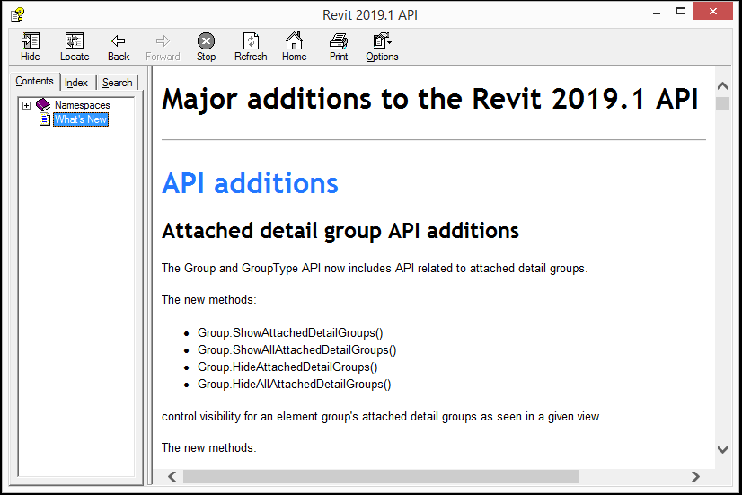

<head>
<meta http-equiv="Content-Type" content="text/html; charset=utf-8">
<link rel="stylesheet" type="text/css" href="bc.css">
<!--

-->

</head>

<!---

- what's new -- /a/doc/revit/tbc/doc/Revit_Platform_API_Changes_and_Additions_2019_1_6.txt

What's New in the Revit 2019.1 API includes exciting #RevitAPI enhancements @AutodeskRevit #bim #dynamobim @AutodeskForge #ForgeDevCon http://bit.ly/rvt2019_1apinews

The Revit 2019.1 update has been released.
It is equipped with an updated API that includes several exciting enhancements for add-in developers.
Many relate directly to explicit developer wishes and requests
&ndash; Information sources
&ndash; What's new in previous versions
&ndash; What's new in the Revit 2019.1 API
&ndash; API Changes
&ndash; API Additions...

--->

### What's New in the Revit 2019.1 API

As I mentioned last week,
the [Revit 2019.1 update](http://thebuildingcoder.typepad.com/blog/2018/08/revit-20191-cefsharp-forge-accelerator-in-rome.html#2) has
been released.

It is equipped with an updated API that includes several exciting enhancements for add-in developers.

Many relate directly to explicit developer wishes and requests:

- [Information Sources](#1) 
- [What's New in Previous Versions](#2) 
- [What's New in the Revit 2019.1 API &ndash; Detailed ToC](#3) 
- [1. API Changes](#3.1) 
    - [1.1. .NET 4.7](#3.1.1) 
    - [1.2. View Filters support OR operators and nesting](#3.1.2) 
    - [1.3. View.ViewName deprecated](#3.1.3) 
    - [1.4. UI API changes](#3.1.4) 
    - [1.5. Existing APIs now support open from cloud paths (Collaboration for Revit)](#3.1.5) 
    - [1.6. BasicFileInfo changes](#3.1.6) 
    - [1.7. Asset-related API members deprecated](#3.1.7) 
    - [1.8. Double Pattern Support](#3.1.8) 
    - [1.9. Document.Title consistency](#3.1.9) 
    - [1.10. View printing & exporting &ndash; activation events behavioral change](#3.1.10) 
    - [1.11. Structural API change](#3.1.11) 
    - [1.12. Rebar API changes](#3.1.12) 
    - [1.13. MEP API changes](#3.1.13) 
    - [1.14. ProjectLocation changes](#3.1.14) 
    - [1.15. Building Site export removed](#3.1.15) 
    - [1.16. Obsolete API removal](#3.1.16)
- [2. API Additions](#3.2)
    - [2.17. Material API additions](#3.2.17) 
    - [2.18. Railing API additions](#3.2.18) 
    - [2.19. Find Element Dependencies](#3.2.19) 
    - [2.20. Dimension API additions](#3.2.20) 
    - [2.21. Set vertical alignment for text](#3.2.21) 
    - [2.22. BrowserOrganization API additions](#3.2.22) 
    - [2.23. Rebar API additions](#3.2.23) 
    - [2.24. Steel Fabrication API additions](#3.2.24) 
    - [2.25. MEP API additions](#3.2.25) 
    - [2.26. MEP Fabrication API additions](#3.2.26) 
    - [2.27. Analysis Visualization Framework API addition](#3.2.27) 
    - [2.28. IFC additions](#3.2.28) 
    - [2.29. Revit Link Additions](#3.2.29) 
    - [2.30. Export Additions](#3.2.30) 
    - [2.31. Access to add-in data paths](#3.2.31) 
    - [2.32. Site API additions](#3.2.32) 
    - [2.33. UI API additions](#3.2.33) 

####Information Sources

The information below is based on the contents of the *Revit Platform API Changes and Additions.docx* document included with
the [Revit 2019.1 SDK](http://thebuildingcoder.typepad.com/blog/2018/04/compiling-the-revit-2019-sdk-samples.html#3)
&ndash; software developers kit &ndash; available from 
the [Revit Developer Centre](https://www.autodesk.com/developer-network/platform-technologies/revit) (not posted yet, but coming soon).

It is also provided in the section on *What's New* in the Revit 2019.1 API help file `RevitAPI.chm` included with the SDK:

For convenient, easy and effective web searching, this blog post provides an online version of that information.

The *What's New* section always provides very important information, both for discovering and exploring the newly added API functionality and for later reference.

If you encounter any issues migrating your existing add-ins between different versions, this is one of the first places to look.

For detailed information on all other aspects of the Revit API, please refer to the rest of the API documentation and samples provided in the SDK.

The most important things to install and always keep at hand are:

- The Revit API help file `RevitAPI.chm`
- The Visual Studio solution containing all the SDK samples, `Samples\SDKSamples.sln`

You will need both of these constantly for research on how to solve specific Revit API programming tasks.

More in-depth official explanations and background information is provided by the
online [Revit API Developers Guide](http://help.autodesk.com/view/RVT/2019/ENU/?guid=Revit_API_Revit_API_Developers_Guide_html) included 
in the [Revit 2019 Help](http://help.autodesk.com/view/RVT/2019/ENU).

####What's New in Previous Versions

Here are links to previous discussions of *What's New in the Revit API*:

- [What's New in the Revit 2010 API](http://thebuildingcoder.typepad.com/blog/2013/02/whats-new-in-the-revit-2010-api.html)
- [What's New in the Revit 2011 API](http://thebuildingcoder.typepad.com/blog/2013/02/whats-new-in-the-revit-2011-api.html)
- [What's New in the Revit 2012 API](http://thebuildingcoder.typepad.com/blog/2013/02/whats-new-in-the-revit-2012-api.html)
- [What's New in the Revit 2013 API](http://thebuildingcoder.typepad.com/blog/2013/03/whats-new-in-the-revit-2013-api.html)
- [What's New in the Revit 2014 API](http://thebuildingcoder.typepad.com/blog/2013/04/whats-new-in-the-revit-2014-api.html)
- [What's New in the Revit 2015 API](http://thebuildingcoder.typepad.com/blog/2014/04/whats-new-in-the-revit-2015-api.html)
- [What's New in the Revit 2016 API](http://thebuildingcoder.typepad.com/blog/2015/04/whats-new-in-the-revit-2016-api.html)
- [What's New in the Revit 2017 API](http://thebuildingcoder.typepad.com/blog/2016/04/whats-new-in-the-revit-2017-api.html)
- [What's New in the Revit 2017.1 API](http://thebuildingcoder.typepad.com/blog/2016/11/whats-new-in-the-revit-20171-api.html)
- [What's New in the Revit 2018 API](http://thebuildingcoder.typepad.com/blog/2017/04/whats-new-in-the-revit-2018-api.html)
- [Revit 2018.1 and the Visual Materials API](http://thebuildingcoder.typepad.com/blog/2017/08/revit-20181-and-the-visual-materials-api.html)
- [Revit 2018.1.1 and 2018.1 API Docs Online](http://thebuildingcoder.typepad.com/blog/2017/09/revit-201811-fixes-cropbox-setting.html)
- [Revit 2018.1 Visual Materials API](http://thebuildingcoder.typepad.com/blog/2017/11/modifying-material-visual-appearance.html)
- [What's New in the Revit 2018.2 API](http://thebuildingcoder.typepad.com/blog/2017/12/whats-new-in-the-revit-20182-api.html)
- [What's New in the Revit 2019 API](http://thebuildingcoder.typepad.com/blog/2018/04/whats-new-in-the-revit-2019-api.html)

####What's New in the Revit 2019.1 API &ndash; Detailed ToC

Table of Contents:

<ul class="toc">
<li>1. <a href="#3.1">API changes</a></li>
<ul class="toc">
<li>1.1. <a href="#3.1.1">.NET 4.7</a></li>
<li>1.2. <a href="#3.1.2">View Filters support OR operators and nesting</a></li>
<ul class="toc">
<li>1.2.1. <a href="#3.1.2.1">ParameterFilterElement API changes</a></li>
<li>1.2.2. <a href="#3.1.2.2">ElementLogicalFilter API addition</a></li>
</ul>
<li>1.3. <a href="#3.1.3">View.ViewName deprecated</a></li>
<li>1.4. <a href="#3.1.4">UI API changes</a></li>
<ul class="toc">
<li>1.4.1. <a href="#3.1.4.1">Main window handle access</a></li>
<li>1.4.2. <a href="#3.1.4.2">Changes to PostableCommand enumeration</a></li>
</ul>
<li>1.5. <a href="#3.1.5">Existing APIs now support open from cloud paths (Collaboration for Revit)</a></li>
<ul class="toc">
<li>1.5.1. <a href="#3.1.5.1">Document Open APIs support cloud paths</a></li>
<li>1.5.2. <a href="#3.1.5.2">Callback for conflict cases when opening from a cloud path</a></li>
</ul>
<li>1.6. <a href="#3.1.6">BasicFileInfo changes</a></li>
<li>1.7. <a href="#3.1.7">Asset-related API members deprecated</a></li>
<li>1.8. <a href="#3.1.8">Double Pattern Support</a></li>
<ul class="toc">
<li>1.8.1. <a href="#3.1.8.1">Material API support for double patterns</a></li>
<li>1.8.2. <a href="#3.1.8.2">Support for overriding double patterns</a></li>
<li>1.8.3. <a href="#3.1.8.3">Support for double patterns for FilledRegion</a></li>
</ul>
<li>1.9. <a href="#3.1.9">Document.Title consistency</a></li>
<li>1.10. <a href="#3.1.10">View printing & exporting &ndash; activation events behavioral change</a></li>
<li>1.11. <a href="#3.1.11">Structural API change</a></li>
<li>1.12. <a href="#3.1.12">Rebar API changes</a></li>
<li>1.13. <a href="#3.1.13">MEP API changes</a></li>
<li>1.14. <a href="#3.1.14">ProjectLocation changes</a></li>
<li>1.15. <a href="#3.1.15">Building Site export removed</a></li>
<li>1.16. <a href="#3.1.16">Obsolete API removal</a></li>
<ul class="toc">
<li>1.16.1. <a href="#3.1.16.1">Classes</a></li>
<li>1.16.2. <a href="#3.1.16.2">Methods</a></li>
<li>1.16.3. <a href="#3.1.16.3">Properties</a></li>
</ul>
</ul>
<li>2. <a href="#3.2">API additions</a></li>
<ul class="toc">
<li>2.17. <a href="#3.2.17">Material API additions</a></li>
<ul class="toc">
<li>2.17.1. <a href="#3.2.17.1">Editing the properties of an Appearance Asset</a></li>
<li>2.17.2. <a href="#3.2.17.2">Editing AssetProperty values</a></li>
<li>2.17.3. <a href="#3.2.17.3">Connected Assets</a></li>
<li>2.17.4. <a href="#3.2.17.4">Validation</a></li>
<li>2.17.5. <a href="#3.2.17.5">Schemas and Property names</a></li>
<li>2.17.6. <a href="#3.2.17.6">Utilities</a></li>
</ul>
<li>2.18. <a href="#3.2.18">Railing API additions</a></li>
<ul class="toc">
<li>2.18.1. <a href="#3.2.18.1">Non-Continuous Rail Structure</a></li>
<li>2.18.2. <a href="#3.2.18.2">Baluster Placement</a></li>
</ul>
<li>2.19. <a href="#3.2.19">Find Element Dependencies</a></li>
<li>2.20. <a href="#3.2.20">Dimension API additions</a></li>
<li>2.21. <a href="#3.2.21">Set vertical alignment for text</a></li>
<li>2.22. <a href="#3.2.22">BrowserOrganization API additions </a></li>
<li>2.23. <a href="#3.2.23">Rebar API additions</a></li>
<ul class="toc">
<li>2.23.1. <a href="#3.2.23.1">BarTypeDiameterOptions</a></li>
<li>2.23.2. <a href="#3.2.23.2">GetDistributionPath()</a></li>
<li>2.23.3. <a href="#3.2.23.3">RebarUpdateCurvesData</a></li>
<li>2.23.4. <a href="#3.2.23.4">RebarShapes</a></li>
<li>2.23.5. <a href="#3.2.23.5">Workshop Instructions</a></li>
<li>2.23.6. <a href="#3.2.23.6">RebarFreeFormAccessor Additions</a></li>
</ul>
<li>2.24. <a href="#3.2.24">Steel Fabrication API additions</a></li>
<ul class="toc">
<li>2.24.1. <a href="#3.2.24.1">SteelElementProperties &ndash; linking between Revit elements and steel fabrication elements</a></li>
<li>2.24.2. <a href="#3.2.24.2">Custom steel connections &ndash; API additions</a></li>
</ul>
<li>2.25. <a href="#3.2.25">MEP API additions</a></li>
<ul class="toc">
<li>2.25.1. <a href="#3.2.25.1">MEPCurveType Shape</a></li>
<li>2.25.2. <a href="#3.2.25.2">Mechanical Equipment Set API</a></li>
<li>2.25.3. <a href="#3.2.25.3">Hydraulic Separation API</a></li>
</ul>
<li>2.26. <a href="#3.2.26">MEP Fabrication API additions</a></li>
<ul class="toc">
<li>2.26.1. <a href="#3.2.26.1">Exporting fabrication job files</a></li>
<li>2.26.2. <a href="#3.2.26.2">API for load and unload of one-off fabrication parts from loose item files</a></li>
<li>2.26.3. <a href="#3.2.26.3">API for version history of parts</a></li>
<li>2.26.4. <a href="#3.2.26.4">API for part swap out information</a></li>
<li>2.26.5. <a href="#3.2.26.5">Centerline length API</a></li>
</ul>
<li>2.27. <a href="#3.2.27">Analysis Visualization Framework API addition</a></li>
<li>2.28. <a href="#3.2.28">IFC additions</a></li>
<li>2.29. <a href="#3.2.29">Revit Link Additions</a></li>
<li>2.30. <a href="#3.2.30">Export Additions </a></li>
<li>2.31. <a href="#3.2.31">Access to add-in data paths</a></li>
<li>2.32. <a href="#3.2.32">Site API additions</a></li>
<li>2.33. <a href="#3.2.33">UI API additions</a></li>
<ul class="toc">
<li>2.33.1. <a href="#3.2.33.1">BeforeExecutedEventArgs Cancellation</a></li>
</ul>
</ul>
</ul>

<h3 style="font-weight: bold">API Changes</h3>

#### .NET 4.7

Revit's API assemblies are built using .NET 4.7. At a minimum, add-ons will need to target .NET 4.7 for Revit 2019.

#### View Filters support OR operators and nesting

#### ParameterFilterElement API changes

View filters now support multiple nested levels of combinations of criteria joined with either "AND" or "OR". In the API, an ElementFilter hierarchy is replacing the use of lists of FilterRules previously obtained from ParameterFilterElement. Several methods are deprecated and replaced. Note that the deprecated methods will still function as before when accessing the criteria contained within a filter joined by a single AND, but cannot function as expected when accessing more complicated sets of criteria. The new method:

- ParameterFilterElement.UsesConjunctionOfFilterRules()

can be used to check if a ParameterFilterElement uses a conjunction of filter rules (without any logical OR operations), as was always the case before Revit release 2019. This function is also deprecated, as are all functions related to the use of FilterRules in ParameterFilterElement.

- Deprecated function &rarr; Replacement function &ndash; Notes
- ParameterFilterElement.Create(Document, String, ICollection&lt;ElementId&gt;, IList&lt;FilterRule&gt;) &rarr; ParameterFilterElement.Create(Document, String, ICollection&lt;ElementId&gt;, ElementFilter) &ndash; The ElementFilter input now specifies the filtering rules. This allows combinations of filter rules using logical AND and OR operations. The ElementFilter must be either an ElementParameterFilter or an ElementLogicalFilter containing only ElementParameterFilters and other ElementLogicalFilters.
- ParameterFilterElement.GetRules() &rarr; ParameterFilterElement.GetElementFilter() &ndash; The new function returns an ElementFilter representing the combination of filter rules used by the ParameterFilterElement. Note that logical combinations using both AND and OR operations are possible. GetRules() is applicable only to filters with rules conjoined with a single AND operation.
- ParameterFilterElement.SetRules() &rarr; ParameterFilterElement.SetElementFilter() &ndash; The new function sets the ParameterFilterElement to contain an ElementFilter representing the combination of filter rules.
- ParameterFilterElement.AllRuleParametersApplicable (IList&lt;FilterRule&gt;) &rarr; ParameterFilterElement.AllRuleParametersApplicable (ElementFilter) &ndash; The new function checks that the parameters of the rules used by the given ElementFilter are valid for this filter's categories.
- ParameterFilterElement.AllRuleParametersApplicable (Document, ICollection&lt;ElementId&gt;, IList&lt;FilterRule&gt;) &rarr; ParameterFilterElement.AllRuleParametersApplicable (Document, ICollection&lt;ElementId&gt;, ElementFilter) &ndash; The new function checks that the parameters of the given ElementFilter (representing a combination of rules) are valid for the given set of categories.
- ParameterFilterElement.GetRuleParameter(FilterRule) &rarr; FilterRule.GetRuleParameter()
- ParameterFilterElement.GetRuleParameters() &rarr; ParameterFilterElement.GetElementFilterParameters()

The new function:

- ParameterFilterElement.ElementFilterIsAcceptableForParameterFilterElement()

can be used to check if an ElementFilter is suitable to be used for a view filter (it consists only of logical filters joining ElementParameterFilters in combination).

#### ElementLogicalFilter API addition

The new function:

- ElementLogicalFilter.GetFilters()

returns the set of ElementFilters that are combined by the given ElementLogicalFilter. This is useful to read the contents of an ElementFilter obtained from a ParameterFilterElement.

#### View.ViewName deprecated

The property

- DB.View.ViewName

has been deprecated. It was a duplication of Element.Name and this property should be used in its place.

#### UI API changes

#### Main window handle access

Two new properties allow access to the handle of the Revit main window:

- Autodesk.Revit.UI.UIApplication.MainWindowHandle
- Autodesk.Revit.UI.UIControlledApplication.MainWindowHandle

This handle should be used when displaying modal dialogs and message windows to ensure that they are properly parented. Use these properties instead of System.Diagnostics.Process.GetCurrentProcess().MainWindowHandle, which is no longer a reliable method for retrieving the main window handle starting with Revit 2019.

#### Changes to PostableCommand enumeration

Some commands were renamed or removed as a result of changes to Revit's windowing system:

- Deprecated Name &rarr; Replacement/New Name &ndash; Notes
- PostableCommand.ReplicateWindow &rarr; N/A &ndash; This command is no longer available
- PostableCommand.CascadeWindows &rarr; PostableCommand.TabViews
- PostableCommand.TileWindows &rarr; PostableCommand.TileViews
- PostableCommand.CloseHiddenWindows &rarr; PostableCommand.CloseInactiveViews

#### Existing APIs now support open from cloud paths (Collaboration for Revit)

#### Document Open APIs support cloud paths

The existing methods:

- Application.OpenDocumentFile(ModelPath modelPath, OpenOptions openOptions)
- UIApplication.OpenAndActivateDocument(ModelPath modelPath, OpenOptions openOptions, bool detachAndPrompt)

and the new methods:

- Application.OpenDocumentFile(ModelPath modelPath,OpenOptions openOptions, IOpenFromCloudCallback openFromCloudCallback)
- UIApplication.OpenAndActivateDocument(ModelPath modelPath, OpenOptions openOptions, bool detachAndPrompt, IOpenFromCloudCallback openFromCloudCallback)

now offer the ability to open a C4R model from its location on the cloud. Obtain a relevant ModelPath representing the document from:

- ModelPathUtils.ConvertCloudGUIDsToCloudPath(Guid, Guid)

by inputting the project Guid and model Guid (which could be obtained from various Forge APIs).

#### Callback for conflict cases when opening from a cloud path

The callback method:

- Autodesk.Revit.DB.IOpenFromCloudCallback.OnOpenConflict()

can be passed to the document open methods to gain to handle conflict cases. The method is passed an OpenConflictScenario value identifying the reason for the conflict ( Rollback, Relinquished or OutOfDate) and should return an OpenConflictResult with the desired response (keep local changes, discard local changes and open the latest version or cancel).
The new class:

- DefaultOpenFromCloudCallback

provides a default way to handle conflicts: it always discards the local change and gets the latest version from the cloud.

#### BasicFileInfo changes

The structure of BasicFileInfo storage has been changed. As a result, calling:

- BasicFileInfo.Extract()

from a version of Revit prior to Revit 2019 will result in an exception if it is called on a Revit 2019 or later file. The class and method documentation has been clarified to reflect this possibility that may occur again in the future.

The following BasicFileInfo property was deprecated and replaced:

- Deprecated property &rarr; Replacement/new property &ndash; Notes
- SavedInVersion &rarr; Format &ndash; The new property contains only the file format indicator (the major release version such as "2019") used for saving the file. No build information or product information is included in this string, making it easier to use for comparisons or messaging.

Calling BasicFileInfo.Extract() from Revit 2019 on any Revit file version should work as expected. Both SavedInVersion and Format should be populated for old and new files.

#### Asset-related API members deprecated

As a part of the introduction of new Appearance Asset editing API's, some members were deprecated and replaced:

- Deprecated member &rarr; Replacement method
- Autodesk.Revit.DB.Visual.AssetProperties[String] &rarr; Autodesk.Revit.DB.Visual.AssetProperties.FindByName(String)
- Autodesk.Revit.DB.Visual.AssetProperties[int] &rarr; Autodesk.Revit.DB.Visual.AssetProperties.Get(int)
- Autodesk.Revit.DB.Visual.Asset.GetConnectedProperty(String) &rarr; Autodesk.Revit.DB.Visual.Asset.GetSingleConnectedAsset()
- Autodesk.Revit.DB.Visual.Asset.GetConnectedPropertiesNames() &rarr; Autodesk.Revit.DB.Visual.Asset.GetSingleConnectedAsset()

#### Double Pattern Support

#### Material API support for double patterns

With the introduction of double patterns in materials Revit now distinguishes between a background and a foreground pattern. The existing properties for the patterns and colors of the surface and cut faces have been deprecated. New properties have been introduced for the background and foreground patterns and colors for both surface and cut faces. (The deprecated properties will return the same values as the new foreground versions.)

- Deprecated property &rarr; Replacement/new properties
- Material.SurfacePatternColor &rarr; Material.SurfaceForegroundPatternColor
- Material.SurfaceBackgroundPatternColor &rarr; Material.SurfacePatternId 
- Material.SurfaceForegroundPatternId &rarr; Material.SurfaceBackgroundPatternId
- Material.CutPatternColor  &rarr; Material.CutForegroundPatternColor
- Material.CutBackgroundPatternColor &rarr; Material.CutPatternId 
- Material.CutForegroundPatternId &rarr; Material.CutBackgroundPatternId

#### Support for overriding double patterns

Several methods and properties in the OverrideGraphicSettings class have been replaced with versions specific to the foreground or background pattern:

- Deprecated method/property &rarr; Replacement/new property/method
- OverrideGraphicSettings.SetProjectionFillColor &rarr; OverrideGraphicSettings.SetSurfaceForegroundPatternColor + OverrideGraphicSettings.SetSurfaceBackgroundPatternColor
- OverrideGraphicSettings.ProjectionFillColor &rarr; OverrideGraphicSettings.SurfaceForegroundPatternColor + OverrideGraphicSettings.SurfaceBackgroundPatternColor
- OverrideGraphicSettings.SetProjectionFillPatternId &rarr; OverrideGraphicSettings.SetSurfaceForegroundPatternId + OverrideGraphicSettings.SetSurfaceBackgroundPatternId
- OverrideGraphicSettings.ProjectionFillPatternId &rarr; OverrideGraphicSettings.SurfaceForegroundPatternId + OverrideGraphicSettings.SurfaceBackgroundPatternId
- OverrideGraphicSettings.SetProjectionFillPatternVisible &rarr; OverrideGraphicSettings.SetSurfaceForegroundPatternVisible + OverrideGraphicSettings.SetSurfaceBackgroundPatternVisible
- OverrideGraphicSettings.IsProjectionFillPatternVisible &rarr; OverrideGraphicSettings.IsSurfaceForegroundPatternVisible + OverrideGraphicSettings.IsSurfaceBackgroundPatternVisible
- OverrideGraphicSettings.SetCutFillColor &rarr; OverrideGraphicSettings.SetCutForegroundPatternColor + OverrideGraphicSettings.SetCutBackgroundPatternColor
- OverrideGraphicSettings.CutFillColor &rarr; OverrideGraphicSettings.CutForegroundPatternColor + OverrideGraphicSettings.CutBackgroundPatternColor
- OverrideGraphicSettings.SetCutFillPatternId &rarr; OverrideGraphicSettings.SetCutForegroundPatternId + OverrideGraphicSettings.SetCutBackgroundPatternId
- OverrideGraphicSettings.CutFillPatternId &rarr; OverrideGraphicSettings.CutForegroundPatternId + OverrideGraphicSettings.CutBackgroundPatternId
- OverrideGraphicSettings.SetCutFillPatternVisible &rarr; OverrideGraphicSettings.SetCutForegroundPatternVisible + OverrideGraphicSettings.SetCutBackgroundPatternVisible
- OverrideGraphicSettings.IsCutFillPatternVisible &rarr; OverrideGraphicSettings.IsCutForegroundPatternVisible + OverrideGraphicSettings.IsCutBackgroundPatternVisible

#### Support for double patterns for FilledRegion

Three properties in the FilledRegionType class have been deprecated and replaced to support double patterns:

- Deprecated property &rarr; Replacement/new properties
- FilledRegionType.Background &rarr; FilledRegionType.IsMasking
- FilledRegionType.Color &rarr; FilledRegionType.ForegroundPatternColor + FilledRegionType.BackgroundPatternColor
- FilledRegionType.FillPatternId &rarr; FilledRegionType.ForegroundPatternId + FilledRegionType.BackgroundPatternId

#### Document.Title consistency

In prior releases, the property:

- Document.Title

honoured the Windows user setting requiring dlsplay of file extensions. The property has been changed to consistently return a title with no extension.

#### View printing & exporting &ndash; activation events behavioral change

Because of an improvement to Revit processing, views will no longer be activated prior to being printed or exported. This means that the ViewActivating and ViewActivated events are no longer triggered as each view is printed or exported from a set.

#### Structural API change

The following method has been deprecated:

- Deprecated property &rarr; Replacement
- StructuralConnectionHandler.SetDefaultPrimaryElement() &rarr; StructuralConnectionHandler.SetDefaultElementOrder()

#### Rebar API changes

The method:

- Autodesk.Revit.DB.Structure.Rebar.GetShapeId()

now throws an exception if the rebar is a free-form which has multiple shapes (i.e., its WorkshopInstructions type is Bent).

#### MEP API changes

The following members have been deprecated:

- Deprecated property &rarr; Replacement &ndash; Notes
- MEPAnalyticalConnectionType.GetAllTypes() &rarr; none &ndash; Use FilteredElementCollector to find elements that match this class.
- Duct.IsLevelId() &rarr; none &ndash; Use GetElement() to check the element type
- FlexDuct.IsLevelId() &rarr; none &ndash; Use GetElement() to check the element type
- Pipe.IsLevelId() &rarr; none &ndash; Use GetElement() to check the element type
- FlexPipe.IsLevelId() &rarr; none &ndash; Use GetElement() to check the element type

#### ProjectLocation changes

The original version of ProjectLocation.IsProjectLocationNameUnique checked for name uniqueness across the entire document. The replacement version only enforces uniqueness among the ProjectLocations belonging to a given SiteLocation. 

- Deprecated function &rarr; Replacement function
- ProjectLocation.IsProjectLocationNameUnique(Document doc, String name) &rarr; ProjectLocation.IsProjectLocationNameUnique(Document doc, String name, ElementId siteLocationId)

#### Building Site export removed

The following method and class were removed:

- BuildingSiteExportOptions
- Document.Export(String,String,View3D, ViewPlan, BuildingSiteExportOptions)

corresponding to the removal of this capability from Revit itself.

#### Obsolete API removal

The following API members and classes which had previously been marked Obsolete have been removed in this release. Consult the API documentation from prior releases for information on the replacements to use:

#### Classes

#### Methods

- Autodesk.Revit.Creation.Document.NewElectricalSystem(Autodesk.Revit.DB.Connector, Autodesk.Revit.DB.Electrical.ElectricalSystemType)
- Autodesk.Revit.Creation.Document.NewElectricalSystem(System.Collections.Generic.ICollection&lt;Autodesk.Revit.DB.ElementId&gt;, Autodesk.Revit.DB.Electrical.ElectricalSystemType)
- Autodesk.Revit.DB.Structure.Rebar.ComputeDrivingCurves()
- Autodesk.Revit.DB.Structure.Rebar.GetBarPositionTransform()
- Autodesk.Revit.DB.Structure.Rebar.GetDistributionPath()
- Autodesk.Revit.DB.Structure.Rebar.ScaleToBox()
- Autodesk.Revit.DB.Structure.Rebar.ScaleToBoxFor3D()
- Autodesk.Revit.DB.Structure.Rebar.SetLayoutAsFixedNumber()
- Autodesk.Revit.DB.Structure.Rebar.SetLayoutAsMaximumSpacing()
- Autodesk.Revit.DB.Structure.Rebar.SetLayoutAsMinimumClearSpacing()
- Autodesk.Revit.DB.Structure.Rebar.SetLayoutAsNumberWithSpacing()
- Autodesk.Revit.DB.Structure.Rebar.SetLayoutAsSingle()
- Autodesk.Revit.DB.Plumbing.PipeSettings.GetPressLossCalculationServerInfo()
- Autodesk.Revit.DB.Plumbing.PipeSettings.SetPressLossCalculationServerInfo()
- Autodesk.Revit.DB.ExternalResourceBrowserData.IsValidResouceName()

#### Properties

- Autodesk.Revit.DB.Structure.Rebar.ArrayLength
- Autodesk.Revit.DB.Structure.Rebar.BarsOnNormalSide
- Autodesk.Revit.DB.Structure.Rebar.BaseFinishingTurns
- Autodesk.Revit.DB.Structure.Rebar.Height
- Autodesk.Revit.DB.Structure.Rebar.MultiplanarDepth
- Autodesk.Revit.DB.Structure.Rebar.Normal
- Autodesk.Revit.DB.Structure.Rebar.Pitch
- Autodesk.Revit.DB.Structure.Rebar.RebarShapeId
- Autodesk.Revit.DB.Structure.Rebar.TopFinishingTurns
- Autodesk.Revit.DB.ProjectLocation.ProjectPosition
- Autodesk.Revit.DB.ProjectLocation.SitePosition

<h3 style="font-weight: bold">API Additions</h3>

#### Material API additions

#### Editing the properties of an Appearance Asset

New Revit API capabilities have been introduced to edit the properties contained in an appearance asset of a material. These properties appear in the Appearance tab of the Materials dialog and govern the appearance of the material in realistic views and rendering.

Editing the properties in an appearance Asset requires establishment of an edit scope. The new class

- Autodesk.Revit.DB.Visual.AppearanceAssetEditScope

allows an application to create and maintain an editing session for an appearance asset. The scope provides access to an editable Asset object whose properties may be changed. Once all of the desired changes have been made to the asset's properties, the edit scope should be committed, which causes the changes to be sent back into the document. (This is the only part of the process when a transaction must be opened).

The new class has the following methods:

- AppearanceAssetEditScope.Start() &ndash; Starts the edit scope for the asset contained in a particular AppearanceAssetElement. The editable Asset is returned from this method.
- AppearanceAssetEditScope.Commit() &ndash; Finishes the edit scope: all changes made during the edit scope will be committed. Provides an option to forces the update of all open views.
- AppearanceAssetEditScope.Cancel() &ndash; Cancels the edit scope and discards any changes.

#### Editing AssetProperty values

The following properties are now writeable from within an AppearanceAssetEditScope, to support modification of an asset property's stored value:

- AssetPropertyString.Value
- AssetPropertyBoolean.Value
- AssetPropertyInteger.Value
- AssetPropertyDouble.Value
- AssetPropertyFloat.Value
- AssetPropertyEnum.Value
- AssetPropertyDistance.Value

In addition, the following new methods have been added to support modification of property values:

- AssetPropertyDoubleArray3d.SetValueAsXYZ()
- AssetPropertyDoubleArray4d.SetValueAsDoubles()
- AssetPropertyDoubleArray4d.SetValueAsColor()

AssetPropertyList now has new methods to allow changes to the members of the list:

- AssetPropertyList.AddNewAssetPropertyDouble()
- AssetPropertyList.InsertNewAssetPropertyDouble()
- AssetPropertyList.AddNewAssetAsColor()
- AssetPropertyList.InsertNewAssetAsColor()
- AssetPropertyList.AddNewAssetPropertyInteger()
- AssetPropertyList.InsertNewAssetPropertyInteger()
- AssetPropertyList.RemoveAssetProperty()

#### Connected Assets

Connected assets are associated to properties in appearance assets, and represent subordinate objects encapsulating a collection of related properties. One example of a connected asset is the "Unified Bitmap" representing an image and its mapping parameters and values. AssetProperty offers new methods to provide the ability to modify, add or delete the asset connected to a property:

- AssetProperty.GetSingleConnectedAsset() &ndash; Gets the single connected asset of this property.
- AssetProperty.RemoveConnectedAsset() &ndash; Removes the single connected asset of this property.
- AssetProperty.AddConnectedAsset (String schemaId) &ndash; Create a new default asset of schema type and connects it to this property.
- AssetProperty.AddCopyAsConnectedAsset() &ndash; Connects the property to a copy of the asset.

#### Validation

Inputs to change the value of asset properties are validated against the requirements of the associated schema.

The new methods:

- AssetPropertyString.IsValidValue(String)
- AssetPropertyInteger.IsValidValue (int)
- AssetPropertyEnum.IsValidValue (int)
- AssetPropertyDouble.IsValidValue (double)
- AssetPropertyFloat.IsValidValue (float)
- AssetPropertyDistance.IsValidValue (double)
- AssetPropertyDoubleArray3d.IsValidValue (XYZ)
- AssetPropertyDoubleArray4d.IsValidValue (IList&lt;double&gt;)
- AssetPropertyDoubleArray4d.IsValidValue (Color)

identify if the input value is a valid value that can be set to the given asset property.

The new method:

- AssetProperty.IsEditable()

identifies the the AssetProperty can currently be edited.

#### Schemas and Property names

Appearance asset properties are aligned with specific schemas. Each schema contains necessary properties which define how the appearance of the material will be generated. There are 14 standard material schemas:

- Ceramic
- Concrete
- Generic
- Glazing
- Hardwood
- MasonryCMU
- Metal
- MetallicPaint
- Mirror
- PlasticVinyl
- SolidGlass
- Stone
- WallPaint
- Water

In addition, there are 5 schemas representing "advanced" materials &ndash; these may be encountered as a result of import from other Autodesk products:

- AdvancedLayered
- AdvancedMetal
- AdvancedOpaque
- AdvancedTransparent
- AdvancedWood

Finally, there are 10 schemas used for the aspects of the connected assets:

- BumpMap
- Checker
- Gradient
- Marble
- Noise
- Speckle
- Tile
- UnifiedBitmap
- Wave
- Wood

The new method:

- AssetProperty.IsValidSchemaIdentifier(String schemaName)

identifies if the input name is a valid name for a supported schema.

To assist in creating code accessing and manipulating the properties of a given schema, predefined properties have been introduced to allow a compile-time reference to a property name without requiring you to transcribe it as a string in your code. These predefined property names are available in static classes named similar to the schema names, above, e.g. Autodesk.Revit.DB.Visual.Ceramic.

#### Utilities

The new method:

- Application.GetAssets(AssetType)

returns a list of assets available to the session.

The new method:

- AppearanceAssetElement.Duplicate()

creates a copy of an appearance asset element and the asset contained by it.

The new operator:

- Asset.operator[ ]

accesses a particular AssetProperty associated to the given asset.

#### Railing API additions

#### Non-Continuous Rail Structure

The new property:

- RailingType.RailStructure

provides access to a collection of the information about non-continuous rails that are part of a RailingType. The Autodesk.Revit.DB.Architecture.NonContinuousRailStructure object returns contains a collection of Autodesk.Revit.DB.Architecture.NonContinuousRailInfo objects, each of which represents the properties needed to define a single non-continuous rail.

#### Baluster Placement

The new property:

- RailingType.BalusterPlacement

provides access to the baluster and post placement information for a given railing type. The Autodesk.Revit.DB.Architecture.BalusterPlacement object returned may contain instances of:

- Autodesk.Revit.DB.Architecture.BalusterPattern &ndash; represents the baluster pattern properties, containing 1 or more objects of the type BalusterInfo.
- Autodesk.Revit.DB.Architecture.PostPattern &ndash; represents the post pattern properties, containing up to 3 objects of the type BalusterInfo
- Autodesk.Revit.DB.Architecture.BalusterInfo &ndash; represents the properties governing an instance of a single railing baluster or post.

#### Find Element Dependencies

The new method:

- Element.GetDependentElements()

returns a list of ids of elements which are "children" of this element; that is, those elements which will be deleted along with this element. The method optionally takes an ElementFilter which can be used to reduce the output list to the collection of elements matching specific criteria.

#### Dimension API additions

The dimension API now supports adding linear dimensions to cut geometry which is view-specific. 

The new property:

- Dimension.AreReferencesAvailable

always returns true for dimensions which are not view-specific. It can return false for view-specific dimensions that can lose their references in certain situations. For example, the host element references may not be available when the view containing the dimension is closed. In general, if the host element view-specific geometry is not available, dimensions that reference that geometry will not be able to resolve their references.

The new property:

- Dimension.IsValid

always returns true for dimensions which are not view-specific. It can return false for view-specific dimensions that are hidden because they are in an invalid state. An example of an invalid state is having misaligned references for generation of an aligned dimension.

#### Set vertical alignment for text

The new property:

- Autodesk.Revit.DB.TextNoteOptions.VerticalAlignment

allows you to specify the vertical alignment for a new text note created by TextNote.Create().

#### BrowserOrganization API additions 

The new enumerated value:

- BrowserOrganizationType.Schedules

corresponds to the type of the browser organization definition for schedules. 

The new method:

- BrowserOrganization.GetCurrentBrowserOrganizationForSchedules()

gets the BrowserOrganization that applies to the Schedules section of the project browser.

#### Rebar API additions

#### BarTypeDiameterOptions

The new options class:

- BarTypeDiameterOptions

allows creation of a new set of diameter values for a RebarBarType. It can be used when copying the diameter information as a bulk of data from one RebarBarType to another.

The diameter options can be set for a RebarBarType with the new method:

- Autodesk.Revit.DB.Structure.RebarBarType.SetBarTypeDiameters()

which sets all input diameters from the input BarTypeDiameterOptions in the current RebarBarType.

#### GetDistributionPath()

The new method:

- Autodesk.Revit.DB.Structure.RebarHandlePositionData.GetDistributionPath()

gets the distribution path currently stored in the rebar.

For a free form rebar set the distance between two consecutive bars may be different if it is calculated between different points on bars. The distribution path is an array of curves with the property that based on these curves the set was calculated to respect the layout rule and number of bars or spacing.

#### RebarUpdateCurvesData

Several new properties have been added to RebarUpdateCurvesData:

- Autodesk.Revit.DB.Structure.RebarUpdateCurvesData.HostMirrored &ndash; If true, then host of the rebar was mirrored (along with the rebar) before the most recent regeneration.
- Autodesk.Revit.DB.Structure.RebarUpdateCurvesData.IsReversed &ndash; Used to store the state of the bar referring to the direction of the bars. This is useful when using face intersection to calculate bars. After mirroring, curves created from intersecting faces may be reversed, so we use this to store the state and keep the rebar pointing in the correct direction.
- Autodesk.Revit.DB.Structure.RebarUpdateCurvesData.ErrorMessage &ndash; The reason for calculation failure. If the calculation fails, this message will be shown in an error, or warning if we are editing the constraints.

#### RebarShapes

Two new methods in the Rebar class check or get associated RebarShape objects:

- Autodesk.Revit.DB.Structure.Rebar.GetAllRebarShapeIds() &ndash; Gets the ids of the RebarShape elements which define the shape of this Rebar.
- Autodesk.Revit.DB.Structure.Rebar.CanBeMatchedWithMultipleShapes() &ndash; Determines whether this Rebar can be matched with more than one RebarShape.

#### Workshop Instructions

Several new properties identify the workshop instructions of a Rebar:

- Autodesk.Revit.DB.Structure.RebarFreeFormAccessor.WorkshopInstructions &ndash; Gets or sets the workshop instructions for the current Rebar element (in other words, is it bent or straight.)
- Autodesk.Revit.DB.Structure.RebarUpdateCurvesData.WorkshopInstructions &ndash; Gets the workshop instructions for this Rebar. This property is read-only.
- Autodesk.Revit.DB.Structure.RebarUpdateCurvesData.AreWorkshopInstructionsChanged &ndash; Determines if the workshop instructions have changed since the last regeneration.

#### RebarFreeFormAccessor Additions

Several new methods have been added to determine information about the bar at a specific index of the set:

- Autodesk.Revit.DB.Structure.RebarFreeFormAccessor.GetShapeIdAtIndex() &ndash; Returns the shape id for the bar at the given position index.
- Autodesk.Revit.DB.Structure.RebarFreeFormAccessor.IsBarMatchedWithShapeInReverseOrder() &ndash; Checks if the bar at the given index is matched in reverse order with its shape.
- Autodesk.Revit.DB.Structure.RebarFreeFormAccessor.GetHookTypeIdAtIndex()
- Autodesk.Revit.DB.Structure.RebarFreeFormAccessor.GetHookOrientationAngleAtIndex()
- Autodesk.Revit.DB.Structure.RebarFreeFormAccessor.GetCouplerIdAtIndex()
- Autodesk.Revit.DB.Structure.RebarFreeFormAccessor.GetEndTreatmentTypeIdAtIndex()

#### Steel Fabrication API additions

#### SteelElementProperties &ndash; linking between Revit elements and steel fabrication elements

The new class:

- Autodesk.Revit.DB.Steel.SteelElementProperties

is used to attach steel fabrication information to various Revit elements. Elements which can have fabrication information include:

- FamilyInstance elements (structural beams and columns)
- StructuralConnectionHandler elements associated to the connection
- Specific steel connection elements (bolts, anchors, plates, etc). These connection elements will be of type Element but with categories related to structural connections, for example:
    - OST_StructConnectionWelds 
    - OST_StructConnectionHoles 
    - OST_StructConnectionShearStuds
    - OST_StructConnectionBolts
    - OST_StructConnectionAnchors 
    - OST_StructConnectionPlates
- Some concrete elements (walls, floors, concrete beams) when they are used as input elements to creation of steel connections.

Use the static method:

- SteelElementProperties.GetSteelElementProperties()

to obtain the properties if they exist.

The properties contain:

- SteelElementProperties.UniqueID

which is the id of the object in fabrication terms, and can be used to determine the Steel Core element corresponding to this Revit element, for use with the Advance Steel API.

You can also look up the id about a Revit element using the static method:

- SteelElementProperties.GetFabricationUniqueID()

For Revit elements which do not currently have a fabrication link, it can be added using:

- SteelElementProperties.AddFabricationInformationForRevitElements()

If you have a fabrication id, you can look up the corresponding Revit element using:

- SteelElementProperties.GetReference()

This may return a reference to an element or a sub-element.

#### Custom steel connections &ndash; API additions

The new method:

- StructuralConnectionHandler.Create(Document, IList&lt;ElementId&gt;, String)

creates a custom StructuralConnectionHandler along with its associated StructuralConnectionHandlerType. Input elements should include structural members and steel connection members, and at least one StructuralConnectionHandler representing the generic connection to replace with the new detailed custom connection. 

The methods:

- StructuralConnectionHandlerType.AddElementsToCustomConnection()
- StructuralConnectionHandlerType.RemoveMainSubelementsFromCustomConnection()

provide support for adding or removing steel connection elements in a custom connection.

The new properties:

- StructuralConnectionHandler.IsCustom
- StructuralConnectionHandlerType.IsCustom
- StructuralConnectionHandlerType.IsDetailed

provide read access to information about the structural connection handler elements.

#### MEP API additions

#### MEPCurveType Shape

The new property:

- MEPCurveType.Shape

returns the shape of the profile for the MEP curve type.

#### Mechanical Equipment Set API

Two new classes allow creation and manipulation of a mechanical equipment set, which is a set of interrelated mechanical equipment in a MEP system that may operate in parallel. This release is limited to supporting one or more pump sets that are part of a piping system. The mechanical equipment set settings will be used for the MEP flow and pressure drop calculations.

The Element subclass Autodesk.Revit.DB.Mechanical.MechanicalEquipmentSet represents an instance of a set associated to a MEP system. It includes:

The new members:

- MechanicalEquipmentSet.Create()
- MechanicalEquipmentSet.GetMembers()
- MechanicalEquipmentSet.Add()
- MechanicalEquipmentSet.Remove()
- MechanicalEquipmentSet.AreValidMembers()
- MechanicalEquipmentSet.AreElementsNotConnectedInSeries()
- MechanicalEquipmentSet.Classification
- MechanicalEquipmentSet.OnDuty
- MechanicalEquipmentSet.OnStandby

The ElementType subclass Autodesk.Revit.DB.Mechanical.MechanicalEquipmentSetType represents a type for a set of mechanical equipment in a MEP system. It includes:

- MechanicalEquipmentSetType.Create()

used to create a uniquely named type of mechanical equipment set.

For pump sets, the new method:

- PipingSystem.GetPumpSets()

gets the set of element ids of pump sets associated with this system.

#### Hydraulic Separation API

New methods implemented in the PipingSystem class support hydraulic separation. Hydraulically separated systems allow independent flow and pressure analysis for each hydraulic loop. For example, each hydraulic loop has its own critical path. The calculated pressure drop on the primary pump consists of all pressure drop on the primary critical path. Any pressure drop on the secondary loop would only contribute to the calculated pressure drop of the secondary pump.

The new methods:

- PipingSystem.CreateHydraulicSeparation()
- PipingSystem.DeleteHydraulicSeparation()
- PipingSystem.IsHydraulicLoopBoundary()
- PipingSystem.CanBeHydraulicLoopBoundary()

support creation, deletion, and validation of members of a hydraulically separated system. Separated systems will have their own associated system elements from which you can read and modify the members after creation.

#### MEP Fabrication API additions

#### Exporting fabrication job files

The new method:

- FabricationPart.SaveAsFabricationJob()

writes a fabrication job to disk in the MAJ file format. The exported file will contain the fabrication parts included in the input. It takes an options class, FabricationSaveJobOptions, allowing for the possibility of including holes branches meet the main straight.

#### API for load and unload of one-off fabrication parts from loose item files

The new class:

- Autodesk.Revit.DB.FabricationItemFile

contains information about one-off items that can be loaded into a fabrication configuration.

The new class:

- Autodesk.Revit.DB.FabricationItemFolder

may contain nested FabricationItemFolders and a list of FabricationItemFiles.

The new members:

- FabricationConfiguration.LoadItemFiles()
- FabricationConfiguration.UnloadItemFiles()
- FabricationConfiguration.GetAllLoadedItemFiles()
- FabricationConfiguration.GetAllUsedItemFiles()
- FabricationConfiguration.CanUnloadItemFiles()
- FabricationConfiguration.AreItemFilesLoaded()
- FabricationConfiguration.GetItemFolders()

allow control over the loading and unloading of item files into the configuration.

The new method:

- FabricationPart.Create(Document, FabricationItemFile, ElementId)

creates a FabricationPart from an item file.

#### API for version history of parts

The new class:

- Autodesk.Revit.DB.FabricationVersionInfo

gives the information about different versions of fabrication data, including the reason why the data was changed.

The new method:

- FabricationPart.GetVersionHistory()

returns a list of FabricationVersionInfo classes that describe the history of the changes made to the part. The most recent changes are first in the list.

#### API for part swap out information

The new class:

- Autodesk.Revit.DB.ReloadSwapOutInfo

gives information about a part that was swapped out during reload.

The new members:

- ConfigurationReloadInfo.OutOfDatePartCount
- ConfigurationReloadInfo.GetOutOfDatePartStatus()

identify the parts that had newer versions found during a reload and which Revit attempted to swap out.

#### Centerline length API

The new property:

- FabricationPart.CenterlineLength

returns the length of the fabrication part's centerline.

#### Analysis Visualization Framework API addition

The new property:

- AnalysisDisplayColoredSurfaceSettings.Transparency

allows for the use of transparency in the display of the coloured surface.

#### IFC additions

The new functions:

- IFCImportOptions.GetExtraOptions()
- IFCImportOptions.SetExtraOptions()

allow for passing in arbitrary options for custom IFC importers. Users can pass in a string to string map specifying extra data they wish to pass for IFC import.

#### Revit Link Additions

The new function:

- RevitLinkType.GetPhaseMap()

allows users to read the Phase Map parameter for the link. The phase map is a correspondence between phases in the host document and phases in the linked document, and is used by room calculations. Note that the link must be loaded to read the phase map.

#### Export Additions 

The new property:

- DWFExportOptions.ExportOnlyViewId

indicates that only the specified view should be exported when creating a DWF export.

#### Access to add-in data paths

The new properties:

- Autodesk.Revit.ApplicationServices.Application.CurrentUsersDataFolderPath
- Autodesk.Revit.ApplicationServices.Application.CurrentUsersAddinsDataFolderPath

provide access to the data folder and add-in data folder for the current Revit version and current user.

#### Site API additions

The new property:

- TopographySurface.ArePointsEditable

identifies whether the points of this TopographySurface can be edited independently. This property is used to check validity for several TopographySurface editing methods.

#### UI API additions

#### BeforeExecutedEventArgs Cancellation

The property:

- BeforeExecutedEventArgs.Cancel

is now permitted to be set to true. This allows the callback to cancel the execution of the impending command. This can be useful if an add-in wishes to selectively allow the command to proceed based on interactions which take place in this callback. The property should also report the cancellation status if it has been cancelled by a different subscriber.
