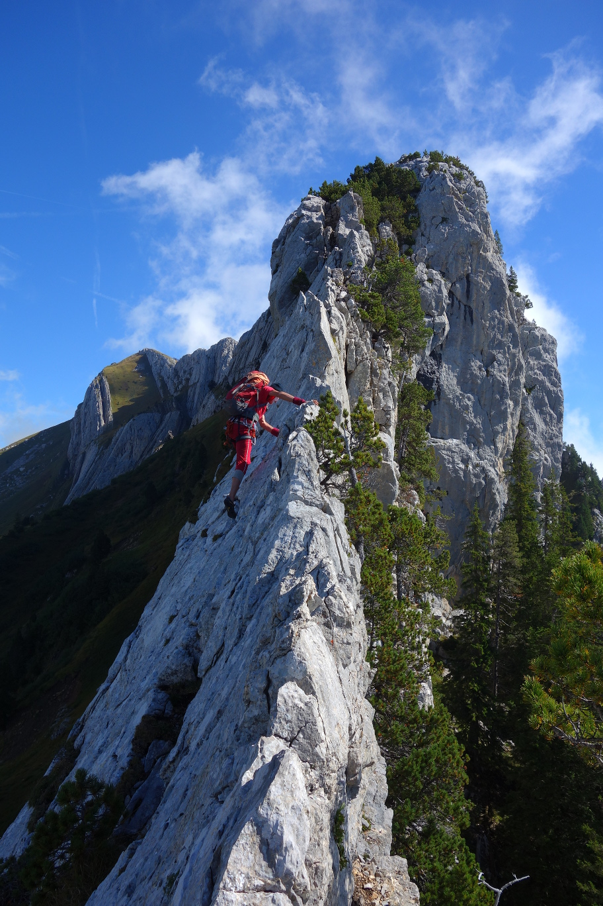
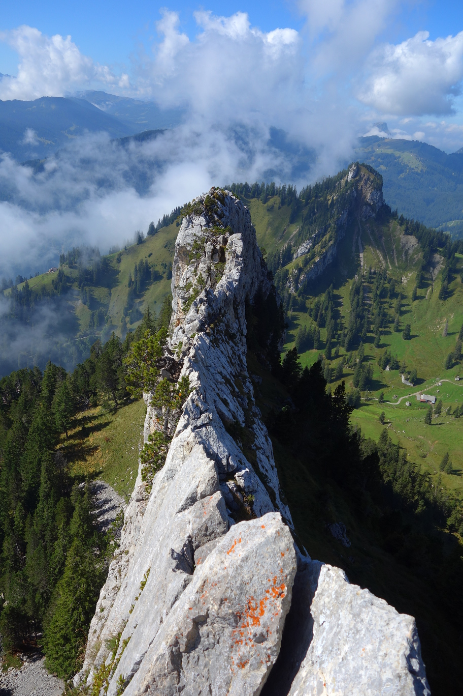

<head>
<meta http-equiv="Content-Type" content="text/html; charset=utf-8">
<link rel="stylesheet" type="text/css" href="bc.css">

<!--

-->
</head>

<!---

Five Secrets of #RevitAPI Coding @AutodeskRevit #adsk #aec #bim #dynamobim @AutodeskForge #ForgeDevCon http://bit.ly/rvtaddinsecrets

Joshua Lumley pointed out the recording he made for his BILT submission on five secrets of Revit API C# coding.
Before getting to that, here are a couple of pictures from this last weekend's mountain tour
&ndash; Ruessigrat, Brotmesser and Matthorn
&ndash; Five secrets of Revit API Coding...

-->

### Five Secrets of Revit API Coding

Joshua Lumley pointed out the recording he made for his BILT submission on five secrets of Revit API C# coding.

Before getting to that, here are a couple of pictures from this last weekend's mountain tour:

- [Ruessigrat, Brotmesser and Matthorn](#2) 
- [Five secrets of Revit API Coding](#3) 

####  Ruessigrat, Brotmesser and Matthorn

I crossed the Ruessigrat, Brotmesser and Matthorn ridge in splendid weather on a very nice scrambling hike with Alex:

It can be done without a rope, although we did in fact use a rope and the route's one and only bolt for security at the narrowest point.

Crossing the Brotmesser (bread knife) part of the Ruessigrat ridge:

Looking back along the ridge:

Mountain panorama around the Matthorn ridge:

For more pictures, please refer to 
the [Matthorn via Ruessgrat photo album](https://flic.kr/s/aHsmiejZvb).

####  Five Secrets of Revit API Coding

Last year, Joshua Lumley published a half-hour recording
on [five secrets of Revit API C# coding addressing ribbon, button, macro, external events and modeless dockable add-in](https://youtu.be/KHMwd4U_Lrs) in
Support of his abstract submission to the BILT ANZ 2018 conference in Brisbane:

<iframe width="480" height="270" src="https://www.youtube.com/embed/KHMwd4U_Lrs" frameborder="0" allow="autoplay; encrypted-media" allowfullscreen></iframe>

He very kindly 'spilled the beans', disclosing what secrets are discussed at what time points:

1. Never initiate your coding project from an external IDE. Rather use Revit Macro Manager, then switch to a third-party IDE such as Visual Studio. This process sets everything up for you with relative paths which is critical if end user has not installed Revit on C drive. 3m:55s
2. Use `Invoke` to run external commands instead of embedding references. This will prevent many hours watching the Revit splash screen when restarting. 6m:55s
3. Always use modeless forms rather than modal ones, i.e., `Show` instead of `ShowDialog`. This allows for freedom of movement for the end user and opens the potential for creating a dockable panel in the future. 12m:40s
4. Like Russian dolls, encase your database interactions inside transactions, which are in turn encased inside a try-catch, which in turn is encased inside an external event.  This nesting is the hardest thing to get your head around but absolutely necessary. 17m.15s
5. Iterate rapidly, and seek peer review as early in the project as possible. I've found canvassing somebody else’s opinion early, can radically change the initial design intent and 'mental image' I had of my add-in. 

Very many thanks to Joshua for sharing his extensive Revit API experience, both here and in many other helpful comments and discussion threads!
