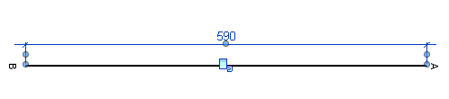
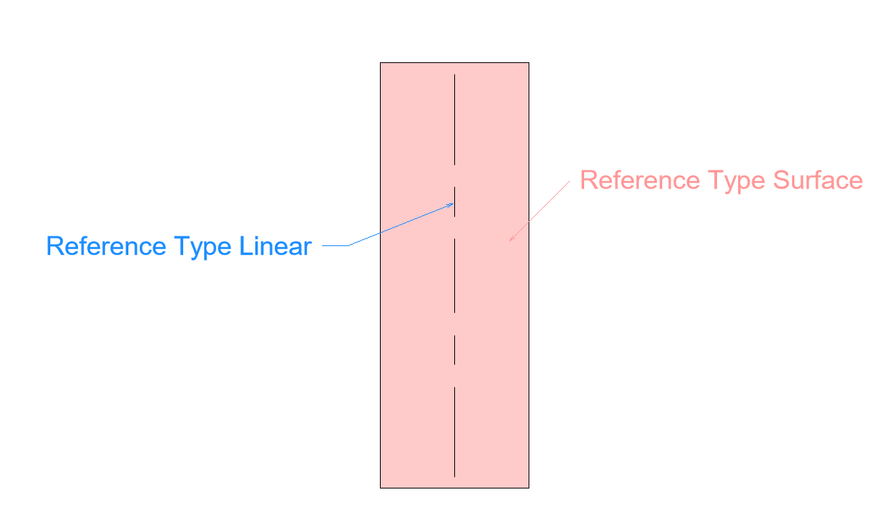

<head>
<meta http-equiv="Content-Type" content="text/html; charset=utf-8">
<link rel="stylesheet" type="text/css" href="bc.css">

<!--

-->
</head>

<!---

- new dimension not visible
  https://forums.autodesk.com/t5/revit-api-forum/copy-dimensions-from-a-view-to-another/m-p/7226217 -- 13180620 [Copy dimensions from a View to another]
  https://forums.autodesk.com/t5/revit-api-forum/newdimension-dimension-created-but-not-visible/m-p/6340985

- New Dimension are not Visible
  https://forums.autodesk.com/t5/revit-api-forum/new-dimension-are-not-visible/m-p/8268048
  get_linear_reference_from_surface.png

- need to regen, or even move element to force regen
  13595991 [Removing dimension leader not visible - only after reselection or reopening mode]
  https://forums.autodesk.com/t5/revit-api-forum/removing-dimension-leader-not-visible-only-after-reselection-or/m-p/7545212

- create dimensioning references to wall centre, outer, inner and core centre:
  10636422 [Create dimension to wall centerline, center of core, faces of core]
  http://forums.autodesk.com/t5/revit-api/create-dimension-to-wall-centerline-center-of-core-faces-of-core/m-p/5577704

- 13479962 [Fail to get reference for grid for dimension in 2017]
  https://forums.autodesk.com/t5/revit-api-forum/fail-to-get-reference-for-grid-for-dimension-in-2017/m-p/6636474
  https://forums.autodesk.com/t5/revit-api-forum/newdimension-between-grids-invalid-number-of-references/m-p/7459503

Dimensioning leaders and references in the #RevitAPI for @AutodeskRevit rebar, grids, surfaces, wall centreline, centre and face of core #bim #dynamobim @AutodeskForge #ForgeDevCon http://bit.ly/dimensionrefs

My colleague Zhong John Wu just solved a Revit API discussion forum issue on how to create dimension line for rebar.
I took this as a prompt to clean out a bunch of other dimensioning related issues lurking in my infinite and growing to-do list
&ndash; Create dimension line for rebar
&ndash; Newly created dimensioning not displayed
&ndash; Dimension leader remains visible after removal
&ndash; Dimension wall centreline, centre and faces of core
&ndash; Grid references for dimensioning...

-->

### Rebar, Wall Centreline, Core and Grid Dimensioning

My colleague Zhong John Wu just solved
a [Revit API discussion forum](http://forums.autodesk.com/t5/revit-api-forum/bd-p/160) issue
on how to [create dimension line for rebar](https://forums.autodesk.com/t5/revit-api-forum/create-dimension-line-for-rebar/m-p/8217536).

I took this as a prompt to clean out a bunch of other dimensioning related issues lurking in my infinite and growing to-do list:

- [Create dimension line for rebar](#2) 
- [Newly created dimensioning not displayed](#3) 
- [Linear reference from surface filtering for all](#3b) 
- [Dimension leader remains visible after removal](#4) 
- [Dimension wall centreline, centre and faces of core](#5) 
- [Grid references for dimensioning](#6) 
- [Simple, better grid references for dimensioning](#7) 

####  Create Dimension Line for Rebar

**Question:** I'm struggling to create a rebar dimension line because I can't find a way to get the edges of the element in a section view:

I can retrieve their edges through their geometry, but the edge I need doesn't have a reference that I can use.

My ultimate goal is to measure the distance from the end of the bar to a level or grid:

**Answer:** Similar questions were raised here in the past, to:

- [Dimension rebars](https://forums.autodesk.com/t5/revit-api-forum/dimension-rebars/td-p/5356233), and 
- [Create aligned dimension between rebars](https://forums.autodesk.com/t5/revit-api-forum/create-aligned-dimension-between-rebars/m-p/7083248)

The solutions back then include reading the element geometry and the references it provides, just like you describe:

> You can read the geometry data from the rebar by `Rebar.Geometry` property. This property requires an `Option` argument. You need to set the `option.ComputeReferences` to true. Then read the edge of the rebar, and get the curve from the `Edge` object. Finally, get the end point reference from the curve.

**Response:** I already looked at these posts but with no results. When I create the dimension line, a reference is needed. The approach you describe returns a null reference for the edge.

Here are 4 different paths I attempted, with no desired result so far:

PLAN A:

<pre class="code">
  ReferenceArray ra = new ReferenceArray();
  Line dimension = Line.CreateBound(rebar_top, apoyo_top);
  DetailLine line1 = doc.Create.NewDetailCurve(view, dimension) as DetailLine;
  ra.Append(line1.GeometryCurve.GetEndPointReference(1));
  ra.Append(line1.GeometryCurve.GetEndPointReference(0));                                           
  Dimension dim = doc.Create.NewDimension(doc.ActiveView, dimension, ra);
</pre>

PLAN B:

<pre class="code">
  XYZ apoyo_top = pAnalisisSupCap + rle.cm_to_ft(200) * XYZ.BasisZ;
  XYZ apoyo_bot = pAnalisisSupCap - rle.cm_to_ft(200) * XYZ.BasisZ;
  XYZ rebar_top = pini + rle.cm_to_ft(200) * XYZ.BasisZ;
  XYZ rebar_bot = pini - rle.cm_to_ft(200) * XYZ.BasisZ;
  Line l_v = Line.CreateBound(apoyo_bot, apoyo_top);
  Line l_h = Line.CreateBound(rebar_bot, rebar_top);
  Plane p_h = Plane.CreateByNormalAndOrigin(rebar_bot
    .CrossProduct(rebar_top), rebar_top);
  SketchPlane skplane_h = SketchPlane.Create(doc, p_h);
  Plane p_v = Plane.CreateByNormalAndOrigin(apoyo_bot
    .CrossProduct(apoyo_top), apoyo_top);
  SketchPlane skplane_v = SketchPlane.Create(doc, p_v);
  ModelCurve modelcurve1 = doc.Create.NewModelCurve (l_h, skplane_h);
  ModelCurve modelcurve2 = doc.Create.NewModelCurve(l_v, skplane_v);
  ra.Append(modelcurve1.GeometryCurve.Reference);
  ra.Append(modelcurve2.GeometryCurve.Reference);
  ra.Append(modelcurve1.GeometryCurve.GetEndPointReference(0));
  ra.Append(modelcurve2.GeometryCurve.GetEndPointReference(0));
</pre>

PLAN C:

<pre class="code">
  Options opt = new Options();
  opt.ComputeReferences = true;
  opt.View = doc.ActiveView;
  opt.IncludeNonVisibleObjects = true;
  GeometryElement geomElem = rebInt.get_Geometry(opt);

  foreach (GeometryObject geomObj in geomElem)
  {
    Solid geomSolid = geomObj as Solid;
    if (null != geomSolid)
    {
      int faces = 0;
      double totalArea = 0;
      foreach (Face geomFace in geomSolid.Faces)
      {
        faces++;
        faceInfo += "Face " + faces + " area: "
          + geomFace.Area.ToString() + "\n";
        totalArea += geomFace.Area;
        info = geomFace;
      }
      faceInfo += "Number of faces: " + faces + "\n";
      faceInfo += "Total area: " + totalArea.ToString() + "\n";

      int edge = 0;
      foreach (Edge geomEdge in geomSolid.Edges)
      {
        geoobj = geomEdge.AsCurve();
      }
    }
  }
  // No Faces/Edges valiuds as references.
</pre>
											
PLAN D:

<pre class="code">
  IList<RebarConstrainedHandle> dd = rebInt
    .GetRebarConstraintsManager().GetAllHandles();

  RebarConstrainedHandle s = null;
  RebarConstrainedHandle e = null;
  foreach (RebarConstrainedHandle rbh in dd)
  {
    if (rbh.GetHandleName().ToString() == "Start of Bar")
    {
      s = rbh;
    }
    if (rbh.GetHandleName().ToString() == "End of Bar")
    {
      e = rbh;
    }
  }
  // This objects (handles) doesn't give references.
</pre>

**Answer:** I verified that your plan A throws an exception saying, 'The direction of dimension is invalid'.

This is because the input value `dimension` should lie inside the plan of `doc.ActiveView`.

So, I changed the input value dimension of the following code line to `line1.GeometryCurve as Line`.

It works, but you just need to offset Z of the dimension line to make it looks good:

<pre class="code">
  Dimension dim = doc.Create.NewDimension(
    doc.ActiveView, line1.GeometryCurve as Line, ra );
</pre>

**Answer and Solution:** With the great support from our Revit engineering team, I got the ideal solution and verified that it works fine to dimension between rebar and grid.

The code contains a command that places a dimension in your model. You will need to select the rebar. The grid line is hard-coded by its element id.

It implements the following steps:

- Get all rebar references.
- Filter them to choose the one that we need.
- Get the grid reference.
- With the rebar ref and grid references, create the dimension.

If you want to only dimension the rebar, you just need to change the code to get the two references of the edges perpendicular to `rebarSeg`:

<pre class="code">
using&nbsp;System;
using&nbsp;System.Collections.Generic;
using&nbsp;Autodesk.Revit.DB;
using&nbsp;Autodesk.Revit.UI;
using&nbsp;Autodesk.Revit.UI.Selection;
using&nbsp;Autodesk.Revit.Attributes;
using&nbsp;Autodesk.Revit.DB.Structure;
 
namespace&nbsp;TestRebar
{
&nbsp;&nbsp;[TransactionAttribute(&nbsp;TransactionMode.Manual&nbsp;)]
&nbsp;&nbsp;public&nbsp;class&nbsp;TestRebar&nbsp;:&nbsp;IExternalCommand
&nbsp;&nbsp;{
&nbsp;&nbsp;&nbsp;&nbsp;UIApplication&nbsp;m_uiApp;
&nbsp;&nbsp;&nbsp;&nbsp;Document&nbsp;m_doc;
 
&nbsp;&nbsp;&nbsp;&nbsp;ElementId&nbsp;elementId&nbsp;=&nbsp;ElementId.InvalidElementId;
 
&nbsp;&nbsp;&nbsp;&nbsp;public&nbsp;Result&nbsp;Execute(
&nbsp;&nbsp;&nbsp;&nbsp;&nbsp;&nbsp;ExternalCommandData&nbsp;commandData,
&nbsp;&nbsp;&nbsp;&nbsp;&nbsp;&nbsp;ref&nbsp;string&nbsp;message,
&nbsp;&nbsp;&nbsp;&nbsp;&nbsp;&nbsp;ElementSet&nbsp;elements&nbsp;)
&nbsp;&nbsp;&nbsp;&nbsp;{
&nbsp;&nbsp;&nbsp;&nbsp;&nbsp;&nbsp;try
&nbsp;&nbsp;&nbsp;&nbsp;&nbsp;&nbsp;{
&nbsp;&nbsp;&nbsp;&nbsp;&nbsp;&nbsp;&nbsp;&nbsp;initStuff(&nbsp;commandData&nbsp;);
&nbsp;&nbsp;&nbsp;&nbsp;&nbsp;&nbsp;&nbsp;&nbsp;if(&nbsp;m_doc&nbsp;==&nbsp;null&nbsp;)
&nbsp;&nbsp;&nbsp;&nbsp;&nbsp;&nbsp;&nbsp;&nbsp;&nbsp;&nbsp;return&nbsp;Result.Failed;
 
&nbsp;&nbsp;&nbsp;&nbsp;&nbsp;&nbsp;&nbsp;&nbsp;m_uiApp&nbsp;=&nbsp;commandData.Application;
&nbsp;&nbsp;&nbsp;&nbsp;&nbsp;&nbsp;&nbsp;&nbsp;Selection&nbsp;sel&nbsp;=&nbsp;m_uiApp.ActiveUIDocument.Selection;
&nbsp;&nbsp;&nbsp;&nbsp;&nbsp;&nbsp;&nbsp;&nbsp;Reference&nbsp;refr&nbsp;=&nbsp;sel.PickObject(&nbsp;ObjectType.Element&nbsp;);
 
&nbsp;&nbsp;&nbsp;&nbsp;&nbsp;&nbsp;&nbsp;&nbsp;Rebar&nbsp;rebar&nbsp;=&nbsp;m_doc.GetElement(&nbsp;refr.ElementId&nbsp;)&nbsp;as&nbsp;Rebar;
 
&nbsp;&nbsp;&nbsp;&nbsp;&nbsp;&nbsp;&nbsp;&nbsp;Line&nbsp;rebarSeg&nbsp;=&nbsp;null;
&nbsp;&nbsp;&nbsp;&nbsp;&nbsp;&nbsp;&nbsp;&nbsp;bool&nbsp;bOk&nbsp;=&nbsp;getRebarSegment(&nbsp;rebar,&nbsp;out&nbsp;rebarSeg&nbsp;);
&nbsp;&nbsp;&nbsp;&nbsp;&nbsp;&nbsp;&nbsp;&nbsp;if(&nbsp;!bOk&nbsp;)
&nbsp;&nbsp;&nbsp;&nbsp;&nbsp;&nbsp;&nbsp;&nbsp;&nbsp;&nbsp;return&nbsp;Result.Failed;
 
&nbsp;&nbsp;&nbsp;&nbsp;&nbsp;&nbsp;&nbsp;&nbsp;Options&nbsp;options&nbsp;=&nbsp;new&nbsp;Options();
&nbsp;&nbsp;&nbsp;&nbsp;&nbsp;&nbsp;&nbsp;&nbsp;//&nbsp;the&nbsp;view&nbsp;in&nbsp;which&nbsp;you&nbsp;want&nbsp;to&nbsp;place&nbsp;the&nbsp;dimension
&nbsp;&nbsp;&nbsp;&nbsp;&nbsp;&nbsp;&nbsp;&nbsp;options.View&nbsp;=&nbsp;m_uiApp.ActiveUIDocument.ActiveView;&nbsp;
&nbsp;&nbsp;&nbsp;&nbsp;&nbsp;&nbsp;&nbsp;&nbsp;options.ComputeReferences&nbsp;=&nbsp;true;&nbsp;//&nbsp;produce&nbsp;references
&nbsp;&nbsp;&nbsp;&nbsp;&nbsp;&nbsp;&nbsp;&nbsp;options.IncludeNonVisibleObjects&nbsp;=&nbsp;true;
&nbsp;&nbsp;&nbsp;&nbsp;&nbsp;&nbsp;&nbsp;&nbsp;GeometryElement&nbsp;wholeRebarGeometry&nbsp;
&nbsp;&nbsp;&nbsp;&nbsp;&nbsp;&nbsp;&nbsp;&nbsp;&nbsp;&nbsp;=&nbsp;rebar.get_Geometry(&nbsp;options&nbsp;);
&nbsp;&nbsp;&nbsp;&nbsp;&nbsp;&nbsp;&nbsp;&nbsp;Reference&nbsp;refForEndOfBar&nbsp;=&nbsp;getReferenceForEndOfBar(&nbsp;
&nbsp;&nbsp;&nbsp;&nbsp;&nbsp;&nbsp;&nbsp;&nbsp;&nbsp;&nbsp;wholeRebarGeometry,&nbsp;rebarSeg&nbsp;);
 
&nbsp;&nbsp;&nbsp;&nbsp;&nbsp;&nbsp;&nbsp;&nbsp;Reference&nbsp;refGrid&nbsp;=&nbsp;getGridRef();
 
&nbsp;&nbsp;&nbsp;&nbsp;&nbsp;&nbsp;&nbsp;&nbsp;ReferenceArray&nbsp;refArray&nbsp;=&nbsp;new&nbsp;ReferenceArray();
&nbsp;&nbsp;&nbsp;&nbsp;&nbsp;&nbsp;&nbsp;&nbsp;refArray.Append(&nbsp;refForEndOfBar&nbsp;);
&nbsp;&nbsp;&nbsp;&nbsp;&nbsp;&nbsp;&nbsp;&nbsp;refArray.Append(&nbsp;refGrid&nbsp;);
 
&nbsp;&nbsp;&nbsp;&nbsp;&nbsp;&nbsp;&nbsp;&nbsp;double&nbsp;dist&nbsp;=&nbsp;10;
 
&nbsp;&nbsp;&nbsp;&nbsp;&nbsp;&nbsp;&nbsp;&nbsp;//&nbsp;a&nbsp;line&nbsp;parallel&nbsp;with&nbsp;our&nbsp;rebar&nbsp;segment&nbsp;somewhere&nbsp;in&nbsp;space
&nbsp;&nbsp;&nbsp;&nbsp;&nbsp;&nbsp;&nbsp;&nbsp;Line&nbsp;dimLine&nbsp;=&nbsp;rebarSeg.CreateOffset(&nbsp;
&nbsp;&nbsp;&nbsp;&nbsp;&nbsp;&nbsp;&nbsp;&nbsp;&nbsp;&nbsp;dist,&nbsp;XYZ.BasisY&nbsp;)&nbsp;as&nbsp;Line;&nbsp;
 
&nbsp;&nbsp;&nbsp;&nbsp;&nbsp;&nbsp;&nbsp;&nbsp;using(&nbsp;Transaction&nbsp;tr&nbsp;=&nbsp;new&nbsp;Transaction(&nbsp;m_doc&nbsp;)&nbsp;)
&nbsp;&nbsp;&nbsp;&nbsp;&nbsp;&nbsp;&nbsp;&nbsp;{
&nbsp;&nbsp;&nbsp;&nbsp;&nbsp;&nbsp;&nbsp;&nbsp;&nbsp;&nbsp;tr.Start(&nbsp;&quot;Create&nbsp;Dimension&quot;&nbsp;);
&nbsp;&nbsp;&nbsp;&nbsp;&nbsp;&nbsp;&nbsp;&nbsp;&nbsp;&nbsp;m_doc.Create.NewDimension(&nbsp;
&nbsp;&nbsp;&nbsp;&nbsp;&nbsp;&nbsp;&nbsp;&nbsp;&nbsp;&nbsp;&nbsp;&nbsp;m_uiApp.ActiveUIDocument.ActiveView,&nbsp;
&nbsp;&nbsp;&nbsp;&nbsp;&nbsp;&nbsp;&nbsp;&nbsp;&nbsp;&nbsp;&nbsp;&nbsp;dimLine,&nbsp;refArray&nbsp;);
&nbsp;&nbsp;&nbsp;&nbsp;&nbsp;&nbsp;&nbsp;&nbsp;&nbsp;&nbsp;tr.Commit();
&nbsp;&nbsp;&nbsp;&nbsp;&nbsp;&nbsp;&nbsp;&nbsp;}
&nbsp;&nbsp;&nbsp;&nbsp;&nbsp;&nbsp;}
&nbsp;&nbsp;&nbsp;&nbsp;&nbsp;&nbsp;catch(&nbsp;Exception&nbsp;e&nbsp;)
&nbsp;&nbsp;&nbsp;&nbsp;&nbsp;&nbsp;{
&nbsp;&nbsp;&nbsp;&nbsp;&nbsp;&nbsp;&nbsp;&nbsp;TaskDialog.Show(&nbsp;&quot;exception&quot;,&nbsp;e.Message&nbsp;);
&nbsp;&nbsp;&nbsp;&nbsp;&nbsp;&nbsp;&nbsp;&nbsp;return&nbsp;Result.Failed;
&nbsp;&nbsp;&nbsp;&nbsp;&nbsp;&nbsp;}
 
&nbsp;&nbsp;&nbsp;&nbsp;&nbsp;&nbsp;return&nbsp;Result.Succeeded;
&nbsp;&nbsp;&nbsp;&nbsp;}
 
&nbsp;&nbsp;&nbsp;&nbsp;private&nbsp;Reference&nbsp;getGridRef()
&nbsp;&nbsp;&nbsp;&nbsp;{
&nbsp;&nbsp;&nbsp;&nbsp;&nbsp;&nbsp;ElementId&nbsp;idGrd&nbsp;=&nbsp;new&nbsp;ElementId(&nbsp;397028&nbsp;);
&nbsp;&nbsp;&nbsp;&nbsp;&nbsp;&nbsp;Element&nbsp;elemGrid&nbsp;=&nbsp;m_doc.GetElement(&nbsp;idGrd&nbsp;);
&nbsp;&nbsp;&nbsp;&nbsp;&nbsp;&nbsp;Options&nbsp;options&nbsp;=&nbsp;new&nbsp;Options();
&nbsp;&nbsp;&nbsp;&nbsp;&nbsp;&nbsp;//&nbsp;the&nbsp;view&nbsp;in&nbsp;which&nbsp;you&nbsp;want&nbsp;to&nbsp;place&nbsp;the&nbsp;dimension
&nbsp;&nbsp;&nbsp;&nbsp;&nbsp;&nbsp;options.View&nbsp;=&nbsp;m_uiApp.ActiveUIDocument.ActiveView;&nbsp;
&nbsp;&nbsp;&nbsp;&nbsp;&nbsp;&nbsp;options.ComputeReferences&nbsp;=&nbsp;true;&nbsp;//&nbsp;produce&nbsp;references
&nbsp;&nbsp;&nbsp;&nbsp;&nbsp;&nbsp;options.IncludeNonVisibleObjects&nbsp;=&nbsp;true;
&nbsp;&nbsp;&nbsp;&nbsp;&nbsp;&nbsp;GeometryElement&nbsp;wholeGridGeometry&nbsp;
&nbsp;&nbsp;&nbsp;&nbsp;&nbsp;&nbsp;&nbsp;&nbsp;=&nbsp;elemGrid.get_Geometry(&nbsp;options&nbsp;);
&nbsp;&nbsp;&nbsp;&nbsp;&nbsp;&nbsp;IList&lt;Reference&gt;&nbsp;allRefs&nbsp;=&nbsp;new&nbsp;List&lt;Reference&gt;();
&nbsp;&nbsp;&nbsp;&nbsp;&nbsp;&nbsp;foreach(&nbsp;GeometryObject&nbsp;geomObj&nbsp;in&nbsp;wholeGridGeometry&nbsp;)
&nbsp;&nbsp;&nbsp;&nbsp;&nbsp;&nbsp;{
&nbsp;&nbsp;&nbsp;&nbsp;&nbsp;&nbsp;&nbsp;&nbsp;Line&nbsp;refLine&nbsp;=&nbsp;geomObj&nbsp;as&nbsp;Line;
&nbsp;&nbsp;&nbsp;&nbsp;&nbsp;&nbsp;&nbsp;&nbsp;if(&nbsp;refLine&nbsp;!=&nbsp;null&nbsp;&amp;&amp;&nbsp;refLine.Reference&nbsp;!=&nbsp;null&nbsp;)
&nbsp;&nbsp;&nbsp;&nbsp;&nbsp;&nbsp;&nbsp;&nbsp;&nbsp;&nbsp;return&nbsp;refLine.Reference;
&nbsp;&nbsp;&nbsp;&nbsp;&nbsp;&nbsp;}
 
&nbsp;&nbsp;&nbsp;&nbsp;&nbsp;&nbsp;return&nbsp;null;
&nbsp;&nbsp;&nbsp;&nbsp;}
 
&nbsp;&nbsp;&nbsp;&nbsp;private&nbsp;Reference&nbsp;getReferenceForEndOfBar(&nbsp;
&nbsp;&nbsp;&nbsp;&nbsp;&nbsp;&nbsp;GeometryElement&nbsp;geom,
&nbsp;&nbsp;&nbsp;&nbsp;&nbsp;&nbsp;Line&nbsp;rebarSeg&nbsp;)
&nbsp;&nbsp;&nbsp;&nbsp;{
&nbsp;&nbsp;&nbsp;&nbsp;&nbsp;&nbsp;foreach(&nbsp;GeometryObject&nbsp;geomObj&nbsp;in&nbsp;geom&nbsp;)
&nbsp;&nbsp;&nbsp;&nbsp;&nbsp;&nbsp;{
&nbsp;&nbsp;&nbsp;&nbsp;&nbsp;&nbsp;&nbsp;&nbsp;Solid&nbsp;sld&nbsp;=&nbsp;geomObj&nbsp;as&nbsp;Solid;
&nbsp;&nbsp;&nbsp;&nbsp;&nbsp;&nbsp;&nbsp;&nbsp;if(&nbsp;sld&nbsp;!=&nbsp;null&nbsp;)
&nbsp;&nbsp;&nbsp;&nbsp;&nbsp;&nbsp;&nbsp;&nbsp;{
&nbsp;&nbsp;&nbsp;&nbsp;&nbsp;&nbsp;&nbsp;&nbsp;&nbsp;&nbsp;//&nbsp;I&#39;ll&nbsp;get&nbsp;the&nbsp;references&nbsp;from&nbsp;curves;
&nbsp;&nbsp;&nbsp;&nbsp;&nbsp;&nbsp;&nbsp;&nbsp;&nbsp;&nbsp;continue;
&nbsp;&nbsp;&nbsp;&nbsp;&nbsp;&nbsp;&nbsp;&nbsp;}
&nbsp;&nbsp;&nbsp;&nbsp;&nbsp;&nbsp;&nbsp;&nbsp;else
&nbsp;&nbsp;&nbsp;&nbsp;&nbsp;&nbsp;&nbsp;&nbsp;{
&nbsp;&nbsp;&nbsp;&nbsp;&nbsp;&nbsp;&nbsp;&nbsp;&nbsp;&nbsp;Line&nbsp;refLine&nbsp;=&nbsp;geomObj&nbsp;as&nbsp;Line;
&nbsp;&nbsp;&nbsp;&nbsp;&nbsp;&nbsp;&nbsp;&nbsp;&nbsp;&nbsp;if(&nbsp;refLine&nbsp;!=&nbsp;null&nbsp;&amp;&amp;&nbsp;refLine.Reference&nbsp;!=&nbsp;null&nbsp;)
&nbsp;&nbsp;&nbsp;&nbsp;&nbsp;&nbsp;&nbsp;&nbsp;&nbsp;&nbsp;{
&nbsp;&nbsp;&nbsp;&nbsp;&nbsp;&nbsp;&nbsp;&nbsp;&nbsp;&nbsp;&nbsp;&nbsp;//&nbsp;We&nbsp;found&nbsp;one&nbsp;reference.&nbsp;
&nbsp;&nbsp;&nbsp;&nbsp;&nbsp;&nbsp;&nbsp;&nbsp;&nbsp;&nbsp;&nbsp;&nbsp;//&nbsp;Let&#39;s&nbsp;see&nbsp;if&nbsp;it&nbsp;is&nbsp;the&nbsp;correct&nbsp;one.&nbsp;
&nbsp;&nbsp;&nbsp;&nbsp;&nbsp;&nbsp;&nbsp;&nbsp;&nbsp;&nbsp;&nbsp;&nbsp;//&nbsp;The&nbsp;correct&nbsp;referece&nbsp;need&nbsp;to&nbsp;be&nbsp;perpendicular&nbsp;
&nbsp;&nbsp;&nbsp;&nbsp;&nbsp;&nbsp;&nbsp;&nbsp;&nbsp;&nbsp;&nbsp;&nbsp;//&nbsp;to&nbsp;rebar&nbsp;segement&nbsp;and&nbsp;the&nbsp;end&nbsp;point&nbsp;of&nbsp;rebar&nbsp;
&nbsp;&nbsp;&nbsp;&nbsp;&nbsp;&nbsp;&nbsp;&nbsp;&nbsp;&nbsp;&nbsp;&nbsp;//&nbsp;segment&nbsp;should&nbsp;be&nbsp;on&nbsp;the&nbsp;reference&nbsp;curve.
&nbsp;&nbsp;&nbsp;&nbsp;&nbsp;&nbsp;&nbsp;&nbsp;&nbsp;&nbsp;&nbsp;&nbsp;double&nbsp;dotProd&nbsp;=&nbsp;refLine.Direction.DotProduct(&nbsp;
&nbsp;&nbsp;&nbsp;&nbsp;&nbsp;&nbsp;&nbsp;&nbsp;&nbsp;&nbsp;&nbsp;&nbsp;&nbsp;&nbsp;rebarSeg.Direction&nbsp;);
&nbsp;&nbsp;&nbsp;&nbsp;&nbsp;&nbsp;&nbsp;&nbsp;&nbsp;&nbsp;&nbsp;&nbsp;if(&nbsp;Math.Abs(&nbsp;dotProd&nbsp;)&nbsp;!=&nbsp;0&nbsp;)
&nbsp;&nbsp;&nbsp;&nbsp;&nbsp;&nbsp;&nbsp;&nbsp;&nbsp;&nbsp;&nbsp;&nbsp;&nbsp;&nbsp;continue;&nbsp;//&nbsp;curves&nbsp;are&nbsp;not&nbsp;perpendicular.
 
&nbsp;&nbsp;&nbsp;&nbsp;&nbsp;&nbsp;&nbsp;&nbsp;&nbsp;&nbsp;&nbsp;&nbsp;XYZ&nbsp;endPointOfRebar&nbsp;=&nbsp;rebarSeg.GetEndPoint(&nbsp;1&nbsp;);
&nbsp;&nbsp;&nbsp;&nbsp;&nbsp;&nbsp;&nbsp;&nbsp;&nbsp;&nbsp;&nbsp;&nbsp;IntersectionResult&nbsp;ir&nbsp;=&nbsp;refLine.Project(&nbsp;
&nbsp;&nbsp;&nbsp;&nbsp;&nbsp;&nbsp;&nbsp;&nbsp;&nbsp;&nbsp;&nbsp;&nbsp;&nbsp;&nbsp;endPointOfRebar&nbsp;);
&nbsp;&nbsp;&nbsp;&nbsp;&nbsp;&nbsp;&nbsp;&nbsp;&nbsp;&nbsp;&nbsp;&nbsp;if(&nbsp;ir&nbsp;==&nbsp;null&nbsp;)
&nbsp;&nbsp;&nbsp;&nbsp;&nbsp;&nbsp;&nbsp;&nbsp;&nbsp;&nbsp;&nbsp;&nbsp;&nbsp;&nbsp;continue;&nbsp;//&nbsp;end&nbsp;point&nbsp;of&nbsp;rebar&nbsp;segment&nbsp;is&nbsp;not&nbsp;on&nbsp;the&nbsp;reference&nbsp;curve.
 
&nbsp;&nbsp;&nbsp;&nbsp;&nbsp;&nbsp;&nbsp;&nbsp;&nbsp;&nbsp;&nbsp;&nbsp;if(&nbsp;Math.Abs(&nbsp;ir.Distance&nbsp;)&nbsp;!=&nbsp;0&nbsp;)
&nbsp;&nbsp;&nbsp;&nbsp;&nbsp;&nbsp;&nbsp;&nbsp;&nbsp;&nbsp;&nbsp;&nbsp;&nbsp;&nbsp;continue;&nbsp;//&nbsp;end&nbsp;point&nbsp;of&nbsp;rebar&nbsp;segment&nbsp;is&nbsp;not&nbsp;on&nbsp;the&nbsp;reference&nbsp;curve.
 
&nbsp;&nbsp;&nbsp;&nbsp;&nbsp;&nbsp;&nbsp;&nbsp;&nbsp;&nbsp;&nbsp;&nbsp;return&nbsp;refLine.Reference;
&nbsp;&nbsp;&nbsp;&nbsp;&nbsp;&nbsp;&nbsp;&nbsp;&nbsp;&nbsp;}
&nbsp;&nbsp;&nbsp;&nbsp;&nbsp;&nbsp;&nbsp;&nbsp;}
&nbsp;&nbsp;&nbsp;&nbsp;&nbsp;&nbsp;}
&nbsp;&nbsp;&nbsp;&nbsp;&nbsp;&nbsp;return&nbsp;null;
&nbsp;&nbsp;&nbsp;&nbsp;}
 
&nbsp;&nbsp;&nbsp;&nbsp;private&nbsp;bool&nbsp;getRebarSegment(
&nbsp;&nbsp;&nbsp;&nbsp;&nbsp;&nbsp;Rebar&nbsp;rebar,&nbsp;
&nbsp;&nbsp;&nbsp;&nbsp;&nbsp;&nbsp;out&nbsp;Line&nbsp;rebarSeg&nbsp;)
&nbsp;&nbsp;&nbsp;&nbsp;{
&nbsp;&nbsp;&nbsp;&nbsp;&nbsp;&nbsp;rebarSeg&nbsp;=&nbsp;null;
&nbsp;&nbsp;&nbsp;&nbsp;&nbsp;&nbsp;IList&lt;Curve&gt;&nbsp;rebarSegments&nbsp;
&nbsp;&nbsp;&nbsp;&nbsp;&nbsp;&nbsp;&nbsp;&nbsp;=&nbsp;rebar.GetCenterlineCurves(&nbsp;false,&nbsp;true,&nbsp;true,
&nbsp;&nbsp;&nbsp;&nbsp;&nbsp;&nbsp;&nbsp;&nbsp;MultiplanarOption.IncludeOnlyPlanarCurves,&nbsp;0&nbsp;);
&nbsp;&nbsp;&nbsp;&nbsp;&nbsp;&nbsp;if(&nbsp;rebarSegments.Count&nbsp;!=&nbsp;1&nbsp;)
&nbsp;&nbsp;&nbsp;&nbsp;&nbsp;&nbsp;&nbsp;&nbsp;return&nbsp;false;
 
&nbsp;&nbsp;&nbsp;&nbsp;&nbsp;&nbsp;rebarSeg&nbsp;=&nbsp;rebarSegments[0]&nbsp;as&nbsp;Line;
&nbsp;&nbsp;&nbsp;&nbsp;&nbsp;&nbsp;if(&nbsp;rebarSeg&nbsp;==&nbsp;null&nbsp;)
&nbsp;&nbsp;&nbsp;&nbsp;&nbsp;&nbsp;&nbsp;&nbsp;return&nbsp;false;
 
&nbsp;&nbsp;&nbsp;&nbsp;&nbsp;&nbsp;return&nbsp;true;
&nbsp;&nbsp;&nbsp;&nbsp;}
 
&nbsp;&nbsp;&nbsp;&nbsp;void&nbsp;initStuff(&nbsp;ExternalCommandData&nbsp;commandData&nbsp;)
&nbsp;&nbsp;&nbsp;&nbsp;{
&nbsp;&nbsp;&nbsp;&nbsp;&nbsp;&nbsp;m_uiApp&nbsp;=&nbsp;commandData.Application;
&nbsp;&nbsp;&nbsp;&nbsp;&nbsp;&nbsp;m_doc&nbsp;=&nbsp;m_uiApp.ActiveUIDocument.Document;
&nbsp;&nbsp;&nbsp;&nbsp;}
&nbsp;&nbsp;}
}
</pre>

**Response:** Thanks a lot for the response. It is the solution to our problem! We made little adjustments to the code to have plenty of control about what end do we want to dimension, and also we had to project all the curves involved into a shared reference plane due to the fact that if you have more than one rebar (rebar set), the geometry of the rebar is above or beneath the grid line.

Again, thanks a lot for your time and effort.

This thanks is due to Zhong (John) Wu, Boris Shafiro and especially Stefan Dobre.

####  Newly Created Dimensioning Not Displayed

For another issue or two, on newly created dimensioning not being displayed properly, 
Frank [@Fair59](https://forums.autodesk.com/t5/user/viewprofilepage/user-id/2083518) Aarssen
once again comes to the rescue:

- [Copy dimensions from a View to another](https://forums.autodesk.com/t5/revit-api-forum/copy-dimensions-from-a-view-to-another/m-p/7226217)
- [NewDimension - dimension created but not visible](https://forums.autodesk.com/t5/revit-api-forum/newdimension-dimension-created-but-not-visible/m-p/6340985)

Fair59 says: The workaround for dimensions to model elements, is rather simple. Create a new Dimension, using the References from the non-visible dimension.

####  Linear Reference from Surface Filtering for All

In yet another visibility question,
on [new dimensions are not visible](https://forums.autodesk.com/t5/revit-api-forum/new-dimension-are-not-visible/m-p/8268048),
Unknowz describes another interesting approach:

**Question:** 
I continued to check my code and found an interesting point which is probably at the origin of the problem. 
I use this to obtain a reference to `theBiggestFace`:

<pre class="code">
  PlanarFace planarFace = theBiggestFace as PlanarFace;
  Reference refer = planarFace.Reference;
</pre>

This returns a `Reference` whose `ElementReferenceType` is `REFERENCE_TYPE_SURFACE`. 
However, in my case (with the faces parallel to the view), the dimensioning will only work with `REFERENCE_TYPE_LINEAR`.

Do you have an idea of how to obtain a `Reference` with a type `Linear` from a `Surface` `Reference`?

It's probably a simple additional line at my existing code, but I couldn't find it yet...

**Solution:** 
Yes and No &ndash; I couldn’t properly find the reference line from the face, so now I do it another way.

I catch all the geometry objects from the view, both visible and invisible, and filter all these elements to find:

- A reference line parallel to the middle axis of the face
- The closest reference to the middle axis

It seems like a dirty solution, but it works, and, with good filtering, the performance stays acceptable.

####  Dimension Leader Remains Visible After Removal

Another dimensioning display issue that came up
involves [removing dimension leader not visible &ndash; only after reselection or reopening](https://forums.autodesk.com/t5/revit-api-forum/removing-dimension-leader-not-visible-only-after-reselection-or/m-p/7545212).

That was resolved by moving an element, as suggested in the bunch of examples illustrating
the [need to regenerate and various ways to achieve that](http://thebuildingcoder.typepad.com/blog/about-the-author.html#5.33):

> `doc.regenerate` and `uidoc.RefreshActiveView` do not seem to do the trick. 

> Your suggestion about moving the object is a good one.

> Moving the dimension up and down within the same transaction (no need for two transactions) regenerates the dimension and removes the leaders.

<pre class="code">
  ElementTransformUtils.MoveElement( doc, dimRef.Id, XYZ.BasisZ );
  ElementTransformUtils.MoveElement( doc, dimRef.Id, -XYZ.BasisZ );
</pre>

####  Dimension Wall Centreline, Centre and Faces of Core

A frequent requirement is
to [create dimension to wall centerline, center of core, faces of core](https://forums.autodesk.com/t5/revit-api-forum/create-dimension-to-wall-centerline-center-of-core-faces-of-core/m-p/5577704)

A lot of powerful and useful functionality addressing this was added in the Revit 2018 API, e.g.:

- [References and selection of subelements](http://thebuildingcoder.typepad.com/blog/2017/04/whats-new-in-the-revit-2018-api.html#2.2.3)
- [API access to FamilyInstance references](http://thebuildingcoder.typepad.com/blog/2017/04/whats-new-in-the-revit-2018-api.html#3.19).

Fair59 added another solution to pinpoint specific core layers, e.g.:

- Overall Centre
- Core Exterior Face
- Core Interior Face
- Core Centre
- Exterior Wall Face
- Interior Wall Face
 
> You can analyse the references of a dimension that measures the core using `Reference.ConvertToStableRepresentation`.

> Using that information, you can then construct the references as follows:

<pre class="code">
  string format = "{0}:{1}:{2}";
  string uid = wall.uidId;
  int nines = -9999;
  
  refString = string.Format(format,uid,nines,1);
  Reference wall_centre = Reference
    .ParseFromStableRepresentation(doc,refString);
    
  refString = string.Format(format,uid,nines,2);
  Reference core_outer = Reference
    .ParseFromStableRepresentation(doc,refString);
    
  refString = string.Format(format,uid,nines,3);
  Reference core_inner = Reference
    .ParseFromStableRepresentation(doc,refString);
    
  refString = string.Format(format,uid,nines,4);
  Reference core_centre = Reference
    .ParseFromStableRepresentation(doc,refString);
</pre>

####  Grid References for Dimensioning

Two other discussions deal with dimensioning grids:

One, on
the [failure to get reference for grid for dimension in 2017](https://forums.autodesk.com/t5/revit-api-forum/fail-to-get-reference-for-grid-for-dimension-in-2017/m-p/6636474).

Alexander [@aignatovich](https://forums.autodesk.com/t5/user/viewprofilepage/user-id/1257478) Ignatovich, aka Александр Игнатович solved it like this:

> Instead of getting references from grid curves I used a reference to the entire grid element:

<pre class="code">
  var gridRef = Reference.ParseFromStableRepresentation(doc, grid.UniqueId);
</pre>

More solutions were presented for
using [`NewDimension` between grids &ndash; invalid number of references](https://forums.autodesk.com/t5/revit-api-forum/newdimension-between-grids-invalid-number-of-references/m-p/7459503), e.g.,
Richard Thomas suggested:

> Basically, you can't use the reference from the curve of the grid (since that is a surface); you have to create a new reference by using the grid element itself: `New Reference(Grid)`. This reference you can then add to the reference array of the `Create.NewDimension` method. It's the same when dimensioning reference planes.

> If you only have the curve information to start with, you need to get the grid element from the curve's reference and then create a new reference from that.

> THE `Create.NewDimension` method expects the reference type of a grid or reference plane to be `REFERENCE_TYPE_NONE` (for element), not `REFERENCE_TYPE_SURFACE`.

####  Simple, Better Grid References for Dimensioning

My colleague Jim Jia adds:

> Please also look at the simple and better code to build reference for `Grid` below; we don't need to retrieve reference from `Grid` geometry. We verified that this works well:

<pre class="code">
&nbsp;&nbsp;///&nbsp;&lt;summary&gt;
&nbsp;&nbsp;///&nbsp;Return&nbsp;a&nbsp;reference&nbsp;built&nbsp;directly&nbsp;from&nbsp;grid
&nbsp;&nbsp;///&nbsp;&lt;/summary&gt;
&nbsp;&nbsp;Reference&nbsp;GetGridRef(&nbsp;Document&nbsp;doc&nbsp;)
&nbsp;&nbsp;{
&nbsp;&nbsp;&nbsp;&nbsp;ElementId&nbsp;idGrid&nbsp;=&nbsp;new&nbsp;ElementId(&nbsp;397028&nbsp;);
&nbsp;&nbsp;&nbsp;&nbsp;Element&nbsp;eGrid&nbsp;=&nbsp;doc.GetElement(&nbsp;idGrid&nbsp;);
&nbsp;&nbsp;&nbsp;&nbsp;return&nbsp;new&nbsp;Reference(&nbsp;eGrid&nbsp;);
&nbsp;&nbsp;}
</pre>