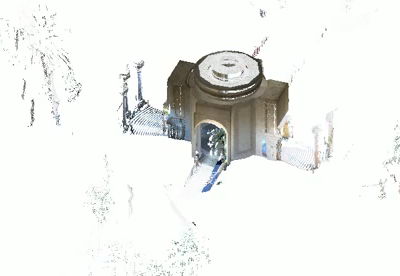

<head>
<meta http-equiv="Content-Type" content="text/html; charset=utf-8">
<link rel="stylesheet" type="text/css" href="bc.css">

<!--

-->
</head>

<!---

Reality Solutions SDK enables RCP file read-write #RevitAPI @AutodeskRevit #bim #dynamobim @AutodeskForge #ForgeDevCon http://bit.ly/rcpreadwrite

Today, we proudly present a DLL for reading and writing RCP files,
announcing the Reality Solutions SDK,
providing full access to the Autodesk proprietary point cloud format
&ndash; Announcing the Reality Solutions SDK
&ndash; How do I access the SDK?
&ndash; Discussion and support resources...

-->

### Reality Solutions SDK Enables RCP File Read-Write

Today, rather belatedly, we proudly present a DLL for reading and writing RCP files,
[announcing the Reality Solutions SDK](http://blogs.autodesk.com/recap/announcing-the-reality-solutions-sdk),
which provides full access to the Autodesk proprietary point cloud format and
is [available for free to registered ADN members](https://adn.autodesk.io/index.php?r=custom_pages%2Fview&id=174):

- [Announcing the Reality Solutions SDK](#2) 
- [How do I access the SDK?](#3) 
- [Discussion and support resources](#4) 

####  Announcing the Reality Solutions SDK

Reality data continues to be an integral part of the workflow supported by Autodesk.
By making our technology available to partners, we accelerate our ability to bring solutions to our customers.
We’re deepening our engagement with partners to collaboratively solve for the breadth of problems and challenges customers face.

Autodesk partners now have access that was previously not available.
For example, this enables reading the point cloud format, converting point clouds to meshes, and pushing the resulting data to BIM 360.
Workflows like this enable partners to build their own feature extraction solutions.

Starting now, partners can gain access to our RCP point cloud format.
This serves as an entry point to Autodesk collections and key products including Revit, AutoCAD, Civil 3D, InfraWorks, and 3ds Max.
Use of the ReCap point cloud format spans across all industries from design to construction, manufacturing, and production.
All of these essential products access point clouds through the RCP file format.

####  How do I access the SDK?

Two ways:

Get in touch! [Email ask.recap@autodesk.com](mailto:ask.recap@autodesk.com) mentioning 'Reality Solutions SDK' in the subject line.

[Sign up for ADN](http://autodesk.com/joinadn),
the [Autodesk Developer Network](http://autodesk.com/adn).
Our reality solutions SDK is freely accessible to Standard and Professional-level ADN members.
For more details, please refer
to [Autodesk.com/developer-network/membership-options](http://autodesk.com/developer-network/membership-options).

####  Discussion and Support Resources

- [Reality Solutions SDK discussion forum](https://forums.autodesk.com/t5/reality-solutions-sdk-group/gp-p/6025)
- [Reality Solutions SDK developer center](https://www.autodesk.com/developer-network/platform-technologies/reality-solutions-sdk)
