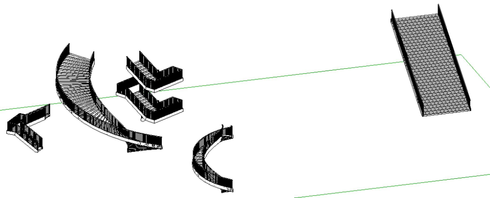

<head>
<meta http-equiv="Content-Type" content="text/html; charset=utf-8">
<link rel="stylesheet" type="text/css" href="bc.css">

</head>

<!---

- forge design automation for revit
  you need to know revit api
  easy if you are familiar with forge
  view on a360
  connect piece by piece
  c4r now works with bim360 team, in 2019 it works with forge docs instead
  licensing issues

- StairsAutomation Revit SDK sample pops up a warning
  this causes problems and stops it when trying to run in forge design automation
  try to suppress it
  simple stairs works ok, keep on clicking to get the warning message
  failure api -- http://thebuildingcoder.typepad.com/blog/about-the-author.html#5.32
  warning swallower -- http://thebuildingcoder.typepad.com/blog/2016/09/warning-swallower-and-roomedit3d-viewer-extension.html#2

- warning swallower
  C:\a\vs\the_building_coder_samples\BuildingCoder\BuildingCoder\CmdPreprocessFailure.cs

Swallowing StairsAutomation warnings preparing for Forge Design Automation in the #RevitAPI @AutodeskRevit #bim #dynamobim @AutodeskForge #ForgeDevCon http://bit.ly/warningswallower

One important step to take before trying to run your Revit API code fully automated and unattended is to ensure that it does not create or modify UI in any way.
For example, you must ensure that it does not cause Revit to display any warnings.
This can be achieved with a warning swallower.
Let's implement one for the StairsAutomation SDK sample...

&ndash; 
...

-->

### Swallowing StairsAutomation Warnings

Here at the Forge Accelerator in Rome, I am starting to take some a first look at
the [Forge](https://autodesk-forge.github.io)
[Design Automation API](https://forge.autodesk.com/en/docs/design-automation/v2/overview) for Revit.

It is not yet available or documented, except to a closely restricted private beta that I am not a member of, so I cannot go into any details.
For more information on its current status, please refer to
[Mikako Harada's discussion of Design Automation for Revit](https://fieldofviewblog.wordpress.com/revit).

However, you can prepare for the day when it comes by handling your add-in warnings properly.

To make use of it, you obviously need to know the Revit API, and it becomes very easy indeed if you also have some experience with Forge apps.

Revit API code can be run in a Forge app by using the `IExternalDBApplication` interface, already listed in
the [Revit API documentation](https://apidocs.co/apps/revit/2019/97318be3-45c4-d93b-ee7b-174fa80ab951.htm).

This interface supports addition of DB-level external applications to Revit, to subscribe to DB-level events and updaters.

DB-level applications cannot create or modify UI.

Therefore, if your add-in pops up any warnings, it cannot be converted to a Forge Design Automation for Revit app &ndash; or, worse still, it will simply silently terminate as soon as it misbehaves.

Therefore, today, let's take a look at suppressing warnings caused by a typical Revit add-in.

As an example, we'll choose the StairsAutomation Revit SDK sample.

It generates five different types of stairs:

Two of them generate Revit warning messages:

- Stair #3 generates [8 warnings about overlapping handrail model line elements](zip/StairsAutomation_warnings_stair_3_8.html).
- Stair #4 generates [1 warning about a missing riser](zip/StairsAutomation_warnings_stair_4_1.html).

Happily, Revit warnings can easily be handled automatically making use of
the [Failure API](http://thebuildingcoder.typepad.com/blog/about-the-author.html#5.32).

Specifically, we presented
a [generic warning swallower](http://thebuildingcoder.typepad.com/blog/2016/09/warning-swallower-and-roomedit3d-viewer-extension.html#2) that
can handle just about any warning message that crops up.

For the StairsAutomation sample, nothing much is required.

The code generating the stairs obviously runs inside a `Transaction`, and that, in turn, is enclosed in a `StairsEditScope`.

The call to `Commit` the stair editing scope is called with a custom failures preprocessor instance:

<pre class="code">
&nbsp;&nbsp;editScope.Commit(&nbsp;
&nbsp;&nbsp;&nbsp;&nbsp;new&nbsp;StairsEditScopeFailuresPreprocessor()&nbsp;);
</pre>

In the original sample, the failures preprocessor does next to nothing:

<pre class="code">
class&nbsp;StairsEditScopeFailuresPreprocessor&nbsp;
&nbsp;&nbsp;:&nbsp;IFailuresPreprocessor
{
&nbsp;&nbsp;public&nbsp;FailureProcessingResult&nbsp;PreprocessFailures(&nbsp;
&nbsp;&nbsp;&nbsp;&nbsp;FailuresAccessor&nbsp;a&nbsp;)
&nbsp;&nbsp;{
&nbsp;&nbsp;&nbsp;&nbsp;return&nbsp;FailureProcessingResult.Continue;
&nbsp;&nbsp;}
}
</pre>

I simply added the following lines of code to it, to delete all warnings before returning:
  
<pre class="code">
&nbsp;&nbsp;IList&lt;FailureMessageAccessor&gt;&nbsp;failures
&nbsp;&nbsp;=&nbsp;a.GetFailureMessages();
 
&nbsp;&nbsp;foreach(&nbsp;FailureMessageAccessor&nbsp;f&nbsp;in&nbsp;failures&nbsp;)
&nbsp;&nbsp;{
&nbsp;&nbsp;&nbsp;&nbsp;FailureSeverity&nbsp;fseverity&nbsp;=&nbsp;a.GetSeverity();
 
&nbsp;&nbsp;&nbsp;&nbsp;if(&nbsp;fseverity&nbsp;==&nbsp;FailureSeverity.Warning&nbsp;)
&nbsp;&nbsp;&nbsp;&nbsp;{
&nbsp;&nbsp;&nbsp;&nbsp;&nbsp;&nbsp;a.DeleteWarning(&nbsp;f&nbsp;);
&nbsp;&nbsp;&nbsp;&nbsp;}
&nbsp;&nbsp;}
</pre>

Now, all five stair variations are created without any warning messages being displayed.

Of course, in your own more complex add-ins, you may need to handle other failures beside simple warnings that can be ignored.

For the most general case, you can make use of
the [generic warning swallower](http://thebuildingcoder.typepad.com/blog/2016/09/warning-swallower-and-roomedit3d-viewer-extension.html#2) mentioned
above.

To document the steps I took to achieve this and track all the changes I made, I extracted the sample to an
own [StairsAutomation GitHub repository](https://github.com/jeremytammik/StairsAutomation).

It ended up being so simple that I need actually not have bothered, though...

Looking forward to making further explorations and digging deeper into this area anon.
