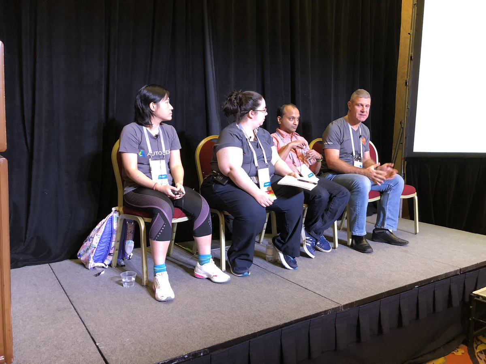

<head>
<meta http-equiv="Content-Type" content="text/html; charset=utf-8">
<link rel="stylesheet" type="text/css" href="bc.css">

</head>

<!---

- /a/doc/revit/tbc/git/a/img/2018-11-15_revit_api_panel_recording_au_las_vegas.jpg
  /a/doc/revit/tbc/git/a/zip/2018-11-15_revit_api_panel_recording_au_las_vegas.m4a

- 14816993 [automatic extraction of the database revives]
  https://forums.autodesk.com/t5/revit-api-forum/automatic-extraction-of-the-database-revives/m-p/8408934

- https://forums.autodesk.com/t5/revit-api-forum/when-to-use-doc-regenerate/td-p/8408490

- RevitLookup -- Center parent for forms (#45)

Dashboard, Regen and Revit API Panel at AU in the #RevitAPI @AutodeskForge @AutodeskRevit #bim #DynamoBim #ForgeDevCon http://bit.ly/dashboardregen

Topics to start the week
&ndash; Revit API panel at AU in Las Vegas
&ndash; Automatic BIM dashboard data extraction
&ndash; When to regenerate the document?
&ndash; RevitLookup centre parent for forms...

-->

### Dashboard, Regen and Revit API Panel at AU

Topics to start the week:

- [Revit API panel at AU in Las Vegas](#2)
    - [Notes by Diane Christoforo](#2.0) 
    - [Revit Ideas](#2.1) 
    - [Requests](#2.2) 
    - [Issues](#2.3) 
    - [Questions](#2.4) 
- [Automatic BIM dashboard data extraction](#3) 
- [When to regenerate the document?](#4) 
- [RevitLookup centre parent for forms](#5) 

####  Revit API Panel at AU in Las Vegas

Last week, Augusto Gonçalves hosted
the [Revit API Panel at AU in Las Vegas](https://autodeskuniversity.smarteventscloud.com/connect/search.ww#loadSearch-searchPhrase=SD195990&searchType=session)
(search for 'Revit API Panel', 'Augusto Goncalves' or 'SD195990' in the [AU session catalogue](https://www.autodesk.com/autodesk-university/las-vegas/sessions)):

- <b>SD195990</b> Revit API Expert Roundtable: Open House on the Factory Floor

The panellists from left to right are Lijuan Zhu, Diane Christoforo, Rahul Bhobe and Miroslav Schonauer.

Here are the notes taken by Diane, session handout and recording:

- [Notes](zip/2018-11-15_diane_christoforo_au_api_panel_notes.pdf)
- [Handout](zip/sd195990_revit_api_panel_augusto_goncalves_handout.pdf)
- [Recording](zip/2018-11-15_revit_api_panel_recording_au_las_vegas.m4a)

Very many thanks to Diane for the valuable notes!

I reprint them here in full:

####  Notes by Diane Christoforo

- [Revit Ideas](#2.1) 
- [Requests](#2.2) 
- [Issues](#2.3) 
- [Questions](#2.4) 

####  Revit Ideas

Here is a [link to Revit Ideas](https://forums.autodesk.com/t5/revit-ideas/idb-p/302).

Your request may already be there! Vote! Add new ideas!

If you want the API ideas specifically, you can [use the `API` tag filter](https://forums.autodesk.com/t5/revit-ideas/idb-p/302/label-name/api).

####  Requests

- MEP systems need to keep their properties when demolished
- Easy way to get the wall core structure centreline from the wall type
    - [There is a suggestion in the recording but not in my notes]
- Ceiling API
- Need to tab-select into linked model elements (And in general, APIs need to work with links if we’re going to say something is supported!) 
- The API documentation is pretty sparse. Can we get more detail and more examples?
- Access to the actual line weight definitions (i.e., line weight 5 means 8 pixels, for example) 
- Expose the group transform
- Rehost a family instance
    - Definitely doesn't work on face based but would like it to work in all cases
    - Also needs to work on links
- Ability to draw on the canvas in front of elements
    - `DirectContext3D` draws behind elements
- Make `DirectContext3D` show up in printing
- `ReferenceIntersector`
    - Make the calculation cached somehow so it's not slow every time you use it on a closed view?
    - Can it work in non-3d views? 
- CAD links
    - Get text box notes out of a CAD link from the API
    - Also allow explode via the API
    - Workaround: use dxf file?
- Getting multiple lines when two elements intersect in multiple places
    - [The note taker is not sure what she meant here. Interference check?] 
- Key schedules
    - Either need to be able to make key schedules using shared parameters, or need to be able to make internal parameters with the API. [Note taker: it might mean normal where it says internal?]
- Rearrange the parameter list from the API
- [non-API?] When making a section or section box, can we have the new view keep the same design options as the original view?

####  Issues

- Area property seems buggy. A comment that view-specific representations might not show the full picture and to use the model one.
- Changes to MEP fabrication elements do not trigger element updaters
- Revit warnings covering a WPF dialog
    - We recommended writing a failure handler but are not sure if this is an expected problem. It would be expected if you have a modal dialog. 
- If you modify the two coordinates of a sloped pipe in the API, then the UI doesn't update properly. [not sure this was written down properly]
- Geometric properties of a solid in structural elements were giving different values depending on the zoom level.

####  Questions

- How do you know when Revit is in a state where it will respond to an event? 
    - You can’t definitively know. It’s why it has to be an asynchronous mechanism.  
- Can you have arguments with ExternalEvents?
    - Yes, although [didn’t manage to write the answer down]
- Can I make an OptionsBar via the API?
    - No because Revit is moving away from options bars. We want everything on the ribbon. 
- Revit core console, similar to the AutoCAD core console? 
    - No, this is not something we’re planning to support at this time.
- Why are slow FilteredElementCollectors of variable speed depending on whether the view's been opened or not? 
    - [trying to condense a rambling answer] The fast filters don’t need all of an element’s information to work. The slow filters need everything, and that 'everything' is usually first read in when you open a view containing the element. It’s a one-time operation. So, if the view is already open, the slow filters are faster because that work’s already been done. 

####  Automatic BIM Dashboard Data Extraction

An interesting, recurring and fundamental issue of ever growing importance was raised in
the [Revit API discussion forum](http://forums.autodesk.com/t5/revit-api-forum/bd-p/160) thread
on [automatic extraction of the database revives](https://forums.autodesk.com/t5/revit-api-forum/automatic-extraction-of-the-database-revives/m-p/8408934)
&ndash; ignoring the fact that we don't know what 'revives' might be (reviews?):

**Question:** I am currently working on an internal project that will eventually extract database overviews of all our projects modelled with Revit automatically every night, to be then presented in the form of dashboards to the various members of the company. My IT Director is currently working on the subject but not knowledgeable in the API Revit, and me too. I would like to save some time by asking in this forum who could guide us towards a solution.

**Answer:** Here are some suggestions on various topics:

First of all, you need to work through the material to help [getting started with the Revit API](https://thebuildingcoder.typepad.com/blog/about-the-author.html#2).

Before getting started with the Revit API, you should acquire as much knowledge as possible about Revit from the end user point of view.

I would assume that you already have that &nbsp; :-)

Here is one very old analysis
of [integrating Revit with an external database](https://thebuildingcoder.typepad.com/blog/2009/01/database-integration.html).

Many things have improved significantly since then, and your target is probably quite different (and much simpler than) the one discussed there.

Still, that article might provide a few useful hints.

By the way, talking about dashboards and things:

I would strongly encourage you to look at a partially cloud-based solution, to provide convenient access to a much larger audience in a much more scalable manner, with access to a huge number of public domain JavaScript-based libraries that can vastly simplify your work and integration efforts.

Here are some links to information about my own
samples [integrating desktop and cloud, provided in the FireRatingCloud overview](https://github.com/jeremytammik/FireRatingCloud).

They are also already pretty dated.

Since then, Autodesk has made significant progress with [Forge](https://autodesk-forge.github.io),
and [Forge design Automation for Revit is just around the corner](https://thebuildingcoder.typepad.com/blog/2018/11/forge-design-automation-for-revit-at-au-and-in-public.html).

Maybe that will provide the most efficient path forward for your project as well?

Good luck getting started and looking forward very much to continuing this discussion once you have gotten your feet wet.

####  When to Regenerate the Document?

Another even more fundamental and recurring issue
concerns [when to use `doc.Regenerate`](https://forums.autodesk.com/t5/revit-api-forum/when-to-use-doc-regenerate/td-p/8408490):

**Question:** I am starting to write an add-in in Revit that will deal with the creation of thousands of family instances, addition of parameters and its values on the fly. I have most of the bits of code required for the task, but I really have no clue on when to use `doc.Regenerate` or not (the less the better for best performance, and I understand that I may have to organize my add-in in order to minimize the number of calls).

I have browsed the Internet, including Jeremy's blog notes on the topic, but it still seems to me that it remains some kind of trial and error operation.

Are there any guidelines, recommendations or documentation on the type of Revit database update operations that require the use of `doc.Regenerate` inside a transaction?

**Answer:** Indeed, it may seem a bit like trial and error.

In general, however, it should probably be pretty clear.

Whenever a transaction is committed, Revit regenerates the document for you anyway, so you do not have to call it in that case.

That will take care of many situations.

The only cases that require explicit regen are when you make <u>several</u> different modifications within one single transaction, and/or query the model <u>after</u> some of them have been make.

In that case, you may be retrieving <u>stale data</u>, outdated information that requires a regen to take the most recent modifications into account.

In general, I would probably not make any calls to `Regenerate` until I notice that something is going wrong.

Just keep in mind what can go wrong when stale data is accessed and used, always check your results, and be ready to add a regen call in case of need.

If you have read and understood all the examples listed in
the [topic group on the need to regenerate](https://thebuildingcoder.typepad.com/blog/about-the-author.html#5.33),
you should be well prepared to address your programming task, at least as far as this aspect is concerned.

Good luck!

**Response:** Thanks for the confirmation, Jeremy. It is more or less what I expected. I have some experience on AutoCAD programming, where there was also a need to regenerate from time to time (but I was more or less aware about the rules of the game).

I will re-read your blog inputs on the topic before getting deeply into the add-in and I will test sequences of operations to check whether they require a `Regenerate` operation or not.

####  RevitLookup Centre Parent for Forms

Last and probably least important, I'll point out a minor update made to centre the forms displayed by RevitLookup over their parent.

This modification was prompted
by [issue #45 &ndash; Center parent for forms](https://github.com/jeremytammik/RevitLookup/issues/45) raised
by [TheKidMSX](https://github.com/TheKidMSX), who also provided
the [pull request #46 &ndash; Forms startposition correction](https://github.com/jeremytammik/RevitLookup/pull/46) including the fixes.

You can examine the exact modifications in
the [diff](https://github.com/jeremytammik/RevitLookup/compare/2019.0.0.3...2019.0.0.4) between
[release 2019.0.0.4](https://github.com/jeremytammik/RevitLookup/releases/tag/2019.0.0.4) containing the fix and the preceding release.

