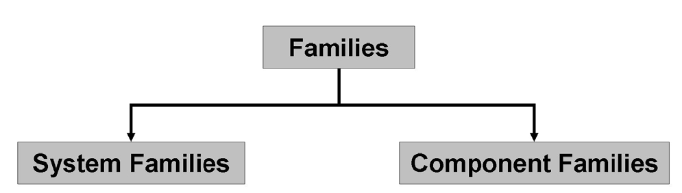

<head>
<meta http-equiv="Content-Type" content="text/html; charset=utf-8">
<link rel="stylesheet" type="text/css" href="bc.css">

</head>

<!---

- https://forums.autodesk.com/t5/revit-api-forum/mesh-data-export-to-json/m-p/8459164

- https://forums.autodesk.com/t5/revit-api-forum/difference-between-familysymbol-and-elementtype/m-p/8461805

- 14880808 [Dynamo 2.0.X vs box shipped 1.3.3 - Which to use for production environment?]
  https://forums.autodesk.com/t5/revit-api-forum/dynamo-2-0-x-vs-box-shipped-1-3-3-which-to-use-for-production/m-p/8457964

- Revit API vs. Dynamo for Revit
  Paolo Serra <paolo.serra@autodesk.com>

- Revit API vs. Dynamo for Revit Toshiaki Isezaki
Q: Does somebody have a matrix which compare the capabilities or functionalities of Revit API and Dynamo for Revit?
A: the revit api is pretty clear, isn't it?
it is the one and only api for revit.
dynamo makes ose of it, and you can use all of it.
so dynamo is a layer over the revit api, and you can use al of the revit api from dynamo (i think).
dynamo also includes other functionality, e.g., DesignScript and its own geometry library.
so in some areas, you can do more in dynamo than in revit api.
however, for manipulating RVT files, dynamo has nothing more to offer than what is provided by the revit api.
for architects, dynamo seems to be the more effective path, cf., e.g., this suggestion to learn dynamo:
https://vasshaug.net/2015/09/18/learn-dynamo/
i hope this clarifies.

- Python code external command loader and compiler implemented in F#
  https://tailoryourbim.com/2018/11/10/efficiently-at-compiling-python-code-as-external-command-%E8%A3%9D%E8%BC%89-python-%E7%B7%A8%E7%A2%BC%E6%88%90-revit-%E5%A4%96%E9%83%A8%E7%A8%8B%E5%BC%8F/
  I have repeatedly pointed out that the Revit API can be used from any .NET supporting language.
  [Ching](https://tailoryourbim.com/about) shows how this can be taken to extremes by implementing an external command in F#
  that loads and compiles an external command implemented in Python.
  In his own words, he 'wrote a simple Python code loader in F#, which loads a Python script into Revit as an external command, combining with [IronPython](http://ironpython.net).'

Dynamo, FamilySymbol vs ElementType and handling a custom exporter exception in the #RevitAPI @AutodeskForge @AutodeskRevit #bim #DynamoBim #ForgeDevCon http://bit.ly/dynsymtyp

Today we discuss a couple of Dynamo considerations, Revit family and element fundamental concepts, and an exception handler required for a custom exporter
&ndash; Revit API versus Dynamo for Revit
&ndash; Dynamo 2.0.X versus 1.3.3
&ndash; Dynamo Future Version Handling
&ndash; Difference between <code>FamilySymbol</code> and <code>ElementType</code>
&ndash; Custom exporter <code>Execute</code> may throw
&ndash; Turned on Git LFS...

-->

### Dynamo, Symbol vs Type and Exporter Exception

Today we discuss a couple of Dynamo considerations, Revit family and element fundamental concepts, and an exception handler required for a custom exporter:

- [Revit API versus Dynamo for Revit](#2) 
- [Dynamo 2.0.X versus 1.3.3](#3)
- [Dynamo future version handling](#3.1) 
- [Difference between `FamilySymbol` and `ElementType`](#4) 
- [Custom exporter `Execute` may throw](#5) 
- [Turned on Git LFS](#6) 

####  Revit API versus Dynamo for Revit

**Question:** Does anybody have a matrix comparing the capabilities and functionalities of the Revit API versus Dynamo for Revit?

My understanding is that Dynamo targets designers, engineers and architects who don’t know or like text-based programming.

I am often asked by people interested in Forge in the BIM domain about differences between Revit API and Dynamo.
Often they are not programmers, but are interested in spreading BIM info and data to a wide audience.
In considering the use of Forge, they face the terminology of ‘API’ and remember that Revit has such a thing.
Forge is also a kind of API. So, clarifying the different possibilities provided by these APIs would be useful.
Maybe a comparison matrix will help?

**Answer:** The Revit API is pretty clear, isn't it?
 
It is the one and only API for Revit.
 
Dynamo makes use of it, and you can use all of it.
 
So, Dynamo is a layer over the Revit API, and you can use all of the Revit API from Dynamo.
 
Dynamo also includes other functionality, e.g., DesignScript and its own geometry library.
 
So, in some areas, you can do more in Dynamo than in the native Revit API.
 
However, for manipulating RVT files, Dynamo has nothing more to offer than what is provided by the Revit API.
 
For architects, Dynamo seems to be the more effective path, cf., e.g., this compelling suggestion
to [learn dynamo](https://vasshaug.net/2015/09/18/learn-dynamo).
 
The [Dynamo Primer slide deck](zip/dynamo_primer.pdf)
by [Paolo Emilio Serra](https://twitter.com/PaoloESerra),
Autodesk Implementation Consultant and author of
the [Punto Revit blog](http://puntorevit.blogspot.com),
includes some references to the Revit API and how to access it via Python Script.
For more details, please refer to his own presentation of
his [Dynamo Primer Slide Deck](https://puntorevit.blogspot.com/2018/12/dynamo-primer-slide-deck.html).

<!--- https://wiki.autodesk.com/download/attachments/487396126/Dynamo%20Primer.pptx?version=1&modificationDate=1544112611952&api=v2 --->
 
As said, from an API standpoint, Dynamo objects are wrappers around Revit objects, there are some 'shortcuts' to convert parameter values to match the Display Unit Types, or alternative syntax to manage transactions etc. but there is nothing out of this world. The good idea behind Dynamo for Revit, with the full user interface, is that it has a serialization/binding feature with Revit elements for free, so it’s like adding intelligence to your Revit model rather than mere automation of tasks you can achieve with traditional programming.
For an end user not accustomed to coding, it is much easier to set a value using the units they are using in the project rather than
 
The visual programming approach is different, the way Dynamo handles namespaces, inheritance and polymorphism defines how to read the find the nodes in the library.
The way a function is called multiple times on a list of inputs, the lacing strategy, replication guides, etc.. are concepts that belong to visual programming and don’t even find a good parallel in a traditional coding language sometimes.
 
Not all the Revit API calls are converted into nodes (i.e. the MEP objects are completely missing and customers complained a lot, but in those cases you just use the Revit API.
People started to create Dynamo packages to expand the out of the box functionalities.
For example, for the Forge users, there is a package called DynaWeb that enables REST API calls from Dynamo… It was developed wrapping the System.Net objects into Dynamo nodes and the end users can use them in a visual programming context.
The dependencies are still a pain to manage and the 'graphs' (read the Dynamo code) cannot be compiled into an unmodifiable .DLL, with risks, IP concerns etc..
Even so, Dynamo is really popular because, as Rob Todd once said, it 'commoditizes programming', and it enables our customer to do more, with better results with less effort.

For Dynamo scalability, also COM and .NET can be included, as they can be used via Python scripting (it’s in fact IronPython that supports managed .DLLs for example).

For example, one developer wrote an extensive library in C# for Dynamo that uses multiple frameworks at the same time such as COM for Civil 3D and .NET for Revit.

Another impressive example of interoperability between the different .NET languages is provided by 
the [Python code external command loader and compiler implemented in F#](https://tailoryourbim.com/2018/11/10/efficiently-at-compiling-python-code-as-external-command-%E8%A3%9D%E8%BC%89-python-%E7%B7%A8%E7%A2%BC%E6%88%90-revit-%E5%A4%96%E9%83%A8%E7%A8%8B%E5%BC%8F) shared by [tailoryourbim](https://tailoryourbim.com).
I have repeatedly pointed out that the Revit API can be used from any .NET supporting language.
[Ching](https://tailoryourbim.com/about) shows how this can be taken to extremes by implementing an external command in F#
that loads and compiles an external command implemented in Python.
In his own words, he 'wrote a simple Python code loader in F#, which loads a Python script into Revit as an external command, combining with [IronPython](http://ironpython.net).'

In fact, macro and add-in functionality is identical in all respects, I would say.
You can probably find an exception to that statement, but it would probably be something rather obscure.

Both VS and SharpDevelop support C#, VB, Ruby and Python. Probably, IronRuby and IronPython for VS need optional installation.
SharpDevelop installs Ruby and Python as default while Revit installation:
 

SharpDevelop IDE supports C#, VB, Ruby and Python

You might also want to check out the [FAQ in the Revit online help](http://help.autodesk.com/view/RVT/2019/ENU/?guid=Revit_API_Revit_API_Developers_Guide_FAQ_html),
which says:

> <u>What languages are supported for Revit API development?</u>

> C#, VB.NET, and C++/CLI are supported for addin development. C#, VB.NET, IronPython, and IronRuby are supported for macro development. Other CLR languages may work with the Revit API, but they are untested and unsupported. Note that for mixed managed/native applications using C++, Revit uses the Visual C++ Redistributable for Visual Studio 2015, specifically, version 14.0.23026.0. Add-ins compiled with other versions of the VC runtime may not work correctly since the Revit install does not include any other VC runtimes.
 
I'm not sure this FAQ is completely accurate and up to date, though.

####  Dynamo 2.0.X versus 1.3.3

Talking about Dynamo, here is a question on the different versions floating around, and which of them to use, from 
the [Revit API discussion forum](http://forums.autodesk.com/t5/revit-api-forum/bd-p/160) thread
on [Dynamo 2.0.X vs box shipped 1.3.3 &ndash; Which to use for production environment?](https://forums.autodesk.com/t5/revit-api-forum/dynamo-2-0-x-vs-box-shipped-1-3-3-which-to-use-for-production/m-p/8457964):

**Question:** Been searching online for some answers and thought maybe the best would be to post this here as I don't have a login for Dynamo's git hub to post there.  We have some conflicting opinions in our department and I am looking at getting some "good" "professional" concrete advice.

One of the guys here has been putting together some dynamo scripts using 2.0 and now upgraded to 2.0.1.  We are running Revit 2019.1 for the most part.  Autodesk however packages 1.3.3 (?) with their 2019 software releases.

For scripts we release to production/end users to use, would you recommend we stick with 1.3.3 or develop in 2.0.X.  From what I understand 2.0 is a pretty big overhaul of dynamo and it's node packages.  So, I am aware of the upgrading and compatibility issues with trying to write scripts in 1.3.3 vs 2.0.  Pretty much have to re-write them.  However, with the stability of 2.0 up in the air, there is some hesitation to move forward with this.  What are some thoughts out there on the subject?  Is there "real" definite reasons on why a person would or would not want to use 2.0.X or 1.3.3 ?

**Answer:** 1.3.3 is the latest version that was shipped with a point release of Revit, and 1.3.4 is in the pipeline for the next update release.

Users and offices who are comfortable going ahead of the Revit shipping product can access both 1.3.4 and 2.0.2 currently on the Latest stable release download pages:

- [dynamobuilds.com](http://dynamobuilds.com)
- [dynamobim.org/download](http://dynamobim.org/download)

As far as why they would upgrade and what the impact is, Dynamo 2.0 does represent an upgrade process for 1.x scripts, and does have enhancements to what is offered. The bigger feature items are:

- Python improvements
- List management improvements (Dictionaries)
- Library browser UX
- A collection of new nodal functionality
- The ability to load Extensions from the Package Manager (an even more powerful manner of exchanging functionality)

The bulk of feature information is here from
the [original 2.0 release features](http://dynamobim.org/to-dynamo-2-0-and-beyond).

Here is
additional [feature information on extensions](http://dynamobim.org/extensions-now-supported-in-package-manager).

Keep in mind that users can also have 2.x installed side-by-side with 1.x, so if they want to do their own comparison, this is pretty easy.

Again, if the user is going to upgrade, definitely take the latest build (2.0.2)

More information on [what it takes to upgrade packages](http://dynamobim.org/new-dynamo-developer-resources-and-updating-packages-for-dynamo-2-0).

Finally, here are the more granular [release notes](https://github.com/DynamoDS/Dynamo/wiki/Release-Notes).

I hope this provides a good and professional complete answer to your question.

####  Dynamo Future Version Handling

**Addendum:** The Dynamo team is working to have a more regular 'heartbeat' of releases that allows for steady integrations with host applications. This will establish an update process that allows users to get the latest version of Dynamo with the latest release and point release of Revit. Additionally, we intend for future releases of Dynamo to not have a shared library, allowing for different versions of Revit to have different version of Dynamo and remove the "cross talk" of Dynamo in new installations. This will allowg Revit v.A to have the most up to date version of Dynamo available when Revit v.A was released, and Revit v.B to have the most up to date version of Dynamo available when Revit v.B was released without version B installation interfering with version A.

####  Difference Between FamilySymbol and ElementType

Another recent [Revit API discussion forum](http://forums.autodesk.com/t5/revit-api-forum/bd-p/160) thread concerns
the [difference between `FamilySymbol` and `ElementType`](https://forums.autodesk.com/t5/revit-api-forum/difference-between-familysymbol-and-elementtype/m-p/8461805):

**Question:** Both FamilySymbol and ElementType seem to represent the same idea.  What is the difference between the two?  (I know one derives from the other)

A related question is: what's the difference between Element and FamilyInstance?  I can't understand why stairs are of class Stairs (derived from Element), while doors are of class FamilyInstance.  Are stairs not an "instance" of a particular "family"?

**Answer:** Families come in several flavours.

The two main ones are standard and built-in.

Actually, they are called 'component' and 'system', as I just learned from the developer guide section I point out below:

System versus component families

Standard are defined in RFA family definitions.

Built-in are built into Revit directly.

Standard families define family symbols, and when you place a family symbol, it is represented by a family instance.

Other elements placed in the model are not called family instances; they are just elements.

Element is a super-class of FamilyInstance.

Analogously, ElementType is a superclass of FamilySymbol.

I hope this explains.

For more info, check
the [Revit API developer guide](http://help.autodesk.com/view/RVT/2019/ENU/?guid=Revit_API_Revit_API_Developers_Guide_html) in
the [online Revit help](http://help.autodesk.com/view/RVT/2019/ENU), in the
section [Introduction](http://help.autodesk.com/view/RVT/2019/ENU/?guid=Revit_API_Revit_API_Developers_Guide_Introduction_html)
&rarr; [Elements Essentials](http://help.autodesk.com/view/RVT/2019/ENU/?guid=Revit_API_Revit_API_Developers_Guide_Introduction_Elements_Essentials_html)
&rarr; [Other Classifications](http://help.autodesk.com/view/RVT/2019/ENU/?guid=Revit_API_Revit_API_Developers_Guide_Introduction_Elements_Essentials_Other_Classifications_html).

####  Custom Exporter Execute May Throw

Let's wrap up with a
final [Revit API discussion forum](http://forums.autodesk.com/t5/revit-api-forum/bd-p/160) thread 
on [mesh data export to json](https://forums.autodesk.com/t5/revit-api-forum/mesh-data-export-to-json/m-p/8459164):

**Question:** I try to retrieve the geometry info from a Revit model to JSON data that I can load to draw geometry by three.js like in
the [ADN mesh data custom exporter to JSON](https://thebuildingcoder.typepad.com/blog/2013/07/adn-mesh-data-custom-exporter-to-json.html).

Of course, the demo is right and works well with some changes from Revit 2015 or 2016 to 2019.

However, working with a different Revit model, an error comes from the call to `exporter.Export(view)`, saying `cannot divide by zero`.

**Answer:** Run the add-in in the debugger and see for yourself which line of code is causing the problem.

Then you will probably be able to see how to fix it as well.

**Response:** The debugger does not help, because the exception is thrown inside Revit internal code while executing the `Export` method.

The debugger will just raise an error on top of the built-in logic.

Finally, I added a `try` `catch` handler and caught the error.

Thank you very much, and thanks for your demo about the use of `CustomExportContext`.

**Answer:** Glad to hear you resolved your problem.

By the way, rather belatedly, may I point out
that [others ran into the same problem in the past](https://thebuildingcoder.typepad.com/blog/2016/07/exporting-rvt-bims-to-webgl-and-forge.html#3).

The [exception thrown by the internal custom exporter implementation can simply be caught and ignored](https://github.com/jeremytammik/CustomExporterAdnMeshJson/commit/23a95aad8f4a3cca85a72b32e2b699bde1d46bcb).

####  Turned on Git LFS

Uploading Paolo's Dynamo primer PDF triggered the GitHub warning about large files exceeding 50 MB in size.

The warning includes a suggestion to turn on
the [Git LFS Large File Storage](https://git-lfs.github.com).

I read about it and did so for three file extensions:

<pre>
$ git lfs track
Listing tracked patterns
    a/zip/*.mp4 (a/zip/.gitattributes)
    a/zip/*.pdf (a/zip/.gitattributes)
    a/zip/*.pptx (a/zip/.gitattributes)
</pre>

Hence, the [tbc](https://github.com/jeremytammik/tbc) repository
hosting all [The Building Coder](https://thebuildingcoder.typepad.com) blog posts
and support material should be significantly smaller now.
